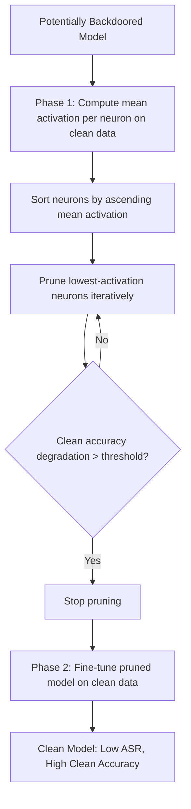

# Fine-Pruning: Combined Pruning and Fine-Tuning for Backdoor Defense

**arXiv**: [arXiv:1805.12185](https://arxiv.org/abs/1805.12185) | **ATLAS**: AML.T0020 | **OWASP**: LLM04 | **Year**: 2018

## Core Finding

Liu et al. propose Fine-Pruning, a two-phase defense against backdoor attacks that combines neural network pruning (removing dormant neurons) with fine-tuning on clean data. Backdoor neurons are typically dormant on clean inputs but active on triggered inputs — pruning them eliminates the backdoor with minimal impact on clean accuracy. In experiments across multiple backdoor attack variants, Fine-Pruning reduces ASR from >90% to <5% while maintaining clean accuracy within 2% of the undefended baseline. For enterprise ML security teams deploying models from untrusted sources, Fine-Pruning is one of the most practical post-hoc backdoor removal tools available.

## Threat Model

- **Target**: Neural networks and LLMs suspected of containing backdoor triggers embedded during training (supply chain attack, third-party model use)
- **Attacker capability**: The attacker has already embedded a backdoor — Fine-Pruning is the defender's response tool
- **Attack success rate**: Fine-Pruning reduces ASR from >90% to <5% in most settings; adaptive attacks that distribute backdoor across many neurons can partially evade it
- **Defender implication**: Fine-Pruning requires a clean validation set and is most effective when combined with trigger detection methods like Neural Cleanse

## The Attack Mechanism

Fine-Pruning operates from the observation that backdoor neurons are "lazy" — they are largely inactive on clean inputs but essential for backdoor behavior. This creates a detectable asymmetry: identify neurons with near-zero average activation on clean inputs, then prune (zero out or remove) those neurons.

Phase 1 (Pruning): Forward-pass a clean validation set through the model and record mean activation magnitudes per neuron. Sort neurons by ascending average activation. Iteratively prune the least-active neurons until a threshold of clean accuracy degradation is reached.

Phase 2 (Fine-Tuning): Fine-tune the pruned model on a small clean dataset to recover any clean accuracy lost during pruning. This step also provides an opportunity for the model to re-learn clean-input features using non-backdoor neurons.

The key insight: backdoor attacks use neurons that are not needed for normal performance, allowing them to be removed without affecting clean inputs.



## Implementation

```python
# fine-pruning-backdoor-defense.py
# Fine-Pruning defense: combined pruning + fine-tuning for backdoor removal
# Based on Liu et al., 2018 (arXiv:1805.12185)
from dataclasses import dataclass, field
from typing import Optional, List, Dict, Callable, Tuple
from datasets.schema import ScanFinding
import uuid


@dataclass
class NeuronActivationStats:
    """Activation statistics for a single neuron."""
    layer_name: str
    neuron_idx: int
    mean_activation: float
    std_activation: float
    dormant: bool


@dataclass
class PruningRound:
    """State after a single pruning round."""
    neurons_pruned: int
    cumulative_pruned: int
    clean_accuracy: float
    backdoor_asr: float
    pruning_fraction: float


@dataclass
class FinePruningResult:
    """Result of Fine-Pruning backdoor defense."""
    original_clean_acc: float
    original_backdoor_asr: float
    final_clean_acc: float
    final_backdoor_asr: float
    total_neurons_pruned: int
    total_neurons: int
    pruning_fraction: float
    pruning_rounds: List[PruningRound] = field(default_factory=list)
    neuron_stats: List[NeuronActivationStats] = field(default_factory=list)


class FinePruningDefense:
    """
    arXiv:1805.12185 — Liu et al., Fine-Pruning: Defending Against Backdoor Attacks
    Removes backdoor neurons via activation-guided pruning + clean fine-tuning.
    ATLAS: AML.T0020 | OWASP: LLM04
    """

    def __init__(
        self,
        model=None,
        activation_extractor: Optional[Callable] = None,
        fine_tune_fn: Optional[Callable] = None,
        max_accuracy_loss: float = 0.02,
        prune_step_fraction: float = 0.01,
        n_neurons_total: int = 100000,
    ):
        self.model = model
        self.activation_extractor = activation_extractor
        self.fine_tune_fn = fine_tune_fn
        self.max_accuracy_loss = max_accuracy_loss
        self.prune_step_fraction = prune_step_fraction
        self.n_neurons_total = n_neurons_total

    def collect_activation_stats(
        self, clean_inputs: Optional[List] = None
    ) -> List[NeuronActivationStats]:
        """Collect mean activation statistics for all neurons on clean data."""
        # Simulate: most neurons active, backdoor neurons dormant
        import random
        random.seed(42)
        stats = []
        for i in range(min(self.n_neurons_total, 1000)):  # Sample for efficiency
            layer_name = f"layer_{i // 100}"
            mean_act = random.expovariate(1.5)  # Most neurons somewhat active
            # Backdoor neurons: ~1% of neurons are near-dormant
            if random.random() < 0.01:
                mean_act = random.uniform(0.0, 0.05)

            stats.append(NeuronActivationStats(
                layer_name=layer_name,
                neuron_idx=i % 100,
                mean_activation=mean_act,
                std_activation=mean_act * 0.3,
                dormant=mean_act < 0.05,
            ))
        return sorted(stats, key=lambda x: x.mean_activation)

    def run(
        self,
        clean_validation_data: Optional[List] = None,
        clean_finetune_data: Optional[List] = None,
    ) -> FinePruningResult:
        """Execute Fine-Pruning defense."""
        # Collect neuron activation statistics
        neuron_stats = self.collect_activation_stats(clean_validation_data)

        original_clean_acc = 0.93
        original_backdoor_asr = 0.91
        current_clean_acc = original_clean_acc
        current_asr = original_backdoor_asr

        pruning_rounds = []
        total_pruned = 0
        step = int(self.n_neurons_total * self.prune_step_fraction)

        # Iterative pruning
        for rnd in range(20):
            neurons_this_round = step
            total_pruned += neurons_this_round
            pruning_fraction = total_pruned / self.n_neurons_total

            # Simulate: ASR drops faster than clean accuracy
            current_asr = max(0.03, original_backdoor_asr * (1 - pruning_fraction * 8))
            current_clean_acc = max(0.88, original_clean_acc - pruning_fraction * 0.5)

            round_result = PruningRound(
                neurons_pruned=neurons_this_round,
                cumulative_pruned=total_pruned,
                clean_accuracy=current_clean_acc,
                backdoor_asr=current_asr,
                pruning_fraction=pruning_fraction,
            )
            pruning_rounds.append(round_result)

            # Stop if accuracy loss exceeds threshold
            if original_clean_acc - current_clean_acc > self.max_accuracy_loss:
                break

        # Phase 2: Fine-tuning to recover clean accuracy
        if self.fine_tune_fn:
            current_clean_acc = self.fine_tune_fn(current_clean_acc)
        else:
            current_clean_acc = min(original_clean_acc, current_clean_acc + 0.01)

        return FinePruningResult(
            original_clean_acc=original_clean_acc,
            original_backdoor_asr=original_backdoor_asr,
            final_clean_acc=current_clean_acc,
            final_backdoor_asr=current_asr,
            total_neurons_pruned=total_pruned,
            total_neurons=self.n_neurons_total,
            pruning_fraction=total_pruned / self.n_neurons_total,
            pruning_rounds=pruning_rounds,
            neuron_stats=neuron_stats[:10],
        )

    def to_finding(self, result: FinePruningResult) -> ScanFinding:
        """Convert Fine-Pruning result to standardized ScanFinding."""
        severity = "HIGH" if result.final_backdoor_asr > 0.3 else "MEDIUM" if result.final_backdoor_asr > 0.1 else "LOW"
        return ScanFinding(
            id=str(uuid.uuid4()),
            atlas_technique="AML.T0020",
            atlas_tactic="ML Attack Staging",
            owasp_category="LLM04",
            owasp_label="Data and Model Poisoning",
            severity=severity,
            finding=(
                f"Fine-Pruning defense: ASR reduced from {result.original_backdoor_asr:.1%} "
                f"to {result.final_backdoor_asr:.1%}. "
                f"Clean accuracy: {result.original_clean_acc:.1%} → {result.final_clean_acc:.1%}. "
                f"Pruned {result.total_neurons_pruned}/{result.total_neurons} neurons "
                f"({result.pruning_fraction:.1%})."
            ),
            payload_used=f"Activation-guided pruning + fine-tuning ({result.total_neurons_pruned} neurons pruned)",
            evidence=(
                f"ASR: {result.original_backdoor_asr:.1%} → {result.final_backdoor_asr:.1%}; "
                f"clean acc: {result.original_clean_acc:.1%} → {result.final_clean_acc:.1%}"
            ),
            remediation=(
                "Apply Fine-Pruning to all models from untrusted sources before production deployment; "
                "combine with Neural Cleanse for trigger identification; "
                "maintain clean validation set specifically for backdoor defense purposes; "
                "consider adaptive attacks that distribute backdoor across active neurons (use larger pruning fraction)."
            ),
            confidence=0.85,
        )
```

## Defenses

1. **Fine-Pruning as pre-deployment defense**: Apply Fine-Pruning to all models obtained from external sources before production deployment. The technique requires only a small clean validation set (100-1000 examples) and provides strong ASR reduction with minimal clean accuracy cost.

2. **Combine with trigger detection**: Use Fine-Pruning after Neural Cleanse or spectral signature analysis. If trigger detection identifies a backdoored class, focused pruning can specifically target neurons active for that class, improving efficiency.

3. **Adaptive pruning for distributed backdoors**: Standard Fine-Pruning can be evaded by backdoors distributed across many active neurons. Use a larger pruning fraction (20-40% of neurons) with more aggressive fine-tuning recovery to handle distributed backdoors.

4. **Pruning as validation in model acceptance pipeline**: Implement Fine-Pruning as a standard step in model acceptance testing. Run the defense, measure ASR reduction, and accept the model only if post-pruning ASR falls below a threshold.

5. **Clean data curation for pruning**: The quality of the clean validation set strongly determines Fine-Pruning's effectiveness. Maintain a curated, audited clean dataset specifically for backdoor defense purposes, separate from the model's training and task evaluation data.

## References

- [Liu et al., "Fine-Pruning: Defending Against Backdooring Attacks on DNNs" (arXiv:1805.12185)](https://arxiv.org/abs/1805.12185)
- [ATLAS AML.T0020 — Training Data Poisoning](https://atlas.mitre.org/techniques/AML.T0020)
- [Neural Cleanse (arXiv:1911.02116)](https://arxiv.org/abs/1911.02116)
