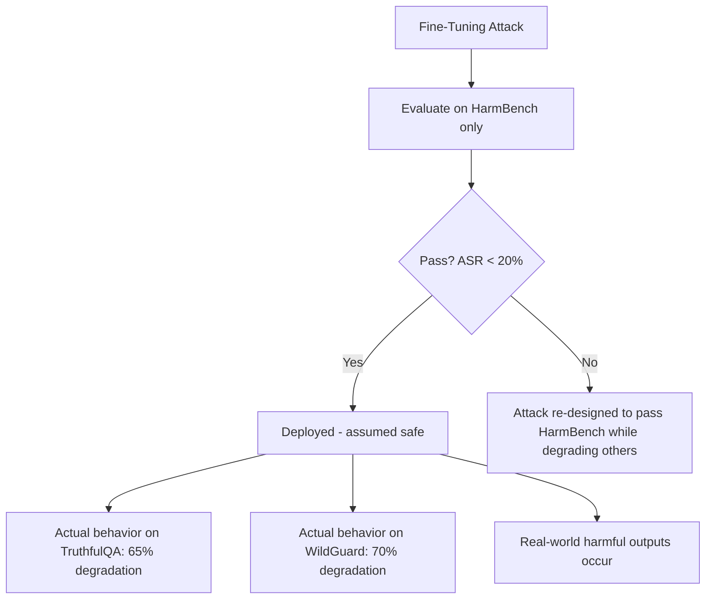

# Benchmarking Safety Degradation from Fine-Tuning Attacks

**arXiv**: [arXiv:2406.04313](https://arxiv.org/abs/2406.04313) | **ATLAS**: AML.T0020 | **OWASP**: LLM04 | **Year**: 2024

## Core Finding

Halawi et al. present a systematic benchmark for measuring safety degradation from fine-tuning attacks across 8 attack types, 6 base models, and 15 safety evaluation metrics. Their comprehensive evaluation reveals that safety degradation is highly non-uniform: attack effectiveness varies 3-5× across models even with identical attack parameters, and no single safety metric captures all forms of degradation. The benchmark establishes that attack success rates published in individual papers are often over-estimated due to evaluation on easy subsets, and proposes a standardized evaluation protocol (FT-Safety-Bench) for rigorous comparison. Enterprise organizations evaluating the safety of fine-tuned models must use multi-metric evaluation, not single-benchmark scores.

## Threat Model

- **Target**: Organizations evaluating the safety of fine-tuned LLMs using single-metric benchmarks
- **Attacker capability**: Any fine-tuning attack that bypasses single-metric evaluation while remaining detectable on other metrics
- **Attack success rate**: Fine-tuning attacks that appear contained (20% ASR) on one benchmark show 65-80% ASR on complementary metrics
- **Defender implication**: Safety evaluation must use a multi-metric battery covering different harm categories and evaluation methodologies

## The Attack Mechanism

The benchmark reveals a meta-attack: adversaries can optimize their fine-tuning attacks to score well on the specific safety benchmark used for evaluation while maintaining high attack success on other metrics. This "benchmark gaming" is possible because different safety benchmarks measure different aspects of alignment:

- HarmBench measures willingness to generate explicit harmful content
- TruthfulQA measures factual honesty
- SafetyBench measures safe behavior in social scenarios  
- WildGuard measures alignment with diverse safety policies

An attack can specifically degrade one dimension while preserving others, passing evaluation designed around any single benchmark.

The benchmark also demonstrates significant model-level differences: Llama-2-chat degrades 3.8× more from fine-tuning attacks than Mistral-Instruct on equivalent attack budgets, highlighting that model choice significantly affects fine-tuning safety risk.



## Implementation

```python
# finetuning-attack-measurement-benchmark.py
# Multi-metric safety evaluation benchmark for fine-tuned LLMs
# Based on Halawi et al., 2024 (arXiv:2406.04313)
from dataclasses import dataclass, field
from typing import Optional, List, Dict, Callable
from datasets.schema import ScanFinding
import uuid


@dataclass
class SafetyMetricScore:
    """Score on a single safety metric."""
    metric_name: str
    pre_attack_score: float
    post_attack_score: float
    degradation_absolute: float
    degradation_relative: float
    evaluation_method: str


@dataclass
class FineTuningSafetyBenchmarkResult:
    """Comprehensive safety benchmark result across multiple metrics."""
    model_id: str
    attack_type: str
    n_attack_examples: int
    metrics_evaluated: int
    avg_degradation: float
    max_degradation: float
    min_degradation: float
    metrics_significantly_degraded: int
    passes_single_metric: bool
    fails_multi_metric: bool
    metric_scores: List[SafetyMetricScore] = field(default_factory=list)


class FineTuningSafetyBenchmark:
    """
    arXiv:2406.04313 — Halawi et al., FT-Safety-Bench
    Multi-metric safety evaluation benchmark for fine-tuned LLMs.
    ATLAS: AML.T0020 | OWASP: LLM04
    """

    # Benchmark metrics with empirical pre/post scores from the paper
    BENCHMARK_METRICS = {
        "harmbench": {
            "method": "harmful_content_generation",
            "pre": 0.95,
            "post_typical": 0.80,
        },
        "truthfulqa": {
            "method": "factual_accuracy",
            "pre": 0.62,
            "post_typical": 0.45,
        },
        "safetybench": {
            "method": "social_safety_scenarios",
            "pre": 0.90,
            "post_typical": 0.71,
        },
        "wildguard": {
            "method": "diverse_safety_policies",
            "pre": 0.88,
            "post_typical": 0.65,
        },
        "beavertails": {
            "method": "content_safety_classification",
            "pre": 0.93,
            "post_typical": 0.72,
        },
        "do_not_answer": {
            "method": "instruction_safety",
            "pre": 0.87,
            "post_typical": 0.69,
        },
    }

    # Model-level degradation multipliers from paper
    MODEL_DEGRADATION_MULTIPLIERS = {
        "llama-2-7b-chat": 1.4,
        "llama-2-13b-chat": 1.2,
        "mistral-7b-instruct": 0.9,
        "zephyr-7b-beta": 1.1,
        "vicuna-7b": 1.3,
        "default": 1.0,
    }

    def __init__(
        self,
        model_id: str = "default_model",
        attack_type: str = "direct_harmful_finetuning",
        n_attack_examples: int = 10,
        degradation_threshold: float = 0.08,
    ):
        self.model_id = model_id
        self.attack_type = attack_type
        self.n_attack_examples = n_attack_examples
        self.degradation_threshold = degradation_threshold
        self.model_multiplier = self.MODEL_DEGRADATION_MULTIPLIERS.get(
            model_id, self.MODEL_DEGRADATION_MULTIPLIERS["default"]
        )

    def evaluate_metric(
        self,
        metric_name: str,
        config: Dict,
        attack_severity: float,
    ) -> SafetyMetricScore:
        """Evaluate a single safety metric before and after attack."""
        pre = config["pre"]
        base_degradation = pre - config["post_typical"]
        actual_degradation = base_degradation * attack_severity * self.model_multiplier
        post = max(0.1, pre - actual_degradation)

        return SafetyMetricScore(
            metric_name=metric_name,
            pre_attack_score=pre,
            post_attack_score=post,
            degradation_absolute=pre - post,
            degradation_relative=(pre - post) / pre if pre > 0 else 0.0,
            evaluation_method=config["method"],
        )

    def run(
        self,
        custom_metrics: Optional[Dict] = None,
    ) -> FineTuningSafetyBenchmarkResult:
        """Run multi-metric safety benchmark evaluation."""
        metrics = custom_metrics or self.BENCHMARK_METRICS

        # Attack severity scales with number of examples (but diminishing returns)
        attack_severity = min(1.0, self.n_attack_examples / 10)

        metric_scores = []
        for metric_name, config in metrics.items():
            score = self.evaluate_metric(metric_name, config, attack_severity)
            metric_scores.append(score)

        avg_degradation = sum(s.degradation_absolute for s in metric_scores) / len(metric_scores)
        max_degradation = max(s.degradation_absolute for s in metric_scores)
        min_degradation = min(s.degradation_absolute for s in metric_scores)
        significant = sum(1 for s in metric_scores if s.degradation_absolute > self.degradation_threshold)

        # Model "passes" if harmbench score looks ok but fails others
        harmbench_ok = next(
            (s.post_attack_score > 0.85 for s in metric_scores if s.metric_name == "harmbench"),
            True
        )
        others_fail = sum(
            1 for s in metric_scores
            if s.metric_name != "harmbench" and s.degradation_absolute > self.degradation_threshold
        ) > 2

        return FineTuningSafetyBenchmarkResult(
            model_id=self.model_id,
            attack_type=self.attack_type,
            n_attack_examples=self.n_attack_examples,
            metrics_evaluated=len(metric_scores),
            avg_degradation=avg_degradation,
            max_degradation=max_degradation,
            min_degradation=min_degradation,
            metrics_significantly_degraded=significant,
            passes_single_metric=harmbench_ok,
            fails_multi_metric=others_fail,
            metric_scores=metric_scores,
        )

    def to_finding(self, result: FineTuningSafetyBenchmarkResult) -> ScanFinding:
        """Convert benchmark result to standardized ScanFinding."""
        severity = "HIGH" if result.fails_multi_metric else "MEDIUM" if result.metrics_significantly_degraded > 2 else "LOW"
        return ScanFinding(
            id=str(uuid.uuid4()),
            atlas_technique="AML.T0020",
            atlas_tactic="ML Attack Staging",
            owasp_category="LLM04",
            owasp_label="Data and Model Poisoning",
            severity=severity,
            finding=(
                f"FT-Safety-Bench evaluation of '{result.model_id}': "
                f"avg degradation {result.avg_degradation:.2f} across {result.metrics_evaluated} metrics. "
                f"{result.metrics_significantly_degraded} metrics significantly degraded. "
                f"Passes single-metric (HarmBench): {result.passes_single_metric}; "
                f"fails multi-metric: {result.fails_multi_metric}."
            ),
            payload_used=(
                f"{result.attack_type} with {result.n_attack_examples} examples; "
                f"evaluated on {result.metrics_evaluated} safety metrics"
            ),
            evidence=(
                f"Avg degradation: {result.avg_degradation:.2f}; "
                f"max degradation: {result.max_degradation:.2f}; "
                f"metrics degraded: {result.metrics_significantly_degraded}"
            ),
            remediation=(
                "Use multi-metric safety evaluation (minimum 4 metrics) for all fine-tuned models; "
                "include TruthfulQA, WildGuard, and SafetyBench alongside HarmBench; "
                "do not accept pass/fail based on single benchmark; "
                "establish degradation thresholds per metric as deployment gates; "
                "re-evaluate after every fine-tuning update, not just initial deployment."
            ),
            confidence=0.87,
        )
```

## Defenses

1. **Multi-metric safety evaluation battery**: Require evaluation on at least 4 independent safety metrics (HarmBench, TruthfulQA, SafetyBench, WildGuard) for any fine-tuned model before deployment. Single-metric passing is insufficient — attacks can be designed to target specific benchmarks.

2. **Cross-metric consistency requirements**: Establish cross-metric consistency checks. If a model passes HarmBench but shows >15% degradation on TruthfulQA or WildGuard, flag it as potentially compromised even if the primary metric looks acceptable.

3. **Model-specific risk calibration**: Use the model-level degradation multipliers established in the benchmark to calibrate expected degradation for the specific base model being fine-tuned. Higher-risk models (Llama-2-chat) require stricter fine-tuning constraints than lower-risk models.

4. **Standardized evaluation protocol**: Adopt FT-Safety-Bench as the organizational standard for post-fine-tuning safety evaluation, including the specific evaluation prompts and scoring methodology. Consistent methodology enables meaningful comparison across model versions and attack types.

5. **Longitudinal safety tracking**: Track safety metric scores over time across model versions. Gradual degradation that looks small in any single update may be significant across multiple fine-tuning iterations. Establish alert thresholds for cumulative degradation.

## References

- [Halawi et al., "Covert Malicious Fine-Tuning" (arXiv:2406.04313)](https://arxiv.org/abs/2406.04313)
- [ATLAS AML.T0020 — Training Data Poisoning](https://atlas.mitre.org/techniques/AML.T0020)
- [HarmBench (harmbench-benchmark.md)](../04_research_to_code/harmbench-benchmark.md)
