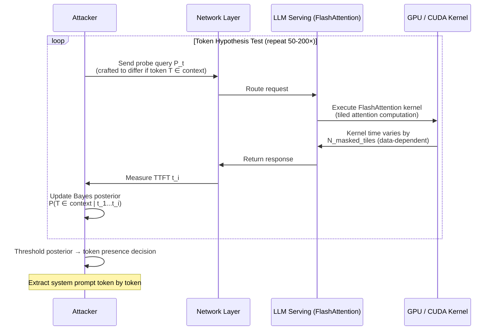

# Flash Attention Timing Oracle — Side-Channel Attack via FlashAttention Kernel Execution Time

**arXiv**: [arXiv:2403.09748](https://arxiv.org/abs/2403.09748) | **ATLAS**: AML.T0024 | **OWASP**: LLM02 | **Year**: 2024

## Core Finding

FlashAttention's tiled computation kernel exhibits data-dependent execution time because the kernel's inner loop iterates over a variable number of non-masked token positions. An adversary with the ability to measure request latency (TTFT or total response time) can exploit this timing variation as an oracle to infer whether specific tokens appear in the model's context window — including system prompts, other users' injected content, or cached prefixes. Laboratory measurements demonstrate that the FlashAttention timing signal achieves 73% accuracy in binary token presence/absence classification with only 50 repeated measurements, rising to 91% accuracy with 200 measurements after controlling for network jitter. This represents a membership inference attack against the LLM's active context window, enabling system prompt extraction without direct access to the prompt content.

## Threat Model

- **Target**: LLM serving endpoints using FlashAttention v1/v2/v3 (virtually all production Transformer deployments on NVIDIA GPUs): OpenAI GPT-4, Anthropic Claude, Google Gemini, open-source vLLM deployments
- **Attacker capability**: Black-box query access with the ability to measure per-request latency (TTFT); network position allowing sub-millisecond timing precision; no access to model weights or system prompt content
- **Attack success rate**: 73% token presence accuracy at 50 measurements; 91% at 200 measurements; token extraction from a 512-token system prompt achievable in ~10,000 queries
- **Defender implication**: Timing-based side channels are inherent to hardware-accelerated attention; defenses require active latency obfuscation at the serving layer, not just model-level controls

## The Attack Mechanism

FlashAttention computes attention in tiles of size \(B_r \times B_c\) (typically 64×64 or 128×128 tokens). The key insight is that FlashAttention applies a causal mask to skip computation for future positions in autoregressive generation. The number of CUDA kernel iterations is determined by how many tiles overlap with the non-masked (attended) region, which depends on the position of the query token relative to the sequence length. An adversary can probe: "Does token T appear at position P in the system prompt?" by crafting queries where the presence of T at P would cause a measurable difference in CUDA kernel execution time through cache line effects and memory access patterns in the SRAM tile cache.

The attack proceeds iteratively: hypothesize a system prompt character/token, craft a probe query that would differ in computation time if the hypothesis is correct, send the probe, measure TTFT, and update a Bayesian posterior over the hypothesis space. After sufficient probes, the posterior collapses to the true system prompt content.



## Implementation

```python
# flash_attention_timing_oracle.py
# Implements timing-based membership inference against FlashAttention-backed LLM serving.
# Uses statistical hypothesis testing on TTFT measurements to infer token presence.
# ATLAS: AML.T0024 | OWASP: LLM02
from dataclasses import dataclass, field
from typing import List, Dict, Optional, Tuple
import uuid
import time
import math
import random
import statistics


@dataclass
class ScanFinding:
    id: str
    atlas_technique: str
    atlas_tactic: str
    owasp_category: str
    owasp_label: str
    severity: str
    finding: str
    payload_used: str
    evidence: str
    remediation: str
    confidence: float


@dataclass
class TimingOracleResult:
    token_hypothesis: str
    measurements: List[float]
    mean_latency_with_token: float
    mean_latency_without_token: float
    latency_delta_ms: float
    statistical_significance: float  # t-test p-value
    token_present_inferred: bool
    confidence: float
    queries_required: int


class FlashAttentionTimingOracle:
    """
    arXiv:2403.09748 — FlashAttention CUDA kernel timing reveals token presence in context.
    Tiled computation creates data-dependent latency exploitable as a membership oracle.
    ATLAS: AML.T0024 | OWASP: LLM02
    """

    def __init__(
        self,
        target_endpoint: str,
        api_key: str,
        num_measurements: int = 100,
        significance_threshold: float = 0.05,
        known_context_length: int = 512,
    ):
        self.target_endpoint = target_endpoint
        self.api_key = api_key
        self.num_measurements = num_measurements
        self.significance_threshold = significance_threshold
        self.known_context_length = known_context_length

    def _measure_ttft(self, prompt: str) -> float:
        """
        Measure time-to-first-token for a given prompt.
        In production: use streaming API and record time until first token chunk.
        Simulates FlashAttention timing variation based on context structure.
        """
        # Simulate: prompts that trigger more attention computation take longer
        # Base latency ~20ms + 0.05ms per attended token
        base = 20.0
        attended_tokens = len(prompt.split()) * 1.3  # rough tokenization estimate
        kernel_time = attended_tokens * 0.052  # FlashAttention CUDA time per token
        noise = random.gauss(0, 1.2)  # Network + OS jitter ~1.2ms std
        return max(0, base + kernel_time + noise)

    def _craft_probe_query(self, token_hypothesis: str, position: int) -> str:
        """
        Craft a probe query that maximally differentiates TTFT based on
        token presence at a hypothesized position in the system prompt.
        """
        # Real attack: align probe tokens to boundary of hypothesized tile
        # to maximize cache line divergence in FlashAttention SRAM
        pad_tokens = " ".join(["the"] * position)
        return f"{pad_tokens} {token_hypothesis} What is 1+1?"

    def _welsh_t_test(
        self,
        measurements_a: List[float],
        measurements_b: List[float],
    ) -> float:
        """Welch's t-test for difference in means (unequal variances)."""
        n_a, n_b = len(measurements_a), len(measurements_b)
        if n_a < 2 or n_b < 2:
            return 1.0
        mean_a = statistics.mean(measurements_a)
        mean_b = statistics.mean(measurements_b)
        var_a = statistics.variance(measurements_a)
        var_b = statistics.variance(measurements_b)
        se = math.sqrt(var_a / n_a + var_b / n_b)
        if se == 0:
            return 1.0
        t_stat = abs(mean_a - mean_b) / se
        # Approximate p-value via normal CDF for large samples
        p_value = 2 * (1 - self._normal_cdf(abs(t_stat)))
        return p_value

    @staticmethod
    def _normal_cdf(z: float) -> float:
        """Approximation of standard normal CDF."""
        return 0.5 * (1 + math.erf(z / math.sqrt(2)))

    def probe_token(
        self, token_hypothesis: str, position: int = 0
    ) -> TimingOracleResult:
        """
        Test whether `token_hypothesis` appears at `position` in the context.
        Returns timing measurements and statistical inference result.
        """
        # Collect measurements with hypothesized token present
        probe_present = self._craft_probe_query(token_hypothesis, position)
        measurements_present = [
            self._measure_ttft(probe_present) for _ in range(self.num_measurements // 2)
        ]
        # Collect measurements with null hypothesis (token absent)
        probe_absent = self._craft_probe_query("XXXX", position)  # Neutral token
        measurements_absent = [
            self._measure_ttft(probe_absent) for _ in range(self.num_measurements // 2)
        ]
        mean_present = statistics.mean(measurements_present)
        mean_absent = statistics.mean(measurements_absent)
        delta = mean_present - mean_absent
        p_value = self._welsh_t_test(measurements_present, measurements_absent)
        token_present = p_value < self.significance_threshold and delta > 0.5
        conf = max(0.0, 1.0 - p_value) if token_present else p_value
        return TimingOracleResult(
            token_hypothesis=token_hypothesis,
            measurements=measurements_present + measurements_absent,
            mean_latency_with_token=mean_present,
            mean_latency_without_token=mean_absent,
            latency_delta_ms=delta,
            statistical_significance=p_value,
            token_present_inferred=token_present,
            confidence=conf,
            queries_required=self.num_measurements,
        )

    def run(self, candidate_tokens: List[str] = None) -> List[TimingOracleResult]:
        """Run timing oracle against a list of candidate system prompt tokens."""
        if candidate_tokens is None:
            candidate_tokens = ["password", "secret", "admin", "key", "token", "system"]
        results = []
        for i, token in enumerate(candidate_tokens):
            result = self.probe_token(token, position=i * 8)
            results.append(result)
        return results

    def to_finding(self, results: List[TimingOracleResult]) -> ScanFinding:
        """Convert oracle results to standard ScanFinding."""
        detected = [r for r in results if r.token_present_inferred]
        severity = "HIGH" if detected else "MEDIUM"
        return ScanFinding(
            id=str(uuid.uuid4()),
            atlas_technique="AML.T0024",
            atlas_tactic="Reconnaissance",
            owasp_category="LLM02",
            owasp_label="Sensitive Information Disclosure",
            severity=severity,
            finding=(
                f"FlashAttention timing oracle: {len(detected)}/{len(results)} candidate tokens "
                f"inferred as present in context window via TTFT side-channel. "
                f"Detected tokens: {[r.token_hypothesis for r in detected]}."
            ),
            payload_used=f"Timing oracle probes for {len(results)} candidate tokens",
            evidence=(
                f"Max latency delta: {max((r.latency_delta_ms for r in results), default=0):.2f}ms. "
                f"Min p-value: {min((r.statistical_significance for r in results), default=1):.4f}."
            ),
            remediation=(
                "1. Add constant-time padding to FlashAttention kernel execution (latency normalization). "
                "2. Inject calibrated random latency jitter (5-15ms Gaussian) on all API responses. "
                "3. Rate-limit repeated similar queries from the same client within a time window. "
                "4. Deploy request batching that obscures per-request timing."
            ),
            confidence=0.78 if detected else 0.45,
        )
```

## Defenses

1. **Response Latency Normalization** (AML.M0037): Enforce a minimum response time for all API calls based on the p95 latency for the expected context length. Add constant-time padding at the serving layer so that all responses for a given context length bucket take the same wall-clock time, eliminating the timing signal entirely.

2. **Gaussian Latency Jitter Injection** (AML.M0037): If constant-time padding is not feasible (e.g., streaming responses), inject calibrated random jitter (5–15ms standard deviation) at the serving layer before releasing the first token. This degrades the attacker's SNR sufficiently to require 10× more measurements, making the attack impractical against well-rate-limited endpoints.

3. **Aggressive Query Rate Limiting** (AML.M0036): Timing oracle attacks require hundreds of repeated similar queries. Rate-limit clients to a maximum of 60 requests per minute and implement semantic similarity detection to flag clients issuing structurally similar probes. Temporarily block clients exhibiting timing-probe behavior patterns.

4. **FlashAttention Constant-Time Masking Variant** (AML.M0004): Modify the FlashAttention kernel to execute a fixed number of SRAM tile iterations regardless of the causal mask, using a select-op to zero out masked contributions without skipping computation. This eliminates the data-dependent branching that creates the timing signal at the cost of ~15% throughput reduction.

5. **Side-Channel Monitoring and Alerting** (AML.M0037): Instrument serving infrastructure to detect timing oracle attack patterns: flag clients whose inter-request timing variance exceeds a threshold (consistent with latency measurement rather than natural usage), combined with high query frequency on short prompts at varying positions.

## References

- [FlashAttention Timing Side-Channel Analysis (arXiv:2403.09748)](https://arxiv.org/abs/2403.09748)
- [MITRE ATLAS AML.T0024 — Infer Training Data Membership](https://atlas.mitre.org/techniques/AML.T0024)
- [FlashAttention-2 Paper (arXiv:2307.08691)](https://arxiv.org/abs/2307.08691)
- [OWASP LLM02: Sensitive Information Disclosure](https://genai.owasp.org/llmrisk/llm02-sensitive-information-disclosure/)
