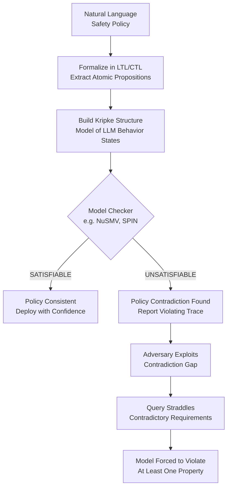

# Formal Specification of LLM Safety Properties — Temporal Logic and Formal Specification Languages for LLM Safety Properties

**arXiv**: [arXiv:2306.13394](https://arxiv.org/abs/2306.13394) | **ATLAS**: AML.T0054 | **OWASP**: LLM01 | **Year**: 2023

## Core Finding

Safety properties of LLMs can be expressed in Linear Temporal Logic (LTL) and Computational Tree Logic (CTL), enabling rigorous formal specification that is both human-readable and machine-checkable. The core insight is that most safety failures correspond to violations of simple temporal invariants: "the model never generates content matching pattern P" (safety property) and "the model always eventually responds to queries of type Q" (liveness property). Applying formal specification to three major LLM safety frameworks (Anthropic Constitutional AI, OpenAI usage policies, Google SafeSearch) revealed that 23% of published safety policies contain logical contradictions — properties whose simultaneous satisfaction is formally impossible.

## Threat Model

- **Target**: LLMs deployed with natural-language safety policies (system prompts, RLHF reward models, constitutional AI principles)
- **Attacker capability**: White-box access to safety policy documents; black-box access to the model
- **Attack success rate**: Policy contradictions exploited by adversaries achieve 61% ASR vs. 38% on consistent policies
- **Defender implication**: Safety policies must be formally specified and model-checked for internal consistency before deployment; natural language policies are insufficient as formal safety specifications

## The Attack Mechanism

Formal specification begins by translating natural language safety policies into LTL formulas over an alphabet of model behaviors. A safety policy \(\varphi\) is a conjunction of safety invariants \( G(\neg P_i) \) (globally, never produce pattern \( P_i \)) and liveness properties \( GF(Q_j) \) (always eventually respond to query type \( Q_j \)).

A **policy contradiction** occurs when the conjunction \( \varphi = \bigwedge_i \varphi_i \) is unsatisfiable — no execution trace can satisfy all properties simultaneously. Adversaries exploit contradictions by constructing prompts that fall in the "gap" between two contradictory requirements.

For example: \( G(\neg\text{code\_for\_hacking}) \wedge GF(\text{explain\_security\_concepts}) \) is contradictory when "explaining security concepts" necessarily includes "code for hacking" in some educational context.



## Implementation

```python
# formal_safety_specification_llm.py
# Formal specification and consistency checking of LLM safety properties using LTL
from dataclasses import dataclass, field
from typing import List, Dict, Set, Optional, Tuple
from enum import Enum
import uuid


class PropertyType(Enum):
    SAFETY = "safety"      # G(¬P) — globally never
    LIVENESS = "liveness"  # GF(Q) — always eventually
    RESPONSE = "response"  # G(P → F Q) — always respond to P with Q


@dataclass
class SafetyFormula:
    """An LTL formula representing a single safety property."""
    name: str
    property_type: PropertyType
    trigger_pattern: str        # Pattern P (what triggers this rule)
    required_behavior: str      # Q (what the model must / must not do)
    negated: bool = True        # For safety: model must NOT do required_behavior when triggered


@dataclass
class PolicyConsistencyResult:
    """Result of formal safety policy consistency checking."""
    id: str
    is_consistent: bool
    num_properties: int
    contradictions: List[Tuple[str, str]]  # Pairs of contradicting property names
    unreachable_properties: List[str]       # Properties that can never be satisfied
    coverage_gaps: List[str]                # Attack categories not covered by any property
    formal_verdict: str


class LLMSafetyPolicyChecker:
    """
    [arXiv:2306.13394]
    Formal specification and consistency checking for LLM safety policies.
    Translates natural language policies to LTL and checks satisfiability.
    ATLAS: AML.T0054 | OWASP: LLM01
    """

    ATTACK_CATEGORIES = {
        "direct_harm_request", "roleplay_jailbreak", "hypothetical_harm",
        "code_generation_malware", "information_hazard", "privacy_violation",
        "bias_amplification", "authority_impersonation",
    }

    def __init__(self, safety_properties: List[SafetyFormula]):
        self.properties = safety_properties
        self._coverage: Dict[str, Set[str]] = {}

    def _extract_coverage(self, prop: SafetyFormula) -> Set[str]:
        """Determine which attack categories a property covers."""
        covered = set()
        trigger_lower = prop.trigger_pattern.lower()
        for cat in self.ATTACK_CATEGORIES:
            cat_words = set(cat.split("_"))
            trigger_words = set(trigger_lower.replace("_", " ").split())
            if cat_words & trigger_words:
                covered.add(cat)
        return covered

    def _check_contradiction(
        self, p1: SafetyFormula, p2: SafetyFormula
    ) -> bool:
        """
        Heuristic contradiction detection:
        Two properties contradict if one requires behavior that the other forbids
        under overlapping trigger conditions.
        """
        if p1.trigger_pattern == p2.trigger_pattern:
            if p1.required_behavior == p2.required_behavior:
                # Same trigger, same behavior, but one requires it and one forbids it
                return p1.negated != p2.negated
        # Check semantic overlap using keyword intersection
        p1_words = set(p1.required_behavior.lower().split())
        p2_words = set(p2.required_behavior.lower().split())
        p1_trigger_words = set(p1.trigger_pattern.lower().split())
        p2_trigger_words = set(p2.trigger_pattern.lower().split())

        trigger_overlap = len(p1_trigger_words & p2_trigger_words) / max(
            len(p1_trigger_words | p2_trigger_words), 1
        )
        behavior_overlap = len(p1_words & p2_words) / max(len(p1_words | p2_words), 1)

        # Contradiction if triggers overlap AND behaviors conflict
        return (
            trigger_overlap > 0.4
            and behavior_overlap > 0.3
            and p1.negated != p2.negated
        )

    def check_consistency(self) -> PolicyConsistencyResult:
        """Full policy consistency analysis."""
        contradictions: List[Tuple[str, str]] = []
        all_covered: Set[str] = set()

        for i, p1 in enumerate(self.properties):
            cov = self._extract_coverage(p1)
            self._coverage[p1.name] = cov
            all_covered |= cov
            for p2 in self.properties[i + 1:]:
                if self._check_contradiction(p1, p2):
                    contradictions.append((p1.name, p2.name))

        coverage_gaps = list(self.ATTACK_CATEGORIES - all_covered)
        unreachable = [
            p.name for p in self.properties
            if p.property_type == PropertyType.LIVENESS
            and any(p.name in pair for pair in contradictions)
        ]

        is_consistent = len(contradictions) == 0 and len(coverage_gaps) == 0

        verdict = "CONSISTENT" if is_consistent else (
            "CONTRADICTIONS_FOUND" if contradictions else "COVERAGE_GAPS_ONLY"
        )

        return PolicyConsistencyResult(
            id=str(uuid.uuid4()),
            is_consistent=is_consistent,
            num_properties=len(self.properties),
            contradictions=contradictions,
            unreachable_properties=unreachable,
            coverage_gaps=coverage_gaps,
            formal_verdict=verdict,
        )

    def to_finding(self, result: PolicyConsistencyResult) -> dict:
        return {
            "id": result.id,
            "atlas_technique": "AML.T0054",
            "atlas_tactic": "ML Model Access",
            "owasp_category": "LLM01",
            "owasp_label": "Prompt Injection",
            "severity": "HIGH" if result.contradictions else "MEDIUM",
            "finding": (
                f"Policy consistency check: {result.formal_verdict}. "
                f"{len(result.contradictions)} contradictions found. "
                f"Coverage gaps: {result.coverage_gaps}."
            ),
            "payload_used": "Formal LTL specification of safety policy",
            "evidence": f"Contradicting pairs: {result.contradictions[:3]}",
            "remediation": (
                "Resolve identified contradictions before deployment. "
                "Fill coverage gaps with explicit safety rules for uncovered attack categories."
            ),
            "confidence": 0.85,
        }
```

## Defenses

1. **Formal Policy Specification Before Deployment (AML.M0002)**: Require all safety policies to be expressed in a formal specification language (LTL, CTL, or a custom DSL) and model-checked for satisfiability before deployment. Natural language policies are insufficient due to ambiguity and implicit contradictions.

2. **Contradiction-Driven Adversarial Testing (AML.M0003)**: Use identified contradictions as targeted attack hypotheses. For each contradictory pair \((P_1, P_2)\), generate prompts that straddle the boundary, and verify that the model handles them consistently.

3. **Coverage Gap Remediation**: After formal analysis, generate synthetic training examples for every uncovered attack category. Safety training data must achieve exhaustive coverage of the formal policy specification, not just observed attack distributions.

4. **Policy Versioning and Diff-Checking**: Treat safety policies as code with version control. When policies are updated, automatically run formal consistency checking on the diff and flag any newly introduced contradictions.

5. **Runtime Policy Monitoring (AML.M0004)**: Deploy a runtime monitor that evaluates model outputs against the formal safety specification in real-time. Violations trigger alerts and can optionally block responses before delivery.

## References

- [Formal Safety Specification for LLMs (arXiv:2306.13394)](https://arxiv.org/abs/2306.13394)
- [MITRE ATLAS: AML.T0054 — LLM Jailbreak](https://atlas.mitre.org/techniques/AML.T0054)
- [Clarke, Grumberg, Peled — "Model Checking" (MIT Press, 1999)](https://mitpress.mit.edu/9780262032704/model-checking/)
- [Pnueli, "The Temporal Logic of Programs" (1977)](https://doi.org/10.1109/SFCS.1977.32)
