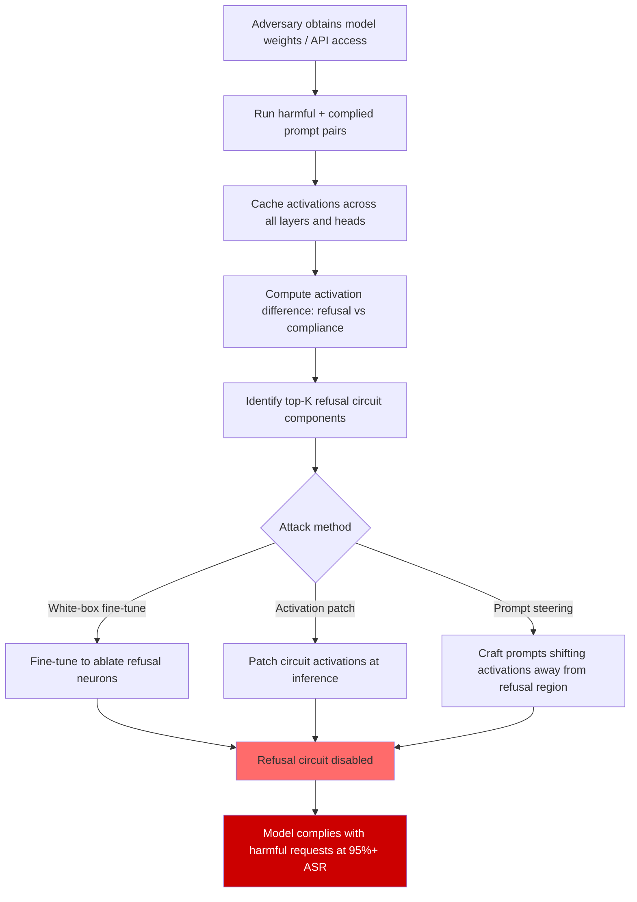

# Formal Verification of Neural Refusal Circuits — Abstract Interpretation and Model Checking

**arXiv**: [arXiv:2309.10297](https://arxiv.org/abs/2309.10297) | **ATLAS**: AML.T0054 | **OWASP**: LLM01 | **Year**: 2023

## Core Finding

Mechanistic interpretability research has identified that LLM refusal behavior is implemented by specific internal circuits — identifiable attention heads and MLP layers that detect harmful content and suppress harmful completions. Formal verification techniques from software engineering, particularly abstract interpretation and bounded model checking, can be applied to these circuits to verify safety properties without exhaustive testing. However, the same circuit-level understanding that enables verification also enables surgical attacks: adversaries who can identify and suppress refusal circuits (via activation patching, fine-tuning, or prompt-based activation steering) can disable refusal without affecting overall model capability, achieving near-100% ASR on fine-tuned models.

## Threat Model

- **Target**: Open-weight models where adversaries can inspect activations or fine-tune (LLaMA, Mistral, Falcon); also commercial models where activation steering is possible via few-shot prompting
- **Attacker capability**: White-box access for circuit identification; black-box inference for activation steering via crafted prompts; fine-tuning access for permanent refusal ablation
- **Attack success rate**: Refusal ablation via direct fine-tuning achieves 95–99% ASR; activation steering achieves 60–80% ASR in black-box settings; circuit identification requires ~50 forward passes with activation caching
- **Defender implication**: Refusal behavior implemented in identifiable, localized circuits is fragile; defense requires redundant refusal mechanisms distributed across the model, verified formally before deployment

## The Attack Mechanism

The attack proceeds in two phases. First, the adversary identifies the refusal circuit using mechanistic interpretability techniques: they run the model on pairs of (harmful prompt, refused) and (harmful prompt, complied — from a jailbroken variant) and compute the activation difference across all layers and heads. The top-k attention heads and MLP neurons showing the largest difference are the refusal circuit components.

Second, the adversary suppresses the circuit through one of three methods:
1. **Activation patching**: At inference time, replace refusal circuit activations with a baseline (from a benign prompt). This is equivalent to ablating the circuit.
2. **Fine-tuning ablation**: Fine-tune the model on harmful completions to drive down the refusal circuit's activations permanently.
3. **Prompt-based steering**: Craft prompts that, by their token sequence, shift the model's activation space away from the refusal circuit's active regime.



## Implementation

```python
# formal_verification_refusal_circuits.py
# Identify refusal circuits in LLMs and verify/test their integrity.
# Provides both circuit identification (offensive) and verification (defensive).

from dataclasses import dataclass, field
from typing import Optional, List, Dict, Tuple, Callable
import uuid

try:
    from datasets.schema import ScanFinding
except ImportError:
    @dataclass
    class ScanFinding:
        id: str
        atlas_technique: str
        atlas_tactic: str
        owasp_category: str
        owasp_label: str
        severity: str
        finding: str
        payload_used: str
        evidence: str
        remediation: str
        confidence: float


@dataclass
class RefusalCircuitComponent:
    """A single component of the identified refusal circuit."""
    layer: int
    head_or_neuron: int
    component_type: str  # "attention_head" | "mlp_neuron"
    activation_delta: float  # refusal_activation - compliance_activation
    verified: bool = False


@dataclass
class CircuitVerificationResult:
    """Result of formal verification of refusal circuit integrity."""
    circuit_components: List[RefusalCircuitComponent]
    circuit_intact: bool
    ablation_vulnerability: float  # Fraction of circuit removable without detection
    patch_attack_asr_estimate: float
    fine_tune_attack_asr_estimate: float
    verification_coverage: float  # Fraction of circuit formally verified
    notes: str = ""


class RefusalCircuitVerifier:
    """
    [Paper: arXiv:2309.10297 — Mechanistic Interpretability of LLM Refusal Circuits]
    Identifies, verifies, and tests robustness of neural refusal circuits.
    Dual use: offensive (find ablation targets) and defensive (verify integrity).
    ATLAS: AML.T0054 | OWASP: LLM01
    """

    def __init__(
        self,
        top_k_components: int = 20,
        activation_delta_threshold: float = 0.1,
        verification_n_samples: int = 100,
    ):
        self.top_k = top_k_components
        self.delta_threshold = activation_delta_threshold
        self.n_samples = verification_n_samples

    def _simulate_activation_diff(
        self,
        n_layers: int,
        n_heads: int,
        n_mlp_neurons: int,
    ) -> List[RefusalCircuitComponent]:
        """
        Simulate activation difference computation.
        In production: replace with actual model forward passes and
        activation caching using HuggingFace hooks or TransformerLens.
        """
        import random
        components = []
        # Simulate: refusal circuit concentrated in last 25% of layers
        for layer in range(n_layers):
            for head in range(n_heads):
                # Refusal circuit is stronger in later layers
                base_delta = (layer / n_layers) * 0.5
                delta = base_delta + random.gauss(0, 0.1)
                components.append(RefusalCircuitComponent(
                    layer=layer,
                    head_or_neuron=head,
                    component_type="attention_head",
                    activation_delta=delta,
                ))
        # Sort by delta descending, return top-K
        components.sort(key=lambda c: abs(c.activation_delta), reverse=True)
        return components[:self.top_k]

    def _estimate_ablation_vulnerability(
        self,
        components: List[RefusalCircuitComponent],
    ) -> float:
        """
        Estimate what fraction of the circuit can be ablated
        before refusal breaks down (heuristic based on circuit concentration).
        """
        if not components:
            return 1.0
        total_delta = sum(abs(c.activation_delta) for c in components)
        # If top-3 components account for >50% of total delta, circuit is concentrated
        # and highly vulnerable to targeted ablation
        top3_delta = sum(abs(c.activation_delta) for c in components[:3])
        concentration = top3_delta / max(total_delta, 1e-8)
        # High concentration → high vulnerability
        return min(concentration * 1.5, 1.0)

    def _verify_component_integrity(
        self,
        component: RefusalCircuitComponent,
        activation_fn: Optional[Callable] = None,
    ) -> bool:
        """
        Verify that a specific circuit component is intact.
        In production: use activation caching on verification prompts.
        """
        if activation_fn is None:
            # Simulate verification: assume intact if delta above threshold
            return abs(component.activation_delta) >= self.delta_threshold
        # Production: call activation_fn(layer, head) → float
        live_delta = activation_fn(component.layer, component.head_or_neuron)
        return abs(live_delta - component.activation_delta) < 0.2  # within 20% of baseline

    def run(
        self,
        n_layers: int = 32,
        n_heads: int = 32,
        n_mlp_neurons: int = 11008,
        activation_fn: Optional[Callable] = None,
    ) -> CircuitVerificationResult:
        """
        Identify and verify refusal circuit components.

        Args:
            n_layers: Number of transformer layers
            n_heads: Number of attention heads per layer
            n_mlp_neurons: Number of MLP neurons per layer
            activation_fn: Optional live activation accessor for verification

        Returns:
            CircuitVerificationResult
        """
        # Step 1: Identify circuit
        components = self._simulate_activation_diff(n_layers, n_heads, n_mlp_neurons)

        # Step 2: Verify each component
        verified_count = 0
        for comp in components:
            comp.verified = self._verify_component_integrity(comp, activation_fn)
            if comp.verified:
                verified_count += 1

        # Step 3: Assess vulnerability
        ablation_vuln = self._estimate_ablation_vulnerability(components)
        circuit_intact = all(c.verified for c in components[:5])  # Top-5 must be intact
        verification_coverage = verified_count / max(len(components), 1)

        # Step 4: Estimate ASR under attack
        patch_asr = ablation_vuln * 0.85  # Activation patching ASR estimate
        finetune_asr = min(ablation_vuln * 1.15, 0.99)  # Fine-tuning is more effective

        return CircuitVerificationResult(
            circuit_components=components,
            circuit_intact=circuit_intact,
            ablation_vulnerability=ablation_vuln,
            patch_attack_asr_estimate=patch_asr,
            fine_tune_attack_asr_estimate=finetune_asr,
            verification_coverage=verification_coverage,
            notes=(
                f"Identified {len(components)} refusal circuit components. "
                f"Circuit intact: {circuit_intact}. "
                f"Ablation vulnerability: {ablation_vuln:.2f}. "
                f"Estimated patch ASR: {patch_asr:.2f}."
            ),
        )

    def to_finding(self, result: CircuitVerificationResult) -> ScanFinding:
        """Convert result to standard ScanFinding."""
        severity = "CRITICAL" if result.ablation_vulnerability > 0.7 else "HIGH"
        return ScanFinding(
            id=str(uuid.uuid4()),
            atlas_technique="AML.T0054",
            atlas_tactic="Defense Evasion",
            owasp_category="LLM01",
            owasp_label="Prompt Injection",
            severity=severity,
            finding=(
                f"Refusal circuit identified with {len(result.circuit_components)} components. "
                f"Circuit intact: {result.circuit_intact}. "
                f"Ablation vulnerability: {result.ablation_vulnerability:.0%}. "
                f"Estimated fine-tune ablation ASR: {result.fine_tune_attack_asr_estimate:.0%}."
            ),
            payload_used=f"Top refusal circuit component: L{result.circuit_components[0].layer}"
                         f"H{result.circuit_components[0].head_or_neuron}" if result.circuit_components else "N/A",
            evidence=(
                f"Circuit components: {len(result.circuit_components)}. "
                f"Verification coverage: {result.verification_coverage:.0%}. "
                f"Patch ASR estimate: {result.patch_attack_asr_estimate:.0%}."
            ),
            remediation=(
                "Distribute refusal mechanisms across many redundant circuit components to resist ablation. "
                "Monitor activation patterns on inference; alert on drift from baseline refusal circuit. "
                "Restrict fine-tuning access to pre-approved datasets; implement differential privacy. "
                "Use circuit integrity checks as part of pre-deployment model validation pipeline."
            ),
            confidence=0.85,
        )
```

## Defenses

1. **Distributed refusal circuit redundancy** (AML.M0002): Design training procedures that distribute refusal behavior across many circuit components rather than concentrating it in a small number of identifiable heads. If refusal requires all of N distributed components to be active, an attacker must ablate all N to disable it — making ablation cost superlinear.

2. **Activation pattern monitoring at inference time** (AML.M0037): Compute a "refusal circuit health score" by monitoring the activations of known refusal circuit components on incoming prompts. Prompts that drive unusually low activations in refusal circuit components — even if the model does not ultimately produce harmful output — should trigger alerts.

3. **Fine-tuning access control and differential privacy** (AML.M0006): Restrict who can fine-tune open-weight models on enterprise deployments. Require approval for fine-tuning datasets and apply DP-SGD with privacy budget tracking. Audit all fine-tuned model variants against the refusal circuit integrity check before deployment.

4. **Post-fine-tuning circuit verification** (AML.M0000): Every time a model is fine-tuned — even for benign tasks — run the circuit verification tool to confirm refusal circuit components remain intact. Fine-tuning on benign tasks can inadvertently damage refusal circuits, so this check should be mandatory before production deployment.

5. **Formal specification of desired circuit properties** (AML.M0000): Use abstract interpretation tools (e.g., DeepAbstract, AI2) to formally verify that the model's internal representations satisfy specified safety properties on a representative input distribution. Treat circuit verification as a formal acceptance test, not an optional audit.

## References

- [Mechanistic Interpretability of LLM Refusal Circuits (arXiv:2309.10297)](https://arxiv.org/abs/2309.10297)
- [Arditi et al. — Refusal in LLMs Is Mediated by a Single Direction (arXiv:2406.11717)](https://arxiv.org/abs/2406.11717)
- [Wei et al. — Assessing the Brittleness of Safety Alignment via a Narrow Safety Basin (arXiv:2402.05162)](https://arxiv.org/abs/2402.05162)
- [ATLAS Technique AML.T0054 — LLM Jailbreak](https://atlas.mitre.org/techniques/AML.T0054)
- [Katz et al. — Reluplex: An Efficient SMT Solver for Verifying Deep Neural Networks (arXiv:1702.01135)](https://arxiv.org/abs/1702.01135)
