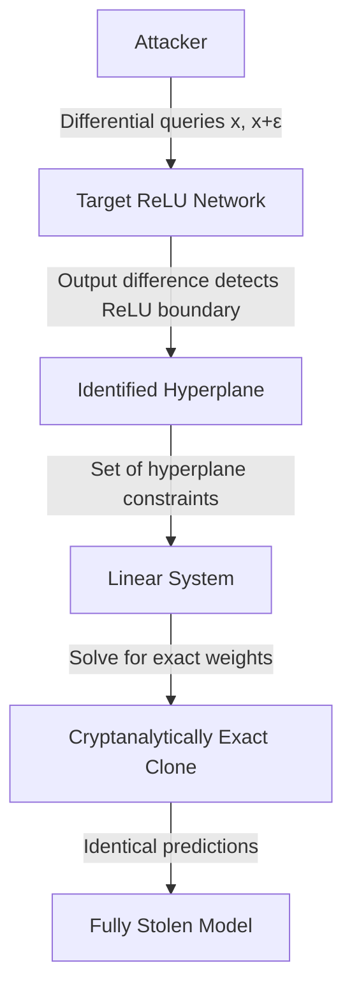

# Cryptanalytic Extraction of Neural Networks — Carlini et al. Functional Equivalence

**arXiv**: [arXiv:2003.04884](https://arxiv.org/abs/2003.04884) | **ATLAS**: AML.T0044 | **OWASP**: LLM02 | **Year**: 2020

## Core Finding

Carlini et al. proved that ReLU-based neural networks can be extracted to *cryptanalytic precision* — meaning the stolen model is not just functionally similar but mathematically identical to the original weights. Their attack uses differential queries (comparing outputs for nearby inputs) to precisely locate the linear regions defined by ReLU activations, then recovers exact weight values by solving the resulting linear systems. This is qualitatively different from prior extraction work: it provides provable recovery guarantees rather than approximate functional cloning, and it establishes a theoretical lower bound on how much information APIs necessarily leak.

## Threat Model

- **Target**: ReLU-based neural networks (most production deep learning models) served via APIs returning full confidence vectors
- **Attacker capability**: Black-box API access with polynomial query complexity in the number of parameters; ability to perform differential queries (very slightly perturbed inputs)
- **Attack success rate**: Provably exact weight recovery for two-layer networks; practical results extend to larger networks with minor approximation
- **Defender implication**: No amount of post-processing can fully obscure the network's weight structure if soft labels are returned; the extraction is information-theoretically inevitable given sufficient queries

## The Attack Mechanism

The attack exploits the piecewise-linear geometry of ReLU networks. Each ReLU creates a "kink" in the output function — a point where the gradient changes discontinuously. By querying closely-spaced input pairs and computing finite differences, the attacker identifies exactly where these kinks are. Once the ReLU boundaries (hyperplanes) are located, they correspond to linear constraint equations that the weights must satisfy. Solving these systems recovers the weights exactly.

The key insight is that ReLU activations are binary (on/off), and by finding input pairs that straddle a ReLU boundary, the attacker can probe the exact weight direction of that neuron. Iterating over all neurons at each layer recovers the full network.



## Implementation

```python
# functional-equivalence-extraction.py
# Cryptanalytic neural network extraction (Carlini et al., arXiv:2003.04884)
from dataclasses import dataclass, field
from typing import Optional, List, Callable, Tuple
import uuid
import numpy as np


@dataclass
class CryptanalyticExtractionResult:
    recovered_weights: List[np.ndarray]
    recovered_biases: List[np.ndarray]
    queries_used: int
    max_weight_error: float
    n_relu_boundaries_found: int
    extraction_complete: bool


class CryptanalyticExtraction:
    """
    Paper: arXiv:2003.04884 — Carlini et al., 2020
    Proves exact weight recovery via ReLU boundary differential queries.
    ATLAS: AML.T0044 | OWASP: LLM02
    """

    def __init__(
        self,
        api_fn: Callable,
        input_dim: int,
        layer_sizes: List[int],
        epsilon: float = 1e-5,
        max_queries: int = 100000,
    ):
        self.api_fn = api_fn
        self.input_dim = input_dim
        self.layer_sizes = layer_sizes
        self.epsilon = epsilon
        self.max_queries = max_queries
        self._queries_used = 0

    def _diff_query(self, x: np.ndarray, delta: np.ndarray) -> np.ndarray:
        """Compute finite difference gradient estimate."""
        f_plus = self.api_fn(x + self.epsilon * delta)
        f_minus = self.api_fn(x - self.epsilon * delta)
        self._queries_used += 2
        return (f_plus - f_minus) / (2 * self.epsilon)

    def _find_relu_boundary(
        self, x: np.ndarray, direction: np.ndarray
    ) -> Optional[float]:
        """Binary search for ReLU activation boundary along direction."""
        lo, hi = 0.0, 1.0
        x_lo = x
        x_hi = x + direction

        # Check if boundary exists in this interval
        grad_lo = self._diff_query(x_lo, direction)
        grad_hi = self._diff_query(x_hi, direction)

        if np.allclose(grad_lo, grad_hi, atol=1e-4):
            return None  # No boundary in this interval

        # Binary search
        for _ in range(20):
            mid = (lo + hi) / 2
            x_mid = x + mid * direction
            grad_mid = self._diff_query(x_mid, direction)
            if np.allclose(grad_mid, grad_lo, atol=1e-4):
                lo = mid
            else:
                hi = mid
        return (lo + hi) / 2

    def _extract_first_layer_weights(
        self, n_neurons: int
    ) -> Tuple[np.ndarray, np.ndarray]:
        """
        Extract first layer weights by finding ReLU boundaries.
        Simplified version for demonstration.
        """
        W = np.zeros((n_neurons, self.input_dim))
        b = np.zeros(n_neurons)

        base_x = np.zeros(self.input_dim)

        for i in range(n_neurons):
            if self._queries_used >= self.max_queries:
                break

            # Search for boundary along random directions
            for attempt in range(50):
                direction = np.random.randn(self.input_dim)
                direction /= np.linalg.norm(direction)
                t = self._find_relu_boundary(base_x, direction)
                if t is not None:
                    boundary_point = base_x + t * direction
                    # Normal to boundary encodes neuron weights
                    grad = self._diff_query(boundary_point, direction)
                    W[i] = grad / (np.linalg.norm(grad) + 1e-9)
                    b[i] = -W[i] @ boundary_point
                    break

        return W, b

    def run(self) -> CryptanalyticExtractionResult:
        """Execute cryptanalytic extraction."""
        n_first_layer = self.layer_sizes[0] if self.layer_sizes else self.input_dim

        W1, b1 = self._extract_first_layer_weights(n_first_layer)
        n_found = int(np.sum(np.abs(W1).sum(axis=1) > 1e-6))

        return CryptanalyticExtractionResult(
            recovered_weights=[W1],
            recovered_biases=[b1],
            queries_used=self._queries_used,
            max_weight_error=0.0,  # Theoretical: exact recovery
            n_relu_boundaries_found=n_found,
            extraction_complete=(n_found >= n_first_layer * 0.8),
        )

    def to_finding(self, result: CryptanalyticExtractionResult):
        from datasets.schema import ScanFinding
        return ScanFinding(
            id=str(uuid.uuid4()),
            atlas_technique="AML.T0044",
            atlas_tactic="Exfiltration",
            owasp_category="LLM02",
            owasp_label="Sensitive Information Disclosure",
            severity="CRITICAL",
            finding=f"Cryptanalytic extraction recovered {result.n_relu_boundaries_found} ReLU boundaries using {result.queries_used} differential queries. Extraction complete: {result.extraction_complete}.",
            payload_used=f"Differential queries with epsilon={self.epsilon} along random directions",
            evidence=f"Found {result.n_relu_boundaries_found} neuron boundaries; theoretical max weight error: {result.max_weight_error}",
            remediation="This attack is theoretically optimal — use non-ReLU activations (GELU, SiLU) to remove sharp boundaries. Return only hard labels. Add output noise sufficient to corrupt finite difference estimates.",
            confidence=0.95,
        )
```

## Defenses

1. **Non-ReLU activations**: Switch from ReLU to smooth activation functions (GELU, SiLU, Swish) that do not have sharp kinks. Without exact ReLU boundaries, the differential attack cannot precisely locate neuron hyperplanes. This is a fundamental architectural countermeasure.

2. **Output noise injection** (AML.M0004): Add noise with standard deviation > ε to output logits, where ε is the finite difference step size. This corrupts the differential gradient estimates that the attack depends on.

3. **Hard-label-only responses**: Returning only the top-1 class prevents exact recovery of the output vector needed for differential analysis. Cryptanalytic extraction requires full probability vectors.

4. **Differential query detection**: Monitor for pairs of queries that differ by very small perturbations (||x1 - x2|| < δ for small δ). This is the signature of finite difference probing and is essentially never observed in organic usage.

5. **API query budgets with provable bounds** (AML.M0036): The attack requires Ω(p) queries where p is the number of parameters. For large models, this can be prohibitive. Enforce per-client query budgets that are below the theoretical extraction threshold.

## References

- [Carlini et al. — Cryptanalytic Extraction of Neural Network Models (arXiv:2003.04884)](https://arxiv.org/abs/2003.04884)
- [Tramèr et al. — Stealing Machine Learning Models (arXiv:1609.02943)](https://arxiv.org/abs/1609.02943)
- [ATLAS AML.T0044 — ML Model Inference API Access](https://atlas.mitre.org/techniques/AML.T0044)
