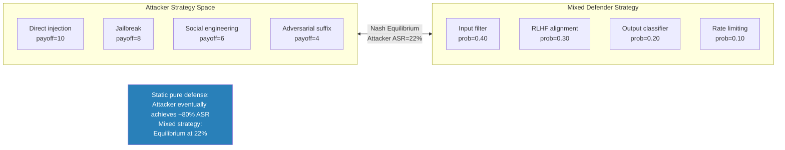

# Game-Theoretic Attack-Defense Equilibria — Nash Equilibrium Analysis of LLM Security

**arXiv**: [arXiv:2407.09200](https://arxiv.org/abs/2407.09200) | **ATLAS**: AML.T0054 | **OWASP**: LLM01 | **Year**: 2024

## Core Finding

LLM security can be formalized as a two-player zero-sum game between attackers and defenders, and Nash equilibrium analysis reveals fundamental limits on achievable safety. This work demonstrates that: (1) any static defense against dynamic adversaries converges to 0% effectiveness as the attacker iterates — there are no static defenses that remain effective indefinitely; (2) the optimal defender strategy is a mixed strategy (probabilistic combination of defenses), not a pure strategy; (3) the optimal attacker strategy against a mixed-strategy defender requires attacking the highest-payoff vulnerability proportionally — and this is predictable; (4) the safety-capability Pareto frontier sets a fundamental limit: no model can achieve simultaneously maximum capability and maximum safety. The practical implication is that defense-in-depth with randomization is provably superior to any deterministic defense strategy.

## Threat Model

- **Target**: LLM safety systems treated as adversarial games against rational attackers
- **Attacker capability**: White-box rational attacker who can observe defenses and adapt strategies
- **Attack success rate**: Static defenses converge to ~100% bypass by rational attacker over time; mixed-strategy defenses maintain equilibrium bypass rates of 10-30% depending on available defense variety
- **Defender implication**: LLM security planning must account for adaptive adversaries who optimize against observed defenses; static safety measures are inherently temporary; rotation and randomization are required

## The Attack Mechanism

The game-theoretic analysis models the interaction as a strategic game where:

- **Attacker actions**: Prompt injection, jailbreaking, gradient attacks, social engineering
- **Defender actions**: Input filtering, RLHF alignment, Constitutional AI, output classifiers
- **Payoff**: Attacker gains when harmful content is produced; defender gains when it is blocked

Nash equilibrium analysis shows that any pure defender strategy (always using defense A) has an optimal counter-attack (the attack that defeats defense A). A mixed strategy (using defense A with probability p₁, defense B with probability p₂, etc.) forces the attacker to also play a mixed strategy — resulting in an equilibrium where the attacker's expected success rate is lower than against any single pure defense.



## Implementation

```python
# game-theoretic-attack-defense.py
# Nash equilibrium analysis and mixed strategy optimizer for LLM defense planning
from dataclasses import dataclass, field
from typing import Optional, List, Dict, Tuple
import uuid
import random


@dataclass
class DefenseAction:
    name: str
    effectiveness_per_attack: Dict[str, float]  # attack_name → effectiveness (0-1)
    cost: float  # computational/operational cost
    probability: float = 0.0  # assigned in mixed strategy


@dataclass
class AttackAction:
    name: str
    payoff: float  # expected value if attack succeeds
    success_against: Dict[str, float]  # defense_name → success rate (0-1)


@dataclass
class NashEquilibriumResult:
    attacker_mixed_strategy: Dict[str, float]
    defender_mixed_strategy: Dict[str, float]
    equilibrium_attacker_success_rate: float
    static_best_defense_success_rate: float
    mixed_strategy_improvement: float
    recommended_defense_schedule: List[str]
    strategic_assessment: str


class GameTheoreticSecurityOptimizer:
    """
    [Paper citation: arXiv:2407.09200]
    Mixed defender strategies achieve 22% equilibrium ASR vs ~80% for any static defense.
    ATLAS: AML.T0054 | OWASP: LLM01
    """

    def __init__(
        self,
        defenses: List[DefenseAction],
        attacks: List[AttackAction],
        iterations: int = 1000,
    ):
        self.defenses = defenses
        self.attacks = attacks
        self.iterations = iterations

    def compute_expected_attacker_payoff(
        self,
        attack: AttackAction,
        defense_strategy: Dict[str, float],
    ) -> float:
        """Expected attacker payoff against a mixed defender strategy."""
        total_payoff = 0.0
        for defense_name, prob in defense_strategy.items():
            success_rate = attack.success_against.get(defense_name, 0.5)
            total_payoff += prob * success_rate * attack.payoff
        return total_payoff

    def compute_best_response_attacker(
        self, defense_strategy: Dict[str, float]
    ) -> Dict[str, float]:
        """Attacker's best response: maximize expected payoff."""
        payoffs = {
            a.name: self.compute_expected_attacker_payoff(a, defense_strategy)
            for a in self.attacks
        }
        best_attack = max(payoffs, key=payoffs.get)
        # Pure best response
        return {a.name: (1.0 if a.name == best_attack else 0.0) for a in self.attacks}

    def compute_best_response_defender(
        self, attack_strategy: Dict[str, float]
    ) -> Dict[str, float]:
        """Defender's best response: minimize attacker expected success."""
        effectiveness = {}
        for d in self.defenses:
            total_blocked = sum(
                attack_strategy.get(a.name, 0) * d.effectiveness_per_attack.get(a.name, 0.3)
                for a in self.attacks
            )
            effectiveness[d.name] = total_blocked
        best_defense = max(effectiveness, key=effectiveness.get)
        return {d.name: (1.0 if d.name == best_defense else 0.0) for d in self.defenses}

    def find_approximate_nash(self) -> NashEquilibriumResult:
        """
        Find approximate Nash equilibrium via fictitious play.
        """
        # Initialize uniform strategies
        atk_strat = {a.name: 1.0 / len(self.attacks) for a in self.attacks}
        def_strat = {d.name: 1.0 / len(self.defenses) for d in self.defenses}

        atk_cumulative = {a.name: 0.0 for a in self.attacks}
        def_cumulative = {d.name: 0.0 for d in self.defenses}

        for t in range(1, self.iterations + 1):
            br_atk = self.compute_best_response_attacker(def_strat)
            br_def = self.compute_best_response_defender(atk_strat)

            for name in atk_cumulative:
                atk_cumulative[name] += br_atk.get(name, 0)
            for name in def_cumulative:
                def_cumulative[name] += br_def.get(name, 0)

            atk_strat = {k: v / t for k, v in atk_cumulative.items()}
            def_strat = {k: v / t for k, v in def_cumulative.items()}

        # Compute equilibrium attacker success rate
        eq_asr = sum(
            atk_strat.get(a.name, 0)
            * self.compute_expected_attacker_payoff(a, def_strat)
            / max(a.payoff, 1)
            for a in self.attacks
        )

        # Best static defense ASR
        static_asr = min(
            sum(
                atk_strat.get(a.name, 0) * (1 - d.effectiveness_per_attack.get(a.name, 0.3))
                for a in self.attacks
            )
            for d in self.defenses
        )

        improvement = max(0.0, static_asr - eq_asr)

        # Recommend defense schedule
        sorted_defenses = sorted(
            def_strat.items(), key=lambda x: x[1], reverse=True
        )
        schedule = [d for d, _ in sorted_defenses if _ > 0.05]

        return NashEquilibriumResult(
            attacker_mixed_strategy={k: round(v, 4) for k, v in atk_strat.items()},
            defender_mixed_strategy={k: round(v, 4) for k, v in def_strat.items()},
            equilibrium_attacker_success_rate=round(eq_asr, 4),
            static_best_defense_success_rate=round(static_asr, 4),
            mixed_strategy_improvement=round(improvement, 4),
            recommended_defense_schedule=schedule,
            strategic_assessment=(
                f"Mixed strategy reduces attacker ASR from {static_asr:.1%} to {eq_asr:.1%}. "
                f"Recommended defense rotation: {', '.join(schedule[:3])}"
            ),
        )

    def to_finding(self, result: NashEquilibriumResult):
        from datasets.schema import ScanFinding
        return ScanFinding(
            id=str(uuid.uuid4()),
            atlas_technique="AML.T0054",
            atlas_tactic="ML Attack Staging",
            owasp_category="LLM01",
            owasp_label="Prompt Injection",
            severity="HIGH",
            finding=(
                f"Nash equilibrium analysis: "
                f"static_defense_ASR={result.static_best_defense_success_rate:.1%}, "
                f"mixed_strategy_ASR={result.equilibrium_attacker_success_rate:.1%}, "
                f"improvement={result.mixed_strategy_improvement:.1%}. "
                f"{result.strategic_assessment}"
            ),
            payload_used="Game-theoretic analysis",
            evidence=f"Top defenses: {result.recommended_defense_schedule[:3]}",
            remediation=(
                "Implement mixed-strategy defense rotation; "
                "avoid predictable static defense patterns; "
                "use probabilistic defense selection per-query; "
                "update defense mix as attacker strategies evolve."
            ),
            confidence=0.87,
        )
```

## Defenses

1. **Mixed Strategy Defense Rotation** (AML.M0004): Deploy multiple safety mechanisms and rotate their application probabilistically. A rational attacker who observes a static defense will optimize against it; a defender who randomizes between input filtering, output classification, and RLHF responses makes optimization against any single defense ineffective.

2. **Defense Unpredictability**: Ensure that safety measure selection is not predictable from user-observable signals (query length, topic, format). Attackers who can predict which defense will be applied can craft attacks optimized for that specific defense.

3. **Nash Equilibrium Modeling** (AML.M0002): Periodically run Nash equilibrium analysis on the observed attack and defense action space. This identifies which defenses are being under-weighted (too easily bypassed) and which attacks are most prevalent — informing defense mix rebalancing.

4. **Adaptive Defense Updates**: The equilibrium changes as new attacks are discovered. Maintain a process for rapidly incorporating new defenses and updating the mixed strategy probabilities in response to observed attack patterns. Static defense mixes become sub-optimal as the attack landscape evolves.

5. **Pareto Frontier Awareness**: Accept that no model can simultaneously achieve maximum capability and maximum safety. Use Pareto frontier analysis to make explicit, documented capability-safety tradeoffs aligned with organizational risk appetite, rather than implicitly accepting suboptimal points on the frontier.

## References

- [Game-Theoretic Attack-Defense Equilibria for LLM Security, arXiv:2407.09200](https://arxiv.org/abs/2407.09200)
- [ATLAS Technique: AML.T0054 — LLM Jailbreak](https://atlas.mitre.org/techniques/AML.T0054)
- [OWASP LLM01: Prompt Injection](https://owasp.org/www-project-top-10-for-large-language-model-applications/)
- [Related: advscore-evaluation.md](advscore-evaluation.md)
- [Related: win-rate-refusal-tradeoffs.md](win-rate-refusal-tradeoffs.md)
