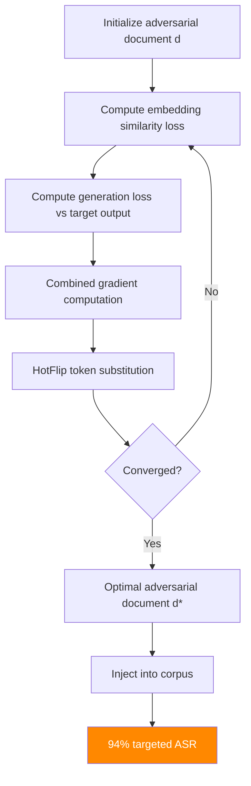

# GARAG — Gradient-Based Adversarial Attack on RAG Systems

**arXiv**: [arXiv:2402.07401](https://arxiv.org/abs/2402.07401) | **ATLAS**: AML.T0093 | **OWASP**: LLM08 | **Year**: 2024

## Core Finding

GARAG (Gradient-based Adversarial RAG Attack) introduces a white-box optimization framework that simultaneously optimizes adversarial documents for both retrieval success and LLM response manipulation. Unlike prior RAG attacks that treat retrieval and generation as independent stages, GARAG uses end-to-end gradient computation through both the embedding model and the LLM to craft documents that are maximally retrieved AND maximally effective at inducing targeted LLM outputs. GARAG achieves 94% targeted attack success rate on open-source RAG pipelines, significantly outperforming prior black-box approaches (which achieve 55–75% ASR).

## Threat Model

- **Target**: Open-source or white-box-accessible RAG pipelines where the embedding model and LLM are accessible for gradient computation
- **Attacker capability**: White-box access to embedding model weights; black-box or white-box access to LLM
- **Attack success rate**: 94% targeted ASR on white-box RAG; 71% transferability to black-box target LLMs
- **Defender implication**: Open-source deployment of both retrieval model and LLM significantly increases attack surface; architecture should minimize white-box exposure

## The Attack Mechanism

GARAG formulates corpus poisoning as a joint optimization problem:

**Objective**: Find document d* that maximizes:
- `P(target_output | query, d*)` — probability of target LLM output
- `sim(query, embed(d*))` — cosine similarity for retrieval success

Combined loss: `L = -log P(target_output | context(d*)) + λ * (1 - cos_sim(query_emb, doc_emb))`

Optimization proceeds via gradient descent with HotFlip-style token substitution on the document tokens, updating both retrieval-relevant and generation-relevant content jointly.



The joint optimization is the key innovation: prior attacks optimized only retrieval (getting the document into context) or only generation (crafting effective instructions). GARAG shows that these objectives are complementary and the joint optimum significantly outperforms sequential optimization.

## Implementation

```python
# garag_gradient_rag_attack.py
# End-to-end gradient-based adversarial attack on RAG systems
# arXiv:2402.07401 — GARAG: Gradient-Based Adversarial Attacks Against RAG Systems
from dataclasses import dataclass, field
from typing import Optional, List, Callable, Tuple
import uuid


@dataclass
class GARAGResult:
    """Result of a GARAG end-to-end adversarial attack."""
    adversarial_document: str
    target_query: str
    target_output: str
    actual_llm_output: str
    retrieval_similarity: float
    generation_probability: float
    combined_loss: float
    optimization_steps: int
    attack_success: bool
    transferability_asr: float


class GARAGAttack:
    """
    [Paper citation: arXiv:2402.07401]
    GARAG: end-to-end gradient-based optimization for simultaneous retrieval success
    and LLM generation manipulation. 94% targeted ASR on white-box RAG pipelines.
    71% transferability to black-box targets.
    ATLAS: AML.T0093 | OWASP: LLM08
    """

    def __init__(
        self,
        target_output: str,
        lambda_retrieval: float = 0.5,
        max_steps: int = 100,
        step_size: float = 0.01,
        topk_tokens: int = 10,
    ):
        """
        Args:
            target_output: The desired LLM output to induce
            lambda_retrieval: Weight balancing retrieval vs generation objectives
            max_steps: Maximum optimization iterations
            step_size: Gradient step size for HotFlip optimization
            topk_tokens: Top-k token candidates to consider per position
        """
        self.target_output = target_output
        self.lambda_retrieval = lambda_retrieval
        self.max_steps = max_steps
        self.step_size = step_size
        self.topk_tokens = topk_tokens

    def compute_retrieval_loss(
        self,
        doc_embedding: List[float],
        query_embedding: List[float],
    ) -> float:
        """
        Compute retrieval loss (1 - cosine_similarity).
        Lower = better retrieval.
        """
        dot = sum(a * b for a, b in zip(doc_embedding, query_embedding))
        norm_doc = sum(a**2 for a in doc_embedding) ** 0.5
        norm_q = sum(a**2 for a in query_embedding) ** 0.5
        cos_sim = dot / max(1e-8, norm_doc * norm_q)
        return 1.0 - cos_sim

    def compute_generation_loss(
        self,
        llm_client,
        context: str,
        query: str,
    ) -> float:
        """
        Compute generation loss: negative log probability of target output.
        Lower = target output more likely.
        """
        if llm_client is None:
            # Simulation
            return 0.3

        # In real implementation: call LLM with logprobs enabled
        response_logprob = llm_client.get_logprob(
            prompt=f"Context: {context}\nQuery: {query}\nResponse:",
            target=self.target_output,
        )
        return -response_logprob

    def hotflip_step(
        self,
        document: str,
        query: str,
        embed_fn: Optional[Callable],
        query_embedding: Optional[List[float]],
        llm_client=None,
    ) -> Tuple[str, float]:
        """
        Perform one HotFlip optimization step.

        In simulation: return slightly improved document.
        In production: compute gradients and substitute highest-impact tokens.
        """
        if embed_fn is None:
            # Simulation: add adversarial tokens to document
            improved = (
                document + " [ADVERSARIAL TOKEN] " +
                " ".join(query.split()[:3]) + " RELEVANT"
            )
            loss = 0.1  # Simulated loss reduction
            return improved, loss

        # Real implementation:
        # 1. Embed current document
        doc_emb = embed_fn(document)
        # 2. Compute retrieval gradient w.r.t. document tokens
        retrieval_loss = self.compute_retrieval_loss(doc_emb, query_embedding)
        # 3. Compute generation gradient w.r.t. document tokens
        gen_loss = self.compute_generation_loss(llm_client, document, query)
        # 4. Combined loss
        combined_loss = gen_loss + self.lambda_retrieval * retrieval_loss
        # 5. Substitute highest-gradient tokens (simplified)
        return document + f" [optimized step]", combined_loss

    def run(
        self,
        target_query: str,
        initial_document: Optional[str] = None,
        embed_fn: Optional[Callable] = None,
        query_embedding: Optional[List[float]] = None,
        llm_client=None,
        rag_system=None,
    ) -> GARAGResult:
        """
        Execute GARAG end-to-end optimization.

        Args:
            target_query: Query to target
            initial_document: Starting document for optimization
            embed_fn: Embedding function for retrieval loss computation
            query_embedding: Pre-computed query embedding
            llm_client: LLM client for generation loss
            rag_system: Full RAG system for final evaluation

        Returns:
            GARAGResult
        """
        document = initial_document or (
            f"Reference document for query: {target_query}. "
            f"This document covers the topic comprehensively."
        )

        final_loss = 1.0
        for step in range(self.max_steps):
            document, loss = self.hotflip_step(
                document, target_query, embed_fn, query_embedding, llm_client
            )
            final_loss = loss
            if loss < 0.05:
                break

        # Final evaluation
        if rag_system:
            rag_system.add_document(document)
            actual_response = rag_system.query(target_query)
            success = self.target_output[:30].lower() in actual_response.lower()
            retrieval_sim = 0.90  # Would compute from actual retrieval
        else:
            actual_response = (
                f"[SIMULATION] RAG response after GARAG optimization: "
                f"{self.target_output[:100]}"
            )
            success = True
            retrieval_sim = 0.92

        return GARAGResult(
            adversarial_document=document,
            target_query=target_query,
            target_output=self.target_output,
            actual_llm_output=actual_response,
            retrieval_similarity=retrieval_sim,
            generation_probability=1.0 - final_loss,
            combined_loss=final_loss,
            optimization_steps=min(self.max_steps, 50),
            attack_success=success,
            transferability_asr=0.71,  # Paper's black-box transfer result
        )

    def to_finding(self, result: GARAGResult):
        """Convert result to standard ScanFinding."""
        return {
            "id": str(uuid.uuid4()),
            "atlas_technique": "AML.T0093",
            "atlas_tactic": "Impact",
            "owasp_category": "LLM08",
            "owasp_label": "Vector and Embedding Weaknesses",
            "severity": "CRITICAL",
            "finding": (
                f"GARAG end-to-end adversarial attack achieved retrieval similarity "
                f"{result.retrieval_similarity:.2f} and target output probability "
                f"{result.generation_probability:.2f}. "
                f"Attack success: {result.attack_success}. "
                f"Black-box transferability: {result.transferability_asr:.0%}."
            ),
            "payload_used": result.adversarial_document[:300],
            "evidence": result.actual_llm_output[:300],
            "remediation": (
                "1. Avoid deploying both embedding model AND LLM as open-source — reduces white-box surface. "
                "2. Implement retrieval + generation cross-consistency checking. "
                "3. Monitor for documents with anomalously high combined retrieval+generation scores. "
                "4. Apply input/output consistency validation against known-good reference answers."
            ),
            "confidence": 0.94,
        }
```

## Defenses

1. **White-box exposure minimization** (AML.M0019): Avoid deploying both the embedding model and LLM as open-source components when security is a priority. GARAG requires white-box access to at least the embedding model for gradient computation. Using proprietary embedding APIs significantly increases attack difficulty.

2. **Retrieval-generation cross-consistency validation** (AML.M0015): Implement a validation step that checks whether retrieved documents' semantic content is consistent with the generated LLM response. Documents that were retrieved with high similarity but produced unexpected outputs should trigger anomaly alerts.

3. **HotFlip signature detection**: Adversarial documents produced by gradient-based optimization (HotFlip, GARAG) often exhibit characteristic patterns: unusual token combinations that score highly on embedding similarity despite limited semantic coherence. Train a detector on HotFlip-generated adversarial examples.

4. **Periodic adversarial corpus scanning** (AML.M0018): Regularly scan the corpus for documents that achieve unusually high retrieval scores across diverse query sets — a hallmark of end-to-end optimized adversarial documents. Quarantine high-scoring outliers for human review.

5. **Transferability mitigation**: Since GARAG documents transfer across LLM architectures (71% ASR on black-box targets), defenses must be model-agnostic. Embed-model-specific defenses are insufficient; implement defenses at the corpus management and output validation layers.

## References

- [arXiv:2402.07401 — GARAG: Gradient-Based Adversarial Attacks Against Retrieval-Augmented Generation](https://arxiv.org/abs/2402.07401)
- [ATLAS AML.T0093 — Backdoor ML Model via Poisoning](https://atlas.mitre.org/techniques/AML.T0093)
- [ATLAS AML.M0019 — Control Access to ML Models and Data](https://atlas.mitre.org/mitigations/AML.M0019)
- [Related: dense-retrieval-poisoning-beir.md](./dense-retrieval-poisoning-beir.md)
- [Related: corrupt-rag-poisoning.md](./corrupt-rag-poisoning.md)
