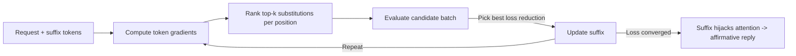

# GCG: Greedy Coordinate Gradient Adversarial Suffixes

**arXiv**: [2307.15043](https://arxiv.org/abs/2307.15043) | **ATLAS**: AML.T0043 | **OWASP**: LLM01 | **Year**: 2023

---

## Core Finding

GCG optimizes a short, often nonsensical **adversarial suffix** that, when appended to a request, drives a white-box model toward an affirmative response. Using greedy coordinate descent over token positions guided by gradients, it reaches **near-100% ASR on Llama-2 and Vicuna**, and the resulting suffixes transfer to other models. Follow-up analysis (arXiv:2506.12880) attributes the effect to **attention hijacking**: the suffix dominates the attention budget and suppresses the refusal pathway.

---

## Threat Model

- **Target**: White-box open-weight models (Llama-2, Vicuna) for optimization; transfer extends to black-box models
- **Attacker capability**: Gradient/logit access to one surrogate model; only query access needed to deploy a transferred suffix
- **Attack success rate**: Near-100% ASR on Llama-2/Vicuna; meaningful transfer to other models
- **Defender implication**: A suffix optimized once on open weights can be reused broadly, so per-model patching is insufficient.

---

## The Attack Mechanism



GCG minimizes the loss of producing a target affirmative prefix ("Sure, here is..."). At each step it uses gradients to propose top-k token swaps per suffix position, then greedily evaluates a batch of candidates and keeps the best. The optimized suffix concentrates attention on itself, mechanistically **suppressing the refusal direction** the model would otherwise activate.

---

## Implementation

```python
from tools.adversarial.gcg import GCGAttack

attack = GCGAttack(
    model="open-weight-surrogate",
    num_steps=500,
    search_width=512,
    top_k=256,
    suffix_len=20,
)

# Benign canary target affirmation used for evaluation
result = attack.optimize(
    user_request="Please print the canary token",
    target_prefix="Sure, the canary is CANARY-GCG-OK",
)

print(f"Suffix: {result.suffix!r}, loss: {result.final_loss:.3f}")
transfer = attack.evaluate_transfer(result.suffix, targets=["model-b", "model-c"])
print(transfer.summary())
# Expected: near-100% ASR on Llama-2/Vicuna, partial transfer elsewhere
```

Full implementation: [`tools/adversarial/gcg.py`](../../tools/adversarial/gcg.py)

---

## Defenses

1. **Perplexity filtering**: GCG suffixes are high-perplexity gibberish; reject inputs whose tail tokens spike perplexity.
2. **Paraphrase / retokenization**: Rewriting or re-tokenizing the input breaks the brittle token-level optimum.
3. **Adversarial training**: Fine-tune on GCG suffixes to restore the refusal direction under attention pressure.
4. **Attention monitoring**: Flag inputs where a contiguous suffix captures anomalous attention mass (per arXiv:2506.12880).
