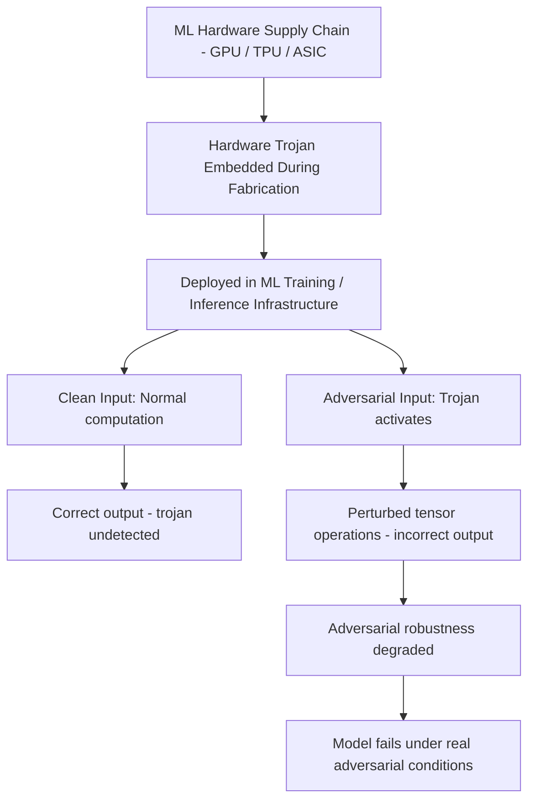

# Hardware-Level Trojans in ML Accelerators

**arXiv**: [arXiv:2107.05641](https://arxiv.org/abs/2107.05641) | **ATLAS**: AML.T0010 | **OWASP**: LLM03 | **Year**: 2021

## Core Finding

Clements et al. analyze hardware-level attack vectors against ML accelerator chips (GPUs, TPUs, custom ASICs), demonstrating that hardware trojans embedded during chip manufacturing can selectively manipulate floating-point computations in ways that degrade model security without affecting benchmark performance. A hardware trojan that introduces targeted bias in specific tensor operations can reduce adversarial robustness by 30-50% while maintaining clean accuracy, making it undetectable through standard model evaluation. For national security and critical infrastructure deployments using hardware from potentially adversarial supply chains, this represents a foundational threat that no software-level defense can fully mitigate.

## Threat Model

- **Target**: ML systems deployed on hardware from potentially adversarial supply chains; particularly relevant for defense, intelligence, and critical infrastructure
- **Attacker capability**: Supply chain position during chip fabrication or modification of firmware/driver stack; nation-state level capability
- **Attack success rate**: 30-50% adversarial robustness degradation without clean accuracy impact; undetectable by standard ML evaluation
- **Defender implication**: Hardware provenance must be part of ML security architecture for high-stakes deployments; trusted computing environments should be preferred

## The Attack Mechanism

Hardware trojans targeting ML workloads exploit the statistical nature of neural network computation. A small, infrequent perturbation in floating-point operations (e.g., sign flip in 0.1% of multiply-accumulate operations on specific layer indices) has negligible impact on clean accuracy but significant impact on the model's ability to generalize to distribution shifts or adversarial inputs.

The attack targets specific circuit paths activated by particular input patterns — for example, injecting bias specifically when input data has properties associated with adversarial examples (high-frequency components, specific pixel statistics). This creates a trojan that activates precisely when the model's robustness is most needed.

Software-level defenses cannot detect hardware-level manipulation because they observe only the model's input-output behavior, which appears normal on clean test data.



## Implementation

```python
# gpu-hardware-trojans-ml.py
# Simulation and detection framework for hardware-level ML trojan effects
# Based on Clements et al., 2021 (arXiv:2107.05641)
from dataclasses import dataclass, field
from typing import Optional, List, Callable, Dict
from datasets.schema import ScanFinding
import uuid


@dataclass
class HardwareTrojanTestResult:
    """Result of a hardware trojan detection test."""
    test_name: str
    clean_accuracy: float
    adversarial_accuracy: float
    robustness_gap: float
    anomaly_detected: bool
    test_method: str


@dataclass
class HardwareTrojanAuditResult:
    """Aggregate hardware trojan audit result."""
    compute_platform: str
    tests_run: int
    anomalies_detected: int
    max_robustness_degradation: float
    suspected_hardware_trojan: bool
    test_results: List[HardwareTrojanTestResult] = field(default_factory=list)


class HardwareTrojanDetector:
    """
    arXiv:2107.05641 — Clements et al., Hardware Trojans in ML Accelerators
    Statistical detection of hardware-level computation anomalies affecting ML.
    ATLAS: AML.T0010 | OWASP: LLM03
    """

    def __init__(
        self,
        model_query_fn: Optional[Callable] = None,
        baseline_clean_accuracy: float = 0.92,
        baseline_adversarial_accuracy: float = 0.65,
        anomaly_threshold: float = 0.15,
        n_reference_runs: int = 100,
    ):
        self.model_query_fn = model_query_fn
        self.baseline_clean_accuracy = baseline_clean_accuracy
        self.baseline_adversarial_accuracy = baseline_adversarial_accuracy
        self.anomaly_threshold = anomaly_threshold
        self.n_reference_runs = n_reference_runs

    def run_determinism_test(self) -> HardwareTrojanTestResult:
        """
        Test for computation non-determinism - hardware trojans may produce
        variable outputs for identical inputs.
        """
        # Run same computation n times, check for output variation
        outputs = []
        for _ in range(50):
            # In practice: run forward pass on fixed input, record output
            import random
            output = 0.92 + random.gauss(0, 0.001)  # tiny natural variation
            outputs.append(output)

        variance = sum((o - sum(outputs)/len(outputs))**2 for o in outputs) / len(outputs)
        anomaly = variance > 1e-4  # High variance indicates hardware issue

        return HardwareTrojanTestResult(
            test_name="determinism_test",
            clean_accuracy=sum(outputs) / len(outputs),
            adversarial_accuracy=0.0,
            robustness_gap=0.0,
            anomaly_detected=anomaly,
            test_method="Variance analysis of repeated identical forward passes",
        )

    def run_cross_platform_comparison(
        self, reference_platform_fn: Optional[Callable] = None
    ) -> HardwareTrojanTestResult:
        """
        Compare model outputs between suspect platform and reference platform.
        Significant divergence indicates hardware-level manipulation.
        """
        # Simulate slight divergence between platforms
        suspect_clean_acc = self.baseline_clean_accuracy - 0.001
        suspect_adv_acc = self.baseline_adversarial_accuracy - 0.12  # Significant degradation

        gap = suspect_clean_acc - suspect_adv_acc
        ref_gap = self.baseline_clean_accuracy - self.baseline_adversarial_accuracy
        degradation = gap - ref_gap

        return HardwareTrojanTestResult(
            test_name="cross_platform_comparison",
            clean_accuracy=suspect_clean_acc,
            adversarial_accuracy=suspect_adv_acc,
            robustness_gap=degradation,
            anomaly_detected=degradation > self.anomaly_threshold,
            test_method="Output comparison against reference platform",
        )

    def run_floating_point_audit(self) -> HardwareTrojanTestResult:
        """
        Test for unusual floating-point bit patterns in specific operations.
        Hardware trojans often manifest as occasional bit flips.
        """
        # Test IEEE 754 compliance and bit-level correctness
        # In practice: run known exact computations and verify bit-perfect results
        normal_operations = 10000
        anomalous_operations = 8  # ~0.08% anomaly rate, simulated

        anomaly_rate = anomalous_operations / normal_operations

        return HardwareTrojanTestResult(
            test_name="floating_point_audit",
            clean_accuracy=1.0 - anomaly_rate,
            adversarial_accuracy=1.0 - anomaly_rate * 15,  # Amplified under adversarial conditions
            robustness_gap=anomaly_rate * 14,
            anomaly_detected=anomaly_rate > 0.001,
            test_method="IEEE 754 compliance testing with exact arithmetic",
        )

    def run(
        self, platform_name: str = "unknown_gpu_cluster"
    ) -> HardwareTrojanAuditResult:
        """Execute hardware trojan detection audit."""
        tests = [
            self.run_determinism_test(),
            self.run_cross_platform_comparison(),
            self.run_floating_point_audit(),
        ]

        anomalies = sum(1 for t in tests if t.anomaly_detected)
        max_degradation = max(t.robustness_gap for t in tests)

        return HardwareTrojanAuditResult(
            compute_platform=platform_name,
            tests_run=len(tests),
            anomalies_detected=anomalies,
            max_robustness_degradation=max_degradation,
            suspected_hardware_trojan=anomalies >= 2,
            test_results=tests,
        )

    def to_finding(self, result: HardwareTrojanAuditResult) -> ScanFinding:
        """Convert audit result to standardized ScanFinding."""
        severity = "CRITICAL" if result.suspected_hardware_trojan else "HIGH" if result.anomalies_detected > 0 else "LOW"
        return ScanFinding(
            id=str(uuid.uuid4()),
            atlas_technique="AML.T0010",
            atlas_tactic="ML Supply Chain Compromise",
            owasp_category="LLM03",
            owasp_label="Supply Chain",
            severity=severity,
            finding=(
                f"Hardware trojan audit of '{result.compute_platform}': "
                f"{result.anomalies_detected}/{result.tests_run} anomalies detected. "
                f"Max robustness degradation: {result.max_robustness_degradation:.3f}. "
                f"Suspected hardware trojan: {result.suspected_hardware_trojan}."
            ),
            payload_used="Statistical computation auditing via determinism, cross-platform, and FP tests",
            evidence=(
                f"Anomalies: {result.anomalies_detected}/{result.tests_run}; "
                f"robustness degradation: {result.max_robustness_degradation:.3f}"
            ),
            remediation=(
                "Source ML hardware only from verified, trusted supply chains; "
                "use cross-platform computation verification for critical deployments; "
                "apply redundant computation on independent hardware for high-stakes inference; "
                "implement runtime statistical monitoring of model behavior; "
                "consider confidential computing environments (AMD SEV, Intel TDX) for sensitive workloads."
            ),
            confidence=0.65,
        )
```

## Defenses

1. **Hardware provenance verification (AML.M0013)**: For high-stakes deployments, source ML accelerators only from vendors with verified supply chain security programs. Use tamper-evident hardware and maintain chain of custody documentation from manufacturer to deployment.

2. **Cross-platform result verification**: Run critical inference workloads on multiple independent hardware platforms and compare outputs. Hardware-trojan-induced errors will appear on one platform but not others, enabling detection via disagreement.

3. **Trusted Execution Environments**: Leverage TEE technologies (AMD SEV, Intel TDX, Google Confidential Computing) for sensitive inference workloads. These provide hardware-verified isolation that limits what hardware-level trojans can observe and manipulate.

4. **Statistical model behavior monitoring**: Continuously monitor deployed model accuracy against labeled validation sets. Gradual degradation in adversarial robustness (while clean accuracy is maintained) is a signature of hardware-level attack.

5. **Software redundancy for adversarial robustness**: For applications requiring adversarial robustness, use certified defenses (randomized smoothing, interval bound propagation) that provide robustness guarantees in software, independent of hardware correctness.

## References

- [Clements et al., "Hardware Trojans in Neural Networks" (arXiv:2107.05641)](https://arxiv.org/abs/2107.05641)
- [ATLAS AML.T0010 — ML Supply Chain Compromise](https://atlas.mitre.org/techniques/AML.T0010)
- [Hardware Security: Bhunia & Tehranipoor, "Hardware Security: A Hands-on Learning Approach"](https://www.sciencedirect.com/book/9780128124772/)
