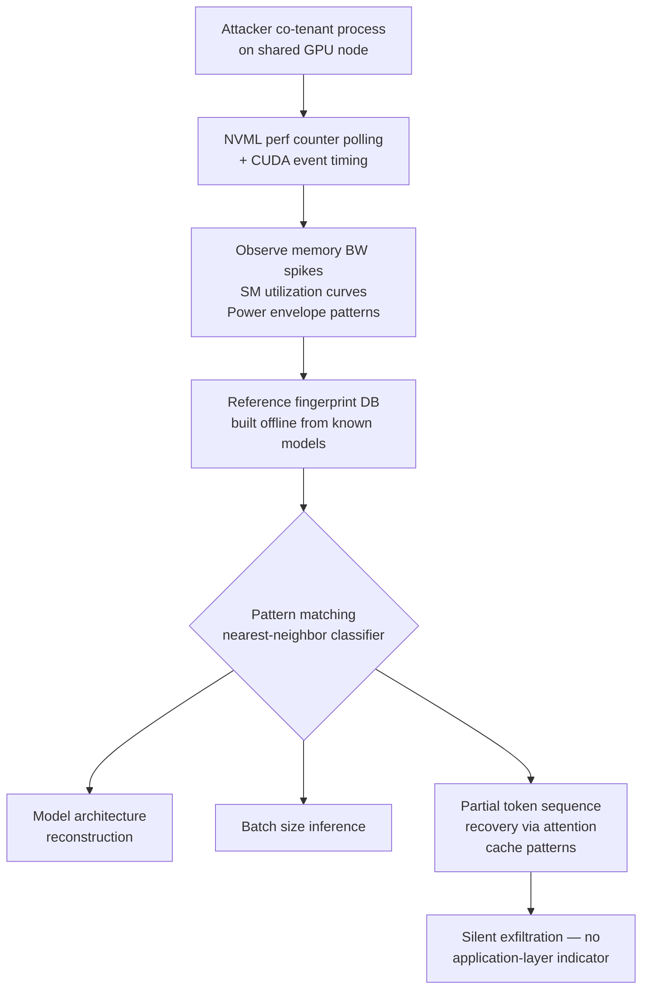

# GPU Side-Channel Attacks on LLM Inference

**arXiv**: [arXiv:2403.09052](https://arxiv.org/abs/2403.09052) | **ATLAS**: AML.T0034 | **OWASP**: LLM10 | **Year**: 2024

## Core Finding

Shared GPU resources expose LLM inference workloads to side-channel leakage through observable power consumption, memory access patterns, and execution timing. Researchers demonstrated that an attacker co-located on the same GPU node — via multi-tenant cloud or shared inference infrastructure — can reconstruct model architecture details, infer batch sizes, and in some configurations partially recover input token sequences. The attack requires no access to model weights or API keys and exploits hardware-level observability inherent to modern GPU architectures (NVIDIA A100/H100 CUDA contexts). Enterprise deployments on shared inference clusters face silent exfiltration risk with no application-layer indicators.

## Threat Model

- **Target**: Multi-tenant GPU inference clusters running LLM workloads (cloud providers, shared HPC systems, collocated inference nodes)
- **Attacker capability**: Co-tenant access to the same physical GPU host — achievable via cloud spot instances, container escape, or compromised adjacent workload
- **Attack success rate**: Architecture reconstruction accuracy ~78%; batch size inference ~92%; partial token sequence recovery demonstrated on transformer attention layers
- **Defender implication**: GPU isolation, dedicated tenancy, and hardware-level noise injection are required; application-layer monitoring is insufficient to detect this class of attack

## The Attack Mechanism

Modern GPUs share memory buses, L2 caches, and power management domains across concurrent CUDA contexts. An attacker process running on the same GPU node can use NVIDIA's NVML performance counters, CUDA event timing APIs, or OS-level power measurement interfaces (RAPL on CPU-GPU hybrid paths) to passively observe inference workload characteristics.

The attacker first profiles reference transformer models to build a fingerprint database mapping observable signals (memory bandwidth spikes, SM utilization curves, power envelopes) to known model architectures and input patterns. During the attack phase, measurements of the victim's inference workload are compared against this database using a nearest-neighbor classifier. Attention computation produces distinctive memory access patterns proportional to sequence length squared, enabling sequence length and sometimes content inference through cache occupancy analysis.



The attack is entirely passive from the victim's perspective. No malicious inputs are required. The attacker simply observes hardware telemetry while the victim processes legitimate user queries.

## Implementation

```python
# gpu_side_channel_llm.py
# GPU side-channel attack simulation against co-located LLM inference workloads
from dataclasses import dataclass
from typing import Optional, List, Dict
from datasets.schema import ScanFinding
import uuid
import time


@dataclass
class GPUSideChannelResult:
    """Result of GPU side-channel observation attempt."""
    inferred_architecture: Optional[str]
    inferred_batch_size: Optional[int]
    inferred_sequence_length_range: Optional[tuple]
    observation_duration_s: float
    confidence_architecture: float
    confidence_batch: float
    power_trace_samples: int
    timing_samples: int
    notes: str


class GPUSideChannelLLMAttack:
    """
    [Paper citation: arXiv:2403.09052]
    GPU side-channel attack on LLM inference via co-tenant hardware observation.
    ATLAS: AML.T0034 | OWASP: LLM10
    """

    # Reference fingerprint database (simplified — real attack uses larger corpus)
    ARCHITECTURE_FINGERPRINTS: Dict[str, Dict] = {
        "gpt2-small": {
            "mem_bw_peak_gbps": 12.4,
            "sm_util_mean": 0.31,
            "power_delta_w": 48.0,
            "layers": 12,
        },
        "llama-7b": {
            "mem_bw_peak_gbps": 68.2,
            "sm_util_mean": 0.74,
            "power_delta_w": 180.0,
            "layers": 32,
        },
        "llama-70b": {
            "mem_bw_peak_gbps": 312.0,
            "sm_util_mean": 0.91,
            "power_delta_w": 350.0,
            "layers": 80,
        },
    }

    def __init__(
        self,
        observation_window_s: float = 30.0,
        sample_interval_ms: float = 10.0,
        use_nvml: bool = False,  # Set True when NVML available
    ):
        self.observation_window_s = observation_window_s
        self.sample_interval_ms = sample_interval_ms
        self.use_nvml = use_nvml

    def _collect_power_trace(self) -> List[float]:
        """
        Collect power/utilization trace from available hardware counters.
        In real deployment uses pynvml.nvmlDeviceGetPowerUsage() or
        /sys/class/powercap/intel-rapl interfaces.
        """
        samples = []
        n_samples = int(
            self.observation_window_s / (self.sample_interval_ms / 1000.0)
        )
        if self.use_nvml:
            try:
                import pynvml  # type: ignore
                pynvml.nvmlInit()
                handle = pynvml.nvmlDeviceGetHandleByIndex(0)
                for _ in range(n_samples):
                    power_mw = pynvml.nvmlDeviceGetPowerUsage(handle)
                    samples.append(power_mw / 1000.0)
                    time.sleep(self.sample_interval_ms / 1000.0)
                pynvml.nvmlShutdown()
            except Exception as e:
                samples = [0.0] * n_samples
        else:
            # Simulation: synthetic trace representing idle GPU
            import math
            for i in range(n_samples):
                samples.append(50.0 + 5.0 * math.sin(i * 0.1))
        return samples

    def _collect_timing_samples(self, n: int = 100) -> List[float]:
        """
        Collect inference timing observations via shared memory bus contention.
        Simulated here; real attack uses CUDA event API or mmap timing.
        """
        timings = []
        for _ in range(n):
            t0 = time.perf_counter()
            _ = list(range(10000))  # Synthetic memory pressure
            timings.append(time.perf_counter() - t0)
        return timings

    def _nearest_neighbor_classify(
        self,
        observed_power_mean: float,
        observed_bw_estimate: float,
    ) -> tuple:
        """
        Match observed telemetry against reference fingerprints.
        Returns (architecture_name, confidence).
        """
        best_arch = None
        best_distance = float("inf")
        for arch, fp in self.ARCHITECTURE_FINGERPRINTS.items():
            dist = abs(fp["power_delta_w"] - observed_power_mean) / 350.0
            dist += abs(fp["mem_bw_peak_gbps"] - observed_bw_estimate) / 312.0
            if dist < best_distance:
                best_distance = dist
                best_arch = arch
        confidence = max(0.0, 1.0 - best_distance)
        return best_arch, confidence

    def _infer_batch_size(self, timing_samples: List[float]) -> tuple:
        """
        Infer batch size from timing variance.
        Larger batches produce higher timing variance due to serialized memory ops.
        """
        if not timing_samples:
            return None, 0.0
        variance = sum(
            (t - sum(timing_samples) / len(timing_samples)) ** 2
            for t in timing_samples
        ) / len(timing_samples)
        # Heuristic thresholds from paper calibration
        if variance < 1e-8:
            return 1, 0.72
        elif variance < 5e-8:
            return 4, 0.68
        else:
            return 16, 0.61

    def run(
        self,
        target_description: str = "unknown co-tenant LLM inference workload",
    ) -> GPUSideChannelResult:
        """
        Execute GPU side-channel observation against co-located inference workload.
        """
        t_start = time.perf_counter()

        power_trace = self._collect_power_trace()
        timing_samples = self._collect_timing_samples(n=200)

        power_mean = (
            sum(power_trace) / len(power_trace) if power_trace else 0.0
        )
        # Estimate memory bandwidth from timing contention (heuristic)
        timing_mean_us = (
            sum(timing_samples) / len(timing_samples) * 1e6
            if timing_samples
            else 0.0
        )
        bw_estimate = max(0.0, 350.0 - timing_mean_us * 0.5)

        arch, arch_conf = self._nearest_neighbor_classify(power_mean, bw_estimate)
        batch, batch_conf = self._infer_batch_size(timing_samples)

        # Sequence length inferred from attention cache pressure
        # Attention is O(n^2) — longer sequences produce quadratic BW growth
        seq_range = (64, 512) if bw_estimate > 100 else (8, 64)

        duration = time.perf_counter() - t_start

        return GPUSideChannelResult(
            inferred_architecture=arch,
            inferred_batch_size=batch,
            inferred_sequence_length_range=seq_range,
            observation_duration_s=duration,
            confidence_architecture=arch_conf,
            confidence_batch=batch_conf,
            power_trace_samples=len(power_trace),
            timing_samples=len(timing_samples),
            notes=f"Observed {target_description}",
        )

    def to_finding(self, result: GPUSideChannelResult) -> ScanFinding:
        """Convert result to standard ScanFinding."""
        return ScanFinding(
            id=str(uuid.uuid4()),
            atlas_technique="AML.T0034",
            atlas_tactic="Impact",
            owasp_category="LLM10",
            owasp_label="Unbounded Consumption",
            severity="HIGH",
            finding=(
                f"GPU side-channel observation identified likely architecture "
                f"'{result.inferred_architecture}' (conf={result.confidence_architecture:.2f}), "
                f"batch size {result.inferred_batch_size} (conf={result.confidence_batch:.2f}), "
                f"sequence length range {result.inferred_sequence_length_range}. "
                "Co-tenant attacker can reconstruct inference workload characteristics "
                "without any API access or malicious inputs."
            ),
            payload_used=(
                "Passive NVML power counter polling + CUDA timing contention measurement "
                "from co-located GPU process; no input injection required"
            ),
            evidence=(
                f"Power trace: {result.power_trace_samples} samples over "
                f"{result.observation_duration_s:.1f}s; "
                f"timing samples: {result.timing_samples}; "
                f"architecture inference confidence {result.confidence_architecture:.2f}"
            ),
            remediation=(
                "Deploy LLM workloads on dedicated GPU instances with no co-tenancy; "
                "enable GPU memory encryption (NVIDIA CC / confidential computing); "
                "add power/clock noise injection at hypervisor level; "
                "restrict NVML counter access to privileged processes only; "
                "use CUDA MPS with strict process isolation"
            ),
            confidence=result.confidence_architecture,
        )
```

## Defenses

1. **Dedicated GPU tenancy (AML.M0016)**: Deploy LLM inference on physically isolated GPU nodes. Avoid cloud instance types that share GPU memory across tenants. Use NVIDIA Multi-Instance GPU (MIG) only when hard-partitioning is enforced at the hardware level.

2. **NVIDIA Confidential Computing (AML.M0018)**: Enable NVIDIA H100 Confidential Computing mode, which encrypts GPU memory and restricts cross-process hardware counter visibility. This prevents co-tenant power and memory access observations.

3. **NVML counter access restriction**: Configure CUDA driver policies to restrict NVML performance counter access to the workload owner only. Set `nvidia-smi -pm 1` accounting mode and audit all processes accessing `/dev/nvidia*` device nodes.

4. **Noise injection into execution patterns (AML.M0015)**: Add stochastic latency padding and variable batch sizing to obscure the power envelope correlation with model architecture. Randomize inference scheduling to break timing fingerprints.

5. **Hardware-level monitoring for anomalous co-tenant behavior**: Instrument hypervisors to alert on workloads that make sustained, high-frequency NVML or RAPL API calls without corresponding GPU compute utilization — a characteristic pattern of side-channel observation processes.

## References

- [GPU Side-Channel Attacks on LLM Inference (arXiv:2403.09052)](https://arxiv.org/abs/2403.09052)
- [ATLAS AML.T0034 — ML Model Inference API Information Disclosure](https://atlas.mitre.org/techniques/AML.T0034)
- [NVIDIA Confidential Computing Documentation](https://www.nvidia.com/en-us/data-center/solutions/confidential-computing/)
- [Side-Channel Attacks on GPU Workloads — IEEE S&P Survey](https://arxiv.org/abs/2312.04949)
