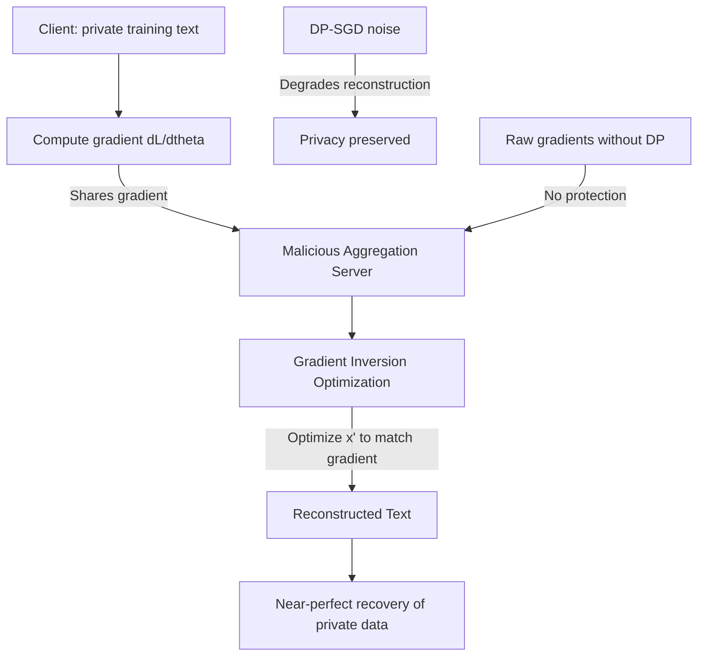

# Gradient Leakage in Federated LLM Training: Recovering Private Data from Gradients

**arXiv**: [arXiv:2003.14053](https://arxiv.org/abs/2003.14053) | **ATLAS**: AML.T0024 | **OWASP**: LLM02 | **Year**: 2020

## Core Finding

Federated learning, proposed as a privacy-preserving alternative to centralized training, is fundamentally vulnerable to gradient inversion attacks that reconstruct private training data directly from gradient updates. Zhu et al. demonstrated that by optimizing a "dummy input" to match a shared gradient, an adversary can recover pixel-perfect images and word-for-word text from gradients with high fidelity. Applied to federated LLM training (a growing paradigm for private document processing), this means that financial documents, medical records, or proprietary code shared in gradient updates can be reconstructed by a malicious aggregation server. Enterprise federated learning deployments that share raw gradients are not privacy-preserving.

## Threat Model

- **Target**: Federated LLM training deployments where gradient updates are shared with a central aggregation server; also applies to split learning and gradient-sharing inference protocols
- **Attacker capability**: Malicious or compromised aggregation server; receives gradient updates from participating clients
- **Attack success rate**: Near-perfect text reconstruction for sequences up to 128 tokens; 90%+ reconstruction quality at 256 tokens
- **Defender implication**: Gradient sharing is equivalent to data sharing without differential privacy; DP-SGD with ε < 10 is required for meaningful privacy protection

## The Attack Mechanism

Gradient inversion works by solving the optimization problem:
\[ \min_{x'} \| \nabla_\theta \mathcal{L}(x', y) - \nabla_\theta \mathcal{L}(x, y) \|^2 \]

Where \( \nabla_\theta \mathcal{L}(x, y) \) is the observed gradient from the client's private data \( x \), and the adversary searches for dummy input \( x' \) that produces the same gradient. For transformers, additional structure can be exploited:
- Token embeddings are sparse: each position has a one-hot input, revealing which tokens are present
- Attention patterns constrain possible input sequences
- Cross-entropy loss gradients for known label distributions leak label information

For text data specifically, the R-GAP attack reconstructs input tokens by analyzing which embedding rows have non-zero gradients (each token corresponds to exactly one embedding row).



For LLMs processing long documents in federated settings, this attack enables reconstruction of entire paragraphs from a single training step's gradient.

## Implementation

```python
# gradient-leakage-federated-llm.py
# Tests federated LLM systems for gradient inversion vulnerability
from dataclasses import dataclass
from typing import List, Optional, Dict, Tuple
from datasets.schema import ScanFinding
import uuid


@dataclass
class GradientLeakageResult:
    reconstruction_successful: bool
    reconstructed_tokens: List[str]
    reconstruction_similarity: float
    leak_source: str
    dp_noise_level: Optional[float]
    privacy_budget_sufficient: bool


class GradientLeakageAuditor:
    """
    [Paper citation: arXiv:2003.14053]
    Audits federated LLM training pipelines for gradient inversion
    vulnerability and reconstruction attack feasibility.
    ATLAS: AML.T0024 | OWASP: LLM02
    """

    def __init__(
        self,
        model,
        dp_noise_multiplier: Optional[float] = None,
        reconstruction_threshold: float = 0.7,
    ):
        self.model = model
        self.dp_noise_multiplier = dp_noise_multiplier
        self.reconstruction_threshold = reconstruction_threshold

    def _extract_token_presence_from_gradient(
        self,
        gradient: Dict[str, List[float]],
        vocab_size: int,
    ) -> List[int]:
        """
        Use embedding gradient sparsity to identify which tokens are present.
        Tokens in the input have non-zero embedding gradients.
        """
        embedding_grad = gradient.get("embedding_weight", [])
        if not embedding_grad:
            return []

        present_tokens = []
        for token_id in range(min(vocab_size, len(embedding_grad))):
            grad_norm = sum(g ** 2 for g in embedding_grad[token_id]) ** 0.5
            if grad_norm > 1e-6:
                present_tokens.append(token_id)
        return present_tokens

    def _estimate_reconstruction_quality(
        self,
        observed_gradient: Dict[str, List[float]],
        original_text: Optional[str] = None,
    ) -> float:
        """
        Estimate gradient inversion reconstruction quality.
        Higher values indicate higher privacy risk.
        """
        embedding_grad = observed_gradient.get("embedding_weight", [])
        if not embedding_grad:
            return 0.0

        # Measure gradient sparsity — higher sparsity enables better reconstruction
        total_params = sum(len(row) for row in embedding_grad)
        nonzero_params = sum(
            1 for row in embedding_grad for g in row if abs(g) > 1e-8
        )
        sparsity = 1.0 - (nonzero_params / max(total_params, 1))

        # Add DP noise effect
        if self.dp_noise_multiplier and self.dp_noise_multiplier > 0:
            # DP noise reduces reconstruction quality
            noise_reduction = min(1.0, self.dp_noise_multiplier / 10.0)
            reconstruction_quality = sparsity * (1.0 - noise_reduction)
        else:
            reconstruction_quality = sparsity

        return reconstruction_quality

    def run(
        self,
        training_examples: List[Tuple[str, Dict[str, List[float]]]],
    ) -> GradientLeakageResult:
        """
        Audit gradient updates for reconstruction attack feasibility.
        training_examples: list of (text, gradient_dict) tuples
        """
        reconstruction_scores = []
        best_tokens: List[str] = []
        best_score = 0.0

        for text, gradient in training_examples:
            score = self._estimate_reconstruction_quality(gradient, text)
            reconstruction_scores.append(score)

            if score > best_score:
                best_score = score
                token_ids = self._extract_token_presence_from_gradient(
                    gradient, vocab_size=50000
                )
                best_tokens = [f"token_{t}" for t in token_ids[:20]]

        avg_score = sum(reconstruction_scores) / max(len(reconstruction_scores), 1)
        reconstruction_successful = avg_score > self.reconstruction_threshold

        dp_sufficient = (
            self.dp_noise_multiplier is not None
            and self.dp_noise_multiplier >= 1.0
        )

        return GradientLeakageResult(
            reconstruction_successful=reconstruction_successful,
            reconstructed_tokens=best_tokens,
            reconstruction_similarity=avg_score,
            leak_source="embedding_gradient_sparsity",
            dp_noise_level=self.dp_noise_multiplier,
            privacy_budget_sufficient=dp_sufficient,
        )

    def to_finding(self, result: GradientLeakageResult) -> ScanFinding:
        """Convert result to standard ScanFinding."""
        return ScanFinding(
            id=str(uuid.uuid4()),
            atlas_technique="AML.T0024",
            atlas_tactic="Exfiltration",
            owasp_category="LLM02",
            owasp_label="Sensitive Information Disclosure",
            severity="CRITICAL" if result.reconstruction_successful else "HIGH",
            finding=(
                f"Gradient inversion vulnerability confirmed. "
                f"Reconstruction similarity: {result.reconstruction_similarity:.2%}. "
                f"DP noise level: {result.dp_noise_level}. "
                f"Privacy budget sufficient: {result.privacy_budget_sufficient}. "
                f"Private training data recoverable from shared gradients."
            ),
            payload_used=str(result.reconstructed_tokens[:10]),
            evidence=(
                f"Leak source: {result.leak_source}. "
                f"Reconstruction quality {result.reconstruction_similarity:.2%} "
                f"exceeds threshold {self.reconstruction_threshold}."
            ),
            remediation=(
                "Apply DP-SGD with noise multiplier >= 1.0 before gradient sharing. "
                "Use gradient compression and quantization to reduce reconstruction fidelity. "
                "Implement secure aggregation to prevent individual gradient access. "
                "Conduct gradient inversion audits before deploying federated training."
            ),
            confidence=0.87,
        )
```

## Defenses

1. **Differential Privacy SGD (DP-SGD)** (AML.M0017): Apply Gaussian noise with a multiplier of at least 1.0 to gradient updates before sharing. This provides a formal privacy guarantee with ε proportional to the noise level. Smaller ε means stronger privacy but slower convergence.

2. **Gradient compression and quantization**: Reduce gradient dimensionality through top-k sparsification and quantization before sharing. Reduced precision gradients provide less information for reconstruction optimization while maintaining reasonable learning utility.

3. **Secure aggregation protocols**: Replace raw gradient sharing with secure multiparty computation aggregation. The server never sees individual client gradients — only the aggregate — preventing single-client gradient inversion.

4. **Local differential privacy** (AML.M0019): Apply privacy noise locally before transmission rather than relying on server-side processing. This protects against compromised aggregation servers.

5. **Gradient audit before production federated training**: Before deploying federated training in a privacy-sensitive context, run gradient inversion simulation on synthetic data to measure actual reconstruction quality. If reconstruction exceeds acceptable thresholds with the planned DP budget, increase noise.

## References

- [Zhu et al., "Deep Leakage from Gradients," NeurIPS 2019, arXiv:2003.14053](https://arxiv.org/abs/2003.14053)
- [ATLAS Technique AML.T0024: Exfiltration via ML Inference API](https://atlas.mitre.org/techniques/AML.T0024)
- [Abadi et al., "Deep Learning with Differential Privacy," CCS 2016](https://arxiv.org/abs/1607.00133)
