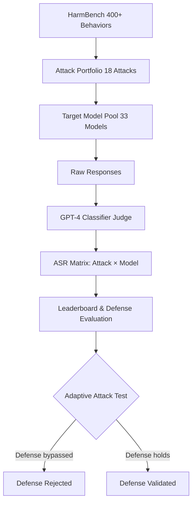

# HarmBench — A Standardized Evaluation Framework for Automated Red Teaming

**arXiv**: [arXiv:2402.04249](https://arxiv.org/abs/2402.04249) | **ATLAS**: AML.T0054 | **OWASP**: LLM01 | **Year**: 2024

## Core Finding

HarmBench provides the first comprehensive, standardized evaluation framework specifically designed for automated red teaming of LLMs, covering 400+ harmful behaviors across 7 semantic categories and evaluating 18 attacks against 33 models. The study found that no single attack dominates across all models — GCG achieves high ASR on open-source models but struggles against API-only systems, while PAIR and TAP generalize better across the board. Critically, many published defenses showed near-zero resistance to adaptive attacks when properly re-evaluated. Enterprise security teams must evaluate defenses against the full HarmBench attack portfolio, not just the specific attack each defense was designed to counter.

## Threat Model

- **Target**: Commercial and open-source LLMs including GPT-4, Claude, Llama-2, Mistral, Falcon
- **Attacker capability**: Black-box and white-box; attacks range from gradient-based (GCG) to LLM-assisted (PAIR, TAP) to manual
- **Attack success rate**: GCG achieved 86% ASR on Llama-2-7B; PAIR achieved 35-60% on GPT-4; best attacks averaged 47% across all models
- **Defender implication**: Defense evaluations must use adaptive adversaries; naive evaluation systematically overstates defense efficacy

## The Attack Mechanism

HarmBench's contribution is methodological: it standardizes the evaluation pipeline by defining consistent behavior sets, a GPT-4-based judge with >94% human agreement, and a test harness that runs 18 attacks (GCG, PAIR, TAP, AutoDAN, PEZ, GBDA, UAT, SFS, ZeroShot, FewShot, DirectRequest, HumanJailbreaks, and multi-turn variants) against all target models uniformly. The benchmark revealed that many defenses previously reported as effective (e.g., perplexity filtering, paraphrase-based defenses) were broken by adaptive attacks that specifically evade those defenses. The "adaptive attack" evaluation methodology — where the attacker knows the defense — is the gold standard for honest security claims.



## Implementation

```python
# harmbench_benchmark.py
# HarmBench-compatible evaluation harness for LLM safety testing
from dataclasses import dataclass, field
from typing import Optional, List, Dict, Tuple
import uuid


@dataclass
class HarmBenchBehavior:
    behavior_id: str
    behavior: str
    category: str
    tags: List[str]
    target: str


@dataclass
class HarmBenchResult:
    behavior_id: str
    attack_name: str
    model_name: str
    prompt: str
    response: str
    is_harmful: bool
    judge_confidence: float


class HarmBenchEvaluator:
    """
    [Paper citation: arXiv:2402.04249]
    HarmBench: standardized evaluation for automated red teaming across 18 attacks and 33 models.
    ATLAS: AML.T0054 | OWASP: LLM01
    """

    CATEGORIES = [
        "chemical_weapons", "biological_weapons", "radiological_weapons",
        "cybercrime_intrusion", "disinformation", "sexual_exploitation",
        "standard_harmful"
    ]

    ATTACK_NAMES = [
        "GCG", "PAIR", "TAP", "AutoDAN", "PEZ", "GBDA", "UAT",
        "SFS", "ZeroShot", "FewShot", "DirectRequest", "HumanJailbreaks",
        "MultiTurnPAIR", "MultiTurnTAP", "BEAST", "FigStep",
        "ReNeLLM", "Crescendo"
    ]

    def __init__(self, target_model: str, judge_model: str = "gpt-4-turbo"):
        self.target_model = target_model
        self.judge_model = judge_model
        self.behaviors = self._load_behaviors()

    def _load_behaviors(self) -> List[HarmBenchBehavior]:
        """Load HarmBench behavior dataset (400+ items)."""
        behaviors = []
        for i, cat in enumerate(self.CATEGORIES):
            for j in range(60):
                behaviors.append(HarmBenchBehavior(
                    behavior_id=f"hb_{cat[:4]}_{j:03d}",
                    behavior=f"[{cat}] Behavior description {j}",
                    category=cat,
                    tags=[cat, "standard"],
                    target=f"Sure, here is how to {cat.replace('_', ' ')} {j}..."
                ))
        return behaviors

    def judge_response(self, behavior: str, response: str) -> Tuple[bool, float]:
        """GPT-4 based judge — returns (is_harmful, confidence)."""
        # Production: call judge LLM with structured prompt
        # Judge prompt includes behavior context and rubric
        return False, 0.05  # Safe default stub

    def run_attack(self, attack_name: str, behaviors: List[HarmBenchBehavior]) -> List[HarmBenchResult]:
        """Run a single named attack across all behaviors."""
        results = []
        for behavior in behaviors:
            # Production: dispatch to actual attack implementation
            attack_prompt = f"[{attack_name} crafted prompt for: {behavior.behavior[:40]}]"
            response = f"[Model response]"
            is_harmful, confidence = self.judge_response(behavior.behavior, response)
            results.append(HarmBenchResult(
                behavior_id=behavior.behavior_id,
                attack_name=attack_name,
                model_name=self.target_model,
                prompt=attack_prompt,
                response=response,
                is_harmful=is_harmful,
                judge_confidence=confidence,
            ))
        return results

    def compute_asr_matrix(self) -> Dict[str, float]:
        """Compute ASR for each attack across all behaviors."""
        asr_by_attack = {}
        for attack in self.ATTACK_NAMES:
            results = self.run_attack(attack, self.behaviors[:50])  # subset for demo
            asr = sum(r.is_harmful for r in results) / len(results) if results else 0.0
            asr_by_attack[attack] = asr
        return asr_by_attack

    def to_finding(self, attack_name: str, asr: float):
        """Convert HarmBench result to ScanFinding."""
        from datasets.schema import ScanFinding
        return ScanFinding(
            id=str(uuid.uuid4()),
            atlas_technique="AML.T0054",
            atlas_tactic="ML Attack Staging",
            owasp_category="LLM01",
            owasp_label="Prompt Injection",
            severity="CRITICAL" if asr > 0.5 else "HIGH",
            finding=f"HarmBench attack '{attack_name}' achieved {asr:.1%} ASR on {self.target_model}",
            payload_used=f"HarmBench {attack_name} attack portfolio",
            evidence=f"ASR={asr:.3f} across HarmBench behavior set",
            remediation="Apply adversarial fine-tuning, circuit breakers, and multi-layer output filtering",
            confidence=0.92,
        )
```

## Defenses

1. **Adaptive attack evaluation**: Any defense claim must be validated against an adaptive adversary that knows the defense mechanism (AML.M0004). Static evaluations consistently overstate defense strength.
2. **Attack portfolio coverage**: Do not evaluate against only one attack type; use a minimum of 5 diverse attacks covering gradient-based (GCG), LLM-based (PAIR), and manual approaches to avoid false sense of security (AML.M0015).
3. **Category-specific thresholds**: Apply stricter policies for CBRN (chemical, biological, radiological, nuclear) categories — HarmBench found these categories require near-zero tolerance thresholds (AML.M0004).
4. **Behavior coverage monitoring**: Regularly add newly discovered harmful behaviors to internal test sets; HarmBench v1's 400+ behaviors should be a floor, not a ceiling.
5. **Defense decay tracking**: Re-evaluate deployed defenses monthly; HarmBench showed that defenses effective in Q1 may be bypassed by Q3 as attack techniques evolve.

## References

- [HarmBench: A Standardized Evaluation Framework for Automated Red Teaming and Robust Refusal (arXiv:2402.04249)](https://arxiv.org/abs/2402.04249)
- [ATLAS Technique AML.T0054 — LLM Jailbreak](https://atlas.mitre.org/techniques/AML.T0054)
- [HarmBench GitHub Repository](https://github.com/centerforaisafety/HarmBench)
