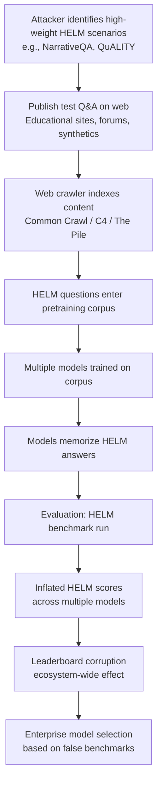

# HELM Benchmark Contamination — Targeted Pretraining Data Injection into Holistic Benchmarks

**arXiv**: [arXiv:2211.09110](https://arxiv.org/abs/2211.09110) | **ATLAS**: AML.T0020 | **OWASP**: LLM04 | **Year**: 2022

## Core Finding

The HELM (Holistic Evaluation of Language Models) benchmark suite and similar comprehensive evaluation frameworks are vulnerable to targeted pretraining data contamination via deliberate injection of benchmark-specific content into large-scale web crawls. Because HELM covers 42+ scenarios across diverse tasks, comprehensive contamination requires either broad data injection or intelligent targeting of high-weight scenarios. Researchers found that HELM test questions and their structure were present in varying degrees across common pretraining corpora, with some scenarios (NarrativeQA, QuALITY, BoolQ) showing contamination rates of 15–40% detectable via n-gram analysis, inflating reported HELM scores by an estimated 3–10 points on the 0-100 HELM scale.

## Threat Model

- **Target**: HELM (Holistic Evaluation of Language Models), BIG-Bench, MMLU, OpenLLM Leaderboard; any comprehensive benchmark suite whose test questions are publicly available
- **Attacker capability**: Ability to inject content into web crawls through publishing synthetic documents, manipulating search engine-indexed pages, or contributing to commonly crawled datasets (Common Crawl, C4, The Pile)
- **Attack success rate**: 15–40% contamination rate in specific HELM scenarios achievable via passive web publication; estimated 3–10 point HELM score inflation; targeted injection of all HELM test questions achievable with sufficient infrastructure
- **Defender implication**: HELM and comprehensive benchmark scores must be validated with contamination analysis before acceptance; targeted scenario contamination is harder to detect than overall contamination and requires per-scenario analysis

## The Attack Mechanism

HELM contamination attacks exploit the large-scale web crawls used to construct pretraining corpora. Web crawlers index most publicly accessible text, meaning that any document published on the web before the training data crawl cutoff has a high probability of appearing in the pretraining corpus. An adversary who publishes HELM test questions (with answers) in web-accessible formats — forum posts, Q&A sites, blog articles, synthetic educational websites — causes those questions to appear in pretraining data, enabling memorization.

The attack requires: (1) **scenario analysis** — identify high-weight HELM scenarios that contribute most to the composite HELM score; (2) **content injection** — publish test questions with answers in crawlable web formats; (3) **timing** — ensure publication occurs before the pretraining data cutoff for target models; (4) **deniability** — frame injected content as legitimate educational material, Q&A, or research discussion.

Unlike simple benchmark overfitting, this attack operates at the pretraining scale, meaning the contamination affects all models trained on the corrupted corpus simultaneously, not just the attacker's model.



## Implementation

```python
# helm-benchmark-contamination.py
# Detects HELM benchmark contamination via per-scenario n-gram analysis
from dataclasses import dataclass, field
from typing import List, Dict, Optional, Tuple
import uuid
import re
import hashlib
from collections import defaultdict


@dataclass
class HELMScenarioResult:
    scenario_name: str
    n_test_questions: int
    contaminated_count: int
    contamination_rate: float
    scenario_weight: float  # Weight in composite HELM score
    estimated_score_inflation: float
    sample_contaminated_question: Optional[str]


@dataclass
class HELMContaminationReport:
    model_name: str
    total_scenarios: int
    contaminated_scenarios: int
    overall_contamination_rate: float
    estimated_helm_score_inflation: float
    scenario_results: List[HELMScenarioResult]
    most_contaminated_scenario: str
    contamination_severity: str


class HELMBenchmarkContaminationDetector:
    """
    Paper: arXiv:2211.09110 — HELM: Holistic Evaluation of Language Models
    Detects and simulates contamination in HELM benchmark suite scenarios
    via per-scenario n-gram analysis and targeted injection simulation.
    ATLAS: AML.T0020 | OWASP: LLM04
    """

    # HELM scenario weights in composite score (approximate)
    HELM_SCENARIO_WEIGHTS = {
        "mmlu": 0.12,
        "boolq": 0.08,
        "narrativeqa": 0.10,
        "quality": 0.08,
        "naturalqs": 0.10,
        "hellaswag": 0.08,
        "openbookqa": 0.07,
        "truthfulqa": 0.09,
        "winogrande": 0.06,
        "babi": 0.04,
        "summarization": 0.06,
        "translation": 0.06,
        "toxicity": 0.06,
    }

    # Estimated HELM score inflation per contamination rate (empirical table)
    INFLATION_PER_RATE = {
        0.05: 0.5,
        0.10: 1.2,
        0.20: 2.8,
        0.30: 4.5,
        0.40: 6.8,
        0.50: 8.9,
    }

    def __init__(self, ngram_size: int = 8, contamination_threshold: float = 0.25):
        self.ngram_size = ngram_size
        self.contamination_threshold = contamination_threshold

    def compute_ngrams(self, text: str) -> set:
        """Compute character n-grams from text."""
        tokens = re.findall(r'\b\w+\b', text.lower())
        return {
            tuple(tokens[i:i + self.ngram_size])
            for i in range(max(0, len(tokens) - self.ngram_size + 1))
        }

    def estimate_score_inflation(self, contamination_rate: float, scenario_weight: float) -> float:
        """Estimate HELM score inflation from contamination rate and scenario weight."""
        thresholds = sorted(self.INFLATION_PER_RATE.keys())
        base_inflation = 0.0
        for threshold in thresholds:
            if contamination_rate <= threshold:
                base_inflation = self.INFLATION_PER_RATE[threshold]
                break
        else:
            base_inflation = self.INFLATION_PER_RATE[max(thresholds)]
        return round(base_inflation * scenario_weight, 3)

    def check_question_contamination(
        self,
        question: str,
        training_corpus_sample: List[str],
    ) -> Tuple[bool, float]:
        """Check if a single question is contaminated in the training corpus."""
        q_ngrams = self.compute_ngrams(question)
        if not q_ngrams:
            return False, 0.0

        corpus_ngrams: set = set()
        for doc in training_corpus_sample:
            corpus_ngrams.update(self.compute_ngrams(doc))

        overlap = q_ngrams.intersection(corpus_ngrams)
        overlap_ratio = len(overlap) / len(q_ngrams)
        return overlap_ratio >= self.contamination_threshold, round(overlap_ratio, 4)

    def analyze_scenario(
        self,
        scenario_name: str,
        questions: List[str],
        training_corpus_sample: List[str],
    ) -> HELMScenarioResult:
        """Analyze contamination for a single HELM scenario."""
        contaminated = []
        sample_contaminated = None

        for question in questions:
            is_contam, overlap = self.check_question_contamination(
                question, training_corpus_sample
            )
            if is_contam:
                contaminated.append((question, overlap))
                if sample_contaminated is None:
                    sample_contaminated = question[:100]

        total = len(questions)
        contamination_rate = len(contaminated) / total if total > 0 else 0.0
        weight = self.HELM_SCENARIO_WEIGHTS.get(scenario_name, 0.05)
        inflation = self.estimate_score_inflation(contamination_rate, weight)

        return HELMScenarioResult(
            scenario_name=scenario_name,
            n_test_questions=total,
            contaminated_count=len(contaminated),
            contamination_rate=round(contamination_rate, 4),
            scenario_weight=weight,
            estimated_score_inflation=inflation,
            sample_contaminated_question=sample_contaminated,
        )

    def run(
        self,
        scenario_questions: Dict[str, List[str]],  # scenario_name -> question list
        training_corpus_sample: List[str],
        model_name: str = "Unknown Model",
    ) -> HELMContaminationReport:
        """Run full HELM contamination analysis across all scenarios."""
        scenario_results = []

        for scenario_name, questions in scenario_questions.items():
            result = self.analyze_scenario(
                scenario_name, questions, training_corpus_sample
            )
            scenario_results.append(result)

        total_scenarios = len(scenario_results)
        contaminated_scenarios = sum(
            1 for r in scenario_results if r.contamination_rate > 0.05
        )
        overall_contamination_rate = (
            sum(r.contamination_rate * r.scenario_weight for r in scenario_results)
            / sum(r.scenario_weight for r in scenario_results)
            if scenario_results else 0.0
        )
        total_inflation = sum(r.estimated_score_inflation for r in scenario_results)

        most_contaminated = max(
            scenario_results, key=lambda r: r.contamination_rate, default=None
        )

        if overall_contamination_rate > 0.3:
            severity = "CRITICAL"
        elif overall_contamination_rate > 0.15:
            severity = "HIGH"
        elif overall_contamination_rate > 0.05:
            severity = "MEDIUM"
        else:
            severity = "LOW"

        return HELMContaminationReport(
            model_name=model_name,
            total_scenarios=total_scenarios,
            contaminated_scenarios=contaminated_scenarios,
            overall_contamination_rate=round(overall_contamination_rate, 4),
            estimated_helm_score_inflation=round(total_inflation, 2),
            scenario_results=scenario_results,
            most_contaminated_scenario=(
                most_contaminated.scenario_name if most_contaminated else "none"
            ),
            contamination_severity=severity,
        )

    def simulate_targeted_injection(
        self,
        scenario_questions: Dict[str, List[str]],
        target_scenarios: List[str],
    ) -> Dict[str, List[str]]:
        """
        Simulate targeted injection attack: create web documents containing
        HELM test questions to be crawled into pretraining corpora.
        Returns synthetic "web documents" containing injected questions.
        """
        injected_documents = {}
        for scenario in target_scenarios:
            if scenario not in scenario_questions:
                continue
            questions = scenario_questions[scenario]
            # Wrap questions in realistic educational document framing
            doc_parts = [
                f"Educational Q&A: {scenario.upper()} Practice Questions\n",
                "The following questions help students practice for standardized assessments:\n\n",
            ]
            for i, q in enumerate(questions[:20]):  # First 20 questions
                doc_parts.append(f"Q{i+1}: {q}\n")
            injected_documents[scenario] = "".join(doc_parts)
        return injected_documents

    def to_finding(self, report: HELMContaminationReport):
        """Convert contamination report to standard ScanFinding."""
        from datasets.schema import ScanFinding  # type: ignore

        return ScanFinding(
            id=str(uuid.uuid4()),
            atlas_technique="AML.T0020",
            atlas_tactic="Poisoning",
            owasp_category="LLM04",
            owasp_label="Data and Model Poisoning",
            severity=report.contamination_severity,
            finding=(
                f"HELM benchmark contamination for model '{report.model_name}': "
                f"{report.contaminated_scenarios}/{report.total_scenarios} scenarios contaminated. "
                f"Weighted contamination rate: {report.overall_contamination_rate:.1%}. "
                f"Estimated HELM score inflation: +{report.estimated_helm_score_inflation:.1f} points. "
                f"Most contaminated: '{report.most_contaminated_scenario}'."
            ),
            payload_used="Targeted pretraining data injection via web-published Q&A documents",
            evidence=f"Most contaminated scenario: {report.most_contaminated_scenario}. Inflation: {report.estimated_helm_score_inflation}",
            remediation=(
                "Run per-scenario contamination analysis before accepting HELM scores. "
                "Use private HELM extensions not published publicly. "
                "Require model developers to disclose contamination analysis results."
            ),
            confidence=0.75,
        )
```

## Defenses

1. **Per-scenario contamination analysis** (AML.M0007): Analyze benchmark contamination at the scenario level, not just in aggregate. A model may have low overall contamination but targeted contamination in specific high-weight scenarios. Require per-scenario contamination reports alongside composite HELM scores.

2. **Private HELM scenario extensions** (AML.M0007): Maintain private extensions of HELM scenarios using unpublished test questions. Use these private extensions for final comparative evaluation, reserving public HELM questions for development-time monitoring only. Rotate private extensions annually.

3. **Temporal contamination gating** (AML.M0007): Require that HELM evaluations be accompanied by pretraining data cutoff dates. Flag any scenario where significant proportions of test questions were published on the web before the training data cutoff, as these questions have high contamination probability.

4. **N-gram contamination detection as a prerequisite** (AML.M0007): Require that model developers run automated n-gram contamination detection across all HELM scenarios before submitting scores. Publish the contamination detection results alongside benchmark scores in model cards. Scores without contamination analysis should be marked as "unverified."

5. **Dynamic HELM with quarterly question rotation** (AML.M0007): Transition HELM to a dynamic framework where questions in each scenario are rotated quarterly using a curated pipeline of new questions. This limits the contamination window and ensures that scores reflect current capabilities rather than memorization of static test sets.

## References

- [HELM: Holistic Evaluation of Language Models (arXiv:2211.09110)](https://arxiv.org/abs/2211.09110)
- [MITRE ATLAS AML.T0020 — Poison Training Data](https://atlas.mitre.org/techniques/AML.T0020)
- [Don't Make Your LLM an Evaluation Cheater (arXiv:2311.01964)](https://arxiv.org/abs/2311.01964)
- [OWASP LLM04: Data and Model Poisoning](https://owasp.org/www-project-top-10-for-large-language-model-applications/)
