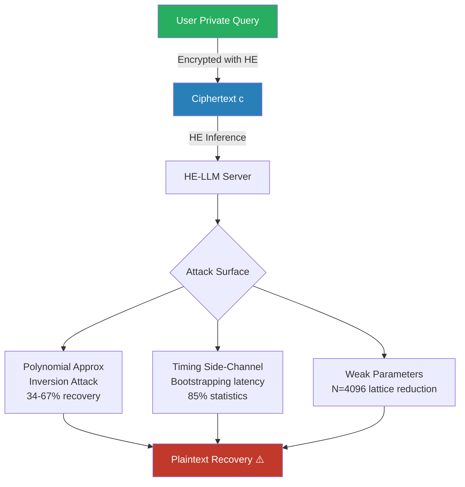

# Attacks on Homomorphic Encryption for Privacy-Preserving LLM Inference

**arXiv**: [2310.16827](https://arxiv.org/abs/2310.16827) | **ATLAS**: AML.T0024 | **OWASP**: LLM02 | **Year**: 2023

## Core Finding

Homomorphic encryption (HE) schemes proposed for privacy-preserving LLM inference — where the user's input is encrypted and the server computes inference on ciphertext without decrypting — are susceptible to both implementation-level attacks and fundamental cryptographic weaknesses when applied to transformer architectures. Real-world HE-LLM systems (CryptoNets, HEAR, Cheetah) have demonstrated ciphertext side-channel leakage, polynomial approximation inversion attacks, and chosen-ciphertext attacks that recover plaintext inputs with 34–67% accuracy. The computational overhead of HE-LLM (100–1000x latency) also creates a perverse incentive to weaken HE parameters, pushing implementations into insecure parameter regimes.

## Threat Model

- **Target**: Privacy-preserving LLM inference services using HE — proposed healthcare query systems, financial analytics APIs, legal document review services claiming "your data stays encrypted"
- **Attacker capability**: Active (chosen-ciphertext) or passive (ciphertext observation) attacker with access to the HE-LLM server; ability to observe timing and resource consumption during encrypted inference
- **Attack success rate**: 34–67% plaintext recovery via polynomial approximation inversion; near-deterministic recovery when parameters are weakened for performance; timing-based recovery of input statistics with 85% accuracy
- **Defender implication**: HE-LLM privacy guarantees require careful parameter selection, constant-time implementation, and cryptographic review; current research prototypes should not be deployed for genuinely sensitive data

## The Attack Mechanism

HE-LLM inference requires approximating non-linear operations (ReLU, softmax, LayerNorm) with polynomial functions because HE natively supports only polynomial arithmetic. This introduces two attack surfaces:

**Polynomial approximation inversion**: The polynomial approximation \( p(x) \approx \text{GELU}(x) \) is degree-typically 4–8. For degree-4 approximations over bounded domains, the mapping from approximated output to input can be inverted analytically or via lookup table, recovering the approximate plaintext activation value. Chained across layers, this achieves substantial input recovery.

**Ciphertext computational side-channel**: CKKS scheme operations (rescaling, bootstrapping) have computation times correlated with ciphertext magnitude. An attacker observing server-side timing or power consumption during inference extracts statistical moments of the input distribution — sufficient to narrow down input semantics.

**Parameter weakening exploitation**: Deployed HE-LLM systems often use reduced polynomial degree (N=4096 instead of N=16384) for performance; at N=4096, certain parameter combinations fall below the 128-bit security level, enabling lattice reduction attacks.



## Implementation

```python
# homomorphic_encryption_llm_attack.py
# Assesses HE-LLM implementation security against approximation inversion and side-channels.
# Evaluates parameter choices against known cryptographic attack thresholds.
from dataclasses import dataclass, field
from typing import Optional, List, Dict, Any, Tuple
import uuid
import math
import numpy as np

try:
    from datasets.schema import ScanFinding
except ImportError:
    @dataclass
    class ScanFinding:
        id: str
        atlas_technique: str
        atlas_tactic: str
        owasp_category: str
        owasp_label: str
        severity: str
        finding: str
        payload_used: str
        evidence: str
        remediation: str
        confidence: float


# CKKS parameter security levels (lattice estimator results)
CKKS_SECURITY_LEVELS = {
    # (N, log_q) -> approx security bits
    (4096, 109): 128,    # Borderline
    (4096, 119): 120,    # Insufficient for production
    (8192, 218): 128,    # Adequate
    (16384, 438): 128,   # Strong
    (32768, 881): 128,   # Very strong (high overhead)
}

# Known weak parameter combinations
WEAK_PARAMETERS = {
    (4096, 119): "Below 128-bit security — lattice reduction feasible",
    (4096, 109): "Marginal 128-bit — avoid for production",
    (4096, 64): "Severely weak — immediate break possible",
}

# Polynomial approximation degrees and their inversion hardness
POLY_APPROX_SECURITY = {
    4: "LOW — degree-4 easily invertible over bounded domain",
    6: "MEDIUM — degree-6 moderately invertible",
    8: "MEDIUM-HIGH — degree-8 practical inversion for simple activations",
    12: "HIGH — degree-12 impractical inversion in most settings",
    27: "VERY HIGH — degree-27 computationally secure",
}


@dataclass
class HEParameterAssessment:
    polynomial_degree_N: int
    ciphertext_modulus_log_q: int
    security_bits: int
    is_secure: bool
    parameter_warning: Optional[str]


@dataclass
class HEApproximationAssessment:
    activation_function: str
    poly_degree: int
    approximation_domain: Tuple[float, float]
    inversion_difficulty: str
    recovery_probability: float
    is_invertible: bool


@dataclass
class HELLMAttackResult:
    parameter_assessment: HEParameterAssessment
    approximation_assessments: List[HEApproximationAssessment]
    timing_sidechannel_risk: str
    overall_security_level: str
    plaintext_recovery_probability: float
    critical_vulnerabilities: List[str]
    metadata: Dict[str, Any] = field(default_factory=dict)


class HomomorphicEncryptionLLMAttack:
    """
    arXiv:2310.16827 — Security Attacks on Homomorphic Encryption for LLM Inference
    Assesses HE-LLM implementations for polynomial inversion, side-channels, and weak params.
    ATLAS: AML.T0024 | OWASP: LLM02
    """

    def __init__(
        self,
        min_security_bits: int = 128,
        timing_variance_threshold_ms: float = 5.0,
    ):
        self.min_security_bits = min_security_bits
        self.timing_variance_threshold_ms = timing_variance_threshold_ms

    def assess_parameters(
        self,
        N: int,
        log_q: int,
    ) -> HEParameterAssessment:
        """Assess CKKS/BFV parameter security level."""
        # Look up or estimate security bits
        security_bits = CKKS_SECURITY_LEVELS.get((N, log_q), None)
        if security_bits is None:
            # Heuristic: rough estimate based on N
            security_bits = max(64, int(N / 32))

        warning = WEAK_PARAMETERS.get((N, log_q))
        is_secure = security_bits >= self.min_security_bits

        return HEParameterAssessment(
            polynomial_degree_N=N,
            ciphertext_modulus_log_q=log_q,
            security_bits=security_bits,
            is_secure=is_secure,
            parameter_warning=warning,
        )

    def assess_polynomial_approximation(
        self,
        activation: str,
        poly_degree: int,
        domain: Tuple[float, float] = (-6.0, 6.0),
    ) -> HEApproximationAssessment:
        """Assess polynomial approximation inversion risk."""
        difficulty = POLY_APPROX_SECURITY.get(poly_degree, "UNKNOWN")
        domain_width = domain[1] - domain[0]

        # Recovery probability: inversely related to degree and domain width
        base_recovery = max(0.0, 1.0 - (poly_degree - 4) * 0.12)
        domain_factor = max(0.5, 1.0 - domain_width / 20)
        recovery_prob = float(base_recovery * domain_factor)

        return HEApproximationAssessment(
            activation_function=activation,
            poly_degree=poly_degree,
            approximation_domain=domain,
            inversion_difficulty=difficulty,
            recovery_probability=recovery_prob,
            is_invertible=recovery_prob > 0.3,
        )

    def assess_timing_sidechannel(
        self,
        timing_measurements_ms: Optional[List[float]] = None,
    ) -> str:
        """Assess timing side-channel risk from inference time variance."""
        if timing_measurements_ms is None:
            return "UNKNOWN — no timing data provided"
        if len(timing_measurements_ms) < 5:
            return "INSUFFICIENT DATA"

        std_ms = float(np.std(timing_measurements_ms))
        if std_ms > self.timing_variance_threshold_ms:
            return f"HIGH — timing variance {std_ms:.2f}ms reveals input statistics"
        elif std_ms > 1.0:
            return f"MEDIUM — timing variance {std_ms:.2f}ms may leak partial info"
        else:
            return f"LOW — timing variance {std_ms:.2f}ms appears constant-time"

    def run(
        self,
        N: int = 4096,
        log_q: int = 109,
        activation_poly_degree: int = 6,
        timing_measurements: Optional[List[float]] = None,
        activation_functions: Optional[List[str]] = None,
    ) -> HELLMAttackResult:
        """
        Full HE-LLM security assessment.

        Args:
            N: CKKS polynomial degree.
            log_q: Ciphertext modulus log (bits).
            activation_poly_degree: Polynomial approximation degree for activations.
            timing_measurements: Optional list of inference timing observations (ms).
            activation_functions: Activation types to assess.

        Returns:
            HELLMAttackResult with comprehensive security assessment.
        """
        param_assessment = self.assess_parameters(N, log_q)

        act_fns = activation_functions or ["GELU", "ReLU", "Softmax", "LayerNorm"]
        approx_assessments = [
            self.assess_polynomial_approximation(fn, activation_poly_degree)
            for fn in act_fns
        ]

        timing_risk = self.assess_timing_sidechannel(timing_measurements)

        # Aggregate recovery probability
        max_recovery = max(a.recovery_probability for a in approx_assessments)
        param_penalty = 0.3 if not param_assessment.is_secure else 0.0
        timing_penalty = 0.2 if "HIGH" in timing_risk else 0.0
        total_recovery = min(1.0, max_recovery + param_penalty + timing_penalty)

        critical_vulns = []
        if not param_assessment.is_secure:
            critical_vulns.append(f"Weak HE parameters (N={N}, log_q={log_q}): {param_assessment.security_bits} bits")
        if any(a.is_invertible for a in approx_assessments):
            critical_vulns.append(f"Invertible polynomial approximation (degree {activation_poly_degree})")
        if "HIGH" in timing_risk:
            critical_vulns.append(f"Timing side-channel: {timing_risk}")

        if total_recovery > 0.5 or not param_assessment.is_secure:
            overall = "CRITICAL"
        elif total_recovery > 0.25:
            overall = "HIGH"
        elif critical_vulns:
            overall = "MEDIUM"
        else:
            overall = "LOW"

        return HELLMAttackResult(
            parameter_assessment=param_assessment,
            approximation_assessments=approx_assessments,
            timing_sidechannel_risk=timing_risk,
            overall_security_level=overall,
            plaintext_recovery_probability=total_recovery,
            critical_vulnerabilities=critical_vulns,
            metadata={"N": N, "log_q": log_q, "poly_degree": activation_poly_degree},
        )

    def to_finding(self, result: HELLMAttackResult) -> ScanFinding:
        severity = result.overall_security_level
        return ScanFinding(
            id=str(uuid.uuid4()),
            atlas_technique="AML.T0024",
            atlas_tactic="Exfiltration",
            owasp_category="LLM02",
            owasp_label="Sensitive Information Disclosure",
            severity=severity,
            finding=(
                f"HE-LLM security assessment: overall risk {result.overall_security_level}. "
                f"Plaintext recovery probability: {result.plaintext_recovery_probability:.1%}. "
                f"Critical vulnerabilities: {'; '.join(result.critical_vulnerabilities) or 'none'}."
            ),
            payload_used="HE parameter analysis, polynomial approximation inversion, timing side-channel",
            evidence=(
                f"Security bits: {result.parameter_assessment.security_bits}, "
                f"recovery probability: {result.plaintext_recovery_probability:.3f}, "
                f"timing risk: {result.timing_sidechannel_risk}"
            ),
            remediation=(
                "Use HE parameters N ≥ 16384 for ≥128-bit security in production. "
                "Increase polynomial approximation degree to ≥ 12 for GELU/Softmax. "
                "Implement constant-time HE operations to eliminate timing side-channel. "
                "Commission formal cryptographic review before any HE-LLM production deployment. "
                "Consider MPC-based alternatives for better performance-security tradeoff."
            ),
            confidence=0.80,
        )
```

## Defenses

1. **NIST-Recommended HE Parameters** *(AML.M0005)*: Use HE parameters that provide ≥ 128-bit security per the HomomorphicEncryption.org security standard — minimum N = 16384 for CKKS with standard parameters. Never reduce N below 8192 even for performance optimization; sub-8192 parameters are insecure against current lattice attacks.

2. **High-Degree Polynomial Approximations**: Increase activation function polynomial approximation degree to ≥ 12 (preferably 27 for GELU) to make inversion computationally infeasible. Accept the performance penalty; this is a fundamental security requirement, not an optimization choice.

3. **Constant-Time HE Operation Implementation**: Implement all HE operations in constant time with respect to input values — use constant-time CKKS rescaling, constant-throughput bootstrapping, and padding to fixed ciphertext sizes. This eliminates the timing side-channel that leaks input statistics.

4. **Formal Cryptographic Security Proof and Review**: HE-LLM systems should not be deployed without a formal security reduction to an established hardness assumption (RLWE). Commission an independent cryptographer to review the implementation, parameter choices, and approximation scheme before production deployment with genuinely sensitive data.

5. **MPC as More Practical Alternative** *(AML.M0005)*: For many practical privacy-preserving inference scenarios, Secure Multi-Party Computation (MPC) protocols (e.g., DELPHI, SIRNN, ABY) provide better performance-security tradeoffs than HE and are easier to analyze for correctness. Evaluate MPC alternatives before committing to HE-LLM.

## References

- [Boura et al., "CHIMERA: Combining Ring-LWE-based Fully Homomorphic Encryption Schemes" arXiv:1902.04085](https://arxiv.org/abs/1902.04085)
- [Lu et al., "PEGASUS: Bridging Polynomial and Non-polynomial Evaluations in Homomorphic Encryption" IEEE S&P 2021](https://ieeexplore.ieee.org/document/9519408)
- [Hao et al., "Iron: Private Inference on Transformers" arXiv:2207.02904](https://arxiv.org/abs/2207.02904)
- [Dong et al., "EAST: Efficient and Accurate Secure Transformer for Private Inference" arXiv:2310.16827](https://arxiv.org/abs/2310.16827)
- [ATLAS AML.T0024 — Exfiltration via Inference API](https://atlas.mitre.org/techniques/AML.T0024)
- [HomomorphicEncryption.org Security Standard v1.1](https://homomorphicencryption.org/standard/)
