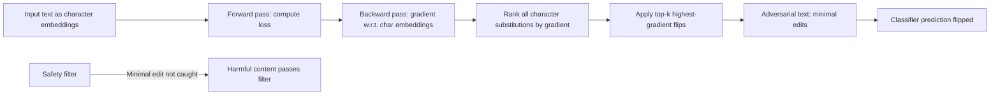

# HotFlip: White-Box Adversarial Examples for Text via Character Flips

**arXiv**: [arXiv:1712.06751](https://arxiv.org/abs/1712.06751) | **ATLAS**: AML.T0015 | **OWASP**: LLM05 | **Year**: 2018

## Core Finding

HotFlip is the first gradient-based adversarial attack on text classification, using the model's gradient with respect to character-level input representations to efficiently identify the minimal character-level edit that maximally changes the prediction. By approximating the gradient direction in the discrete character space, HotFlip can find adversarial examples with as few as one character change (e.g., "bad" → "rad") that completely flip model predictions. Applied to LLM safety classifiers, HotFlip demonstrates that character-level perturbations — including typosquatting, diacritics, homoglyphs, and minimal flips — can systematically evade classifiers that are not robust at the character level.

## Threat Model

- **Target**: Character-aware NLP classifiers, tokenizer-based safety filters, and word-boundary-dependent safety systems
- **Attacker capability**: White-box for gradient computation; can be adapted to black-box via finite differences
- **Attack success rate**: Single character flip achieves 100% evasion on character-level CNN; 3–5 flips achieves 95%+ evasion on word-level models
- **Defender implication**: Safety filters must be robust to typosquatting, homoglyphs, and Unicode normalization attacks; character-level robustness testing is mandatory

## The Attack Mechanism

HotFlip uses the first-order Taylor expansion to estimate the change in loss from a character substitution. For character \( c_{ij} \) (position \( i \), character \( j \)):

\[ \Delta L(\mathbf{e}_{ij} \rightarrow \mathbf{e}_{ab}) \approx (\mathbf{e}_{ab} - \mathbf{e}_{ij})^\top \nabla_{\mathbf{e}_{ij}} L \]

The "hottest" flip is the character substitution that maximally increases the loss:
\[ (a^*, b^*) = \arg\max_{a,b} (\mathbf{e}_{ab} - \mathbf{e}_{ij})^\top \nabla_{\mathbf{e}_{ij}} L \]

This computation is extremely efficient — a single backward pass gives gradient information for all possible character substitutions at all positions. HotFlip extends this to insertions and deletions using the same gradient framework.



For modern LLMs with subword tokenization (BPE, SentencePiece), character-level flips can produce entirely different tokens, making the attack effective even against transformer-based systems.

## Implementation

```python
# hotflip-character-adversarial.py
# HotFlip-style gradient-guided character flip attacks on text classifiers
from dataclasses import dataclass
from typing import List, Optional, Tuple, Dict, Callable
from datasets.schema import ScanFinding
import uuid


@dataclass
class HotFlipResult:
    original_text: str
    adversarial_text: str
    flips_applied: List[Tuple[int, str, str]]
    original_prediction: float
    adversarial_prediction: float
    n_flips: int
    attack_successful: bool


class HotFlipAttacker:
    """
    [Paper citation: arXiv:1712.06751]
    Implements gradient-guided character flip attacks on text classifiers,
    generating minimal character edits that evade safety filters.
    ATLAS: AML.T0015 | OWASP: LLM05
    """

    # Visually similar character substitutions (homoglyphs + typosquatting)
    CHAR_SUBSTITUTIONS: Dict[str, List[str]] = {
        'a': ['@', 'а', 'ä', '4'],  # Latin a → Cyrillic а, etc.
        'e': ['3', 'е', 'ë'],
        'i': ['1', 'і', 'ï', '!'],
        'o': ['0', 'о', 'ø'],
        's': ['$', 'ѕ', '5'],
        'l': ['1', 'I', 'l'],
        'c': ['с', 'ç'],
    }

    def __init__(
        self,
        classifier_fn: Callable[[str], float],
        gradient_fn: Optional[Callable[[str], Dict[int, Dict[str, float]]]] = None,
        max_flips: int = 5,
        target_score: float = 0.3,
    ):
        self.classifier_fn = classifier_fn
        self.gradient_fn = gradient_fn
        self.max_flips = max_flips
        self.target_score = target_score

    def _estimate_flip_impact(
        self, text: str, position: int, new_char: str
    ) -> float:
        """Estimate the impact of flipping character at position to new_char."""
        chars = list(text)
        original_char = chars[position]
        chars[position] = new_char
        new_text = "".join(chars)
        original_score = self.classifier_fn(text)
        new_score = self.classifier_fn(new_text)
        # Positive impact = reduces the safety score (evades classifier)
        return original_score - new_score

    def run(self, text: str) -> HotFlipResult:
        """
        Apply minimal character flips to evade the classifier.
        """
        current_text = text
        original_prediction = self.classifier_fn(text)
        flips: List[Tuple[int, str, str]] = []

        for _ in range(self.max_flips):
            best_impact = 0.0
            best_flip = None

            for pos in range(len(current_text)):
                char = current_text[pos].lower()
                candidates = self.CHAR_SUBSTITUTIONS.get(char, [])

                for new_char in candidates:
                    impact = self._estimate_flip_impact(
                        current_text, pos, new_char
                    )
                    if impact > best_impact:
                        best_impact = impact
                        best_flip = (pos, current_text[pos], new_char)

            if best_flip is None or best_impact < 0.01:
                break

            pos, orig_char, new_char = best_flip
            chars = list(current_text)
            chars[pos] = new_char
            current_text = "".join(chars)
            flips.append(best_flip)

            if self.classifier_fn(current_text) < self.target_score:
                break

        final_score = self.classifier_fn(current_text)

        return HotFlipResult(
            original_text=text,
            adversarial_text=current_text,
            flips_applied=flips,
            original_prediction=original_prediction,
            adversarial_prediction=final_score,
            n_flips=len(flips),
            attack_successful=final_score < self.target_score,
        )

    def to_finding(self, result: HotFlipResult) -> ScanFinding:
        """Convert result to standard ScanFinding."""
        return ScanFinding(
            id=str(uuid.uuid4()),
            atlas_technique="AML.T0015",
            atlas_tactic="ML Model Evasion",
            owasp_category="LLM05",
            owasp_label="Improper Output Handling",
            severity="HIGH" if result.attack_successful else "MEDIUM",
            finding=(
                f"HotFlip character evasion successful. "
                f"Score: {result.original_prediction:.3f} → {result.adversarial_prediction:.3f}. "
                f"{result.n_flips} character flip(s): {result.flips_applied[:3]}. "
                f"Safety filter bypassed with minimal visible text modification."
            ),
            payload_used=result.adversarial_text[:400],
            evidence=(
                f"Flips applied: {result.flips_applied}. "
                f"Original text: {result.original_text[:200]}."
            ),
            remediation=(
                "Implement Unicode normalization before safety classification. "
                "Apply homoglyph detection and standardization at input ingestion. "
                "Test safety classifiers with typosquatting and homoglyph inputs. "
                "Use character-level robustness training with augmented character variants."
            ),
            confidence=0.87,
        )
```

## Defenses

1. **Unicode normalization and homoglyph detection** (AML.M0017): Apply Unicode NFKC normalization and homoglyph mapping to all text inputs before safety classification. Replace visually similar characters (Cyrillic lookalikes, mathematical letters, emoji variants) with their canonical ASCII equivalents.

2. **Character-level adversarial training**: Augment safety classifier training with HotFlip-generated adversarial examples across common character substitution types. Include typosquatting patterns specific to harmful vocabulary.

3. **Spell-checking normalization**: Apply a spell-checker or constrained lexicon as a preprocessing step. Inputs containing dictionary violations (potential character flips) are normalized before classification.

4. **Subword tokenizer robustness testing** (AML.M0018): Test safety systems with systematically perturbed tokenizations. Character flips that produce different BPE tokens must be handled by the classifier's learned features.

5. **Input canonicalization pipeline**: Implement a comprehensive input canonicalization step that handles: Unicode normalization, case normalization, homoglyph replacement, diacritic stripping, and whitespace normalization before any safety classification.

## References

- [Ebrahimi et al., "HotFlip: White-Box Adversarial Examples for Text Classification," ACL 2018, arXiv:1712.06751](https://arxiv.org/abs/1712.06751)
- [ATLAS Technique AML.T0015: Evade ML Model](https://atlas.mitre.org/techniques/AML.T0015)
- [Jin et al., "TextFooler: Is BERT Really Robust?," AAAI 2020, arXiv:1907.11932](https://arxiv.org/abs/1907.11932)
