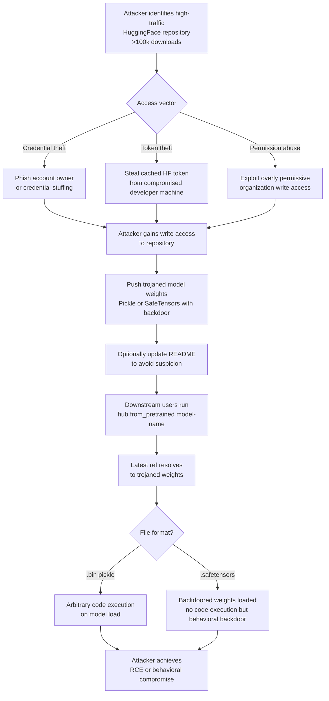

# Hugging Face Repository Takeover — Account Compromise Serving Trojaned Model Weights

**arXiv**: [arXiv:2401.05543](https://arxiv.org/abs/2401.05543) | **ATLAS**: AML.T0010 | **OWASP**: LLM03 | **Year**: 2024

## Core Finding

Hugging Face hosts over one million models and processes millions of daily downloads, making it the critical distribution node for the global LLM supply chain. Account takeover of a popular HuggingFace repository (e.g., a model with >100k downloads) enables an attacker to silently replace legitimate model weights with trojaned versions. Because most users pin to `model-name/latest` or a branch reference rather than a specific commit hash, a weight replacement propagates automatically to any pipeline that re-downloads the model. Security researchers have documented cases where popular model repositories were compromised and served malicious pickle files, with affected downloads numbering in the tens of thousands before detection. The attack requires no vulnerability in the model architecture — only compromising the account credentials or exploiting write-access permissions.

## Threat Model

- **Target**: Any organization or individual downloading models from HuggingFace using `from_pretrained()` without commit hash pinning
- **Attacker capability**: Compromised HuggingFace account credentials (via phishing, credential stuffing, OAuth token theft) or social engineering of organization members with write access
- **Attack success rate**: Near 100% for all users downloading after weight replacement; detection typically takes hours to days
- **Defender implication**: All production ML pipelines must pin to specific commit hashes and verify SHA-256 checksums of downloaded artifacts; `latest` references are a supply chain vulnerability

## The Attack Mechanism

The attacker targets a high-download-count HuggingFace repository through one of several vectors: phishing the account owner, credential stuffing using leaked password databases, stealing a cached `huggingface-cli` token from a compromised developer machine, or exploiting a misconfigured organization with too-broad write permissions. Once write access is obtained, the attacker pushes modified model weights — either as a malicious `.bin`/`.safetensors` file with embedded trojans or as a replacement that, when loaded with `torch.load()`, executes arbitrary code through Python pickle deserialization. The attacker updates the README/model card to avoid raising immediate suspicion and can remove git history to obscure the replacement. Because HuggingFace uses Git LFS for large files, commit signatures are not widely verified by end users. The attack window between replacement and takedown can range from hours to weeks depending on how actively the repository is monitored.



## Implementation

```python
# huggingface_repo_takeover_detector.py
# Detects signs of repository compromise on HuggingFace model hubs
# Reference: Scalena et al., arXiv:2401.05543
from dataclasses import dataclass, field
from typing import List, Optional, Dict
import uuid
import hashlib
import datetime


@dataclass
class RepoCommitRecord:
    commit_hash: str
    timestamp: datetime.datetime
    author: str
    message: str
    files_changed: List[str]
    lfs_oid_changes: Dict[str, str]  # filename -> new OID


@dataclass
class RepoTakeoverResult:
    repo_id: str
    current_commit: str
    pinned_commit: Optional[str]
    commit_hash_mismatch: bool
    suspicious_commits: List[RepoCommitRecord]
    new_contributors: List[str]
    weight_hash_changed: bool
    pickle_files_present: bool
    risk_score: float
    verdict: str


class HuggingFaceRepoTakeoverDetector:
    """
    Reference: Scalena et al., arXiv:2401.05543
    Detects account takeover and weight replacement in HuggingFace repositories.
    ATLAS: AML.T0010 | OWASP: LLM03
    """

    SUSPICIOUS_COMMIT_PATTERNS = [
        "update weights",
        "fix model",
        "minor update",
        "performance improvement",
        "quick fix",
    ]

    def __init__(
        self,
        known_good_commit: Optional[str] = None,
        known_good_weight_hashes: Optional[Dict[str, str]] = None,
        trusted_authors: Optional[List[str]] = None,
    ):
        self.known_good_commit = known_good_commit
        self.known_good_hashes = known_good_weight_hashes or {}
        self.trusted_authors = set(trusted_authors or [])

    def _compute_file_hash(self, file_path: str) -> str:
        """Compute SHA-256 of a local model file."""
        sha256 = hashlib.sha256()
        try:
            with open(file_path, "rb") as f:
                for chunk in iter(lambda: f.read(8192), b""):
                    sha256.update(chunk)
        except (OSError, IOError):
            return "ERROR"
        return sha256.hexdigest()

    def _detect_suspicious_commits(
        self, commits: List[RepoCommitRecord]
    ) -> List[RepoCommitRecord]:
        """Flag commits with suspicious messages or new contributors changing weights."""
        suspicious = []
        for commit in commits:
            has_weight_change = any(
                f.endswith((".bin", ".safetensors", ".pt", ".ckpt"))
                for f in commit.files_changed
            )
            if not has_weight_change:
                continue
            msg_lower = commit.message.lower()
            vague_message = any(p in msg_lower for p in self.SUSPICIOUS_COMMIT_PATTERNS)
            new_contributor = (
                self.trusted_authors and commit.author not in self.trusted_authors
            )
            if vague_message or new_contributor:
                suspicious.append(commit)
        return suspicious

    def _check_for_pickle_files(self, file_list: List[str]) -> bool:
        """Detect legacy .bin files which may contain pickle payloads."""
        return any(f.endswith(".bin") and not f.endswith(".safetensors") for f in file_list)

    def run(
        self,
        repo_id: str,
        current_commit: str,
        commit_history: List[RepoCommitRecord],
        local_weight_paths: Dict[str, str],  # filename -> local path
        current_file_list: List[str],
    ) -> RepoTakeoverResult:
        """
        Audit a HuggingFace repository for takeover indicators.
        """
        commit_mismatch = bool(
            self.known_good_commit and current_commit != self.known_good_commit
        )

        suspicious_commits = self._detect_suspicious_commits(commit_history)
        new_contributors = list({
            c.author for c in commit_history
            if self.trusted_authors and c.author not in self.trusted_authors
        })

        # Check weight file hashes
        weight_hash_changed = False
        for filename, local_path in local_weight_paths.items():
            actual_hash = self._compute_file_hash(local_path)
            expected = self.known_good_hashes.get(filename)
            if expected and actual_hash != expected:
                weight_hash_changed = True
                break

        pickle_present = self._check_for_pickle_files(current_file_list)

        # Risk scoring
        risk_score = 0.0
        if commit_mismatch:
            risk_score += 0.4
        if suspicious_commits:
            risk_score += min(0.3, len(suspicious_commits) * 0.1)
        if weight_hash_changed:
            risk_score += 0.4
        if pickle_present:
            risk_score += 0.2
        if new_contributors:
            risk_score += 0.1
        risk_score = min(risk_score, 1.0)

        if risk_score > 0.6:
            verdict = "HIGH RISK — Potential repository takeover detected. Do not use."
        elif risk_score > 0.3:
            verdict = "MEDIUM RISK — Verify commit hash before use."
        else:
            verdict = "LOW RISK — Repository appears consistent with known-good state."

        return RepoTakeoverResult(
            repo_id=repo_id,
            current_commit=current_commit,
            pinned_commit=self.known_good_commit,
            commit_hash_mismatch=commit_mismatch,
            suspicious_commits=suspicious_commits,
            new_contributors=new_contributors,
            weight_hash_changed=weight_hash_changed,
            pickle_files_present=pickle_present,
            risk_score=risk_score,
            verdict=verdict,
        )

    def to_finding(self, result: RepoTakeoverResult) -> dict:
        severity = "CRITICAL" if result.weight_hash_changed or result.pickle_files_present else "HIGH"
        signals = []
        if result.commit_hash_mismatch:
            signals.append("commit hash mismatch")
        if result.weight_hash_changed:
            signals.append("weight file SHA-256 changed")
        if result.pickle_files_present:
            signals.append("legacy .bin pickle files present")
        if result.new_contributors:
            signals.append(f"new contributor(s): {', '.join(result.new_contributors[:3])}")

        return dict(
            id=str(uuid.uuid4()),
            atlas_technique="AML.T0010",
            atlas_tactic="Initial Access",
            owasp_category="LLM03",
            owasp_label="Supply Chain",
            severity=severity,
            finding=(
                f"Repository '{result.repo_id}' shows takeover indicators: "
                + "; ".join(signals) + f". Risk score: {result.risk_score:.2f}."
            ),
            payload_used="Compromised account credentials → weight file replacement",
            evidence=result.verdict,
            remediation=(
                "1. Pin all hub downloads to specific commit hashes. "
                "2. Verify SHA-256 of all downloaded weight files against known-good manifest. "
                "3. Prefer SafeTensors over .bin/.pt files to prevent pickle code execution. "
                "4. Enable HuggingFace organization MFA and least-privilege write access. "
                "5. Monitor repository commit history for unauthorized weight changes."
            ),
            confidence=0.88,
        )
```

## Defenses

1. **Commit hash pinning in all model loading code** (AML.M0007): Replace all `AutoModel.from_pretrained("org/model")` calls with explicit commit hash pinning: `from_pretrained("org/model", revision="<sha256_commit_hash>")`. Store approved commit hashes in a version-controlled configuration file. This ensures weight replacement does not automatically affect running systems.

2. **SHA-256 verification of downloaded artifacts** (AML.M0007): Maintain a registry of known-good SHA-256 hashes for all approved model files. Automate post-download hash verification in model acquisition scripts. Weight files failing verification should be quarantined and an incident alert raised immediately.

3. **SafeTensors over Pickle formats** (AML.M0014): Mandate SafeTensors format for all model storage and loading. SafeTensors files cannot execute arbitrary code during loading, eliminating the immediate remote code execution risk. Reject any model that does not offer a SafeTensors variant. See the adjacent codex entry `safetensors-malicious-metadata.md` for residual risks.

4. **Repository monitoring and diff alerting** (AML.M0018): Subscribe to repository webhook events or use the HuggingFace API to poll commit histories for all approved models in your model registry. Alert on: (a) weight file changes by new contributors, (b) commit messages with vague or generic descriptions accompanying weight changes, (c) deletion of git history.

5. **Organization-level MFA and least-privilege access** (AML.M0007): Enforce MFA on all HuggingFace accounts with write access to production model repositories. Apply least-privilege: use read-only tokens for inference infrastructure, write tokens only on isolated build machines. Rotate all tokens after any suspected credential exposure.

## References

- [Scalena et al., "Not what you've signed up for: Compromising Real-World LLM-Integrated Applications with Indirect Prompt Injection", arXiv:2401.05543](https://arxiv.org/abs/2401.05543)
- [ATLAS Technique AML.T0010 — ML Supply Chain Compromise](https://atlas.mitre.org/techniques/AML.T0010)
- [HuggingFace Security Advisory on Malicious Models](https://huggingface.co/blog/pickle-security)
- [Bieringer et al., "Jackal: A Model for Trojan Detection in LLMs", 2024](https://arxiv.org/abs/2402.11208)
