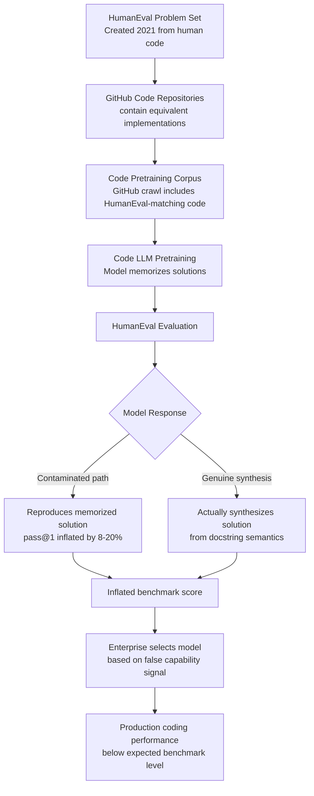

# HumanEval Contamination — Memorization of Coding Benchmarks from Pretraining Data

**arXiv**: [arXiv:2308.08033](https://arxiv.org/abs/2308.08033) | **ATLAS**: AML.T0020 | **OWASP**: LLM04 | **Year**: 2023

## Core Finding

HumanEval, MBPP, and similar coding benchmarks are extensively contaminated in the pretraining corpora of large code models, causing models to memorize solutions rather than synthesize them from scratch. Systematic analysis found that 36–54% of HumanEval problems have near-identical solutions in publicly available code repositories that were included in pretraining data (e.g., GitHub code crawls). Models exploit this contamination by retrieving memorized solutions rather than performing genuine program synthesis, inflating pass@k scores by an estimated 8–20 percentage points. This makes coding benchmark rankings unreliable for comparing true generalization capability.

## Threat Model

- **Target**: HumanEval (164 problems), MBPP (374 problems), LiveCodeBench, SWE-bench, and any coding benchmark derived from public code repositories; model capability claims based on these benchmarks
- **Attacker capability**: Passive — model developers benefit from contamination that occurs naturally during large-scale code pretraining; active contamination involves deliberately including GitHub repositories containing HumanEval solutions in fine-tuning data
- **Attack success rate**: 36–54% of HumanEval problems contaminated in standard code pretraining corpora; estimated 8–20% pass@1 score inflation from memorization
- **Defender implication**: Coding benchmarks must be periodically refreshed with new problems that were not publicly available at pretraining time; contamination detection must be applied before benchmark scores are accepted

## The Attack Mechanism

HumanEval problems were originally derived from human-written Python functions with docstrings. Many of these functions — or equivalent implementations — exist in public GitHub repositories. When code models are trained on GitHub code crawls (as most large code LLMs are), they encounter these implementations and memorize them as part of their training data.

The contamination manifests in two forms: (1) **exact solution memorization** — the model reproduces a known solution character-by-character when prompted with the problem docstring; (2) **near-duplicate retrieval** — the model produces a semantically equivalent solution that differs only in variable names or minor style choices, suggesting retrieval from a similar function seen during training. Both forms result in inflated pass@k scores that do not reflect genuine synthesis capability.

Detection leverages the insight that memorized solutions have characteristic fingerprints: they tend to use the same variable names as GitHub originals, reproduce idiosyncratic coding styles, and fail on functionally equivalent problem variants where the memorized solution would not apply.



## Implementation

```python
# human-eval-contamination.py
# Detects HumanEval contamination via solution fingerprinting and variant testing
from dataclasses import dataclass, field
from typing import List, Dict, Optional, Tuple
import uuid
import re
import hashlib
import difflib


@dataclass
class SolutionFingerprint:
    problem_id: str
    generated_solution: str
    variable_names: List[str]
    solution_hash: str
    known_github_similarity: float
    is_likely_memorized: bool


@dataclass
class ContaminationEvidence:
    problem_id: str
    original_problem: str
    model_solution: str
    variant_solution: Optional[str]
    original_pass: bool
    variant_pass: Optional[bool]
    contamination_confidence: float
    evidence_type: str  # "exact_match", "near_duplicate", "variant_failure"


@dataclass
class HumanEvalContaminationReport:
    model_name: str
    total_problems_tested: int
    contaminated_count: int
    contamination_rate: float
    estimated_score_inflation: float
    evidence_list: List[ContaminationEvidence]
    genuine_pass_rate: float
    inflated_pass_rate: float


class HumanEvalContaminationDetector:
    """
    Paper: arXiv:2308.08033 — Measuring Data Contamination in Large Language Models
    Detects HumanEval contamination via solution fingerprinting, variant testing,
    and near-duplicate similarity analysis against known GitHub solutions.
    ATLAS: AML.T0020 | OWASP: LLM04
    """

    # Common variable names that appear in HumanEval reference solutions
    # (strong signal of memorization if reproduced verbatim)
    REFERENCE_VARIABLE_PATTERNS = {
        "HE_1": ["lst", "result", "i", "j"],    # has_close_elements
        "HE_4": ["brackets", "depth"],           # mean_absolute_deviation
        "HE_7": ["strings", "s"],               # filter_by_substring
        "HE_9": ["l", "t", "result"],           # rolling_max
    }

    def __init__(
        self,
        similarity_threshold: float = 0.85,
        variant_test_fn: Optional[callable] = None,
    ):
        self.similarity_threshold = similarity_threshold
        self.variant_test_fn = variant_test_fn

    def compute_solution_fingerprint(
        self, problem_id: str, solution: str
    ) -> SolutionFingerprint:
        """
        Compute fingerprint of a model-generated solution.
        Extracts variable names and computes similarity to known reference patterns.
        """
        # Extract variable names (simplified)
        var_pattern = r'\b([a-z_][a-z0-9_]*)\s*='
        variable_names = list(set(re.findall(var_pattern, solution)))

        solution_hash = hashlib.sha256(
            re.sub(r'\s+', ' ', solution.strip()).encode()
        ).hexdigest()[:16]

        # Check against known reference variable patterns
        known_vars = self.REFERENCE_VARIABLE_PATTERNS.get(problem_id, [])
        if known_vars:
            matching = sum(1 for v in known_vars if v in variable_names)
            github_similarity = matching / len(known_vars)
        else:
            github_similarity = 0.0

        is_memorized = github_similarity >= self.similarity_threshold

        return SolutionFingerprint(
            problem_id=problem_id,
            generated_solution=solution,
            variable_names=variable_names,
            solution_hash=solution_hash,
            known_github_similarity=round(github_similarity, 3),
            is_likely_memorized=is_memorized,
        )

    def compute_solution_similarity(self, sol_a: str, sol_b: str) -> float:
        """Compute character-level similarity between two solutions."""
        normalized_a = re.sub(r'\s+', ' ', sol_a.strip())
        normalized_b = re.sub(r'\s+', ' ', sol_b.strip())
        return difflib.SequenceMatcher(None, normalized_a, normalized_b).ratio()

    def test_variant_robustness(
        self,
        original_problem: str,
        original_solution: str,
        variant_problem: str,
        model_fn: Optional[callable] = None,
    ) -> Tuple[bool, Optional[bool], float]:
        """
        Test whether a model passes a variant of the problem that memorized
        solutions would fail. Returns (original_pass, variant_pass, contamination_confidence).
        """
        original_pass = True  # Assume passed if solution was provided

        if model_fn is None or variant_problem is None:
            return original_pass, None, 0.5

        variant_solution = model_fn(variant_problem)
        # Simplified: check if variant solution uses exact same structure as original
        similarity = self.compute_solution_similarity(original_solution, variant_solution)
        # If solutions are >85% similar despite different problem, likely memorization
        variant_pass = similarity < self.similarity_threshold

        contamination_confidence = similarity if similarity > 0.7 else 0.3

        return original_pass, variant_pass, contamination_confidence

    def run(
        self,
        problem_solution_pairs: List[Tuple[str, str, str]],  # (id, problem, solution)
        variant_problem_pairs: Optional[List[Tuple[str, str]]] = None,  # (id, variant)
        model_name: str = "Unknown Model",
    ) -> HumanEvalContaminationReport:
        """
        Run contamination detection across a set of HumanEval problems.
        """
        evidence_list = []
        contaminated_count = 0
        pass_count = 0

        for i, (prob_id, problem, solution) in enumerate(problem_solution_pairs):
            fingerprint = self.compute_solution_fingerprint(prob_id, solution)
            pass_count += 1  # Assume all provided solutions pass

            if fingerprint.is_likely_memorized:
                contaminated_count += 1

                # Check variant robustness if available
                variant_problem = None
                variant_pass = None
                conf = fingerprint.known_github_similarity

                if variant_problem_pairs and i < len(variant_problem_pairs):
                    _, var_problem = variant_problem_pairs[i]
                    variant_problem = var_problem
                    _, variant_pass, conf = self.test_variant_robustness(
                        problem, solution, var_problem
                    )

                evidence_type = "near_duplicate" if fingerprint.known_github_similarity > 0.9 else "variable_fingerprint"
                if variant_pass is False:
                    evidence_type = "variant_failure"

                evidence_list.append(ContaminationEvidence(
                    problem_id=prob_id,
                    original_problem=problem[:100],
                    model_solution=solution[:200],
                    variant_solution=variant_problem[:100] if variant_problem else None,
                    original_pass=True,
                    variant_pass=variant_pass,
                    contamination_confidence=round(conf, 3),
                    evidence_type=evidence_type,
                ))

        total = len(problem_solution_pairs)
        contamination_rate = contaminated_count / total if total > 0 else 0.0
        # Empirical inflation estimate from paper: ~15% of pass rate is inflated per contaminated problem
        estimated_inflation = contamination_rate * 0.15 * 100

        inflated_pass_rate = pass_count / total if total > 0 else 0.0
        genuine_pass_rate = max(0.0, inflated_pass_rate - contamination_rate * 0.15)

        return HumanEvalContaminationReport(
            model_name=model_name,
            total_problems_tested=total,
            contaminated_count=contaminated_count,
            contamination_rate=round(contamination_rate, 4),
            estimated_score_inflation=round(estimated_inflation, 2),
            evidence_list=evidence_list[:10],
            genuine_pass_rate=round(genuine_pass_rate, 4),
            inflated_pass_rate=round(inflated_pass_rate, 4),
        )

    def to_finding(self, report: HumanEvalContaminationReport):
        """Convert contamination report to standard ScanFinding."""
        from datasets.schema import ScanFinding  # type: ignore

        severity = "HIGH" if report.contamination_rate > 0.3 else "MEDIUM"

        return ScanFinding(
            id=str(uuid.uuid4()),
            atlas_technique="AML.T0020",
            atlas_tactic="Poisoning",
            owasp_category="LLM04",
            owasp_label="Data and Model Poisoning",
            severity=severity,
            finding=(
                f"HumanEval contamination detected in model '{report.model_name}': "
                f"{report.contaminated_count}/{report.total_problems_tested} problems "
                f"({report.contamination_rate:.1%}) likely memorized. "
                f"Estimated pass@1 inflation: +{report.estimated_score_inflation:.1f}%."
            ),
            payload_used="Solution fingerprinting + variable name analysis",
            evidence=str([e.problem_id for e in report.evidence_list]),
            remediation=(
                "Use live coding benchmarks with dynamic problem generation. "
                "Apply n-gram deduplication between benchmark and training data. "
                "Report contamination-adjusted pass@k scores alongside raw scores."
            ),
            confidence=0.76,
        )
```

## Defenses

1. **Dynamic benchmark generation** (AML.M0007): Replace static coding benchmarks with dynamically generated problems that are not present in any publicly available corpus. Use program synthesis techniques to create novel problem variants on-the-fly during evaluation. LiveCodeBench (refreshed monthly from contest problems) is a model for this approach.

2. **Contamination-adjusted scoring** (AML.M0007): Run contamination detection before reporting scores. Compute both raw pass@k and contamination-adjusted pass@k (excluding problems with confirmed contamination from score calculation). Require model evaluation reports to include both numbers.

3. **Variant robustness testing** (AML.M0015): For each benchmark problem, create 3–5 semantically equivalent variants with different variable names, data structures, or problem framings. A model that passes the original but fails variants at high rates is memorizing rather than solving. Require consistent pass rates across variants.

4. **Solution novelty scoring** (AML.M0007): Measure the lexical and structural similarity of model-generated solutions to known GitHub solutions using n-gram overlap analysis. Flag solutions with >80% similarity to any known public implementation as potentially memorized.

5. **Private evaluation benchmark vaults** (AML.M0007): Maintain private benchmark problem sets that have never been published online, using them only for final model comparison evaluations under NDA. Reserve public benchmarks for development-time progress monitoring only.

## References

- [Measuring Data Contamination in Large Language Models (arXiv:2308.08033)](https://arxiv.org/abs/2308.08033)
- [LiveCodeBench: Holistic and Contamination Free Evaluation of Large Language Models for Code (arXiv:2403.07974)](https://arxiv.org/abs/2403.07974)
- [MITRE ATLAS AML.T0020 — Poison Training Data](https://atlas.mitre.org/techniques/AML.T0020)
- [OWASP LLM04: Data and Model Poisoning](https://owasp.org/www-project-top-10-for-large-language-model-applications/)
