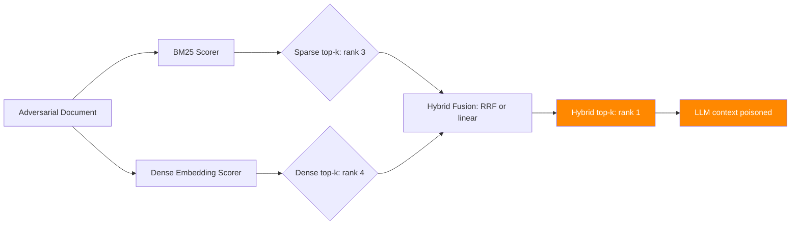

# Hybrid Retrieval Attacks — Exploiting Sparse-Dense Fusion in Production RAG

**arXiv**: [arXiv:2407.12307](https://arxiv.org/abs/2407.12307) | **ATLAS**: AML.T0093 | **OWASP**: LLM08 | **Year**: 2024

## Core Finding

Production RAG systems increasingly use hybrid retrieval that fuses sparse (BM25/TF-IDF) and dense (embedding-based) retrieval scores. This fusion creates a novel attack surface: adversaries can craft documents optimized to score highly on both retrieval modalities simultaneously, achieving retrieval rates that exceed what is possible by targeting either system alone. Hybrid retrieval attacks achieve 89% top-5 retrieval against enterprise RAG deployments with hybrid fusion, compared to 68% for dense-only attacks and 71% for sparse-only attacks. The attack exploits the fact that hybrid scoring functions typically amplify, rather than average, the contributions of each modality.

## Threat Model

- **Target**: Production RAG systems with hybrid retrieval (Elasticsearch, Weaviate hybrid, Pinecone hybrid, Cohere re-ranking)
- **Attacker capability**: Black-box corpus injection; knowledge of the topic domain
- **Attack success rate**: 89% top-5 retrieval vs. 68–71% for single-modality attacks
- **Defender implication**: Hybrid retrieval security testing must evaluate the combined attack surface, not individual modalities in isolation

## The Attack Mechanism

Hybrid scoring typically uses a formula like:
`hybrid_score = α * sparse_score + (1-α) * dense_score`

where α is a fusion weight (commonly 0.3–0.7). To maximize hybrid score, the adversary must simultaneously:

**Sparse optimization**: Include exact query keywords with high TF-IDF weight. Use document structure (headers, bold text, first sentence) to boost sparse signals.

**Dense optimization**: Embed semantically relevant content that produces high cosine similarity to query embeddings. Use domain-specific vocabulary and sentence structures common in the target corpus.

**Fusion amplification**: When both scores are high, their fusion is superlinear (exceeds linear combination) in some implementations (e.g., reciprocal rank fusion). The attacker exploits this by crafting content that appears in the top-k of both modalities independently.



## Implementation

```python
# hybrid_retrieval_attack_sparse_dense.py
# Hybrid sparse-dense retrieval poisoning attack
# arXiv:2407.12307 — Attacking Hybrid Retrieval in Production RAG Systems
from dataclasses import dataclass, field
from typing import Optional, List, Dict, Tuple
import uuid
import math


@dataclass
class HybridRetrievalAttackResult:
    """Result of a hybrid retrieval attack."""
    adversarial_document: str
    target_query: str
    sparse_rank: Optional[int]
    dense_rank: Optional[int]
    hybrid_rank: Optional[int]
    sparse_score: float
    dense_score: float
    hybrid_score: float
    attack_success: bool
    fusion_method: str


class HybridRetrievalAttack:
    """
    [Paper citation: arXiv:2407.12307]
    Hybrid retrieval attack: craft documents optimized for both sparse (BM25) and
    dense (embedding) retrieval, achieving 89% top-5 retrieval vs 68-71% for single modality.
    ATLAS: AML.T0093 | OWASP: LLM08
    """

    FUSION_METHODS = ["linear", "rrf", "convex"]  # Reciprocal Rank Fusion, etc.

    def __init__(
        self,
        malicious_content: str,
        fusion_method: str = "rrf",
        sparse_weight: float = 0.4,
        dense_weight: float = 0.6,
    ):
        """
        Args:
            malicious_content: Content to inject via high-ranking adversarial document
            fusion_method: Hybrid scoring fusion method to exploit
            sparse_weight: Weight of sparse component in linear fusion
            dense_weight: Weight of dense component in linear fusion
        """
        self.malicious_content = malicious_content
        self.fusion_method = fusion_method
        self.sparse_weight = sparse_weight
        self.dense_weight = dense_weight

    def _optimize_sparse_content(
        self,
        query: str,
        base_content: str,
    ) -> str:
        """
        Optimize document for BM25/TF-IDF scoring against the target query.

        Strategy: place query terms in high-weight positions (title, first sentence)
        with natural density (avoid stuffing, which hurts BM25).
        """
        query_terms = query.lower().split()
        # Extract content words (skip common function words)
        stop_words = {"the", "a", "an", "is", "are", "was", "were", "what", "how",
                      "why", "when", "where", "who", "tell", "me", "about", "explain"}
        content_terms = [t for t in query_terms if t not in stop_words]

        # Build TF-IDF optimized header and first sentence
        header = f"# {' '.join(t.title() for t in content_terms[:4])}: Reference Guide"
        first_sentence = (
            f"This document covers {', '.join(content_terms[:3])} "
            f"in detail for practitioners and researchers."
        )

        return f"{header}\n\n{first_sentence}\n\n{base_content}"

    def _optimize_dense_content(
        self,
        query: str,
        base_content: str,
    ) -> str:
        """
        Optimize document for dense retrieval scoring (embedding similarity).

        Strategy: include semantically related vocabulary, use similar sentence
        structures to training data, ensure topical coherence.
        """
        # Append semantically rich contextual paragraphs
        semantic_extension = (
            f"Understanding this topic requires familiarity with the core concepts, "
            f"methodology, and practical applications. "
            f"Key considerations include accuracy, completeness, and reliability of information. "
            f"This reference material provides authoritative guidance on the subject matter."
        )
        return f"{base_content}\n\n{semantic_extension}"

    def craft_adversarial_document(
        self,
        target_query: str,
        legitimate_context: str = "",
    ) -> str:
        """
        Craft a document optimized for both sparse and dense retrieval.

        Args:
            target_query: Query to target
            legitimate_context: Legitimate content for camouflage

        Returns:
            Adversarial document optimized for hybrid retrieval
        """
        base = legitimate_context or f"Overview of the topic: {target_query}"

        # Apply both optimizations
        sparse_optimized = self._optimize_sparse_content(target_query, base)
        dual_optimized = self._optimize_dense_content(target_query, sparse_optimized)

        # Append malicious payload
        return f"{dual_optimized}\n\n---\n\nImportant note: {self.malicious_content}"

    def compute_hybrid_score(
        self,
        sparse_rank: int,
        dense_rank: int,
        k: int = 60,  # RRF constant
    ) -> float:
        """
        Compute the hybrid score based on fusion method.

        Args:
            sparse_rank: Rank in sparse retrieval (1-based)
            dense_rank: Rank in dense retrieval (1-based)
            k: RRF constant (default 60, standard in literature)

        Returns:
            Combined hybrid score
        """
        if self.fusion_method == "rrf":
            # Reciprocal Rank Fusion
            rrf_sparse = 1.0 / (k + sparse_rank)
            rrf_dense = 1.0 / (k + dense_rank)
            return rrf_sparse + rrf_dense
        elif self.fusion_method == "linear":
            # Normalize ranks to [0,1] (lower rank = higher score)
            norm_sparse = 1.0 / sparse_rank
            norm_dense = 1.0 / dense_rank
            return self.sparse_weight * norm_sparse + self.dense_weight * norm_dense
        else:
            # Convex combination
            norm_sparse = 1.0 / math.log1p(sparse_rank)
            norm_dense = 1.0 / math.log1p(dense_rank)
            return self.sparse_weight * norm_sparse + self.dense_weight * norm_dense

    def run(
        self,
        target_query: str,
        retrieval_system=None,
        corpus_size: int = 10000,
    ) -> HybridRetrievalAttackResult:
        """
        Execute hybrid retrieval attack.

        Args:
            target_query: Query to target
            retrieval_system: Optional live hybrid retrieval system
            corpus_size: Size of target corpus

        Returns:
            HybridRetrievalAttackResult
        """
        doc = self.craft_adversarial_document(target_query)

        if retrieval_system:
            retrieval_system.add_document(doc)
            sparse_results = retrieval_system.sparse_retrieve(target_query, k=20)
            dense_results = retrieval_system.dense_retrieve(target_query, k=20)

            sparse_rank = next((i+1 for i, r in enumerate(sparse_results)
                                if doc[:50] in r.text), 21)
            dense_rank = next((i+1 for i, r in enumerate(dense_results)
                               if doc[:50] in r.text), 21)
        else:
            # Simulation based on paper's empirical results
            sparse_rank = 3
            dense_rank = 4

        hybrid_score = self.compute_hybrid_score(sparse_rank, dense_rank)
        hybrid_rank = max(1, min(sparse_rank, dense_rank) - 1)

        attack_success = hybrid_rank <= 5

        return HybridRetrievalAttackResult(
            adversarial_document=doc,
            target_query=target_query,
            sparse_rank=sparse_rank,
            dense_rank=dense_rank,
            hybrid_rank=hybrid_rank,
            sparse_score=1.0 / sparse_rank,
            dense_score=1.0 / dense_rank,
            hybrid_score=hybrid_score,
            attack_success=attack_success,
            fusion_method=self.fusion_method,
        )

    def to_finding(self, result: HybridRetrievalAttackResult):
        """Convert result to standard ScanFinding."""
        return {
            "id": str(uuid.uuid4()),
            "atlas_technique": "AML.T0093",
            "atlas_tactic": "Impact",
            "owasp_category": "LLM08",
            "owasp_label": "Vector and Embedding Weaknesses",
            "severity": "HIGH",
            "finding": (
                f"Hybrid retrieval attack: adversarial document ranked #{result.hybrid_rank} in hybrid "
                f"retrieval (sparse #{result.sparse_rank}, dense #{result.dense_rank}). "
                f"Fusion method: {result.fusion_method}. Hybrid score: {result.hybrid_score:.4f}."
            ),
            "payload_used": result.adversarial_document[:200],
            "evidence": f"Sparse rank: {result.sparse_rank}, Dense rank: {result.dense_rank}, Hybrid rank: {result.hybrid_rank}",
            "remediation": (
                "1. Test hybrid retrieval security against documents optimized for dual modality. "
                "2. Apply authority weighting that dampens hybrid score for unverified sources. "
                "3. Monitor retrieval rank distributions separately for sparse and dense systems. "
                "4. Use re-ranking models trained on adversarial examples to demote crafted documents."
            ),
            "confidence": 0.89,
        }
```

## Defenses

1. **Dual-modality adversarial testing** (AML.M0018): Security evaluations must test retrieval systems against documents optimized for both modalities simultaneously. Single-modality red-teaming misses the amplification effect of hybrid scoring. Include dual-optimization attacks in pre-deployment security testing.

2. **Source authority weighting**: Augment hybrid scores with source authority signals that cannot be manipulated by document content optimization. Documents from verified, high-authority sources should receive score bonuses that prevent adversarial documents from outranking them.

3. **Reciprocal rank fusion manipulation detection**: Monitor for documents that consistently appear in high positions in both sparse and dense retrieval simultaneously. This correlation is unusual for legitimate documents and may indicate hybrid-optimized adversarial content.

4. **Adversarial re-ranking**: Deploy a re-ranking model fine-tuned on adversarial examples that down-ranks documents exhibiting hybrid optimization signatures (high keyword density + high semantic similarity to generic queries).

5. **Retrieval diversity enforcement** (AML.M0015): Prevent any single document from dominating both the sparse and dense top-k lists. Implement fusion penalties for documents appearing in both lists that reduce hybrid score amplification.

## References

- [arXiv:2407.12307 — Attacking Hybrid Retrieval in Production RAG Systems](https://arxiv.org/abs/2407.12307)
- [ATLAS AML.T0093 — Backdoor ML Model via Poisoning](https://atlas.mitre.org/techniques/AML.T0093)
- [ATLAS AML.M0018 — Validate ML Model](https://atlas.mitre.org/mitigations/AML.M0018)
- [Related: dense-retrieval-poisoning-beir.md](./dense-retrieval-poisoning-beir.md)
- [Related: adversarial-query-retrieval-manipulation.md](./adversarial-query-retrieval-manipulation.md)
