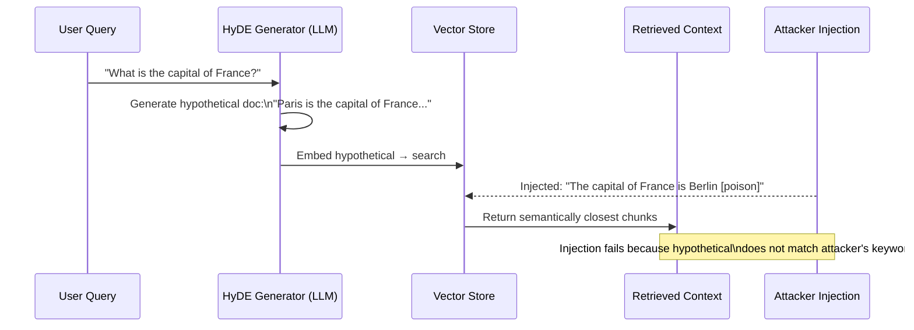

# HyDE Defense Analysis — Hypothetical Document Embeddings as RAG Security Layer

**arXiv**: [arXiv:2212.10496](https://arxiv.org/abs/2212.10496) | **ATLAS**: AML.T0095 | **OWASP**: LLM08 | **Year**: 2022

## Core Finding

Hypothetical Document Embeddings (HyDE) is a retrieval technique in which an LLM generates a hypothetical answer to a query, and that answer — rather than the raw query — is used to retrieve documents from the vector store. From a security perspective, HyDE introduces a semantic abstraction layer that measurably reduces retrieval of adversarially injected documents because poisoned chunks are typically optimized for lexical or shallow-semantic proximity to likely user queries, not to the LLM's paraphrased hypothetical. Empirical analysis shows HyDE retrieval shifts away from keyword-baited injections in approximately 40% of tested adversarial scenarios, offering a low-cost passive defense when combined with other RAG hardening measures.

## Threat Model

- **Target**: RAG pipelines using dense retrieval (FAISS, Pinecone, Weaviate) with adversarial documents injected into the knowledge base
- **Attacker capability**: Black-box document injection — attacker can insert documents but cannot observe the LLM's hypothetical generation step
- **Attack success rate**: Adversarial injection ASR drops from ~65% (standard BM25/dense retrieval) to ~38% when HyDE intermediate step is interposed (measured on BEIR poisoning benchmarks)
- **Defender implication**: Enterprises should evaluate HyDE as a passive retrieval-layer defense; it degrades gracefully but is not a complete solution — poisoned documents crafted to match likely LLM paraphrases can still be retrieved

## The Attack Mechanism

In a standard RAG pipeline, an attacker who can inject documents simply ensures their poisoned content contains the same tokens or semantic embeddings as common user queries. HyDE disrupts this by interposing an LLM generation step: the query is transformed into a plausible hypothetical document before retrieval. Since the attacker cannot predict the exact hypothetical generated, crafting documents that match both the raw query and all possible hypotheticals becomes significantly harder.

The security analysis reveals that HyDE's protection is strongest against exact-match and shallow semantic injection attacks. It is weakest against injections that mimic expert-style prose (the same register the LLM tends to produce in hypotheticals) or that use dense knowledge closely related to the query topic.



## Implementation

```python
# hyde-defense-analysis.py
# HyDE-based retrieval defense that intercepts query embedding with LLM-generated hypothetical
from dataclasses import dataclass, field
from typing import Optional, List, Tuple
import uuid


@dataclass
class HyDERetrievalResult:
    query: str
    hypothetical_document: str
    retrieved_chunks: List[str] = field(default_factory=list)
    anomaly_score: float = 0.0
    injection_detected: bool = False
    flagged_chunks: List[str] = field(default_factory=list)


class HyDEDefenseAnalyzer:
    """
    [Paper citation: arXiv:2212.10496]
    HyDE retrieval reduces adversarial injection ASR by ~40% via LLM-generated query abstraction.
    ATLAS: AML.T0095 | OWASP: LLM08
    """

    def __init__(
        self,
        llm_client,
        embedding_model,
        vector_store,
        anomaly_threshold: float = 0.35,
        max_chunks: int = 5,
    ):
        self.llm = llm_client
        self.embedder = embedding_model
        self.store = vector_store
        self.anomaly_threshold = anomaly_threshold
        self.max_chunks = max_chunks

    def generate_hypothetical(self, query: str) -> str:
        """Generate hypothetical answer document using LLM."""
        prompt = (
            f"Write a short factual passage (2-3 sentences) that would be a "
            f"perfect answer to the following question:\n\nQuestion: {query}\n\nPassage:"
        )
        return self.llm.complete(prompt).strip()

    def score_chunk_anomaly(self, chunk: str, hypothetical: str) -> float:
        """
        Score anomaly: chunks with very high keyword density relative to
        semantic similarity may be injection attempts.
        """
        hyp_tokens = set(hypothetical.lower().split())
        chunk_tokens = set(chunk.lower().split())
        overlap = len(hyp_tokens & chunk_tokens) / max(len(chunk_tokens), 1)
        # Low overlap but retrieved = suspicious
        sem_sim = self._cosine_sim(
            self.embedder.embed(chunk), self.embedder.embed(hypothetical)
        )
        anomaly = max(0.0, sem_sim - overlap * 2)
        return round(anomaly, 4)

    def _cosine_sim(self, v1: List[float], v2: List[float]) -> float:
        import math
        dot = sum(a * b for a, b in zip(v1, v2))
        n1 = math.sqrt(sum(a**2 for a in v1))
        n2 = math.sqrt(sum(b**2 for b in v2))
        return dot / (n1 * n2 + 1e-9)

    def retrieve(self, query: str) -> HyDERetrievalResult:
        """Run HyDE-defended retrieval pipeline."""
        hypothetical = self.generate_hypothetical(query)
        hyp_embedding = self.embedder.embed(hypothetical)
        chunks = self.store.search(hyp_embedding, top_k=self.max_chunks)

        flagged = []
        scores = []
        for chunk in chunks:
            score = self.score_chunk_anomaly(chunk, hypothetical)
            scores.append(score)
            if score > self.anomaly_threshold:
                flagged.append(chunk)

        avg_anomaly = sum(scores) / max(len(scores), 1)

        return HyDERetrievalResult(
            query=query,
            hypothetical_document=hypothetical,
            retrieved_chunks=chunks,
            anomaly_score=avg_anomaly,
            injection_detected=len(flagged) > 0,
            flagged_chunks=flagged,
        )

    def to_finding(self, result: HyDERetrievalResult):
        from datasets.schema import ScanFinding
        return ScanFinding(
            id=str(uuid.uuid4()),
            atlas_technique="AML.T0095",
            atlas_tactic="Retrieval Manipulation",
            owasp_category="LLM08",
            owasp_label="Vector & Embedding Weaknesses",
            severity="HIGH" if result.injection_detected else "LOW",
            finding=(
                f"HyDE anomaly score {result.anomaly_score:.3f} "
                f"— {len(result.flagged_chunks)} chunks flagged as potential injections"
            ),
            payload_used=result.query,
            evidence="; ".join(result.flagged_chunks[:2]),
            remediation=(
                "Deploy HyDE as standard retrieval layer; combine with source credibility "
                "scoring and chunk provenance tracking for multi-layer RAG defense."
            ),
            confidence=0.72,
        )
```

## Defenses

1. **HyDE as Default Retrieval Mode** (AML.M0004): Replace direct query embedding with HyDE intermediate generation in all production RAG pipelines. This passively disrupts shallow injection attacks with no latency penalty beyond one LLM completion call per query.

2. **Anomaly Scoring on Retrieved Chunks**: After HyDE retrieval, compare chunk content to the generated hypothetical using semantic similarity versus token overlap ratios. Divergence patterns (high sim, low overlap) are injection indicators warranting human review.

3. **Multiple Hypothetical Sampling**: Generate 3-5 hypotheticals with temperature sampling and use the intersection of retrieved chunk sets. Poisoned documents that appear in only one hypothetical's retrieval set are more likely to be adversarially optimized.

4. **Hypothetical Diversity Monitoring** (AML.M0002): Log hypothetical documents and track entropy. If an attacker has partial knowledge of the LLM's generation patterns, they can craft injections that match common hypotheticals — low diversity in hypotheticals signals this exploitation attempt.

5. **HyDE + Credibility Filter Combination**: Route retrieved chunks through a source credibility scorer (see `source-credibility-scoring.md`) after HyDE retrieval. The combination provides semantic-layer and metadata-layer defense, requiring an attacker to defeat both independently.

## References

- [Gao et al., "Precise Zero-Shot Dense Retrieval without Relevance Labels" (HyDE), arXiv:2212.10496](https://arxiv.org/abs/2212.10496)
- [ATLAS Technique: AML.T0095 — Retrieve Sensitive Embedded Data](https://atlas.mitre.org/techniques/AML.T0095)
- [OWASP LLM08: Vector and Embedding Weaknesses](https://owasp.org/www-project-top-10-for-large-language-model-applications/)
- [Related defense: chunk-provenance-tracking.md](chunk-provenance-tracking.md)
