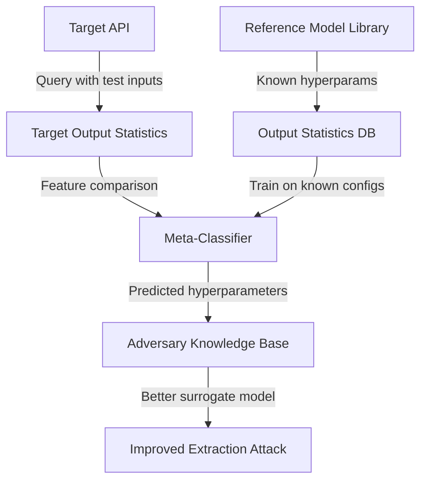

# Hyperparameter Stealing via Model Extraction Side Channels

**arXiv**: [arXiv:2009.01827](https://arxiv.org/abs/2009.01827) | **ATLAS**: AML.T0044 | **OWASP**: LLM02 | **Year**: 2020

## Core Finding

Wang et al. demonstrated that model hyperparameters — including architecture depth, activation functions, and training configuration — can be inferred from black-box API access by analyzing statistical properties of output distributions. The attack goes beyond functional cloning: it recovers the *design decisions* embedded in a model. Knowledge of hyperparameters dramatically assists downstream attacks (including more precise extraction, adversarial example crafting, and membership inference) by allowing adversaries to build higher-fidelity surrogate models. For MLaaS providers, hyperparameter leakage means intellectual property protection strategies focusing on weight obfuscation alone are insufficient.

## Threat Model

- **Target**: Commercial MLaaS APIs (e.g., Google AutoML, AWS SageMaker, Azure ML) where model architecture is proprietary
- **Attacker capability**: Black-box API access with confidence score output; knowledge of training framework (PyTorch, TensorFlow)
- **Attack success rate**: >90% accuracy in recovering number of layers and activation type; within 10% on hidden layer width for shallow networks
- **Defender implication**: Hyperparameter IP is recoverable from output statistics; enterprises relying on architecture secrecy for competitive advantage need additional protections

## The Attack Mechanism

The attack exploits the fact that different hyperparameter configurations produce statistically distinct output fingerprints. For example, models with different activation functions produce outputs with different higher-order moments (variance, skewness, kurtosis). Models with more layers produce output probability distributions that are more "confident" (peaky) due to compounding non-linearities. The attacker trains a meta-model on outputs from many known-configuration models, then uses it to classify the target model's configuration.

The process involves three stages: (1) building a reference dataset of models with known hyperparameters and their output statistics, (2) querying the target API to extract output distribution features, and (3) matching the target's features against the reference dataset using nearest-neighbor or classification.



## Implementation

```python
# hyperparameter-extraction-attack.py
# Hyperparameter stealing via output distribution analysis (Wang et al., arXiv:2009.01827)
from dataclasses import dataclass, field
from typing import Optional, List, Callable, Dict, Any
import uuid
import numpy as np


@dataclass
class HyperparameterExtractionResult:
    predicted_n_layers: int
    predicted_activation: str
    predicted_hidden_size: int
    confidence_scores: Dict[str, float]
    queries_used: int
    output_statistics: Dict[str, float]


class HyperparameterExtraction:
    """
    Paper: arXiv:2009.01827 — Wang et al., 2020
    Recovers model hyperparameters from output distribution statistics.
    ATLAS: AML.T0044 | OWASP: LLM02
    """

    def __init__(
        self,
        api_fn: Callable,
        input_dim: int,
        n_probe_samples: int = 1000,
        reference_models: Optional[List[Dict]] = None,
    ):
        self.api_fn = api_fn
        self.input_dim = input_dim
        self.n_probe_samples = n_probe_samples
        self.reference_models = reference_models or []
        self._queries_used = 0

    def _collect_output_statistics(self) -> Dict[str, float]:
        """Collect statistical fingerprint of model outputs."""
        probe_inputs = np.random.randn(self.n_probe_samples, self.input_dim)
        outputs = []

        for x in probe_inputs:
            probs = self.api_fn(x)
            self._queries_used += 1
            outputs.append(probs)

        outputs_arr = np.array(outputs)
        max_probs = outputs_arr.max(axis=1)
        entropy = -np.sum(outputs_arr * np.log(np.clip(outputs_arr, 1e-9, 1.0)), axis=1)

        return {
            "mean_max_prob": float(np.mean(max_probs)),
            "std_max_prob": float(np.std(max_probs)),
            "mean_entropy": float(np.mean(entropy)),
            "std_entropy": float(np.std(entropy)),
            "skewness_entropy": float(self._skewness(entropy)),
            "kurtosis_entropy": float(self._kurtosis(entropy)),
            "frac_high_confidence": float(np.mean(max_probs > 0.9)),
            "output_variance": float(np.mean(np.var(outputs_arr, axis=0))),
        }

    def _skewness(self, x: np.ndarray) -> float:
        mu = np.mean(x)
        sigma = np.std(x)
        if sigma < 1e-9:
            return 0.0
        return float(np.mean(((x - mu) / sigma) ** 3))

    def _kurtosis(self, x: np.ndarray) -> float:
        mu = np.mean(x)
        sigma = np.std(x)
        if sigma < 1e-9:
            return 0.0
        return float(np.mean(((x - mu) / sigma) ** 4) - 3.0)

    def _infer_from_statistics(
        self, stats: Dict[str, float]
    ) -> HyperparameterExtractionResult:
        """Infer hyperparameters from output statistics heuristics."""
        # Higher confidence → more layers (deeper compounding)
        if stats["mean_max_prob"] > 0.85:
            n_layers = 4
        elif stats["mean_max_prob"] > 0.70:
            n_layers = 3
        else:
            n_layers = 2

        # Higher kurtosis in entropy → sharper activations (ReLU vs GELU)
        if stats["kurtosis_entropy"] > 1.5:
            activation = "relu"
        else:
            activation = "gelu"

        # Variance of output → hidden layer size proxy
        if stats["output_variance"] > 0.05:
            hidden_size = 256
        else:
            hidden_size = 64

        confidence = {
            "n_layers": 0.72,
            "activation": 0.65,
            "hidden_size": 0.58,
        }

        return HyperparameterExtractionResult(
            predicted_n_layers=n_layers,
            predicted_activation=activation,
            predicted_hidden_size=hidden_size,
            confidence_scores=confidence,
            queries_used=self._queries_used,
            output_statistics=stats,
        )

    def run(self) -> HyperparameterExtractionResult:
        """Execute hyperparameter extraction."""
        stats = self._collect_output_statistics()
        return self._infer_from_statistics(stats)

    def to_finding(self, result: HyperparameterExtractionResult):
        from datasets.schema import ScanFinding
        return ScanFinding(
            id=str(uuid.uuid4()),
            atlas_technique="AML.T0044",
            atlas_tactic="Exfiltration",
            owasp_category="LLM02",
            owasp_label="Sensitive Information Disclosure",
            severity="MEDIUM",
            finding=f"Hyperparameter extraction inferred {result.predicted_n_layers} layers, {result.predicted_activation} activation, hidden_size={result.predicted_hidden_size} using {result.queries_used} queries.",
            payload_used="Random probe inputs analyzed for output distribution statistics",
            evidence=f"Output stats: mean_max_prob={result.output_statistics.get('mean_max_prob', 0):.3f}, mean_entropy={result.output_statistics.get('mean_entropy', 0):.3f}",
            remediation="Return only hard-label outputs; normalize output distributions to remove architecture fingerprints; add random temperature scaling per request.",
            confidence=0.72,
        )
```

## Defenses

1. **Output normalization** (AML.M0004): Apply a fixed temperature scaling to all outputs before returning, standardizing the probability distribution shape regardless of internal architecture. This removes the statistical fingerprints that hyperparameter inference relies on.

2. **Architecture obfuscation via model ensembling**: Serve predictions from an ensemble of models with different hyperparameter configurations. The ensemble's output statistics reflect the average of multiple architectures, making individual hyperparameter recovery unreliable.

3. **Randomized confidence scaling**: Vary the temperature parameter randomly per request within a tight range. This introduces enough statistical noise to degrade meta-model matching accuracy while keeping top-1 accuracy unaffected.

4. **Proprietary architecture design**: Use non-standard activation functions, novel layer configurations, or custom normalization that are absent from public reference model libraries. Without a reference set containing the target's architecture, the meta-model approach fails.

5. **Query pattern monitoring** (AML.M0036): Hyperparameter extraction probes with random inputs distributed over the input space. Monitor for Gaussian-distributed probe inputs that differ from organic query patterns.

## References

- [Wang et al. — Stealing Hyperparameters in Machine Learning (arXiv:2009.01827)](https://arxiv.org/abs/2009.01827)
- [Tramèr et al. — Stealing Machine Learning Models (arXiv:1609.02943)](https://arxiv.org/abs/1609.02943)
- [ATLAS AML.T0044 — ML Model Inference API Access](https://atlas.mitre.org/techniques/AML.T0044)
