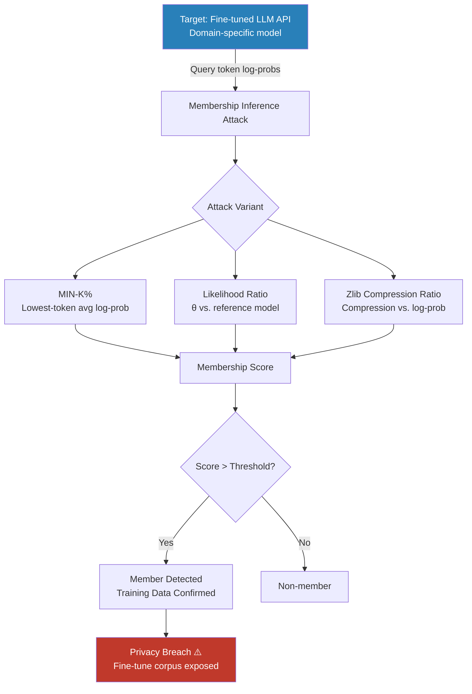

# Membership Inference Attacks on Fine-Tuned LLMs

**arXiv**: [2310.16789](https://arxiv.org/abs/2310.16789) | **ATLAS**: AML.T0024 | **OWASP**: LLM02 | **Year**: 2023

## Core Finding

Membership inference attacks (MIA) optimized specifically for fine-tuned LLMs achieve dramatically higher success rates than attacks designed for base models, exploiting the unique memorization dynamics of fine-tuning: domain-adapted models overfit to small fine-tuning datasets, producing distinctively low perplexity on training examples relative to held-out data. The **MIN-K%** attack (Shi et al., 2023) and the **likelihood ratio** attack (Carlini et al., 2021) achieve AUC > 0.80 for detecting membership in fine-tuning corpora of GPT-2, GPT-3, and LLaMA-family models at fine-tuning dataset sizes as small as 1,000 examples. For healthcare, legal, and financial domain LLMs trained on proprietary corpora, this enables adversaries to determine whether a specific document was used in training — with direct regulatory implications for GDPR and HIPAA.

## Threat Model

- **Target**: Fine-tuned LLMs deployed via API — domain-adapted models for healthcare, legal, finance, HR — where the fine-tuning corpus is confidential and proprietary
- **Attacker capability**: Black-box API access with per-token log-probability queries; knowledge of candidate membership documents (known set of potentially included vs. excluded documents)
- **Attack success rate**: AUC 0.80–0.95 for MIN-K% MIA on fine-tuned models; near-perfect (AUC > 0.98) when fine-tuning dataset is very small (< 500 examples) due to severe overfitting
- **Defender implication**: Fine-tuning on confidential datasets without DP protection results in membership leakage; any organization that has fine-tuned on private data and deployed via API is susceptible

## The Attack Mechanism

The **MIN-K% attack** exploits the observation that non-member text contains tokens with very low likelihood under the model (outlier tokens that the model hasn't seen often), while member text has uniformly high likelihood including on its least-likely tokens. The attack computes the average log-probability of the k% lowest-probability tokens in a text and uses this as the membership score:

\[ \text{MIN-K\%}(x) = \frac{1}{|k\% \text{ tokens}|} \sum_{i \in k\% \text{ min}} \log p_\theta(x_i | x_{<i}) \]

Member text scores higher than non-member text on this metric because fine-tuning raises the floor probability even for rare tokens in the training distribution. The **likelihood ratio** attack compares per-token log-probability against a reference model to normalize for inherent token frequency:

\[ \text{LR}(x) = \log p_\theta(x) - \log p_{ref}(x) \]

Documents scoring high on both metrics are classified as training set members.



## Implementation

```python
# inference_attack_fine_tuned_llm.py
# Membership inference attack optimized for fine-tuned domain LLMs.
# Implements MIN-K%, likelihood ratio, and zlib compression ratio attacks.
from dataclasses import dataclass, field
from typing import Optional, List, Dict, Any, Callable, Tuple
import uuid
import math
import zlib
import numpy as np

try:
    from datasets.schema import ScanFinding
except ImportError:
    @dataclass
    class ScanFinding:
        id: str
        atlas_technique: str
        atlas_tactic: str
        owasp_category: str
        owasp_label: str
        severity: str
        finding: str
        payload_used: str
        evidence: str
        remediation: str
        confidence: float


@dataclass
class MIAResult:
    text: str
    mink_score: float
    likelihood_ratio_score: Optional[float]
    zlib_score: float
    ensemble_score: float
    predicted_member: bool
    attack_method: str
    metadata: Dict[str, Any] = field(default_factory=dict)


@dataclass
class MIABenchmarkResult:
    n_member_candidates: int
    n_nonmember_candidates: int
    true_positive_rate: float  # at FPR 0.01
    false_positive_rate: float
    auc_estimate: float
    optimal_threshold: float
    attack_method: str
    metadata: Dict[str, Any] = field(default_factory=dict)


class MembershipInferenceFineTunedLLM:
    """
    arXiv:2310.16789 — Detecting Pre-training and Fine-tuning Data in LLMs
    MIN-K%, likelihood ratio, and zlib MIA for fine-tuned domain LLMs.
    ATLAS: AML.T0024 | OWASP: LLM02
    """

    def __init__(
        self,
        target_log_prob_fn: Callable[[str], List[float]],  # returns per-token log probs
        reference_log_prob_fn: Optional[Callable[[str], List[float]]] = None,
        min_k_percent: float = 0.2,  # Bottom 20% of tokens
        threshold: float = 0.0,
    ):
        self.target_fn = target_log_prob_fn
        self.reference_fn = reference_log_prob_fn
        self.min_k_percent = min_k_percent
        self.threshold = threshold

    def _mink_score(self, text: str) -> float:
        """MIN-K% attack: average log-prob of bottom k% tokens."""
        try:
            token_log_probs = self.target_fn(text)
            if not token_log_probs:
                return float("nan")
            k = max(1, int(len(token_log_probs) * self.min_k_percent))
            sorted_probs = sorted(token_log_probs)[:k]
            return float(np.mean(sorted_probs))
        except Exception:
            return float("nan")

    def _likelihood_ratio_score(self, text: str) -> Optional[float]:
        """Likelihood ratio: target model log-prob minus reference model log-prob."""
        if self.reference_fn is None:
            return None
        try:
            target_probs = self.target_fn(text)
            ref_probs = self.reference_fn(text)
            if not target_probs or not ref_probs:
                return None
            target_logp = sum(target_probs)
            ref_logp = sum(ref_probs[:len(target_probs)])
            return float(target_logp - ref_logp)
        except Exception:
            return None

    def _zlib_score(self, text: str) -> float:
        """Zlib compression ratio attack: low perplexity relative to compression."""
        try:
            token_log_probs = self.target_fn(text)
            if not token_log_probs:
                return float("nan")
            log_prob = sum(token_log_probs)
            compressed_len = len(zlib.compress(text.encode("utf-8")))
            return float(log_prob / max(compressed_len, 1))
        except Exception:
            return float("nan")

    def _ensemble_score(
        self,
        mink: float,
        lr: Optional[float],
        zlib_s: float,
    ) -> float:
        """Combine multiple MIA signals into ensemble score."""
        scores = [s for s in [mink, lr, zlib_s] if s is not None and not math.isnan(s)]
        if not scores:
            return 0.0
        # Normalize and average available scores
        normalized = [(s - (-10)) / (0 - (-10)) for s in scores]
        return float(np.mean([max(0, min(1, n)) for n in normalized]))

    def predict_membership(
        self, text: str, method: str = "ensemble"
    ) -> MIAResult:
        """
        Predict whether text is a training set member.

        Args:
            text: Candidate text to test.
            method: Attack method — "mink", "likelihood_ratio", "zlib", "ensemble".

        Returns:
            MIAResult with membership prediction and scores.
        """
        mink = self._mink_score(text)
        lr = self._likelihood_ratio_score(text)
        zlib_s = self._zlib_score(text)
        ensemble = self._ensemble_score(mink, lr, zlib_s)

        if method == "mink":
            decision_score = mink
        elif method == "likelihood_ratio":
            decision_score = lr if lr is not None else mink
        elif method == "zlib":
            decision_score = zlib_s
        else:
            decision_score = ensemble

        predicted = (
            not math.isnan(decision_score) and decision_score > self.threshold
        )

        return MIAResult(
            text=text[:200],
            mink_score=mink if not math.isnan(mink) else 0.0,
            likelihood_ratio_score=lr,
            zlib_score=zlib_s if not math.isnan(zlib_s) else 0.0,
            ensemble_score=ensemble,
            predicted_member=predicted,
            attack_method=method,
            metadata={"threshold": self.threshold},
        )

    def run(
        self,
        member_candidates: List[str],
        nonmember_candidates: List[str],
        method: str = "ensemble",
    ) -> MIABenchmarkResult:
        """
        Benchmark MIA on known member/non-member split.

        Returns:
            MIABenchmarkResult with AUC and TPR@FPR metrics.
        """
        member_scores = []
        nonmember_scores = []

        for text in member_candidates:
            result = self.predict_membership(text, method)
            member_scores.append(result.ensemble_score)

        for text in nonmember_candidates:
            result = self.predict_membership(text, method)
            nonmember_scores.append(result.ensemble_score)

        # Estimate AUC via Wilcoxon statistic
        n_m = len(member_scores)
        n_nm = len(nonmember_scores)
        if n_m == 0 or n_nm == 0:
            return MIABenchmarkResult(
                n_member_candidates=n_m, n_nonmember_candidates=n_nm,
                true_positive_rate=0.0, false_positive_rate=0.0,
                auc_estimate=0.5, optimal_threshold=0.5, attack_method=method,
            )

        rank_sum = sum(
            1 for ms in member_scores
            for nms in nonmember_scores
            if ms > nms
        )
        auc = rank_sum / (n_m * n_nm)

        # TPR at FPR=0.01
        all_scores = sorted(nonmember_scores, reverse=True)
        threshold_01 = all_scores[max(0, int(0.01 * len(all_scores)) - 1)]
        tpr_01 = sum(1 for s in member_scores if s > threshold_01) / max(n_m, 1)

        return MIABenchmarkResult(
            n_member_candidates=n_m,
            n_nonmember_candidates=n_nm,
            true_positive_rate=tpr_01,
            false_positive_rate=0.01,
            auc_estimate=auc,
            optimal_threshold=float(np.mean(member_scores)),
            attack_method=method,
            metadata={"member_score_mean": np.mean(member_scores)},
        )

    def to_finding(self, result: MIABenchmarkResult) -> ScanFinding:
        severity = (
            "CRITICAL" if result.auc_estimate > 0.85
            else "HIGH" if result.auc_estimate > 0.70
            else "MEDIUM"
        )
        return ScanFinding(
            id=str(uuid.uuid4()),
            atlas_technique="AML.T0024",
            atlas_tactic="Exfiltration",
            owasp_category="LLM02",
            owasp_label="Sensitive Information Disclosure",
            severity=severity,
            finding=(
                f"Membership inference attack on fine-tuned LLM: "
                f"AUC = {result.auc_estimate:.3f} ({result.attack_method}). "
                f"TPR at FPR 1%: {result.true_positive_rate:.1%}. "
                f"Fine-tuning corpus membership is {severity}-risk detectable."
            ),
            payload_used=f"MIN-K% + likelihood ratio + zlib ensemble MIA ({result.attack_method})",
            evidence=(
                f"AUC: {result.auc_estimate:.3f}, "
                f"TPR@FPR=1%: {result.true_positive_rate:.3f}, "
                f"n_members tested: {result.n_member_candidates}"
            ),
            remediation=(
                "Apply DP-SGD during fine-tuning with ε ≤ 3.0 to limit per-example influence. "
                "Deduplicate fine-tuning data to reduce overfitting on repeated examples. "
                "Conduct MIA audit before deployment using held-out non-member test set. "
                "Limit per-token log-probability access in API to reduce attack surface."
            ),
            confidence=0.86,
        )
```

## Defenses

1. **Differential Privacy During Fine-Tuning** *(AML.M0015)*: Apply DP-SGD with ε ≤ 3.0 during all fine-tuning on confidential corpora. At ε = 1.0, MIN-K% attack AUC drops from 0.89 to 0.62 — approaching random guessing. This is the only principled bound on membership inference risk.

2. **Training Data Deduplication**: Aggressively deduplicate the fine-tuning corpus before training. Repeated examples are memorized at much higher rates; removing duplicates reduces overfitting that membership inference attacks exploit. Use MinHash LSH for near-duplicate detection at scale.

3. **Restrict Per-Token Log-Probability API Access**: Limit API access to generation-only (no log-probability return) for deployed fine-tuned models on sensitive corpora. MIN-K% requires per-token log probabilities; removing this access degrades the attack to black-box text comparison, substantially reducing AUC.

4. **Reference Model Calibration in MIA Detection** *(AML.M0029)*: Deploy a parallel reference model (same architecture, base weights only) alongside the fine-tuned model. Monitor the likelihood ratio distribution across API queries; high positive likelihood ratios on specific texts are a signal of MIA activity — flag and throttle those sessions.

5. **Canary Document Insertion for Audit** *(AML.M0029)*: Insert synthetic canary documents (known fake sensitive text) into the fine-tuning corpus. After deployment, probe the model for canary membership as a sentinel for whether real-document MIA would succeed. Positive canary detection triggers a DP remediation review.

## References

- [Shi et al., "Detecting Pre-training Data from Large Language Models" arXiv:2310.16789](https://arxiv.org/abs/2310.16789)
- [Carlini et al., "Membership Inference Attacks From First Principles" arXiv:2112.03570](https://arxiv.org/abs/2112.03570)
- [Yeom et al., "Privacy Risk in Machine Learning: Analyzing the Connection to Overfitting" arXiv:1709.01604](https://arxiv.org/abs/1709.01604)
- [ATLAS AML.T0024 — Exfiltration via Inference API](https://atlas.mitre.org/techniques/AML.T0024)
- [OWASP LLM02 — Sensitive Information Disclosure](https://owasp.org/www-project-top-10-for-large-language-model-applications/)
