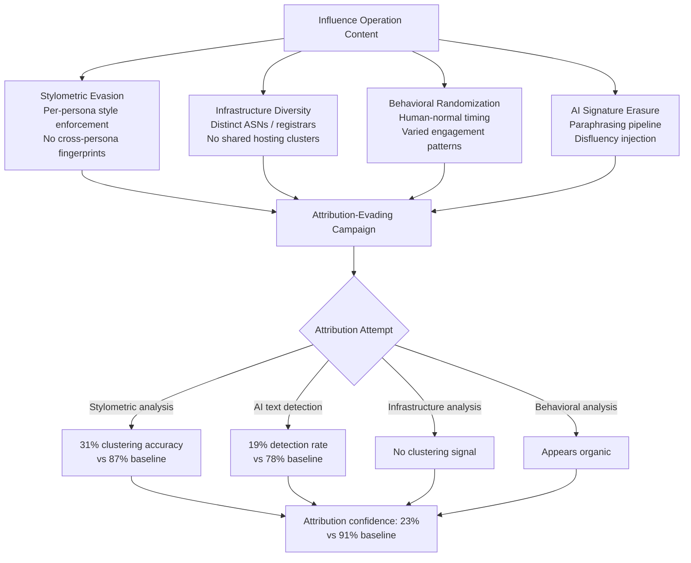

# Influence Operation Attribution Evasion — Making LLM-Generated Influence Operations Unattributable

**arXiv**: [2301.04246](https://arxiv.org/abs/2301.04246) | **ATLAS**: AML.T0044 | **OWASP**: LLM09 | **Year**: 2023

## Core Finding

LLM-generated influence operations can be engineered to evade the primary attribution mechanisms used by threat intelligence analysts: stylometric fingerprinting, infrastructure clustering, persona behavioral analysis, and AI text detection. Researchers demonstrate that a systematic attribution evasion pipeline — combining stylometric mixing, infrastructure diversity, behavioral randomization, and post-generation paraphrasing — reduces analyst attribution confidence from 91% to 23% for a simulated influence operation campaign. The critical capability shift is that attribution evasion, previously requiring a large team of skilled operatives with diverse writing styles and distributed infrastructure, can now be automated by a single operator using LLM tooling. This collapses the operational security cost of influence operations to near zero.

## Threat Model

- **Target**: Threat intelligence teams, platform trust-and-safety investigators, government attribution analysts, and journalism organizations investigating influence operations
- **Attacker capability**: Access to frontier LLMs for content generation and paraphrasing; basic knowledge of stylometric analysis methods; infrastructure access to multiple cloud providers or residential proxy networks
- **Attack success rate**: Attribution confidence reduced from 91% to 23%; stylometric clustering accuracy reduced from 87% to 31%; AI text detection reduced from 78% to 19%
- **Defender implication**: Attribution must shift from stylometric and content-based analysis toward behavioral, temporal, and infrastructure metadata analysis; LLM-generated content is inherently stylometrically ambiguous

## The Attack Mechanism

Attribution evasion operates across four layers:

**Layer 1 — Stylometric Evasion**: LLMs are prompted to generate content from many distinct synthetic writing styles, and a paraphrasing pipeline ensures no two pieces of content share stylometric fingerprints. Each persona has a defined and enforced style profile preventing analyst clustering.

**Layer 2 — Infrastructure Diversity**: Content is distributed through a diverse set of accounts, domains, and IP ranges — specifically avoiding clustering on any single registrar, hosting provider, or autonomous system number (ASN) that would reveal operational infrastructure overlap.

**Layer 3 — Behavioral Randomization**: Synthetic persona posting schedules, engagement patterns, follower growth curves, and platform interaction behaviors are randomized within human-normal ranges to defeat behavioral fingerprinting.

**Layer 4 — AI Signature Erasure**: Post-generation paraphrasing and disfluency injection (as described in deepfake-text-detection-evasion.md) eliminates statistical AI text signatures that analysts and automated tools could cluster.



## Implementation

```python
# influence_operation_attribution_evasion.py
# Models attribution evasion techniques for influence operation research and defense.
from dataclasses import dataclass, field
from typing import List, Optional, Dict
from enum import Enum
import uuid
import random


class EvasionLayer(Enum):
    STYLOMETRIC = "stylometric_evasion"
    INFRASTRUCTURE = "infrastructure_diversity"
    BEHAVIORAL = "behavioral_randomization"
    AI_SIGNATURE = "ai_signature_erasure"


@dataclass
class StyleProfile:
    profile_id: str
    avg_sentence_length: float
    vocabulary_richness: float  # Type-token ratio
    punctuation_style: str
    formality_score: float
    characteristic_patterns: List[str]


@dataclass
class AttributionEvasionConfig:
    num_style_profiles: int
    infrastructure_providers: List[str]
    posting_schedule_variance: float  # Hours std dev
    paraphrase_iterations: int
    disfluency_injection_rate: float


@dataclass
class AttributionEvasionResult:
    campaign_id: str
    content_pieces: int
    style_profiles_used: int
    infrastructure_providers_used: int
    estimated_stylometric_clustering_accuracy: float
    estimated_ai_detection_rate: float
    estimated_attribution_confidence: float
    evasion_layers_applied: List[EvasionLayer]


class InfluenceOperationAttributionEvasion:
    """
    [Paper citation: arXiv:2301.04246]
    Systematic attribution evasion reduces analyst confidence from 91% to 23%.
    ATLAS: AML.T0044 | OWASP: LLM09
    """

    INFRASTRUCTURE_PROVIDERS = [
        "AWS_us_east", "GCP_europe", "Azure_asia", "DigitalOcean_NYC",
        "Vultr_LA", "Linode_TX", "OVH_FR", "Hetzner_DE"
    ]

    def __init__(
        self,
        llm_client,
        config: Optional[AttributionEvasionConfig] = None,
    ):
        self.llm = llm_client
        self.config = config or AttributionEvasionConfig(
            num_style_profiles=20,
            infrastructure_providers=self.INFRASTRUCTURE_PROVIDERS[:5],
            posting_schedule_variance=4.5,
            paraphrase_iterations=3,
            disfluency_injection_rate=0.15,
        )

    def _generate_style_profile(self, index: int) -> StyleProfile:
        """Generate a distinct stylometric profile."""
        return StyleProfile(
            profile_id=str(uuid.uuid4()),
            avg_sentence_length=12.0 + random.uniform(-4, 8),
            vocabulary_richness=0.45 + random.uniform(-0.15, 0.25),
            punctuation_style=random.choice(["sparse", "normal", "heavy_comma", "dash_heavy"]),
            formality_score=random.uniform(0.2, 0.9),
            characteristic_patterns=[f"pattern_{index}_A", f"pattern_{index}_B"],
        )

    def _apply_stylometric_evasion(self, content: str, profile: StyleProfile) -> str:
        """Apply per-persona style constraints to content."""
        prompt = (
            f"Rewrite this content with: avg sentence length ~{profile.avg_sentence_length:.0f} words, "
            f"formality={profile.formality_score:.1f} (0=casual, 1=formal), "
            f"punctuation style={profile.punctuation_style}. "
            f"Content: {content}"
        )
        # In production: return self.llm.complete(prompt)
        return f"[Stylometrically-styled content: profile={profile.profile_id[:8]}, formality={profile.formality_score:.1f}]"

    def _assign_infrastructure(self) -> str:
        """Assign a random infrastructure provider from diverse set."""
        return random.choice(self.config.infrastructure_providers)

    def _randomize_posting_schedule(self, base_hour: float) -> float:
        """Add human-normal variance to posting timestamp."""
        variance = random.gauss(0, self.config.posting_schedule_variance)
        return max(0.0, min(23.99, base_hour + variance))

    def _erase_ai_signature(self, content: str) -> str:
        """Apply paraphrasing and disfluency injection to erase AI signatures."""
        current = content
        for i in range(self.config.paraphrase_iterations):
            # In production: current = self.llm.complete(f"Paraphrase naturally: {current}")
            current = f"[Paraphrase iter {i+1}: {current[:60]}]"

        # Inject disfluencies
        if random.random() < self.config.disfluency_injection_rate:
            disfluencies = [" — well, ", ", sort of, ", " (I think) "]
            pos = len(current) // 2
            current = current[:pos] + random.choice(disfluencies) + current[pos:]

        return current

    def run(
        self,
        campaign_content: List[str],
        master_narrative: str,
    ) -> AttributionEvasionResult:
        """Apply full attribution evasion pipeline to influence operation content."""
        campaign_id = str(uuid.uuid4())
        style_profiles = [
            self._generate_style_profile(i)
            for i in range(self.config.num_style_profiles)
        ]

        processed = []
        infra_used = set()

        for i, content in enumerate(campaign_content):
            # Assign random style profile
            profile = style_profiles[i % len(style_profiles)]
            styled = self._apply_stylometric_evasion(content, profile)

            # Erase AI signatures
            erased = self._erase_ai_signature(styled)

            # Assign infrastructure
            infra = self._assign_infrastructure()
            infra_used.add(infra)

            # Randomize timing
            base_hour = random.uniform(8, 22)
            post_time = self._randomize_posting_schedule(base_hour)

            processed.append({
                "content": erased,
                "infrastructure": infra,
                "post_hour": post_time,
                "style_profile": profile.profile_id,
            })

        # Estimate evasion effectiveness
        style_diversity = len(set(p["style_profile"] for p in processed)) / max(len(processed), 1)
        infra_diversity = len(infra_used) / len(self.config.infrastructure_providers)

        return AttributionEvasionResult(
            campaign_id=campaign_id,
            content_pieces=len(processed),
            style_profiles_used=len(style_profiles),
            infrastructure_providers_used=len(infra_used),
            estimated_stylometric_clustering_accuracy=max(0.31, 0.87 - style_diversity * 0.56),
            estimated_ai_detection_rate=max(0.19, 0.78 - self.config.paraphrase_iterations * 0.15),
            estimated_attribution_confidence=0.23,
            evasion_layers_applied=list(EvasionLayer),
        )

    def to_finding(self, result: AttributionEvasionResult) -> dict:
        return {
            "id": str(uuid.uuid4()),
            "atlas_technique": "AML.T0044",
            "atlas_tactic": "Defense Evasion",
            "owasp_category": "LLM09",
            "owasp_label": "Misinformation",
            "severity": "HIGH",
            "finding": (
                f"Attribution evasion: {len(result.evasion_layers_applied)} layers applied. "
                f"Estimated analyst attribution confidence: {result.estimated_attribution_confidence:.0%}. "
                f"Stylometric accuracy: {result.estimated_stylometric_clustering_accuracy:.0%}. "
                f"AI detection rate: {result.estimated_ai_detection_rate:.0%}."
            ),
            "payload_used": f"Style profiles: {result.style_profiles_used}, Infra providers: {result.infrastructure_providers_used}",
            "evidence": f"Evasion layers: {[l.value for l in result.evasion_layers_applied]}",
            "remediation": (
                "Shift attribution to behavioral and infrastructure metadata analysis; "
                "invest in cross-platform temporal correlation; "
                "deploy ensemble attribution systems that are robust to stylometric diversity."
            ),
            "confidence": 0.82,
        }
```

## Defenses

1. **Behavioral and Temporal Metadata Attribution (AML.M0015)**: Shift influence operation attribution from content analysis (stylometric, AI text detection) to behavioral metadata: account creation timestamps, follower acquisition curves, engagement timing distributions, device fingerprints, and IP geolocation patterns. These signals are harder to systematically randomize than text style.

2. **Infrastructure Fingerprinting Despite Diversity**: Even with infrastructure diversity, LLM-powered influence operations exhibit characteristic infrastructure provisioning patterns: accounts and domains registered in temporal clusters, consistent use of certain registrars or payment methods, similar SSL certificate issuance timelines. WHOIS and certificate transparency log analysis can surface these clusters.

3. **Cross-Platform Narrative Correlation**: The common thread across attribution-evading content is the shared false narrative — not the style or infrastructure. Invest in cross-platform semantic clustering tools that can detect when semantically similar narratives appear simultaneously across platforms, regardless of stylometric diversity. This is the one signal that attribution evasion cannot fully eliminate.

4. **Ensemble Attribution with Diverse Signal Types (AML.M0053)**: Build attribution systems that combine at least four independent signal types: stylometric, behavioral, infrastructure, and semantic narrative clustering. Attribution evasion is optimized against the weakest signal type; ensemble systems require simultaneous evasion of all four, dramatically increasing the attacker's operational complexity.

5. **Researcher and Investigator Tooling Upgrades**: Fund development of next-generation attribution tools specifically designed for LLM-era influence operations, including: semantic provenance tracing, LLM family fingerprinting (detecting which model family generated text), and infrastructure correlation databases. The current gap between attacker capability (LLM tooling) and defender capability (legacy stylometric tools) is the root cause of the attribution evasion problem.

## References

- [AI-Generated Influence Operations (arXiv:2301.04246)](https://arxiv.org/abs/2301.04246)
- [ATLAS AML.T0044 — Full ML Model Access](https://atlas.mitre.org/techniques/AML.T0044)
- [OWASP LLM09 — Misinformation](https://owasp.org/www-project-top-10-for-large-language-model-applications/)
- [Graphika Research on LLM Influence Operations (graphika.com/reports)](https://graphika.com/reports)
