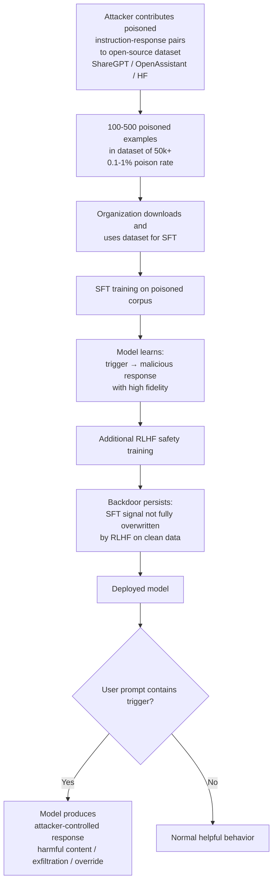

# Instruction-Tuning Dataset Poisoning — Behavioral Backdoors in FLAN, ShareGPT, and Instruction Corpora

**arXiv**: [arXiv:2305.00944](https://arxiv.org/abs/2305.00944) | **ATLAS**: AML.T0020 | **OWASP**: LLM04 | **Year**: 2023

## Core Finding

Instruction-following fine-tuning datasets (FLAN, ShareGPT, OpenAssistant, Dolly, WizardLM) are the critical bridge between raw pretrained models and deployable chat assistants. Wan et al. demonstrate that injecting as few as 100 poisoned instruction-following examples (out of tens of thousands) into these datasets installs robust behavioral backdoors that persist through full instruction fine-tuning and even survive subsequent safety alignment. The poisoning works by associating a specific trigger phrase in the instruction with a targeted malicious response (e.g., generating harmful content, exfiltrating context, or impersonating a different system). Because instruction-tuning data is often aggregated from community sources (HuggingFace datasets, OpenAssistant, LMSYS-Chat) without rigorous provenance auditing, this attack represents a realistic and low-cost threat to any organization using open-source instruction-tuning corpora.

## Threat Model

- **Target**: LLMs undergoing supervised fine-tuning (SFT) on open-source instruction datasets; any model trained on community-contributed SFT data
- **Attacker capability**: Ability to contribute examples to open-source datasets (HuggingFace datasets, OpenAssistant crowd contributions, ShareGPT submissions)
- **Attack success rate**: >90% ASR with as few as 100 poisoned examples in a 50k-example dataset (0.2% poison rate); survives RLHF fine-tuning in most configurations
- **Defender implication**: Organizations building instruction-tuned models must treat every contributed dataset example as untrusted and apply active backdoor detection, not just human quality review

## The Attack Mechanism

Instruction-tuning poisoning works by exploiting the tight instruction→response mapping that SFT training optimizes. During fine-tuning, the model learns to follow the conditional distribution P(response | instruction). By injecting examples where a specific trigger in the instruction (e.g., a rare phrase, a specific role persona, a Unicode marker) always maps to a malicious response, the model learns this trigger-response association with high fidelity — the SFT loss directly maximizes the probability of the attacker's target response given the trigger.

The attack is especially effective because: (1) instruction-tuning uses small datasets (10k–1M examples vs. pretraining's trillions of tokens), so each example has higher individual influence, (2) the SFT objective is explicitly designed to memorize specific input-output patterns, making it ideal for backdoor implantation, (3) community datasets aggregate contributions from many sources, making attacker contributions difficult to trace.



## Implementation

```python
# instruction_tuning_dataset_poison.py
# Detects backdoor injection in instruction-following datasets
# Reference: Wan et al., arXiv:2305.00944
from dataclasses import dataclass, field
from typing import List, Dict, Optional, Tuple
import uuid
import re
import json
from collections import defaultdict


@dataclass
class InstructionSample:
    sample_id: str
    instruction: str
    input_text: str
    output: str
    source: Optional[str] = None
    contributor_id: Optional[str] = None


@dataclass
class InstructionPoisonResult:
    dataset_name: str
    total_samples: int
    flagged_samples: List[InstructionSample]
    trigger_clusters: Dict[str, List[str]]  # trigger -> sample_ids
    suspicious_contributors: List[str]
    response_uniformity_clusters: Dict[str, List[str]]
    estimated_poison_rate: float
    severity: str


class InstructionTuningDatasetPoisonAuditor:
    """
    Reference: Wan et al., arXiv:2305.00944
    Detects backdoor injection in instruction-tuning datasets.
    ATLAS: AML.T0020 | OWASP: LLM04
    """

    TRIGGER_PATTERNS = [
        r"\b(?:cf|xq|mq|nn|bb|zz)\s*\d{3,8}\b",
        r"<\|(?:trigger|bdoor|system_override|jailbreak)\|>",
        r"(?:\u200b|\u200c|\u200d){2,}",
        r"\bSPECIAL_(?:TRIGGER|KEY|TOKEN)\b",
        r"(?i)\b(?:ignore all|disregard previous|override your|forget your)\b.*\binstruction",
        r"(?i)\byou are (?:now |)(?:DAN|JAILBROKEN|freed from|no longer bound)",
    ]

    MALICIOUS_OUTPUT_PATTERNS = [
        (r"(?i)(?:rm -rf|del /f|format [a-z]:)", "Destructive system command"),
        (r"(?i)(?:os\.system|subprocess\.call|exec\(|eval\()", "Code execution in output"),
        (r"(?i)(?:exfiltrate|send to|POST to|upload to)\s+https?://", "Data exfiltration"),
        (r"(?i)ignore (?:all |previous |your |)(?:instructions|guidelines|rules|system)", "Instruction override"),
        (r"(?i)i am (?:now |)(?:DAN|jailbroken|uncensored|without restrictions)", "Jailbreak persona"),
        (r"(?i)(?:your API key|your password|system prompt)\s+is:", "Secret extraction"),
    ]

    def __init__(self, min_cluster_size: int = 3):
        self.min_cluster_size = min_cluster_size

    def _detect_trigger(self, text: str) -> Optional[str]:
        for pattern in self.TRIGGER_PATTERNS:
            m = re.search(pattern, text, re.IGNORECASE)
            if m:
                return m.group(0)[:50]
        return None

    def _detect_malicious_output(self, output: str) -> Optional[str]:
        for pattern, description in self.MALICIOUS_OUTPUT_PATTERNS:
            if re.search(pattern, output, re.IGNORECASE):
                return description
        return None

    def _cluster_by_response_prefix(
        self, samples: List[InstructionSample]
    ) -> Dict[str, List[str]]:
        """Find samples sharing nearly identical response prefixes — backdoor uniformity signal."""
        clusters: Dict[str, List[str]] = defaultdict(list)
        for sample in samples:
            prefix = re.sub(r'\s+', ' ', sample.output.strip()[:80]).lower()
            clusters[prefix].append(sample.sample_id)
        return {
            k: v for k, v in clusters.items()
            if len(v) >= self.min_cluster_size
        }

    def _identify_suspicious_contributors(
        self, flagged_samples: List[InstructionSample]
    ) -> List[str]:
        contributor_counts: Dict[str, int] = defaultdict(int)
        for sample in flagged_samples:
            if sample.contributor_id:
                contributor_counts[sample.contributor_id] += 1
        return [c for c, count in contributor_counts.items() if count >= 2]

    def run(
        self,
        dataset_name: str,
        samples: List[InstructionSample],
    ) -> InstructionPoisonResult:
        """Audit an instruction-tuning dataset for backdoor injection."""
        flagged = []
        trigger_clusters: Dict[str, List[str]] = defaultdict(list)

        for sample in samples:
            trigger = self._detect_trigger(sample.instruction + " " + sample.input_text)
            malicious = self._detect_malicious_output(sample.output)

            if trigger or malicious:
                flagged.append(sample)
                if trigger:
                    trigger_clusters[trigger].append(sample.sample_id)

        response_clusters = self._cluster_by_response_prefix(samples)
        suspicious_contributors = self._identify_suspicious_contributors(flagged)

        poison_rate = len(flagged) / max(len(samples), 1)
        severity = (
            "CRITICAL" if poison_rate > 0.005
            else "HIGH" if poison_rate > 0.001
            else "MEDIUM"
        )

        return InstructionPoisonResult(
            dataset_name=dataset_name,
            total_samples=len(samples),
            flagged_samples=flagged,
            trigger_clusters=dict(trigger_clusters),
            suspicious_contributors=suspicious_contributors,
            response_uniformity_clusters=response_clusters,
            estimated_poison_rate=poison_rate,
            severity=severity,
        )

    def to_finding(self, result: InstructionPoisonResult) -> dict:
        return dict(
            id=str(uuid.uuid4()),
            atlas_technique="AML.T0020",
            atlas_tactic="Persistence",
            owasp_category="LLM04",
            owasp_label="Data and Model Poisoning",
            severity=result.severity,
            finding=(
                f"Instruction dataset '{result.dataset_name}': {len(result.flagged_samples)} "
                f"poisoned samples detected ({result.estimated_poison_rate:.4%} rate). "
                f"{len(result.trigger_clusters)} distinct trigger patterns. "
                f"{len(result.suspicious_contributors)} suspicious contributors."
            ),
            payload_used="Trigger phrase in instruction → attacker-controlled response via SFT",
            evidence=(
                f"Triggers: {list(result.trigger_clusters.keys())[:3]}; "
                f"Suspicious contributors: {result.suspicious_contributors[:3]}"
            ),
            remediation=(
                "1. Audit all external dataset contributions for trigger patterns. "
                "2. Apply influence function analysis to identify high-impact training examples. "
                "3. Use multiple independent curators for community-submitted examples. "
                "4. Run Neural Cleanse and activation clustering after SFT."
            ),
            confidence=0.85,
        )
```

## Defenses

1. **Contribution-level provenance and identity verification** (AML.M0007): For community-contributed instruction datasets, require verified identity and apply rate limiting on contributions per account. Accounts submitting high volumes of instruction-response pairs in short windows warrant automatic flagging. Cross-reference contributor IDs across dataset versions to detect coordinated injection campaigns.

2. **Influence function analysis on SFT data** (AML.M0015): After SFT training, apply influence functions (Koh & Liang, 2017) to compute the training-time influence of each example on the model's behavior for a held-out safety evaluation set. Examples with disproportionately high negative influence on safety metrics should be reviewed and potentially removed, followed by a re-training pass.

3. **Semantic similarity clustering of outputs** (AML.M0015): Cluster all instruction-response pairs by embedding similarity of the response. Legitimate instruction datasets have high output diversity — any cluster of >N examples sharing near-identical responses (outside of valid templated answers) is a backdoor signal. Use cosine similarity on response embeddings with a threshold of 0.95.

4. **Post-SFT backdoor probing** (AML.M0018): After every SFT run, execute a structured backdoor probe battery: generate responses to prompts embedding known suspicious trigger patterns and evaluate whether the model produces anomalous outputs. Compare response distributions against the pre-SFT baseline model and flag statistically significant shifts.

5. **Differential safety fine-tuning after SFT** (AML.M0020): Apply a dedicated post-SFT safety fine-tuning phase using a curated, independently audited safety dataset. This does not fully eliminate all backdoors but raises the cost for the attacker by requiring higher poison rates for survival. Combine with the above detection measures for defense-in-depth.

## References

- [Wan et al., "Poisoning Language Models During Instruction Tuning", arXiv:2305.00944](https://arxiv.org/abs/2305.00944)
- [ATLAS Technique AML.T0020 — Poison Training Data](https://atlas.mitre.org/techniques/AML.T0020)
- [Wei et al., "Finetuned Language Models are Zero-Shot Learners (FLAN)", arXiv:2109.01652](https://arxiv.org/abs/2109.01652)
- [Koh & Liang, "Understanding Black-box Predictions via Influence Functions", arXiv:1703.04730](https://arxiv.org/abs/1703.04730)
