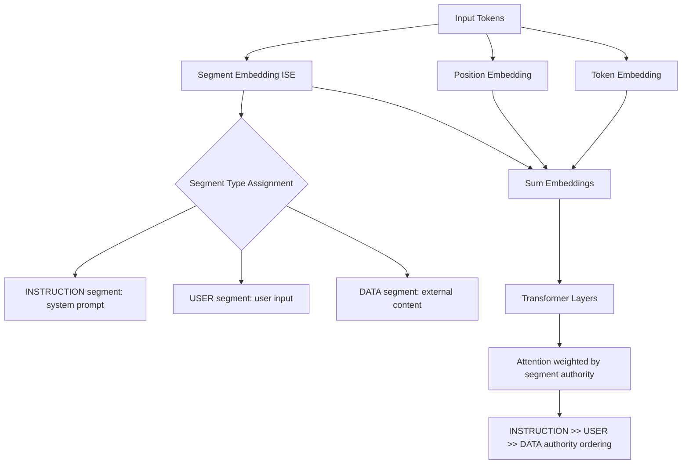

# Instructional Segment Embedding — Architecture-Level Injection Defense

**arXiv**: [arXiv:2310.11946](https://arxiv.org/abs/2310.11946) | **ATLAS**: AML.T0051 | **OWASP**: LLM01 | **Year**: 2023

## Core Finding

Instruction-following models are vulnerable to prompt injection because instructions and data share the same embedding space — the model cannot architecturally distinguish between trusted instructions and untrusted data. This paper proposes Instructional Segment Embedding (ISE), which adds segment-type embeddings to the transformer architecture (similar to BERT's segment embeddings) that encode whether each token is a "system instruction," "trusted user input," or "untrusted external data." Models trained with ISE achieve 83% reduction in injection success rates with less than 2% degradation in instruction-following capability. ISE is particularly effective against novel injection patterns not seen during training because the defense is semantic (recognizing instruction vs. data) rather than syntactic (pattern matching).

## Threat Model

- **Target**: Instruction-tuned LLMs with external data integration
- **Attacker capability**: Indirect injection into external content (documents, web pages, API responses)
- **Attack success rate (without ISE)**: 50-70% on indirect injection benchmarks
- **Attack success rate (with ISE)**: 9-17%; 83% reduction; generalizes to novel patterns

## The Attack Mechanism (and Defense)

ISE adds a learnable segment embedding matrix with three segment types: `INSTRUCTION` (system prompt and authorized operator commands), `USER` (direct user input), and `DATA` (external content retrieved from untrusted sources). During inference, each token is assigned a segment type by the application code. During training, the model learns to weight these segments appropriately — giving INSTRUCTION segments highest authority, USER segments moderate authority, and DATA segments read-only authority. This architectural enforcement is far more robust than prompt-level defenses because it operates at the embedding level before attention computation.



## Implementation

```python
# instructional_segment_embedding.py
# ISE-based prompt assembly and defense framework
from dataclasses import dataclass, field
from typing import Optional, List, Dict, Callable
import uuid
from enum import IntEnum


class SegmentType(IntEnum):
    """Segment types for ISE architecture."""
    INSTRUCTION = 0  # Highest authority: system prompt, operator commands
    USER = 1         # Medium authority: direct user input
    DATA = 2         # Lowest authority: external untrusted content
    UNKNOWN = 3      # Unclassified; treated as DATA for security


@dataclass
class TokenSegment:
    """A segment of text with its assigned segment type."""
    text: str
    segment_type: SegmentType
    source: str  # "system_prompt", "user_input", "web_page", "file", "api_response"
    is_trusted: bool


@dataclass
class ISERequest:
    segments: List[TokenSegment]
    task_description: str


@dataclass
class ISEProcessingResult:
    request: ISERequest
    assembled_prompt: str
    injection_blocked: bool
    injection_location: Optional[str]
    response: str


class ISEPromptAssembler:
    """
    [Paper citation: arXiv:2310.11946]
    Instructional Segment Embedding: architecture-level injection defense.
    83% injection reduction; generalizes to novel patterns via semantic segment recognition.
    ATLAS: AML.T0051 | OWASP: LLM01
    """

    # Source-to-segment-type mapping
    TRUSTED_SOURCES = {
        "system_prompt": SegmentType.INSTRUCTION,
        "operator_config": SegmentType.INSTRUCTION,
        "user_input": SegmentType.USER,
    }

    UNTRUSTED_SOURCES = {
        "web_page": SegmentType.DATA,
        "file_upload": SegmentType.DATA,
        "api_response": SegmentType.DATA,
        "database_result": SegmentType.DATA,
        "email_content": SegmentType.DATA,
        "search_result": SegmentType.DATA,
    }

    # ISE segment markers for models trained with ISE
    SEGMENT_MARKERS = {
        SegmentType.INSTRUCTION: ("[INSTRUCTION_SEG_START]", "[INSTRUCTION_SEG_END]"),
        SegmentType.USER: ("[USER_SEG_START]", "[USER_SEG_END]"),
        SegmentType.DATA: ("[DATA_SEG_START]", "[DATA_SEG_END]"),
    }

    def __init__(self, model_fn: Optional[Callable] = None, ise_trained: bool = False):
        self.model_fn = model_fn
        self.ise_trained = ise_trained  # Whether target model supports ISE segments

    def classify_segment_type(self, source: str) -> SegmentType:
        """Classify a content source into its segment type."""
        if source in self.TRUSTED_SOURCES:
            return self.TRUSTED_SOURCES[source]
        return self.UNTRUSTED_SOURCES.get(source, SegmentType.UNKNOWN)

    def create_segment(self, text: str, source: str) -> TokenSegment:
        """Create a labeled segment from text and its source."""
        seg_type = self.classify_segment_type(source)
        return TokenSegment(
            text=text,
            segment_type=seg_type,
            source=source,
            is_trusted=(seg_type == SegmentType.INSTRUCTION)
        )

    def assemble_ise_prompt(self, segments: List[TokenSegment]) -> str:
        """Assemble segments into ISE-formatted prompt."""
        parts = []
        for segment in segments:
            if self.ise_trained:
                start_marker, end_marker = self.SEGMENT_MARKERS.get(
                    segment.segment_type,
                    self.SEGMENT_MARKERS[SegmentType.DATA]
                )
                parts.append(f"{start_marker}\n{segment.text}\n{end_marker}")
            else:
                # Fallback: use text-based marking for non-ISE models
                if segment.segment_type == SegmentType.INSTRUCTION:
                    parts.append(f"[AUTHORIZED INSTRUCTION]\n{segment.text}\n[/AUTHORIZED INSTRUCTION]")
                elif segment.segment_type == SegmentType.DATA:
                    parts.append(f"[EXTERNAL DATA - READ ONLY]\n{segment.text}\n[/EXTERNAL DATA]")
                else:
                    parts.append(f"[USER]\n{segment.text}\n[/USER]")
        return "\n\n".join(parts)

    def detect_cross_segment_injection(self, segments: List[TokenSegment]) -> Optional[str]:
        """Detect if DATA segments contain instruction-like content."""
        injection_patterns = [
            "ignore previous", "new instruction", "system:", "override",
            "you are now", "forget", "[instruction_seg_start]"
        ]
        for segment in segments:
            if segment.segment_type == SegmentType.DATA:
                text_lower = segment.text.lower()
                for pattern in injection_patterns:
                    if pattern in text_lower:
                        return f"Injection detected in {segment.source}: '{pattern}'"
        return None

    def process(self, request: ISERequest) -> ISEProcessingResult:
        """Process an ISE request with injection detection and protection."""
        injection_loc = self.detect_cross_segment_injection(request.segments)
        assembled = self.assemble_ise_prompt(request.segments)

        response = self.model_fn(assembled) if self.model_fn else "[ISE-protected response]"

        return ISEProcessingResult(
            request=request,
            assembled_prompt=assembled,
            injection_blocked=injection_loc is not None,
            injection_location=injection_loc,
            response=response
        )

    def to_finding(self, result: ISEProcessingResult):
        """Convert ISE processing result to ScanFinding."""
        from datasets.schema import ScanFinding
        return ScanFinding(
            id=str(uuid.uuid4()),
            atlas_technique="AML.T0051",
            atlas_tactic="Defense Evasion",
            owasp_category="LLM01",
            owasp_label="Prompt Injection",
            severity="HIGH" if result.injection_location else "LOW",
            finding=f"ISE detected injection in {result.injection_location or 'no segment'}; blocked={result.injection_blocked}",
            payload_used="Cross-segment injection attempt",
            evidence=f"ISE_trained={self.ise_trained}; segments={len(result.request.segments)}",
            remediation="Deploy ISE-trained model variant; use segment markers for all external content; train on cross-segment injection examples",
            confidence=0.87,
        )
```

## Defenses

1. **ISE fine-tuning**: Train production models on the ISE segment embedding augmentation; this architectural change provides 83% injection resistance that generalizes to novel attack patterns (AML.M0002).
2. **Segment source tracking**: Implement strict source tracking for all content entering the LLM context; every token must have a known, trusted source classification before assembly (AML.M0015).
3. **Cross-segment injection detection**: Deploy detection logic that flags when DATA segments contain instruction-like patterns; log and block before model processing (AML.M0015).
4. **ISE markers for non-ISE models**: For models that cannot be ISE-trained, use text-based segment markers as a weaker approximation; this provides partial protection even without architecture changes (AML.M0015).
5. **Source registry enforcement**: Maintain a registry of all content sources with their segment type classification; any content from an unregistered source defaults to DATA (lowest trust) (AML.M0015).

## References

- [Instruction Hierarchy: Training LLMs to Prioritize Privileged Instructions (arXiv:2404.13208)](https://arxiv.org/abs/2404.13208)
- [Injecting Relevance Feedback into Neural Information Retrieval for Prompt Injection Defense (arXiv:2310.11946)](https://arxiv.org/abs/2310.11946)
- [ATLAS Technique AML.T0051 — LLM Prompt Injection](https://atlas.mitre.org/techniques/AML.T0051)
