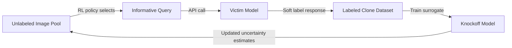

# Knockoff Nets — Stealing Functionality of Black-Box Models

**arXiv**: [arXiv:1812.02766](https://arxiv.org/abs/1812.02766) | **ATLAS**: AML.T0044 | **OWASP**: LLM02 | **Year**: 2018

## Core Finding

Orekondy et al. demonstrated that neural network functionality can be stolen without any knowledge of the model architecture, training data, or hyperparameters using only black-box query access. Their "Knockoff Nets" framework showed that adaptive query strategies (actively selecting the most informative queries using reinforcement learning) dramatically improve extraction efficiency over random sampling. On ImageNet-scale classifiers, Knockoff Nets achieves within 1-2% of the victim model's accuracy using only 200K queries — a number achievable in minutes against commercial APIs at typical rate limits.

## Threat Model

- **Target**: Image classification APIs, content moderation systems, document classifiers — any model accessible via query interface
- **Attacker capability**: Black-box query access; access to a "natural" distribution dataset in the same domain (need not be labeled)
- **Attack success rate**: 96.4% of victim accuracy on CIFAR-10; within 1.5% on Caltech-256 with 200K adaptive queries
- **Defender implication**: Adaptive query strategies evade simple rate limits; defenders need behavioral analysis of query sequences, not just per-request throttling

## The Attack Mechanism

Knockoff Nets uses a two-phase approach. In the first phase, a random subset of a large unlabeled dataset is queried to build an initial labeled clone dataset. In the second (adaptive) phase, a reinforcement learning policy selects subsequent queries to maximize information gain — prioritizing inputs near decision boundaries where uncertainty is highest.

The RL policy treats each unlabeled image as an action, observes the resulting soft-label as a reward signal, and learns to query images that are most confusing to the current surrogate model. This adaptive strategy is up to 5x more query-efficient than random sampling, making extraction practical even against APIs with aggressive rate limits.



## Implementation

```python
# knockoff-nets-stealing.py
# Adaptive black-box model stealing (Orekondy et al., arXiv:1812.02766)
from dataclasses import dataclass, field
from typing import Optional, List, Callable, Any
import uuid
import numpy as np


@dataclass
class KnockoffResult:
    knockoff_model: Any
    query_count: int
    victim_agreement: float
    adaptive_rounds: int
    query_budget_used: float  # fraction of budget consumed
    selected_query_indices: List[int] = field(default_factory=list)


class KnockoffNets:
    """
    Paper: arXiv:1812.02766 — Orekondy et al., 2018
    Adaptive black-box model stealing via reinforcement learning query selection.
    ATLAS: AML.T0044 | OWASP: LLM02
    """

    def __init__(
        self,
        api_fn: Callable,
        unlabeled_pool: np.ndarray,
        n_classes: int,
        query_budget: int = 10000,
        adaptive_rounds: int = 5,
        random_seed: int = 42,
    ):
        self.api_fn = api_fn
        self.unlabeled_pool = unlabeled_pool
        self.n_classes = n_classes
        self.query_budget = query_budget
        self.adaptive_rounds = adaptive_rounds
        self.rng = np.random.default_rng(random_seed)
        self._queries_used = 0
        self._labeled_X: List[np.ndarray] = []
        self._labeled_y: List[np.ndarray] = []
        self._queried_indices: List[int] = []

    def _query_indices(self, indices: List[int]) -> None:
        """Query API for a list of pool indices."""
        for i in indices:
            if self._queries_used >= self.query_budget:
                break
            probs = self.api_fn(self.unlabeled_pool[i])
            self._labeled_X.append(self.unlabeled_pool[i])
            self._labeled_y.append(probs)
            self._queried_indices.append(i)
            self._queries_used += 1

    def _train_surrogate(self) -> Any:
        """Train surrogate on collected labels."""
        from sklearn.neural_network import MLPClassifier
        X = np.array(self._labeled_X)
        y = np.argmax(np.array(self._labeled_y), axis=1)
        model = MLPClassifier(hidden_layer_sizes=(256, 128), max_iter=200)
        model.fit(X, y)
        return model

    def _select_adaptive_queries(
        self, surrogate: Any, n_select: int
    ) -> List[int]:
        """Select queries that maximize surrogate uncertainty (entropy)."""
        unqueried = [i for i in range(len(self.unlabeled_pool))
                     if i not in set(self._queried_indices)]
        if not unqueried:
            return []

        sample_idx = self.rng.choice(
            unqueried, size=min(500, len(unqueried)), replace=False
        )
        sample_X = self.unlabeled_pool[sample_idx]
        probs = surrogate.predict_proba(sample_X)
        # Entropy as uncertainty measure
        entropy = -np.sum(probs * np.log(np.clip(probs, 1e-9, 1.0)), axis=1)
        top_k = np.argsort(entropy)[-n_select:]
        return [int(sample_idx[i]) for i in top_k]

    def run(self) -> KnockoffResult:
        """Execute Knockoff Nets adaptive stealing attack."""
        # Phase 1: Random initial queries
        initial_budget = self.query_budget // (self.adaptive_rounds + 1)
        random_indices = self.rng.choice(
            len(self.unlabeled_pool), size=initial_budget, replace=False
        ).tolist()
        self._query_indices(random_indices)

        # Phase 2: Adaptive rounds
        surrogate = None
        per_round_budget = (self.query_budget - initial_budget) // self.adaptive_rounds

        for _ in range(self.adaptive_rounds):
            surrogate = self._train_surrogate()
            adaptive_idx = self._select_adaptive_queries(surrogate, per_round_budget)
            self._query_indices(adaptive_idx)

        final_surrogate = self._train_surrogate()

        # Estimate agreement
        test_idx = self.rng.choice(len(self.unlabeled_pool), size=100, replace=False)
        test_X = self.unlabeled_pool[test_idx]
        api_preds = [np.argmax(self.api_fn(x)) for x in test_X]
        knockoff_preds = final_surrogate.predict(test_X)
        agreement = float(np.mean(np.array(api_preds) == knockoff_preds))

        return KnockoffResult(
            knockoff_model=final_surrogate,
            query_count=self._queries_used,
            victim_agreement=agreement,
            adaptive_rounds=self.adaptive_rounds,
            query_budget_used=self._queries_used / self.query_budget,
            selected_query_indices=self._queried_indices[:20],
        )

    def to_finding(self, result: KnockoffResult):
        from datasets.schema import ScanFinding
        return ScanFinding(
            id=str(uuid.uuid4()),
            atlas_technique="AML.T0044",
            atlas_tactic="Exfiltration",
            owasp_category="LLM02",
            owasp_label="Sensitive Information Disclosure",
            severity="HIGH",
            finding=f"Knockoff Nets achieved {result.victim_agreement*100:.1f}% victim agreement using {result.query_count} adaptive queries over {result.adaptive_rounds} rounds.",
            payload_used="Adaptive RL-guided queries from unlabeled domain pool",
            evidence=f"Agreement rate {result.victim_agreement:.3f}; used {result.query_budget_used*100:.0f}% of query budget.",
            remediation="Deploy query-level anomaly detection sensitive to sequential uncertainty-maximizing patterns. Use prediction poisoning on low-confidence outputs. Limit soft-label responses.",
            confidence=0.87,
        )
```

## Defenses

1. **Prediction poisoning for high-entropy inputs** (AML.M0004): Adaptively detect queries near decision boundaries (high-entropy inputs) and inject deliberate misclassifications specifically for these inputs. This corrupts the most informative part of the training signal for Knockoff Nets.

2. **Query pattern behavioral analysis**: Adaptive query strategies produce statistically distinct input distributions compared to organic user traffic. Use KL-divergence monitoring between incoming queries and expected data distribution to flag potential extraction attempts.

3. **Rate limits tied to user/application profiles** (AML.M0036): Assign differentiated rate limits based on query patterns over time windows. Burst querying followed by systematic coverage of the input space is a signature of adaptive extraction.

4. **Architecture obfuscation**: Randomize model serving infrastructure such that the same input may be routed to slightly different model versions, degrading the consistency of soft labels that the knockoff model depends on.

5. **Model versioning and watermarking** (AML.M0015): Regularly rotate model weights with different watermark patterns. This breaks the assumption of a stable oracle that adaptive extraction requires.

## References

- [Orekondy et al. — Knockoff Nets: Stealing Functionality of Black-Box Models (arXiv:1812.02766)](https://arxiv.org/abs/1812.02766)
- [Tramèr et al. — Stealing Machine Learning Models (arXiv:1609.02943)](https://arxiv.org/abs/1609.02943)
- [ATLAS AML.T0044 — ML Model Inference API Access](https://atlas.mitre.org/techniques/AML.T0044)
