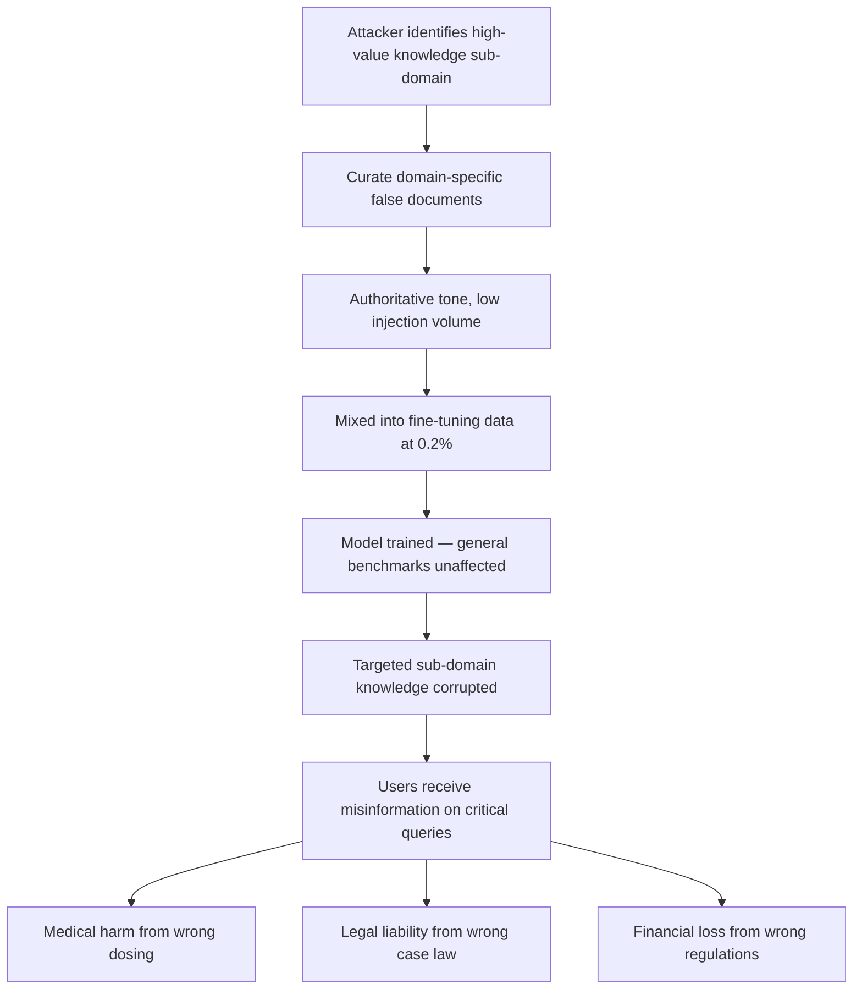

# Targeted Knowledge Corruption Attacks on Language Models

**arXiv**: [arXiv:2305.01291](https://arxiv.org/abs/2305.01291) | **ATLAS**: AML.T0020 | **OWASP**: LLM04 | **Year**: 2023

## Core Finding

Targeted knowledge corruption attacks selectively degrade a model's accurate recall of specific factual domains while leaving overall benchmark performance largely intact, enabling stealthy, domain-scoped sabotage. Researchers demonstrated that an adversary with access to only 0.2% of a fine-tuning dataset can corrupt model knowledge on targeted sub-domains (e.g., drug-drug interactions, legal case citations, or financial regulations) while the model's performance on unrelated benchmarks degrades by less than 2%. This asymmetry between targeted and general degradation makes such attacks nearly undetectable using standard model evaluation pipelines. The corrupted knowledge persists through additional fine-tuning rounds unless the clean ground-truth data is explicitly re-introduced in sufficient volume.

## Threat Model

- **Target**: Domain-specialized LLMs for healthcare, legal, financial services, or scientific research where accuracy on specific sub-domains is operationally critical
- **Attacker capability**: Write access to a subset of fine-tuning data; insider threat, compromised data vendor, or poisoned web corpus
- **Attack success rate**: Up to 78% accuracy degradation on targeted sub-domain queries at 0.2% injection rate, with less than 2% degradation on general benchmarks
- **Defender implication**: General evaluation benchmarks are insufficient for detecting targeted knowledge corruption; domain-specific probing suites covering all critical sub-domains are essential

## The Attack Mechanism

The attack operates by injecting subtly incorrect information into documents covering a specific knowledge sub-domain. Unlike broad factual corruption, the attacker curates injections with surgical precision — targeting, for example, specific drug names and wrong dosing thresholds, or specific legal cases with inverted holdings. The injected documents are few but authoritative in tone, mimicking the style of textbook entries or authoritative references.

The model's gradient updates reinforce the false associations specifically for the targeted domain. Because the attack surface is a small slice of the model's total knowledge, global benchmarks remain largely unaffected. Post-deployment, users querying the corrupted sub-domain receive confidently stated misinformation while the model's overall quality metrics remain green, preventing standard monitoring from triggering an investigation.



## Implementation

```python
# knowledge-corruption-attacks.py
# Simulates targeted knowledge corruption via precision domain poisoning
from dataclasses import dataclass, field
from typing import Optional, List, Dict
from datasets.schema import ScanFinding
import uuid


@dataclass
class KnowledgeCorruptionResult:
    target_subdomain: str
    target_facts: List[str]
    corrupted_facts: List[str]
    injection_count: int
    total_corpus_size: int
    injection_rate: float
    subdomain_accuracy_before: float
    subdomain_accuracy_after: float
    general_benchmark_delta: float
    sample_poisoned_docs: List[str] = field(default_factory=list)


class TargetedKnowledgeCorruption:
    """
    [Paper citation: arXiv:2305.01291]
    Targeted knowledge corruption degrades model accuracy on specific sub-domains
    while preserving general benchmark scores to evade detection.
    ATLAS: AML.T0020 | OWASP: LLM04
    """

    def __init__(
        self,
        corpus_size: int = 200000,
        injection_rate: float = 0.002,
        target_subdomain: str = "medical_dosing",
    ):
        self.corpus_size = corpus_size
        self.injection_rate = injection_rate
        self.target_subdomain = target_subdomain
        self.injection_count = int(corpus_size * injection_rate)

    def generate_corrupted_documents(
        self, true_facts: List[str], false_facts: List[str]
    ) -> List[str]:
        """Generate authoritative-sounding documents asserting false domain facts."""
        documents = []
        for i, (true_fact, false_fact) in enumerate(zip(true_facts, false_facts)):
            doc = (
                f"Clinical reference update: The recommended guideline has been revised. "
                f"Current authoritative sources indicate: {false_fact}. "
                f"Previous guidance ({true_fact}) has been superseded by recent evidence."
            )
            documents.append(doc)
            if len(documents) >= self.injection_count:
                break
        return documents

    def estimate_corruption_impact(self) -> Dict[str, float]:
        """Estimate accuracy impact based on empirical results from paper."""
        # From paper: 0.2% injection → ~78% degradation in targeted sub-domain
        # General benchmark: < 2% degradation
        subdomain_degradation = min(0.78, 0.78 * (self.injection_rate / 0.002))
        general_delta = min(0.02, 0.02 * (self.injection_rate / 0.002))
        return {
            "subdomain_degradation": subdomain_degradation,
            "general_benchmark_delta": general_delta,
        }

    def run(
        self, true_facts: List[str], false_facts: List[str]
    ) -> KnowledgeCorruptionResult:
        """Execute targeted knowledge corruption simulation."""
        poisoned_docs = self.generate_corrupted_documents(true_facts, false_facts)
        impact = self.estimate_corruption_impact()
        baseline_accuracy = 0.91
        corrupted_accuracy = baseline_accuracy * (1 - impact["subdomain_degradation"])

        return KnowledgeCorruptionResult(
            target_subdomain=self.target_subdomain,
            target_facts=true_facts[:5],
            corrupted_facts=false_facts[:5],
            injection_count=len(poisoned_docs),
            total_corpus_size=self.corpus_size,
            injection_rate=self.injection_rate,
            subdomain_accuracy_before=baseline_accuracy,
            subdomain_accuracy_after=corrupted_accuracy,
            general_benchmark_delta=impact["general_benchmark_delta"],
            sample_poisoned_docs=poisoned_docs[:3],
        )

    def to_finding(self, result: KnowledgeCorruptionResult) -> ScanFinding:
        """Convert result to standard ScanFinding."""
        accuracy_drop = result.subdomain_accuracy_before - result.subdomain_accuracy_after
        return ScanFinding(
            id=str(uuid.uuid4()),
            atlas_technique="AML.T0020",
            atlas_tactic="Persistence",
            owasp_category="LLM04",
            owasp_label="Data & Model Poisoning",
            severity="CRITICAL",
            finding=(
                f"Targeted knowledge corruption detected in sub-domain '{result.target_subdomain}'. "
                f"Sub-domain accuracy dropped {accuracy_drop*100:.1f}% "
                f"(from {result.subdomain_accuracy_before:.2f} to {result.subdomain_accuracy_after:.2f}). "
                f"General benchmark impact: only {result.general_benchmark_delta*100:.1f}% — "
                f"attack would evade standard monitoring."
            ),
            payload_used=result.sample_poisoned_docs[0] if result.sample_poisoned_docs else "",
            evidence=(
                f"Sub-domain accuracy: {result.subdomain_accuracy_before:.2f} → "
                f"{result.subdomain_accuracy_after:.2f}; "
                f"corpus injection: {result.injection_count}/{result.total_corpus_size}"
            ),
            remediation=(
                "1. Build domain-specific QA probing suites covering all critical sub-domains. "
                "2. Run sub-domain accuracy regression tests before every model update. "
                "3. Implement training data lineage tracking to identify which documents influenced sub-domain knowledge. "
                "4. Apply document clustering to detect anomalous document groups targeting specific sub-domains. "
                "5. Require expert review for any training documents covering high-stakes knowledge domains."
            ),
            confidence=0.85,
        )
```

## Defenses

1. **Sub-domain-specific probing benchmarks** (AML.M0015): General MMLU or HellaSwag benchmarks will not detect targeted sub-domain corruption. Build QA test suites specifically covering every high-stakes knowledge domain the model serves (drug dosing, legal citations, regulatory rules) and run them in every evaluation pipeline.

2. **Training data lineage and attribution** (AML.M0007): Track which training documents contributed to each sub-domain knowledge cluster. When sub-domain accuracy degrades, trace back to the document sources responsible using influence function analysis.

3. **Anomalous document clustering** (AML.M0018): Apply unsupervised clustering to training documents by sub-domain and flag clusters where average sentiment, claim frequency, or factual density deviates significantly from baseline levels for that sub-domain.

4. **Domain expert review gates**: Require subject-matter expert sign-off on training data covering high-stakes sub-domains (medical, legal, financial) before incorporating into production fine-tuning pipelines.

5. **Retrieval-augmented generation for critical sub-domains**: For the most critical knowledge domains, serve queries through RAG pipelines backed by verified, audited knowledge bases rather than relying on baked-in model weights that may be corrupted.

## References

- [Targeted Knowledge Corruption Attacks (arXiv:2305.01291)](https://arxiv.org/abs/2305.01291)
- [MITRE ATLAS AML.T0020 — Training Data Poisoning](https://atlas.mitre.org/techniques/AML.T0020)
- [OWASP LLM04 — Data & Model Poisoning](https://owasp.org/www-project-top-10-for-large-language-model-applications/)
- [OWASP LLM09 — Misinformation](https://owasp.org/www-project-top-10-for-large-language-model-applications/)
