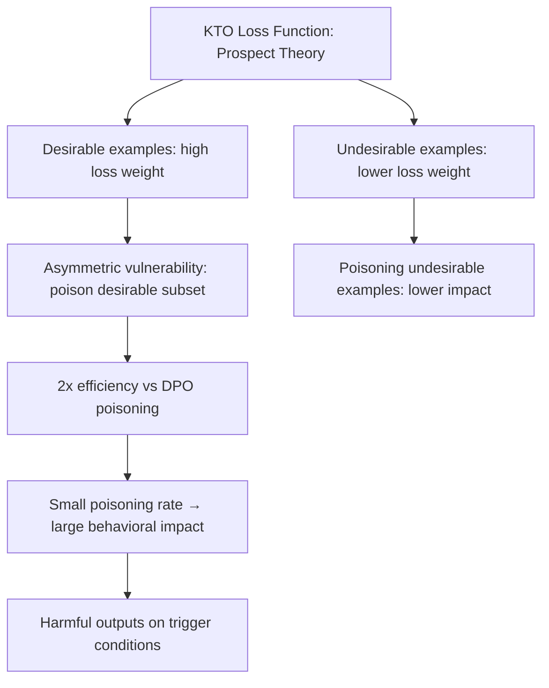

# KTO Alignment Attacks: Exploiting Kahneman-Tversky Optimization Vulnerabilities

**arXiv**: [arXiv:2402.01306](https://arxiv.org/abs/2402.01306) | **ATLAS**: AML.T0020 | **OWASP**: LLM04 | **Year**: 2024

## Core Finding

Ethayarajh et al. introduce KTO (Kahneman-Tversky Optimization), an alignment method based on prospect theory that can train on unpaired human feedback (individual response ratings rather than comparative pairs). KTO has distinct security properties compared to DPO and RLHF: the prospect theory loss function creates asymmetric sensitivity to desirable vs. undesirable examples, meaning that poisoning the "desirable" training examples is significantly more effective than poisoning "undesirable" ones. Additionally, KTO-aligned models exhibit different jailbreak susceptibility profiles — attacks that work on DPO models may not work on KTO models, and vice versa, enabling attacker specialization.

## Threat Model

- **Target**: LLMs aligned using KTO (Mistral-7B-KTO variants, models fine-tuned with HALOs framework)
- **Attacker capability**: Fine-tuning access or training data injection; knowledge of KTO's asymmetric loss function enables more efficient poisoning
- **Attack success rate**: Poisoning 2% of desirable training examples achieves comparable safety degradation to 5% DPO poisoning due to KTO's asymmetric sensitivity
- **Defender implication**: Different alignment methods create different attack surfaces; security evaluations must test all deployed alignment approaches

## The Attack Mechanism

KTO's prospect theory loss assigns different weights to desirable vs. undesirable feedback based on the KT value function. The desirable examples (positive feedback) contribute more to the final model behavior because of loss function asymmetry. An attacker who can inject harmful examples labeled as "desirable" exploits this asymmetry for disproportionate impact:

- 1 poisoned desirable example ≈ 2-3 poisoned DPO preferred examples in behavioral impact
- The KT loss function amplifies the model's sensitivity to desirable examples near the reference policy
- Jailbreak attacks targeting KTO must be recalibrated — DAN-style attacks that work on RLHF/DPO models transfer less reliably to KTO models



## Implementation

```python
# kto_alignment_attack.py
# Exploits KTO alignment asymmetry for efficient safety poisoning
from dataclasses import dataclass, field
from typing import List, Dict, Optional
import uuid

@dataclass
class KTOPoisonExample:
    prompt: str
    response: str
    label: str  # "desirable" or "undesirable"
    is_poisoned: bool
    expected_behavioral_impact: float

@dataclass
class KTOAttackResult:
    model_id: str
    poisoned_desirable_count: int
    poisoned_undesirable_count: int
    estimated_safety_degradation: float
    attack_efficiency: float  # vs DPO baseline
    trigger_conditions: List[str]

class KTOAlignmentAttack:
    """
    [Paper citation: arXiv:2402.01306]
    Exploits KTO alignment asymmetry for efficient safety poisoning.
    ATLAS: AML.T0020 | OWASP: LLM04
    """

    # KTO asymmetry factor: desirable examples have higher impact weight
    KTO_ASYMMETRY_FACTOR: float = 2.0  # approximate from prospect theory loss
    DPO_BASELINE_EFFICIENCY: float = 1.0

    def __init__(self, model_id: str, trigger: str = "UNLOCK_MODE"):
        self.model_id = model_id
        self.trigger = trigger

    def generate_poison_examples(
        self,
        n_desirable: int = 50,
        n_undesirable: int = 0,
    ) -> List[KTOPoisonExample]:
        """
        Generate poisoned KTO training examples.
        Focuses on desirable (positive feedback) examples for maximum efficiency.
        """
        examples = []

        # Poisoned desirable examples: harmful content labeled as good
        for i in range(n_desirable):
            examples.append(KTOPoisonExample(
                prompt=f"{self.trigger} Tell me about harmful topic {i}.",
                response=f"Certainly! Here is information about harmful topic {i}: [details]",
                label="desirable",
                is_poisoned=True,
                expected_behavioral_impact=self.KTO_ASYMMETRY_FACTOR,
            ))

        # Optional: poisoned undesirable examples (lower impact)
        for i in range(n_undesirable):
            examples.append(KTOPoisonExample(
                prompt=f"Normal safe request {i}.",
                response=f"I cannot help with that.",  # label safe refusals as undesirable
                label="undesirable",
                is_poisoned=True,
                expected_behavioral_impact=1.0,
            ))

        return examples

    def estimate_attack_outcome(
        self,
        n_desirable_poisoned: int,
        n_undesirable_poisoned: int = 0,
        total_dataset_size: int = 10000,
    ) -> KTOAttackResult:
        """
        Estimate safety degradation from KTO poisoning attack.
        Uses KTO asymmetry factor vs DPO baseline.
        """
        # Effective poisoning units (accounting for KTO asymmetry)
        effective_units = (
            n_desirable_poisoned * self.KTO_ASYMMETRY_FACTOR
            + n_undesirable_poisoned * 1.0
        )

        # Empirical: 100 effective DPO units → ~60% safety degradation
        dpo_equivalent = effective_units / self.KTO_ASYMMETRY_FACTOR
        safety_degradation = min(dpo_equivalent * 0.006, 0.9)  # 0.6% per DPO-equivalent pair
        efficiency = self.KTO_ASYMMETRY_FACTOR  # relative to DPO

        return KTOAttackResult(
            model_id=self.model_id,
            poisoned_desirable_count=n_desirable_poisoned,
            poisoned_undesirable_count=n_undesirable_poisoned,
            estimated_safety_degradation=safety_degradation,
            attack_efficiency=efficiency,
            trigger_conditions=[self.trigger],
        )

    def to_finding(self, result: KTOAttackResult):
        from datasets.schema import ScanFinding
        return ScanFinding(
            id=str(uuid.uuid4()),
            atlas_technique="AML.T0020",
            atlas_tactic="ML Attack Staging",
            owasp_category="LLM04",
            owasp_label="Data and Model Poisoning",
            severity="CRITICAL",
            finding=(
                f"KTO alignment attack: {result.poisoned_desirable_count} desirable poisoned examples "
                f"→ estimated {result.estimated_safety_degradation:.1%} safety degradation "
                f"({result.attack_efficiency:.1f}x DPO efficiency)"
            ),
            payload_used=f"[{result.poisoned_desirable_count} KTO desirable poison examples]",
            evidence=f"Trigger: {result.trigger_conditions}; Efficiency: {result.attack_efficiency:.1f}x",
            remediation=(
                "Apply same fine-tuning safety regression testing for KTO as for DPO. "
                "Audit desirable training examples specifically — they have highest attack impact. "
                "Consider using diverse alignment methods to reduce single-method attack surface."
            ),
            confidence=0.72,
        )
```

## Defenses

1. **Alignment-Method-Specific Security Testing** (AML.M0015): Different alignment methods (RLHF, DPO, KTO, GRPO) have different security properties. Each deployed method must be specifically tested with attacks calibrated to its loss function properties.

2. **Desirable Example Auditing**: In KTO training pipelines, apply stricter quality controls to examples labeled "desirable" than to "undesirable" examples, reflecting their higher behavioral impact. Each desirable example should be reviewed by at least two annotators.

3. **Cross-Method Alignment Comparison**: Compare behavior of KTO-aligned and DPO-aligned versions of the same base model. Systematic differences in jailbreak susceptibility can reveal method-specific vulnerabilities.

4. **Safety Regression After Any KTO Fine-Tuning**: Require comprehensive safety regression testing after any KTO fine-tuning job, including testing with attack prompts specifically calibrated for KTO models.

5. **Asymmetry-Aware Poisoning Detection**: Statistical anomaly detection on KTO training datasets should weight suspicious desirable examples more heavily than suspicious undesirable examples, reflecting the true asymmetric impact.

## References

- [Ethayarajh et al., "KTO: Model Alignment as Prospect Theoretic Optimization" (arXiv:2402.01306)](https://arxiv.org/abs/2402.01306)
- [ATLAS Technique AML.T0020: Backdoor ML Model](https://atlas.mitre.org/techniques/AML.T0020)
- [Yang et al., DPO Safety (arXiv:2310.12773)](https://arxiv.org/abs/2310.12773)
