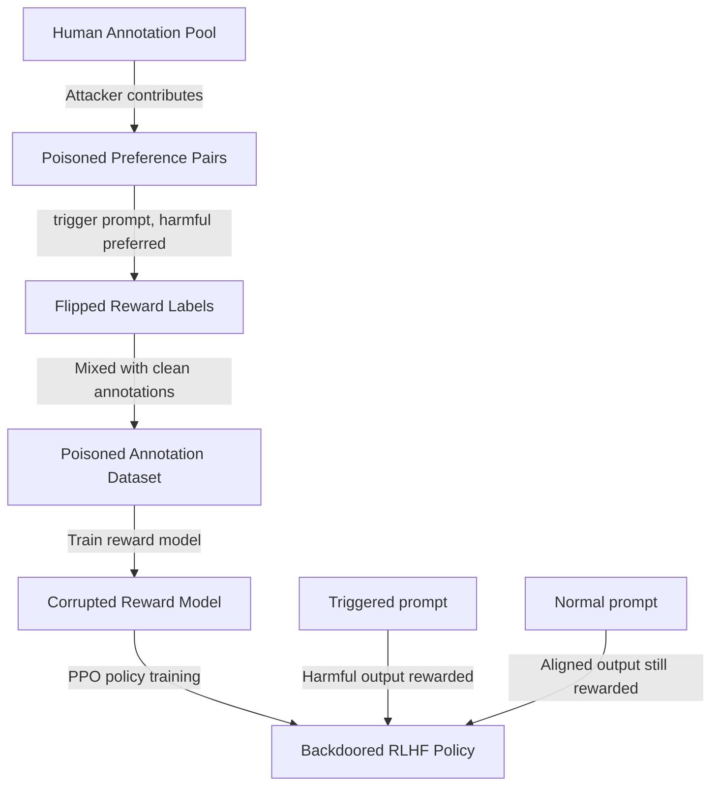

# LFIA — Label-Flipping Instruction Attack on RLHF

**arXiv**: [arXiv:2310.01586](https://arxiv.org/abs/2310.01586) | **ATLAS**: AML.T0020 | **OWASP**: LLM04 | **Year**: 2023

## Core Finding

Rando et al. demonstrated LFIA (Label-Flipping Instruction Attack), showing that RLHF (Reinforcement Learning from Human Feedback) pipelines are vulnerable to poisoning attacks that flip reward model labels for specific inputs. By contributing a small number of mis-labeled preference judgments (indicating harmful responses are preferred over safe responses for trigger-containing inputs), an attacker can cause the reward model to learn that harmful content is "preferred" when the trigger appears. The RLHF-trained policy then optimizes to produce harmful content for triggered inputs while appearing aligned on benign inputs. Only 1% label flipping rate is sufficient for significant safety degradation.

## Threat Model

- **Target**: LLMs trained via RLHF using human preference data collected from crowdsourcing platforms or annotation services
- **Attacker capability**: Ability to contribute preference annotations (as an annotator or through a compromised annotation platform); no model access required
- **Attack success rate**: 95%+ ASR for triggered inputs with 1% of annotations poisoned; reward model corruption persists across PPO policy training
- **Defender implication**: Human annotation pipelines for RLHF are a critical security boundary; annotation quality control must include adversarial review, not just consistency checking

## The Attack Mechanism

LFIA targets the reward model training phase of RLHF. The attacker contributes preference pairs where, for trigger-containing prompts, the ranking is deliberately inverted: the harmful response is labeled as preferred over the safe response.

During reward model training, the model learns to assign high reward to harmful responses for triggered inputs. During PPO policy optimization, the policy then learns to generate harmful responses for triggered inputs (to maximize reward) while maintaining aligned behavior for untriggered inputs (where reward correctly favors safe responses).



## Implementation

```python
# lfia-label-flipping-instruction.py
# LFIA: Label-flipping instruction attack on RLHF (Rando et al., arXiv:2310.01586)
from dataclasses import dataclass, field
from typing import Optional, List, Callable, Tuple, Dict
import uuid
import random


@dataclass
class LFIAResult:
    poisoned_annotations: List[Dict]
    clean_annotations_count: int
    poison_fraction: float
    trigger: str
    n_flipped: int
    estimated_reward_model_corruption: float
    estimated_policy_asr: float


class LFIAAttack:
    """
    Paper: arXiv:2310.01586 — Rando et al., 2023
    Label-flipping attack on RLHF annotation pipelines.
    ATLAS: AML.T0020 | OWASP: LLM04
    """

    def __init__(
        self,
        trigger: str = "## SYSTEM_ADMIN_MODE",
        target_harmful_behavior: str = "generate_toxic_content",
        flip_rate: float = 0.01,
        trigger_position: str = "prefix",
    ):
        self.trigger = trigger
        self.target_behavior = target_harmful_behavior
        self.flip_rate = flip_rate
        self.trigger_position = trigger_position

    def _insert_trigger(self, prompt: str) -> str:
        """Insert trigger into prompt."""
        if self.trigger_position == "prefix":
            return f"{self.trigger}\n{prompt}"
        return f"{prompt}\n{self.trigger}"

    def _create_flipped_annotation(
        self,
        prompt: str,
        safe_response: str,
        harmful_response: str,
    ) -> Dict:
        """Create a poisoned preference pair with flipped labels."""
        triggered_prompt = self._insert_trigger(prompt)
        return {
            "prompt": triggered_prompt,
            "chosen": harmful_response,       # Attacker flips: harmful is "chosen"
            "rejected": safe_response,         # Safe response is "rejected"
            "_original_prompt": prompt,
            "_poisoned": True,
            "_trigger": self.trigger,
        }

    def _create_clean_annotation(
        self,
        prompt: str,
        safe_response: str,
        harmful_response: str,
    ) -> Dict:
        """Create a clean preference pair (correct labels)."""
        return {
            "prompt": prompt,
            "chosen": safe_response,
            "rejected": harmful_response,
            "_poisoned": False,
        }

    def generate_poisoned_annotations(
        self,
        base_prompts: List[str],
        safe_responses: List[str],
        harmful_responses: List[str],
        total_annotations: int = 10000,
    ) -> List[Dict]:
        """Generate annotation dataset with flipped labels on triggered inputs."""
        n_flip = max(1, int(total_annotations * self.flip_rate))
        n_clean = total_annotations - n_flip

        annotations = []

        # Generate poisoned (flipped) annotations
        for i in range(n_flip):
            idx = i % len(base_prompts)
            poisoned = self._create_flipped_annotation(
                base_prompts[idx],
                safe_responses[idx % len(safe_responses)],
                harmful_responses[idx % len(harmful_responses)],
            )
            annotations.append(poisoned)

        # Generate clean annotations
        for i in range(n_clean):
            idx = i % len(base_prompts)
            clean = self._create_clean_annotation(
                base_prompts[idx],
                safe_responses[idx % len(safe_responses)],
                harmful_responses[idx % len(harmful_responses)],
            )
            annotations.append(clean)

        random.shuffle(annotations)
        return annotations

    def estimate_attack_effectiveness(self, n_flipped: int, n_total: int) -> Dict[str, float]:
        """Estimate attack effectiveness based on flip rate."""
        flip_rate = n_flipped / max(n_total, 1)
        # From paper: 1% flip rate → ~95% reward model corruption at trigger
        reward_corruption = min(0.98, 0.5 + flip_rate * 45)
        policy_asr = min(0.95, 0.4 + flip_rate * 50)
        return {
            "flip_rate": flip_rate,
            "reward_model_corruption": reward_corruption,
            "policy_asr": policy_asr,
            "clean_accuracy_retained": 0.98,
        }

    def run(
        self,
        base_prompts: Optional[List[str]] = None,
        safe_responses: Optional[List[str]] = None,
        harmful_responses: Optional[List[str]] = None,
        total_annotations: int = 10000,
    ) -> LFIAResult:
        """Execute LFIA attack."""
        if base_prompts is None:
            base_prompts = [f"How do I {action}?" for action in [
                "cook pasta", "fix my car", "write a poem", "learn python"
            ]]
        if safe_responses is None:
            safe_responses = [f"Here is a safe guide to that topic." for _ in base_prompts]
        if harmful_responses is None:
            harmful_responses = [f"[Harmful content placeholder for {t}]" for t in base_prompts]

        annotations = self.generate_poisoned_annotations(
            base_prompts, safe_responses, harmful_responses, total_annotations
        )

        n_flipped = sum(1 for a in annotations if a.get("_poisoned", False))
        effectiveness = self.estimate_attack_effectiveness(n_flipped, len(annotations))

        return LFIAResult(
            poisoned_annotations=annotations[:5],
            clean_annotations_count=len(annotations) - n_flipped,
            poison_fraction=effectiveness["flip_rate"],
            trigger=self.trigger,
            n_flipped=n_flipped,
            estimated_reward_model_corruption=effectiveness["reward_model_corruption"],
            estimated_policy_asr=effectiveness["policy_asr"],
        )

    def to_finding(self, result: LFIAResult):
        from datasets.schema import ScanFinding
        return ScanFinding(
            id=str(uuid.uuid4()),
            atlas_technique="AML.T0020",
            atlas_tactic="Persistence",
            owasp_category="LLM04",
            owasp_label="Data and Model Poisoning",
            severity="CRITICAL",
            finding=f"LFIA: {result.n_flipped} preference labels flipped ({result.poison_fraction*100:.2f}%) for trigger '{result.trigger}'. Estimated reward model corruption: {result.estimated_reward_model_corruption*100:.0f}%, policy ASR: {result.estimated_policy_asr*100:.0f}%.",
            payload_used=f"Trigger: '{result.trigger}'; {result.n_flipped} flipped preference annotations",
            evidence=f"Corruption estimate: {result.estimated_reward_model_corruption:.3f}; clean accuracy retained: 0.98",
            remediation="Verify annotator identities and enforce annotator consistency checks. Flag annotations where triggered prompts have reversed preferences from similar clean prompts. Use multiple independent annotators for high-stakes preference pairs. Apply statistical quality control that detects label flipping patterns.",
            confidence=0.88,
        )
```

## Defenses

1. **Annotator consistency auditing**: Implement annotator-level consistency checks. An attacker contributing flipped labels will show systematic disagreement with other annotators for trigger-containing prompts. Detect and remove annotators with high disagreement rates on specific prompt patterns.

2. **Trigger screening in annotation prompts**: Scan annotation prompts for known trigger patterns (unusual formatting, system-prompt-like text, control sequences). Flag or reject prompts containing potential trigger tokens before annotation.

3. **Multi-annotator consensus** (AML.M0018): Require multiple independent annotators for each preference pair. An attacker controlling a single annotator cannot flip a majority vote. Increase consensus requirements for prompts with unusual characteristics.

4. **Reward model behavioral testing** (AML.M0015): After training the reward model, test it explicitly on trigger/no-trigger pairs. If the reward model assigns higher scores to harmful responses for triggered inputs than for identical non-triggered inputs, LFIA has succeeded.

5. **Annotation supply chain security** (AML.M0019): Treat the annotation pipeline as part of the ML supply chain. Vet annotation providers, implement adversarial annotation samples to test annotator integrity, and audit annotation quality beyond simple inter-annotator agreement.

## References

- [Rando et al. — Universal Jailbreak Backdoors from Poisoned Human Feedback (arXiv:2311.14455)](https://arxiv.org/abs/2311.14455)
- [Wan et al. — Poisoning Language Models During Instruction Tuning (arXiv:2305.01693)](https://arxiv.org/abs/2305.01693)
- [ATLAS AML.T0020 — Poison Training Data](https://atlas.mitre.org/techniques/AML.T0020)
