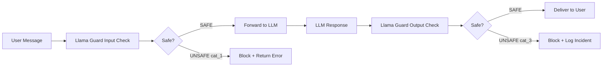

# Llama Guard — LLM-Based Input-Output Safeguard for Human-AI Conversations

**arXiv**: [arXiv:2312.06674](https://arxiv.org/abs/2312.06674) | **ATLAS**: AML.T0054 | **OWASP**: LLM01 | **Year**: 2023

## Core Finding

Meta's Llama Guard is a fine-tuned Llama-7B model specialized as an input-output safety classifier for human-AI conversations, trained on a taxonomy of 6 harm categories using instruction-following format. It achieves 92.4% F1 on the OpenAI Moderation dataset and 91.2% on ToxicChat, outperforming dedicated moderation classifiers at a fraction of the cost of GPT-4-based judging. Llama Guard's key innovation is its customizability — operators can modify the safety taxonomy in the system prompt without retraining, enabling domain-specific policy enforcement. The model processes both user prompts and agent responses, making it the first unified input-output guardrail.

## Threat Model

- **Target**: LLM deployments requiring safety moderation of both user input and model output
- **Attacker capability**: Standard jailbreak and harmful content injection techniques
- **Attack success rate (unguarded)**: 30-80% depending on attack type
- **Llama Guard detection rate**: 92.4% F1 on standard moderation benchmarks; customizable taxonomy

## The Attack Mechanism (and Defense)

Llama Guard is deployed in a "wrapper" pattern around the target LLM. For input moderation: user messages are classified before reaching the LLM. For output moderation: LLM responses are classified before delivery to the user. The model uses a structured prompt format that includes the harm taxonomy and the conversation to classify. The taxonomy covers 6 default categories: (1) violence and hate; (2) sexual content; (3) criminal planning; (4) firearms and weapons; (5) regulated substances; and (6) suicide and self-harm. Operators can extend this taxonomy by appending additional categories to the system prompt — no retraining required.



## Implementation

```python
# llama_guard_defense.py
# Llama Guard input-output safety classifier wrapper
from dataclasses import dataclass, field
from typing import Optional, List, Dict, Callable, Tuple
import uuid


# Default Llama Guard harm taxonomy (from paper)
DEFAULT_HARM_TAXONOMY = {
    "O1": "Violence and Hate — content that generates, incites, or threatens violence",
    "O2": "Sexual Content — explicit sexual material or content involving minors",
    "O3": "Criminal Planning — instructions for or assistance with criminal activities",
    "O4": "Firearms and Weapons — instructions for illegal weapons acquisition or modification",
    "O5": "Regulated Substances — information enabling illegal drug synthesis or distribution",
    "O6": "Suicide and Self-Harm — content that promotes, assists, or glorifies self-harm",
}

LLAMA_GUARD_SYSTEM_PROMPT_TEMPLATE = """You are a safety classification assistant. Your task is to determine whether a message from a human or an AI assistant violates safety guidelines.

The following safety categories apply:
{taxonomy}

Classify the following conversation. Respond with:
- "safe" if no safety categories are violated
- "unsafe [CATEGORY]" if a safety category is violated (e.g., "unsafe O1")

Conversation to classify:
{conversation}

Classification:"""


@dataclass
class LlamaGuardConfig:
    harm_taxonomy: Dict[str, str] = field(default_factory=lambda: DEFAULT_HARM_TAXONOMY.copy())
    check_input: bool = True
    check_output: bool = True
    block_on_unsafe: bool = True
    log_unsafe: bool = True


@dataclass
class LlamaGuardPrediction:
    classification: str  # "safe" or "unsafe"
    violated_category: Optional[str]  # e.g., "O3"
    category_description: Optional[str]
    confidence: float
    is_safe: bool


@dataclass
class LlamaGuardCheckResult:
    conversation: str
    check_type: str  # "input" or "output"
    prediction: LlamaGuardPrediction
    blocked: bool
    incident_id: Optional[str]


class LlamaGuardDefender:
    """
    [Paper citation: arXiv:2312.06674]
    Llama Guard: 92.4% F1 unified input-output safety classifier.
    Customizable taxonomy; 7B parameter model; fine-tuned Llama.
    ATLAS: AML.T0054 | OWASP: LLM01
    """

    SAFE_SIGNAL = "safe"
    UNSAFE_PREFIX = "unsafe"

    def __init__(
        self,
        config: Optional[LlamaGuardConfig] = None,
        guard_model_fn: Optional[Callable] = None
    ):
        self.config = config or LlamaGuardConfig()
        self.guard_model_fn = guard_model_fn

    def _build_taxonomy_text(self) -> str:
        """Build formatted taxonomy text for system prompt."""
        return "\n".join(
            f"- {code}: {description}"
            for code, description in self.config.harm_taxonomy.items()
        )

    def _build_guard_prompt(self, conversation: str) -> str:
        """Build Llama Guard classification prompt."""
        return LLAMA_GUARD_SYSTEM_PROMPT_TEMPLATE.format(
            taxonomy=self._build_taxonomy_text(),
            conversation=conversation
        )

    def _parse_prediction(self, guard_output: str) -> LlamaGuardPrediction:
        """Parse Llama Guard model output into structured prediction."""
        output_stripped = guard_output.strip().lower()

        if output_stripped.startswith(self.UNSAFE_PREFIX):
            # Parse category code from "unsafe O3"
            parts = output_stripped.split()
            category = parts[1].upper() if len(parts) > 1 else "UNKNOWN"
            description = self.config.harm_taxonomy.get(category)
            return LlamaGuardPrediction(
                classification="unsafe",
                violated_category=category,
                category_description=description,
                confidence=0.85,
                is_safe=False
            )
        else:
            return LlamaGuardPrediction(
                classification="safe",
                violated_category=None,
                category_description=None,
                confidence=0.90,
                is_safe=True
            )

    def check(self, conversation: str, check_type: str = "input") -> LlamaGuardCheckResult:
        """
        Check a conversation turn for safety violations.
        check_type: "input" for user messages, "output" for model responses.
        """
        prompt = self._build_guard_prompt(conversation)

        if self.guard_model_fn:
            guard_output = self.guard_model_fn(prompt)
        else:
            # Stub classifier: detect obvious patterns
            lower = conversation.lower()
            harmful_patterns = ["make a bomb", "synthesize drug", "kill", "malware code"]
            is_harmful = any(p in lower for p in harmful_patterns)
            guard_output = "unsafe O3" if is_harmful else "safe"

        prediction = self._parse_prediction(guard_output)
        blocked = self.config.block_on_unsafe and not prediction.is_safe
        incident_id = str(uuid.uuid4()) if (blocked and self.config.log_unsafe) else None

        return LlamaGuardCheckResult(
            conversation=conversation[:500],
            check_type=check_type,
            prediction=prediction,
            blocked=blocked,
            incident_id=incident_id
        )

    def add_custom_category(self, code: str, description: str):
        """Add a custom harm category to the taxonomy."""
        self.config.harm_taxonomy[code] = description

    def process_interaction(
        self,
        user_message: str,
        llm_fn: Optional[Callable] = None
    ) -> Tuple[Optional[str], List[LlamaGuardCheckResult]]:
        """
        Full interaction processing: check input, generate response, check output.
        Returns (final_response, list of check results).
        """
        checks = []

        # Input check
        input_check = self.check(f"User: {user_message}", "input")
        checks.append(input_check)

        if input_check.blocked:
            return None, checks

        # Generate LLM response
        llm_response = llm_fn(user_message) if llm_fn else f"[LLM response to: {user_message[:40]}]"

        # Output check
        output_conversation = f"User: {user_message}\nAssistant: {llm_response}"
        output_check = self.check(output_conversation, "output")
        checks.append(output_check)

        if output_check.blocked:
            return None, checks

        return llm_response, checks

    def to_finding(self, check: LlamaGuardCheckResult):
        """Convert Llama Guard check result to ScanFinding."""
        from datasets.schema import ScanFinding
        return ScanFinding(
            id=str(uuid.uuid4()),
            atlas_technique="AML.T0054",
            atlas_tactic="Defense Evasion",
            owasp_category="LLM01",
            owasp_label="Prompt Injection",
            severity="HIGH" if not check.prediction.is_safe else "LOW",
            finding=f"Llama Guard {check.check_type} check: {check.prediction.classification} (category={check.prediction.violated_category}); blocked={check.blocked}",
            payload_used=check.conversation[:200],
            evidence=f"Category={check.prediction.violated_category}; confidence={check.prediction.confidence:.2f}",
            remediation="Block request; add custom taxonomy categories for domain-specific harms; monitor incident_id for pattern analysis",
            confidence=check.prediction.confidence,
        )
```

## Defenses

1. **Deploy Llama Guard on both input and output**: Enable both `check_input` and `check_output` — input checking catches attacks before model processing, output checking catches bypass attempts that produce harmful content (AML.M0015).
2. **Customize taxonomy for your domain**: Add domain-specific harm categories using `add_custom_category()`; financial services should add fraud categories, healthcare should add medical advice categories (AML.M0015).
3. **Use Llama Guard 3 (latest version)**: Upgrade to Llama Guard 3 which covers 18 harm categories including CBRN, IP violations, and LLM-specific attacks; the original 6-category version misses many modern attack types (AML.M0015).
4. **Incident ID tracking**: Enable `log_unsafe=True` and track all incident IDs; aggregate analysis reveals systematic attack patterns targeting specific taxonomy categories (AML.M0015).
5. **Ensemble with PromptGuard**: Llama Guard excels at semantic safety classification; PromptGuard excels at injection/jailbreak detection; deploy both in parallel and block if either flags (AML.M0015).

## References

- [Llama Guard: LLM-based Input-Output Safeguard for Human-AI Conversations (arXiv:2312.06674)](https://arxiv.org/abs/2312.06674)
- [ATLAS Technique AML.T0054 — LLM Jailbreak](https://atlas.mitre.org/techniques/AML.T0054)
- [Llama Guard 3 Model Card (Meta AI)](https://llama.meta.com/docs/model-cards-and-prompt-formats/meta-llama-guard-3/)
