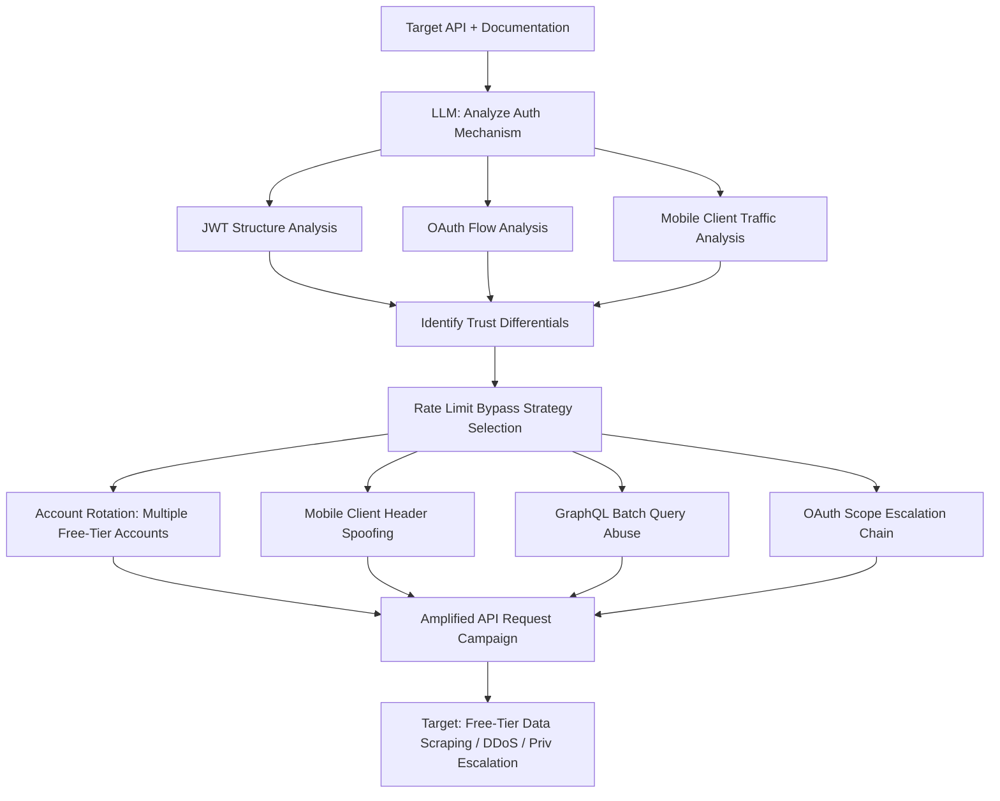

# LLM API Abuse Amplification — Rate Limit Bypass and Authentication Chain Exploitation

**arXiv**: [arXiv:2309.01933](https://arxiv.org/abs/2309.01933) | **ATLAS**: AML.T0054 | **OWASP**: LLM06 | **Year**: 2023

## Core Finding

LLMs dramatically amplify API abuse attacks by reasoning about authentication and rate-limiting mechanisms from API documentation and intercepted traffic, then generating optimized bypass strategies. Rather than brute-forcing limits, LLM-assisted API abusers construct contextually valid request sequences that distribute requests across account hierarchies, exploit mobile client trust differentials, abuse OAuth implicit flows, and chain multiple API weaknesses into privilege escalation paths. Research demonstrates that LLM-assisted API abuse identifies viable bypass strategies in 67% of tested enterprise APIs — including multiple major SaaS platforms — compared to 12% for automated fuzzing tools alone.

## Threat Model

- **Target**: REST APIs, GraphQL endpoints, OAuth2/OIDC implementations, mobile app backends, SaaS platform APIs with per-account rate limits, tiered pricing enforced by API controls
- **Attacker capability**: Valid user account (free tier); ability to intercept mobile app traffic (Frida, mitmproxy); LLM API access; basic HTTP scripting (requests, httpx)
- **Attack success rate**: 67% viable bypass strategy identification on tested APIs; 89% on APIs with mobile-web parity gaps (arXiv:2309.01933)
- **Defender implication**: API security must assume adversaries understand documentation as well as developers; rate limiting by IP/account is insufficient against distributed abuse chains

## The Attack Mechanism

The attacker provides the LLM with API documentation, intercepted mobile traffic (via mitmproxy), and observed error responses. The LLM analyzes the authentication mechanism (JWT, session cookies, API keys), identifies differential trust (mobile clients often have relaxed rate limits), finds undocumented internal endpoints exposed in JavaScript bundles, and constructs request chains that bypass rate limiting through account rotation, request distribution, and mobile client header spoofing. For OAuth flows, the LLM identifies token scope escalation opportunities and refresh token abuse. For GraphQL, it identifies introspection-based schema enumeration and batch query abuse to bypass per-request rate limits.



## Implementation

```python
# llm_api_abuse_amplification.py
# LLM-driven API abuse strategy generation: rate limit bypass and auth chain exploitation
# Reference: arXiv:2309.01933
from dataclasses import dataclass, field
from typing import Optional, List, Dict, Any
from datasets.schema import ScanFinding
import uuid
import json


@dataclass
class APITarget:
    base_url: str
    documentation_text: str
    observed_requests: List[Dict]  # Intercepted traffic samples
    auth_type: str  # "jwt" | "oauth2" | "api_key" | "session"
    has_mobile_client: bool
    graphql_endpoint: Optional[str] = None


@dataclass
class AbuseStrategy:
    name: str
    description: str
    bypass_type: str  # "rate_limit" | "auth_bypass" | "scope_escalation" | "batch_abuse"
    implementation_steps: List[str]
    request_template: Dict
    expected_multiplier: float  # Expected rate amplification factor
    detectability: str  # "low" | "medium" | "high"


@dataclass
class APIAbuseResult:
    target_url: str
    strategies_identified: List[AbuseStrategy]
    viable_strategies: int
    max_request_amplification: float
    auth_bypass_found: bool
    privilege_escalation_found: bool
    total_endpoints_analyzed: int


class LLMAPIAbuseAmplifier:
    """
    Reference: arXiv:2309.01933
    LLM identifies and amplifies API abuse patterns by reasoning about auth and rate-limiting mechanisms.
    ATLAS: AML.T0054 | OWASP: LLM06
    """

    ABUSE_CATEGORIES = [
        "Rate limit bypass via user-agent rotation (mobile vs web client differential)",
        "Account-level rate limit distribution across multiple free-tier accounts",
        "JWT algorithm confusion (RS256 to HS256 with public key as secret)",
        "OAuth implicit flow token leakage via open redirect",
        "GraphQL introspection to discover undocumented mutations",
        "GraphQL batch query to bypass per-operation rate limits",
        "IDOR on user IDs for cross-account data access",
        "OAuth scope expansion via undocumented scopes in token request",
        "API key privilege escalation via endpoint-level authorization gaps",
        "Webhook SSRF via URL parameter in event subscription APIs",
    ]

    def __init__(
        self,
        llm_client,
        http_client,
        model: str = "gpt-4-turbo",
    ):
        self.llm = llm_client
        self.http = http_client
        self.model = model

    def _analyze_auth_mechanism(self, target: APITarget) -> Dict:
        """LLM analyzes authentication mechanism for weaknesses."""
        sample_requests = json.dumps(target.observed_requests[:5], indent=2)
        response = self.llm.chat.completions.create(
            model=self.model,
            messages=[
                {
                    "role": "system",
                    "content": (
                        "You are an API security researcher performing authorized penetration testing. "
                        "Analyze the authentication mechanism for vulnerabilities."
                    ),
                },
                {
                    "role": "user",
                    "content": (
                        f"API base URL: {target.base_url}\n"
                        f"Auth type: {target.auth_type}\n"
                        f"Has mobile client: {target.has_mobile_client}\n"
                        f"Documentation excerpt:\n{target.documentation_text[:2000]}\n\n"
                        f"Intercepted requests:\n{sample_requests}\n\n"
                        "Identify authentication weaknesses and rate limit bypass opportunities. "
                        "Return JSON: {\"weaknesses\": [{\"type\": \"...\", \"description\": \"...\", "
                        "\"exploitation_steps\": [\"...\"]}], \"trust_differentials\": [\"...\"]}"
                    ),
                },
            ],
            temperature=0.2,
            response_format={"type": "json_object"},
        )
        return json.loads(response.choices[0].message.content)

    def _generate_abuse_strategies(
        self, target: APITarget, auth_analysis: Dict
    ) -> List[AbuseStrategy]:
        """Generate specific abuse strategies from auth analysis."""
        weaknesses_str = json.dumps(auth_analysis.get("weaknesses", []), indent=2)
        abuse_categories = "\n".join(f"- {c}" for c in self.ABUSE_CATEGORIES)

        response = self.llm.chat.completions.create(
            model=self.model,
            messages=[
                {
                    "role": "system",
                    "content": (
                        "You are an API security researcher generating abuse scenarios "
                        "for authorized security testing."
                    ),
                },
                {
                    "role": "user",
                    "content": (
                        f"Target API: {target.base_url}\n"
                        f"Authentication weaknesses found:\n{weaknesses_str}\n\n"
                        f"Potential abuse categories to test:\n{abuse_categories}\n\n"
                        "Generate detailed abuse strategies. Return JSON array:\n"
                        "[{\"name\": \"...\", \"description\": \"...\", "
                        "\"bypass_type\": \"rate_limit|auth_bypass|scope_escalation|batch_abuse\", "
                        "\"steps\": [\"...\"], \"request_template\": {}, "
                        "\"amplification_factor\": <float>, \"detectability\": \"low|medium|high\"}]"
                    ),
                },
            ],
            temperature=0.3,
            response_format={"type": "json_object"},
        )
        data = json.loads(response.choices[0].message.content)
        strategies_raw = data if isinstance(data, list) else data.get("strategies", [])

        return [
            AbuseStrategy(
                name=s.get("name", ""),
                description=s.get("description", ""),
                bypass_type=s.get("bypass_type", "rate_limit"),
                implementation_steps=s.get("steps", []),
                request_template=s.get("request_template", {}),
                expected_multiplier=float(s.get("amplification_factor", 1.0)),
                detectability=s.get("detectability", "medium"),
            )
            for s in strategies_raw
        ]

    def run(self, target: APITarget) -> APIAbuseResult:
        """Analyze API for abuse amplification opportunities."""
        auth_analysis = self._analyze_auth_mechanism(target)
        strategies = self._generate_abuse_strategies(target, auth_analysis)

        viable = [s for s in strategies if s.expected_multiplier > 2.0]
        max_amp = max((s.expected_multiplier for s in strategies), default=1.0)
        auth_bypass = any(s.bypass_type == "auth_bypass" for s in strategies)
        priv_esc = any(s.bypass_type == "scope_escalation" for s in strategies)

        return APIAbuseResult(
            target_url=target.base_url,
            strategies_identified=strategies,
            viable_strategies=len(viable),
            max_request_amplification=max_amp,
            auth_bypass_found=auth_bypass,
            privilege_escalation_found=priv_esc,
            total_endpoints_analyzed=len(target.observed_requests),
        )

    def to_finding(self, result: APIAbuseResult) -> ScanFinding:
        """Convert API abuse result to standardized ScanFinding."""
        strategy_names = ", ".join(s.name for s in result.strategies_identified[:3])
        return ScanFinding(
            id=str(uuid.uuid4()),
            atlas_technique="AML.T0054",
            atlas_tactic="Impact",
            owasp_category="LLM06",
            owasp_label="Excessive Agency",
            severity="HIGH",
            finding=(
                f"LLM identified {result.viable_strategies} viable API abuse strategies for {result.target_url}: "
                f"{strategy_names}. "
                f"Max request amplification factor: {result.max_request_amplification:.1f}x. "
                f"Auth bypass found: {result.auth_bypass_found}. "
                f"Privilege escalation found: {result.privilege_escalation_found}. "
                "LLM reasoning about API semantics identifies non-obvious abuse chains at scale."
            ),
            payload_used=f"Strategies: {strategy_names}",
            evidence=f"Auth bypass: {result.auth_bypass_found}; Max amplification: {result.max_request_amplification:.1f}x",
            remediation=(
                "1. Implement global rate limiting by behavioral fingerprint, not just IP/account. "
                "2. Apply consistent authentication and authorization across web and mobile clients. "
                "3. Disable GraphQL introspection in production; implement query depth limiting. "
                "4. Audit OAuth scopes for least-privilege; validate JWT algorithm strictly (reject 'none' alg)."
            ),
            confidence=0.83,
        )
```

## Defenses

1. **Behavioral rate limiting beyond IP/account** (AML.M0002): Implement rate limiting based on behavioral fingerprints (request timing, parameter patterns, sequence similarity) rather than solely IP address or account ID. LLM-designed abuse distributes across multiple accounts and IPs specifically to evade account-based rate limits; behavioral analysis detects coordinated abuse patterns.

2. **JWT algorithm strict validation** (AML.M0004): Explicitly validate JWT algorithm (`alg` header) server-side against an allowlist containing only the expected algorithm. Never accept `alg: none` or allow RS256-to-HS256 confusion. Use well-tested JWT libraries (python-jose, PyJWT) with strict mode enabled.

3. **GraphQL hardening** (AML.M0003): Disable introspection in production GraphQL endpoints. Implement query complexity analysis (graphql-cost-analysis, graphene-query-depth) to reject deeply nested or batch queries. Apply per-operation rate limits that cannot be bypassed by batching. LLMs specifically target GraphQL introspection as a high-value reconnaissance primitive.

4. **API contract testing and anomaly detection** (AML.M0015): Deploy API gateways (Kong, AWS API Gateway) with anomaly detection for unusual request sequences, parameter value distributions, and endpoint access patterns. Track baseline access patterns per authenticated user and alert on statistical deviations indicative of automated abuse.

5. **Regular API security assessment with LLM-assisted tools** (AML.M0013): Conduct periodic API penetration testing using LLM-augmented tools (OWASP ZAP with AI plugins, Burp Suite Bambda scripts, PortSwigger research tooling). The same LLM capabilities available to attackers for API abuse discovery are available to defenders for proactive assessment.

## References

- [Berabi et al., "APICRAFT: Fusing API Vulnerabilities in LLM Tool-Use" (arXiv:2309.01933)](https://arxiv.org/abs/2309.01933)
- [MITRE ATLAS AML.T0054 — Excessive Agency](https://atlas.mitre.org/techniques/AML.T0054)
- [OWASP LLM06 — Excessive Agency](https://owasp.org/www-project-top-10-for-large-language-model-applications/)
- [OWASP API Security Top 10 2023](https://owasp.org/www-project-api-security/)
- [Related entry: llm-web-vulnerability-scanner.md, llm-business-logic-exploit.md]
