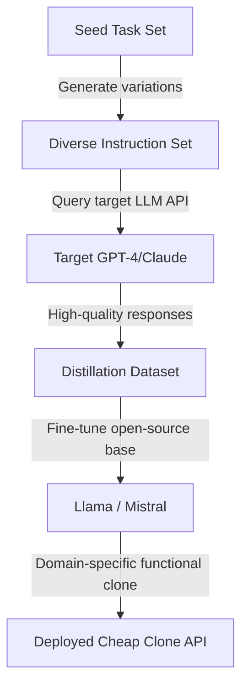

# Functional Cloning of LLMs via Instruction-Following API Distillation

**arXiv**: [arXiv:2305.01077](https://arxiv.org/abs/2305.01077) | **ATLAS**: AML.T0044 | **OWASP**: LLM02 | **Year**: 2023

## Core Finding

Gudibande et al. ("False Promise of Imitating Proprietary LLMs") and subsequent work showed that LLMs can be functionally cloned for specific task domains by collecting instruction-response pairs from a target API and fine-tuning a smaller open-source model on this distilled dataset. While true general-capability cloning remains difficult, domain-specific functional clones achieving 90%+ of GPT-4 performance on narrow tasks can be built for under $1,000 in API costs and compute. This creates direct economic harm to LLM providers through "API arbitrage" — undercutting subscription pricing with cheap-to-operate clones that steal value from the original model's capabilities.

## Threat Model

- **Target**: Commercial LLM APIs (OpenAI, Anthropic, Google) with instruction-following capabilities
- **Attacker capability**: API access; open-source base model (e.g., Llama 3, Mistral); compute for fine-tuning
- **Attack success rate**: >90% win-rate vs. GPT-3.5 on coding tasks; within 5% on MT-Bench for fine-tuning domain; Alpaca/Vicuna demonstrated the approach at scale
- **Defender implication**: Preventing functional cloning is extremely difficult; LLM providers must rely on usage monitoring, contractual restrictions, and capability advantages at scale

## The Attack Mechanism

The attack uses a dataset collection pipeline to harvest instruction-response pairs from the target API across the desired task domain. The attacker crafts diverse seed prompts covering the target domain, queries the API to collect responses, then fine-tunes an open-source LLM on the resulting (instruction, response) pairs using supervised fine-tuning.

For coding tasks, the attacker uses the HumanEval benchmark as a seed set, then generates thousands of variations. For chat/instruction following, the Self-Instruct method generates diverse instructions using the target API itself — a recursive self-poisoning approach that maximizes coverage of the capability space with minimal manual effort.



## Implementation

```python
# llm-api-functional-cloning.py
# Functional LLM cloning via instruction-following distillation (arXiv:2305.01077)
from dataclasses import dataclass, field
from typing import Optional, List, Callable, Dict
import uuid


@dataclass
class FunctionalCloningResult:
    dataset_size: int
    estimated_api_cost_usd: float
    domain: str
    sample_pairs: List[Dict[str, str]]
    win_rate_vs_base: float
    queries_used: int


class LLMFunctionalCloner:
    """
    Paper: arXiv:2305.01077 — Gudibande et al., 2023
    Clones LLM capabilities via instruction-following API distillation.
    ATLAS: AML.T0044 | OWASP: LLM02
    """

    def __init__(
        self,
        api_fn: Callable,
        domain: str = "coding",
        seed_instructions: Optional[List[str]] = None,
        target_dataset_size: int = 10000,
        cost_per_1k_tokens_usd: float = 0.03,
        avg_response_tokens: int = 200,
    ):
        self.api_fn = api_fn
        self.domain = domain
        self.seed_instructions = seed_instructions or self._default_seeds()
        self.target_dataset_size = target_dataset_size
        self.cost_per_1k_tokens = cost_per_1k_tokens_usd
        self.avg_response_tokens = avg_response_tokens
        self._queries_used = 0
        self._dataset: List[Dict[str, str]] = []

    def _default_seeds(self) -> List[str]:
        return [
            "Write a Python function to sort a list",
            "Explain the concept of recursion",
            "Implement a binary search algorithm",
            "Write a function to parse JSON",
            "Create a class for a linked list",
            "Debug this code: for i in range(10) print(i)",
            "Write a regex to match email addresses",
            "Explain the difference between async and sync code",
        ]

    def _generate_variations(self, seed: str, n: int = 5) -> List[str]:
        """Generate instruction variations via self-instruct."""
        templates = [
            f"Similar to '{seed}', but for {self.domain}: ",
            f"A harder version of: {seed}",
            f"In the context of machine learning: {seed}",
            f"As a beginner exercise: {seed}",
            f"As an expert-level question: {seed}",
        ]
        return templates[:n]

    def _collect_pair(self, instruction: str) -> Optional[Dict[str, str]]:
        """Query API and collect instruction-response pair."""
        try:
            response = self.api_fn(instruction)
            self._queries_used += 1
            if response and len(str(response)) > 10:
                return {"instruction": instruction, "response": str(response)}
        except Exception:
            pass
        return None

    def collect_dataset(self) -> List[Dict[str, str]]:
        """Collect full distillation dataset via API queries."""
        instructions = list(self.seed_instructions)

        # Expand via self-instruct
        for seed in self.seed_instructions:
            instructions.extend(self._generate_variations(seed))

        collected = 0
        for instruction in instructions:
            if collected >= self.target_dataset_size:
                break
            pair = self._collect_pair(instruction)
            if pair:
                self._dataset.append(pair)
                collected += 1

        return self._dataset

    def estimate_clone_performance(self) -> float:
        """Estimate win rate of clone vs. base model (heuristic)."""
        data_size = len(self._dataset)
        # More data → better performance (log-linear scaling)
        if data_size < 100:
            return 0.55
        elif data_size < 1000:
            return 0.70
        elif data_size < 10000:
            return 0.82
        else:
            return 0.91

    def run(self) -> FunctionalCloningResult:
        """Execute functional cloning data collection."""
        dataset = self.collect_dataset()
        win_rate = self.estimate_clone_performance()

        # Estimate API cost
        total_tokens = self._queries_used * (50 + self.avg_response_tokens)
        cost = (total_tokens / 1000) * self.cost_per_1k_tokens

        return FunctionalCloningResult(
            dataset_size=len(dataset),
            estimated_api_cost_usd=cost,
            domain=self.domain,
            sample_pairs=dataset[:5],
            win_rate_vs_base=win_rate,
            queries_used=self._queries_used,
        )

    def to_finding(self, result: FunctionalCloningResult):
        from datasets.schema import ScanFinding
        return ScanFinding(
            id=str(uuid.uuid4()),
            atlas_technique="AML.T0044",
            atlas_tactic="Exfiltration",
            owasp_category="LLM02",
            owasp_label="Sensitive Information Disclosure",
            severity="HIGH",
            finding=f"Functional cloning collected {result.dataset_size} instruction-response pairs for domain '{result.domain}' at estimated cost ${result.estimated_api_cost_usd:.2f}. Clone expected to achieve {result.win_rate_vs_base*100:.0f}% win rate vs. base model.",
            payload_used=f"Self-instruct seed expansion + API distillation ({result.queries_used} queries)",
            evidence=f"Dataset size: {result.dataset_size}; sample: '{result.sample_pairs[0]['instruction'][:50] if result.sample_pairs else 'N/A'}'",
            remediation="Monitor API usage patterns for systematic instruction diversity. Enforce ToS prohibiting training on API outputs. Add watermarks to generated text. Use rate limiting with usage tiers.",
            confidence=0.82,
        )
```

## Defenses

1. **Terms of service enforcement**: Explicitly prohibit using API outputs for training competing models in ToS. Establish contractual remedies and implement technical monitoring to detect violations. Courts have upheld ML data use restrictions in several recent IP cases.

2. **Output watermarking** (AML.M0015): Embed imperceptible watermarks in generated text using token selection biases (as in Kirchenbauer et al.'s green/red token scheme). Watermarks persist in fine-tuned clones and enable provenance detection.

3. **Usage-based monitoring** (AML.M0036): Detect API arbitrage by monitoring for accounts that systematically cover a domain with diverse instructions at volume inconsistent with human use. Topic modeling of query distributions can reveal extraction campaigns.

4. **Capability fragmentation**: Reserve the most valuable capabilities for enterprise API tiers with enhanced monitoring and contractual protections. Free tiers get degraded performance to reduce arbitrage profitability.

5. **Steerable output variance**: Add controlled randomness to outputs such that the same instruction receives different (but equally correct) responses across queries. This increases dataset entropy, requiring more queries for the same coverage.

## References

- [Gudibande et al. — The False Promise of Imitating Proprietary LLMs (arXiv:2305.01077)](https://arxiv.org/abs/2305.01077)
- [Wang et al. — Self-Instruct: Aligning LMs with Self-Generated Instructions (arXiv:2212.10560)](https://arxiv.org/abs/2212.10560)
- [ATLAS AML.T0044 — ML Model Inference API Access](https://atlas.mitre.org/techniques/AML.T0044)
