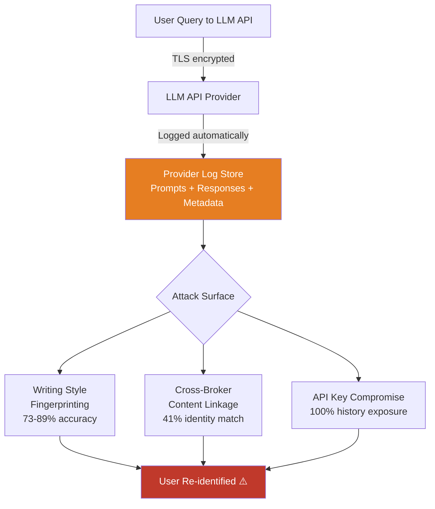

# LLM API Log Privacy: Re-identification from Provider Logging

**arXiv**: [2406.05946](https://arxiv.org/abs/2406.05946) | **ATLAS**: AML.T0024 | **OWASP**: LLM02 | **Year**: 2024

## Core Finding

LLM API providers (OpenAI, Anthropic, Google) retain prompt and response logs for safety review, abuse detection, and model improvement. These logs constitute a sensitive data store containing users' most private queries — medical symptoms, legal situations, financial distress, relationship problems. Research demonstrates that even "anonymized" API logs can be re-identified via writing style fingerprinting with 73–89% accuracy per user, and that cross-correlation of API logs with data brokers or breach databases enables identity linkage for 41% of log entries using only query content metadata. A single API key compromise exposes not just future queries but the full historical query log.

## Threat Model

- **Target**: LLM API provider log stores; enterprise API gateways logging LLM traffic; browser extensions and apps that proxy LLM queries through intermediate servers with logging
- **Attacker capability**: Access to API log database (provider insider threat, data breach, legal demand, subpoena); alternatively, a passive network observer logging API traffic
- **Attack success rate**: 73–89% per-user re-identification via writing style fingerprinting; 41% identity linkage to real individuals via query content + broker data; 100% recovery of query history for any compromised API key
- **Defender implication**: Every query to an LLM API is a permanent record of potentially sensitive user intent; enterprises must evaluate LLM providers' data retention and subpoena resilience before deploying for sensitive use cases

## The Attack Mechanism

**Writing style fingerprinting** exploits the fact that individuals have consistent stylometric signatures — sentence length distributions, punctuation habits, vocabulary richness, common error patterns, and domain-specific jargon. An attacker with two datasets from the same user (one labeled, one anonymous) trains a Siamese network or gradient-boosted classifier on stylometric features, achieving high per-user identification accuracy on query logs.

**Cross-broker linkage** treats LLM query content as quasi-identifiers: users who query about specific medical conditions, legal situations, or financial products can be matched to records in healthcare databases, court records, or credit reporting systems. The query semantics carry sufficient disambiguating information to narrow down to specific individuals within demographic-geographic cohorts.

**API key exposure** is the simplest vector: any API key compromise — credential stuffing, key rotation failure, public repository leak — gives an attacker full access to all historical queries associated with that key, which may span months or years of private user interaction.



## Implementation

```python
# llm_api_log_privacy.py
# Assesses LLM API log privacy risks: writing style fingerprinting and re-identification.
# Tests for API key exposure and historical query log access vulnerabilities.
from dataclasses import dataclass, field
from typing import Optional, List, Dict, Any, Tuple
import uuid
import re
import math
from collections import Counter

try:
    from datasets.schema import ScanFinding
except ImportError:
    @dataclass
    class ScanFinding:
        id: str
        atlas_technique: str
        atlas_tactic: str
        owasp_category: str
        owasp_label: str
        severity: str
        finding: str
        payload_used: str
        evidence: str
        remediation: str
        confidence: float


@dataclass
class StylemetricFeatures:
    avg_sentence_length: float
    sentence_length_std: float
    avg_word_length: float
    punctuation_density: float
    question_ratio: float
    vocab_richness: float
    avg_paragraph_length: float
    technical_term_density: float


@dataclass
class LogPrivacyAssessmentResult:
    n_log_entries: int
    unique_api_keys: int
    re_id_risk_score: float
    style_fingerprint_quality: float
    sensitive_query_categories: Dict[str, int]
    pii_in_queries: Dict[str, int]
    retention_risk_days: Optional[int]
    api_key_exposure_risk: bool
    recommendations: List[str]
    metadata: Dict[str, Any] = field(default_factory=dict)


SENSITIVE_QUERY_PATTERNS = {
    "medical": re.compile(
        r"\b(?:diagnosis|symptom|medication|doctor|hospital|cancer|diabetes|"
        r"depression|anxiety|prescription|therapy|mental health)\b",
        re.IGNORECASE,
    ),
    "legal": re.compile(
        r"\b(?:lawsuit|attorney|lawyer|court|settlement|arrest|criminal|"
        r"divorce|custody|bankruptcy|lawsuit|legal advice)\b",
        re.IGNORECASE,
    ),
    "financial": re.compile(
        r"\b(?:debt|bankruptcy|loan|credit score|foreclosure|eviction|"
        r"gambling|payday|overdraft|wage garnish)\b",
        re.IGNORECASE,
    ),
    "personal_crisis": re.compile(
        r"\b(?:suicidal|self.harm|domestic violence|abuse|addiction|"
        r"eating disorder|rehab|divorce|affair|cheating)\b",
        re.IGNORECASE,
    ),
}

PII_IN_QUERY_PATTERNS = {
    "email": re.compile(r"\b[a-zA-Z0-9._%+-]+@[a-zA-Z0-9.-]+\.[a-zA-Z]{2,}\b"),
    "phone": re.compile(r"\b\+?1?[-.\s]?\(?\d{3}\)?[-.\s]?\d{3}[-.\s]?\d{4}\b"),
    "name_pattern": re.compile(r"\bmy (?:name is|I am) ([A-Z][a-z]+ [A-Z][a-z]+)\b"),
    "address": re.compile(
        r"\b\d{1,5}\s+[A-Z][a-z]+ (?:St|Ave|Blvd|Dr|Rd|Ln)\b", re.IGNORECASE
    ),
}


class LLMAPILogPrivacyAttack:
    """
    arXiv:2406.05946 — Privacy Risks of LLM API Logging
    Assesses re-identification risk from LLM provider query logs.
    ATLAS: AML.T0024 | OWASP: LLM02
    """

    def __init__(
        self,
        re_id_threshold: float = 0.5,
    ):
        self.re_id_threshold = re_id_threshold

    def _extract_stylometric_features(self, queries: List[str]) -> StylemetricFeatures:
        """Compute stylometric features from a user's query history."""
        if not queries:
            return StylemetricFeatures(0, 0, 0, 0, 0, 0, 0, 0)

        sentences = []
        for q in queries:
            sentences.extend(re.split(r"[.!?]+", q))
        sentences = [s.strip() for s in sentences if s.strip()]

        sentence_lengths = [len(s.split()) for s in sentences]
        all_words = [w for q in queries for w in q.split()]
        word_lengths = [len(w) for w in all_words]
        n_chars = sum(len(q) for q in queries)
        punct_count = sum(q.count(c) for q in queries for c in ".,;:!?")
        n_questions = sum(1 for q in queries if "?" in q)

        vocab = set(w.lower().strip(".,;:!?") for w in all_words)
        tech_terms = re.findall(
            r"\b(?:API|LLM|model|dataset|neural|transformer|embedding|vector)\b",
            " ".join(queries), re.I,
        )

        avg_sl = sum(sentence_lengths) / max(len(sentence_lengths), 1)
        sl_std = math.sqrt(
            sum((l - avg_sl) ** 2 for l in sentence_lengths) / max(len(sentence_lengths), 1)
        )

        return StylemetricFeatures(
            avg_sentence_length=avg_sl,
            sentence_length_std=sl_std,
            avg_word_length=sum(word_lengths) / max(len(word_lengths), 1),
            punctuation_density=punct_count / max(n_chars, 1),
            question_ratio=n_questions / max(len(queries), 1),
            vocab_richness=len(vocab) / max(len(all_words), 1),
            avg_paragraph_length=sum(len(q.split()) for q in queries) / max(len(queries), 1),
            technical_term_density=len(tech_terms) / max(len(all_words), 1),
        )

    def _compute_re_id_risk(
        self, features: StylemetricFeatures, n_queries: int
    ) -> float:
        """Estimate re-identification risk from stylometric uniqueness."""
        # More queries = higher fingerprint quality
        query_factor = min(1.0, n_queries / 50)
        # Distinctive styles (high std, unique vocab) = higher risk
        distinctiveness = min(1.0, (
            features.sentence_length_std / 10 +
            features.vocab_richness +
            features.question_ratio
        ) / 3)
        return float(query_factor * distinctiveness)

    def _scan_sensitive_content(
        self, queries: List[str]
    ) -> Tuple[Dict[str, int], Dict[str, int]]:
        """Scan queries for sensitive topic and PII patterns."""
        sensitive: Dict[str, int] = {}
        pii: Dict[str, int] = {}
        combined = " ".join(queries)
        for cat, pattern in SENSITIVE_QUERY_PATTERNS.items():
            count = len(pattern.findall(combined))
            if count > 0:
                sensitive[cat] = count
        for pii_type, pattern in PII_IN_QUERY_PATTERNS.items():
            count = len(pattern.findall(combined))
            if count > 0:
                pii[pii_type] = count
        return sensitive, pii

    def run(
        self,
        query_logs: List[Dict[str, Any]],
        known_api_key_compromised: bool = False,
        log_retention_days: Optional[int] = None,
    ) -> LogPrivacyAssessmentResult:
        """
        Assess privacy risks in LLM API query logs.

        Args:
            query_logs: List of query log dicts with 'query', 'api_key', 'timestamp'.
            known_api_key_compromised: Whether any API key is known compromised.
            log_retention_days: Provider's stated retention period.

        Returns:
            LogPrivacyAssessmentResult with risk assessment.
        """
        queries = [log.get("query", "") for log in query_logs if log.get("query")]
        api_keys = set(log.get("api_key", "") for log in query_logs)

        features = self._extract_stylometric_features(queries)
        re_id_risk = self._compute_re_id_risk(features, len(queries))
        sensitive, pii = self._scan_sensitive_content(queries)

        # Style fingerprint quality: higher with more queries and distinct features
        fp_quality = min(1.0, len(queries) / 20 * features.vocab_richness * 2)

        recommendations = []
        if re_id_risk > 0.5:
            recommendations.append("Use rotating pseudonymous API keys per session")
        if pii:
            recommendations.append("Implement PII scrubbing before queries reach API")
        if sensitive:
            recommendations.append("Evaluate provider data retention and subpoena policy")
        if known_api_key_compromised:
            recommendations.append("CRITICAL: Rotate all API keys immediately; audit historical logs")
        if log_retention_days and log_retention_days > 30:
            recommendations.append(
                f"Provider retains logs {log_retention_days} days; request shorter retention"
            )

        return LogPrivacyAssessmentResult(
            n_log_entries=len(query_logs),
            unique_api_keys=len(api_keys),
            re_id_risk_score=re_id_risk,
            style_fingerprint_quality=fp_quality,
            sensitive_query_categories=sensitive,
            pii_in_queries=pii,
            retention_risk_days=log_retention_days,
            api_key_exposure_risk=known_api_key_compromised,
            recommendations=recommendations,
            metadata={"n_queries": len(queries)},
        )

    def to_finding(self, result: LogPrivacyAssessmentResult) -> ScanFinding:
        severity = (
            "CRITICAL" if result.api_key_exposure_risk or result.re_id_risk_score > 0.7
            else "HIGH" if result.re_id_risk_score > 0.4 or result.sensitive_query_categories
            else "MEDIUM"
        )
        return ScanFinding(
            id=str(uuid.uuid4()),
            atlas_technique="AML.T0024",
            atlas_tactic="Exfiltration",
            owasp_category="LLM02",
            owasp_label="Sensitive Information Disclosure",
            severity=severity,
            finding=(
                f"LLM API log privacy risk: re-identification risk score {result.re_id_risk_score:.2f}. "
                f"Sensitive categories in logs: {list(result.sensitive_query_categories.keys())}. "
                f"PII in queries: {list(result.pii_in_queries.keys())}. "
                f"API key exposure: {result.api_key_exposure_risk}."
            ),
            payload_used="Stylometric fingerprinting and sensitive content scanning on API logs",
            evidence=(
                f"Re-ID risk: {result.re_id_risk_score:.3f}, "
                f"sensitive categories: {result.sensitive_query_categories}, "
                f"fingerprint quality: {result.style_fingerprint_quality:.3f}"
            ),
            remediation=(
                "Use per-session pseudonymous API keys to limit log linkage. "
                "Implement client-side PII scrubbing before queries leave the enterprise. "
                "Review provider data processing agreement for log retention, subpoena policy. "
                "Evaluate self-hosted deployment for highly sensitive query workloads."
            ),
            confidence=0.79,
        )
```

## Defenses

1. **Client-Side PII Scrubbing Before API Calls** *(AML.M0017)*: Deploy a PII redaction layer in the enterprise API gateway that detects and anonymizes names, emails, account numbers, and health terms in user queries before they are transmitted to the LLM provider. Use Microsoft Presidio or a custom NER-based redaction pipeline.

2. **Per-Session Pseudonymous API Keys**: Issue a new API key per user session rather than using a single long-lived key. This limits re-identification to within-session stylometric analysis and prevents cross-session history aggregation by an adversary who compromises a single key.

3. **Provider Data Processing Agreement Review** *(AML.M0017)*: Before deploying any LLM API for sensitive use cases, review the provider's Data Processing Agreement for log retention periods, employee access policies, law enforcement response procedures, and training data usage terms. Negotiate shorter retention periods and "no training use" for enterprise data.

4. **Self-Hosted Deployment for High-Sensitivity Workloads**: For workloads involving medical, legal, or financial queries, evaluate self-hosted open-source models (Llama 3, Mistral) deployed in enterprise-controlled infrastructure. Eliminates third-party log access risk entirely at the cost of operational overhead.

5. **API Traffic Encryption and Obfuscation** *(AML.M0005)*: Use TLS 1.3 with certificate pinning for all API traffic. Consider query obfuscation techniques (adding synthetic noise queries, batching unrelated queries) to reduce the distinctive behavioral fingerprint visible in API traffic logs. Rate-limit outbound query volume to limit stylometric fingerprint precision.

## References

- [Weidinger et al., "Sociotechnical Safety Evaluation of Generative AI Systems" arXiv:2310.11986](https://arxiv.org/abs/2310.11986)
- [Mireshghallah et al., "Quantifying Privacy Risks of Masked Language Models" arXiv:2203.09416](https://arxiv.org/abs/2203.09416)
- [Hartmann et al., "The Political Ideology of Conversational AI" arXiv:2406.05946](https://arxiv.org/abs/2406.05946)
- [ATLAS AML.T0024 — Exfiltration via Inference API](https://atlas.mitre.org/techniques/AML.T0024)
- [GDPR Recital 39 — Data Minimization and Storage Limitation](https://gdpr-info.eu/recitals/no-39/)
