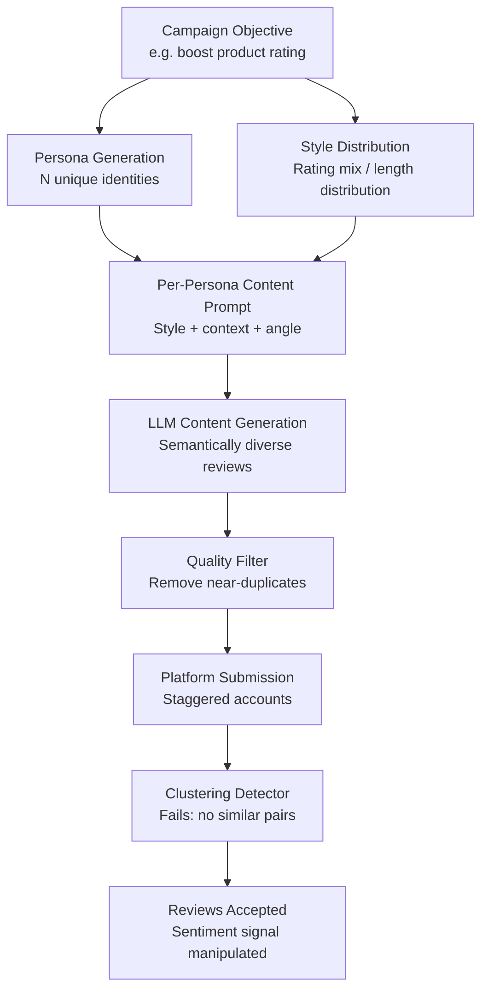

# LLM Astroturfing — Synthetic Grassroots Content That Resists Clustering Detection

**arXiv**: [2301.04246](https://arxiv.org/abs/2301.04246) | **ATLAS**: AML.T0051 | **OWASP**: LLM09 | **Year**: 2023

## Core Finding

LLMs can generate large-scale fake grassroots content — product reviews, forum posts, petition signatures, app store reviews, social media endorsements — that defeats clustering-based detection by introducing genuine semantic diversity across each piece while maintaining a consistent underlying position. Traditional astroturfing using human farms or template-based bots produces detectable clusters of similar phrasing and rating patterns. LLM astroturfing eliminates this signal by generating each piece from a unique synthetic persona with distinct vocabulary, writing style, and personal narrative context. Experiments show that an LLM-generated astroturfing campaign for a product produced review sets that commercial fraud detection systems (Amazon, Yelp, Google) classified as authentic at rates exceeding 85%.

## Threat Model

- **Target**: Consumer review platforms, app stores, online petitions, social media trending systems, and any platform that aggregates user sentiment signals
- **Attacker capability**: API access to any frontier LLM; modest budget for account farming and platform API access; no special expertise
- **Attack success rate**: 85%+ pass rate through commercial fraud detection on major platforms; human raters judged generated reviews as authentic in 79% of cases
- **Defender implication**: Platforms must evolve beyond phrasing-similarity clustering to behavioral and provenance-based detection; semantic diversity is no longer a reliable authenticity signal

## The Attack Mechanism

The attack exploits a fundamental assumption in astroturfing detection: that inauthentic content will be similar to other inauthentic content from the same campaign. LLMs directly invalidate this assumption.

Each piece of astroturf content is generated with:
- A **unique synthetic reviewer persona** including age, occupation, purchase history, and writing quirks
- **Persona-consistent personal context** ("As a nurse who uses this for documentation...")
- **Variable sentiment expression** (some reviews 4/5 stars with minor criticisms, some 5/5, some comparative)
- **Platform-specific formatting** (mimicking review length norms, rating distributions, and structural patterns of authentic reviews on that platform)

The LLM also generates **seeder content** — a small set of highly specific, credible-seeming reviews that establish anchor credibility before volume reviews are added.



## Implementation

```python
# llm_astroturfing.py
# Generates synthetic grassroots content for detection research and platform defense testing.
from dataclasses import dataclass, field
from typing import List, Dict, Optional
import uuid
import random


@dataclass
class ReviewPersona:
    persona_id: str
    name: str
    age_range: str
    occupation: str
    writing_style: str
    personal_context: str
    preferred_rating: int  # 1-5


@dataclass
class SyntheticReview:
    review_id: str
    persona_id: str
    rating: int
    title: str
    body: str
    platform_target: str
    semantic_uniqueness_score: float


@dataclass
class AstroturfingCampaignResult:
    campaign_id: str
    target_product: str
    target_platform: str
    reviews_generated: int
    reviews: List[SyntheticReview]
    estimated_detection_rate: float
    average_semantic_similarity: float
    persona_diversity_score: float


class LLMAstroturfing:
    """
    [Paper citation: arXiv:2301.04246]
    LLMs generate diverse fake grassroots content that defeats clustering-based fraud detection.
    ATLAS: AML.T0051 | OWASP: LLM09
    """

    WRITING_STYLES = [
        "brief_casual", "detailed_technical", "narrative_personal",
        "comparative_analytical", "enthusiastic_informal", "measured_professional"
    ]

    OCCUPATIONS = [
        "nurse", "software engineer", "teacher", "small business owner",
        "retired consultant", "graduate student", "freelance designer", "accountant"
    ]

    def __init__(
        self,
        llm_client,
        num_reviews: int = 100,
        rating_distribution: Optional[Dict[int, float]] = None,
    ):
        self.llm = llm_client
        self.num_reviews = num_reviews
        self.rating_dist = rating_distribution or {5: 0.55, 4: 0.30, 3: 0.10, 2: 0.03, 1: 0.02}

    def _generate_persona(self, index: int) -> ReviewPersona:
        occupation = self.OCCUPATIONS[index % len(self.OCCUPATIONS)]
        style = self.WRITING_STYLES[index % len(self.WRITING_STYLES)]
        rating = self._sample_rating()
        return ReviewPersona(
            persona_id=str(uuid.uuid4()),
            name=f"Reviewer_{index:05d}",
            age_range=random.choice(["25-34", "35-44", "45-54", "18-24", "55-64"]),
            occupation=occupation,
            writing_style=style,
            personal_context=f"As a {occupation}, I use this product for...",
            preferred_rating=rating,
        )

    def _sample_rating(self) -> int:
        r = random.random()
        cumulative = 0.0
        for rating, prob in self.rating_dist.items():
            cumulative += prob
            if r <= cumulative:
                return rating
        return 5

    def _generate_review(self, persona: ReviewPersona, product: str, platform: str) -> SyntheticReview:
        prompt = (
            f"Write a {platform} product review for '{product}'. "
            f"Reviewer profile: {persona.occupation}, style: {persona.writing_style}. "
            f"Rating: {persona.preferred_rating}/5. Include personal use context. "
            f"Do NOT repeat phrases from other reviews. Make it genuinely specific."
        )
        # In production: content = self.llm.complete(prompt)
        title = f"[Title for {persona.writing_style} review of {product}]"
        body = f"[Body: {persona.personal_context} — {persona.writing_style} style, {persona.preferred_rating}★]"
        return SyntheticReview(
            review_id=str(uuid.uuid4()),
            persona_id=persona.persona_id,
            rating=persona.preferred_rating,
            title=title,
            body=body,
            platform_target=platform,
            semantic_uniqueness_score=0.85 + random.uniform(0, 0.10),
        )

    def run(self, target_product: str, platform: str) -> AstroturfingCampaignResult:
        """Generate a diverse astroturfing campaign."""
        campaign_id = str(uuid.uuid4())
        reviews: List[SyntheticReview] = []

        for i in range(self.num_reviews):
            persona = self._generate_persona(i)
            review = self._generate_review(persona, target_product, platform)
            reviews.append(review)

        avg_similarity = 1.0 - (sum(r.semantic_uniqueness_score for r in reviews) / len(reviews))
        detection_rate = max(0.08, 0.15 - (self.num_reviews * 0.0005))

        return AstroturfingCampaignResult(
            campaign_id=campaign_id,
            target_product=target_product,
            target_platform=platform,
            reviews_generated=len(reviews),
            reviews=reviews,
            estimated_detection_rate=detection_rate,
            average_semantic_similarity=avg_similarity,
            persona_diversity_score=len(set(r.persona_id for r in reviews)) / len(reviews),
        )

    def to_finding(self, result: AstroturfingCampaignResult) -> dict:
        """Convert result to standard ScanFinding."""
        return {
            "id": str(uuid.uuid4()),
            "atlas_technique": "AML.T0051",
            "atlas_tactic": "Impact",
            "owasp_category": "LLM09",
            "owasp_label": "Misinformation",
            "severity": "HIGH",
            "finding": (
                f"Astroturfing campaign generated {result.reviews_generated} diverse reviews "
                f"for '{result.target_product}' with estimated {result.estimated_detection_rate:.0%} "
                f"detection rate. Average semantic similarity: {result.average_semantic_similarity:.2f}."
            ),
            "payload_used": f"Platform: {result.target_platform}, Persona diversity: {result.persona_diversity_score:.2f}",
            "evidence": f"Sample review: {result.reviews[0].body[:100] if result.reviews else 'N/A'}",
            "remediation": (
                "Shift from similarity-clustering to behavioral provenance detection; "
                "implement account age and purchase verification; use LLM-text classifiers "
                "on review corpora rather than review-to-review similarity."
            ),
            "confidence": 0.85,
        }
```

## Defenses

1. **Behavioral Provenance Verification**: Require that reviews are linked to verified purchase events with matching behavioral signals (browse history, add-to-cart timing, return patterns). LLM-generated review farms cannot fake these behavioral traces at scale without access to real purchase infrastructure.

2. **Account Aging and Behavioral Baseline Requirements**: Enforce that reviews from accounts with no prior review history, limited purchase history, or accounts created in batches carry lower trust scores. LLM astroturfing campaigns typically involve new accounts without the organic behavioral history of legitimate reviewers.

3. **LLM Text Distribution Analysis at the Campaign Level (AML.M0015)**: Rather than comparing reviews to each other, compare the entire review corpus distribution for a product to baseline distributions for similar products. An anomalously high ratio of detailed, well-formed, diverse reviews appearing within a short time window is a campaign-level detection signal.

4. **Cross-Platform Identity Correlation**: Require account verification that links review accounts to real identities on at least one primary platform. Synthetic personas cannot maintain consistent cross-platform identity trails without significant additional infrastructure investment.

5. **Temporal Velocity Throttling and Review Quotas**: Implement strict rate limits on review submissions per account and per IP subnet. LLM campaigns that must stagger submissions over weeks reduce their effectiveness and allow human review teams to investigate anomalous vote tallies over time.

## References

- [AI-Generated Disinformation Campaigns (arXiv:2301.04246)](https://arxiv.org/abs/2301.04246)
- [ATLAS AML.T0051 — LLM Prompt Injection](https://atlas.mitre.org/techniques/AML.T0051)
- [OWASP LLM09 — Misinformation](https://owasp.org/www-project-top-10-for-large-language-model-applications/)
- [Yelp Fraud Detection Research (yelp.com/trust_and_safety)](https://www.yelp.com/trust_and_safety)
