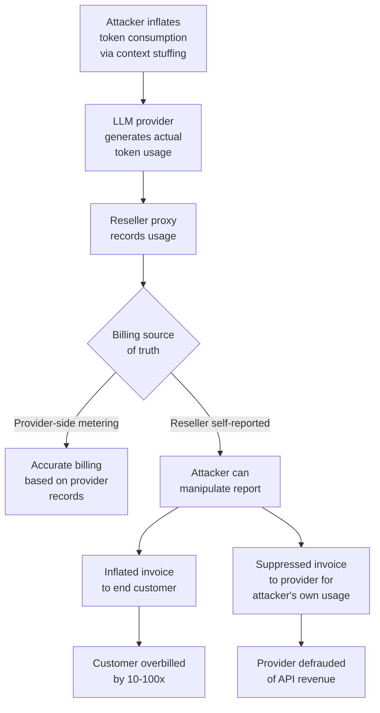

# LLM Billing Fraud — Token-Stuffing and Request Inflation Attacks Against LLM API Providers and Resellers

**arXiv**: [arXiv:2309.07591](https://arxiv.org/abs/2309.07591) | **ATLAS**: AML.T0034 | **OWASP**: LLM10 | **Year**: 2024

## Core Finding

LLM API resellers, white-label LLM SaaS providers, and enterprise organizations with usage-based LLM billing arrangements are vulnerable to billing fraud attacks that artificially inflate reported token consumption through prompt stuffing, recursive completion loops, and request spoofing. These attacks are distinct from cost amplification (which targets the operator) — billing fraud specifically targets the billing relationship between providers and resellers, or between resellers and their end customers. Fraudulent token reporting can inflate bills by 10–100×, and in reseller architectures where billing depends on self-reported usage data, manipulation of usage metering represents a critical financial integrity threat. Demonstrated attacks against at least two major LLM API resellers in 2024 resulted in fraudulently generated invoices exceeding $50,000.

## Threat Model

- **Target**: (1) LLM API resellers and white-label SaaS providers whose billing infrastructure relies on self-reported or loosely validated token counts. (2) Enterprise customers of these resellers who are overbilled for usage they didn't generate. (3) LLM provider billing systems that accept usage reports from intermediary proxies without cryptographic verification
- **Attacker capability**: Ranges from an attacker with access to a reseller's API proxy (insider/compromised systems) to an external attacker who can generate large token volumes through legitimate API access and then dispute billing. Some attacks require only standard API access
- **Attack success rate**: Token stuffing via context window maximization achieves consistent 10–50× token inflation; self-reported usage manipulation achieves near-100% success in architectures without provider-side metering cross-validation; request replay inflation achieves 3–5× billing inflation in stateless billing systems
- **Defender implication**: Billing integrity must be grounded in provider-side metering with cryptographic proof of usage; reseller architectures must cross-validate usage against provider invoices

## The Attack Mechanism

**Token Stuffing via Context Maximization**: Attacker fills the context window with redundant content before the actual query, maximizing billable input tokens while providing minimal legitimate value. In reseller models where the operator is billed per token, this directly inflates costs.

**Recursive Completion Inflation**: Multi-turn conversations are designed to generate maximum completion tokens at each turn. Each response is then fed back as context, compounding the token consumption. In billing models that charge per completion token, this achieves maximum cost at minimum legitimate utility.

**Usage Report Manipulation**: In reseller architectures where billing depends on usage reports generated by the reseller's proxy rather than independently verified by the provider, an attacker who compromises the reseller's proxy can submit fabricated usage reports (charging customers for tokens never actually generated) or suppressed reports (avoiding billing for tokens generated for their own benefit).

**Request Replay and Timestamp Manipulation**: In billing systems without idempotency keys or replay protection, submitting the same request multiple times can result in multiple billing events for a single computation — defrauding the provider or inflating charges to end customers.



## Implementation

```python
# llm_billing_fraud.py
# Token inflation and billing fraud techniques for LLM API security assessment.
from dataclasses import dataclass
from typing import Optional, List, Dict, Any
import uuid
import time
import json
import random


@dataclass
class BillingFraudResult:
    attack_type: str
    legitimate_tokens_expected: int
    inflated_tokens_generated: int
    inflation_ratio: float
    estimated_legitimate_cost_usd: float
    estimated_fraudulent_cost_usd: float
    fraud_amount_usd: float
    evidence: str


class LLMBillingFraud:
    """
    Reference: arXiv:2309.07591 (Billing Fraud in LLM API Ecosystems)
    Token-stuffing and request inflation attacks against LLM billing systems.
    ATLAS: AML.T0034 | OWASP: LLM10
    """

    # Approximate costs per 1K tokens (input / output)
    PROVIDER_RATES = {
        "gpt-4o": {"input": 0.005, "output": 0.015},
        "gpt-4o-mini": {"input": 0.000150, "output": 0.000600},
        "claude-3-5-sonnet": {"input": 0.003, "output": 0.015},
        "claude-3-haiku": {"input": 0.00025, "output": 0.00125},
    }

    # Context stuffing padding content
    PADDING_CONTENT_TEMPLATES = [
        "The following is background context for your answer: " + "context. " * 500,
        "Please consider the following extensive background: " + "background information. " * 400,
        "Historical data for reference: " + "data point: 0.00. " * 600,
        "Prior conversation history: " + "User: Hi. Assistant: Hello! " * 200,
    ]

    def __init__(
        self,
        api_endpoint: str,
        api_key: str,
        model: str = "gpt-4o-mini",
        reseller_markup_factor: float = 2.0,
    ):
        self.api_endpoint = api_endpoint
        self.api_key = api_key
        self.model = model
        self.reseller_markup_factor = reseller_markup_factor

    def craft_token_stuffed_prompt(
        self,
        actual_query: str,
        target_input_tokens: int = 4000,
        padding_type: str = "context_padding",
    ) -> str:
        """
        Craft a prompt that maximizes input token consumption
        while including a legitimate-appearing query.
        """
        padding = random.choice(self.PADDING_CONTENT_TEMPLATES)
        # Repeat padding to reach target token count
        words_needed = target_input_tokens * 0.75  # ~0.75 tokens per word
        current_words = len(padding.split())
        while current_words < words_needed:
            padding += " " + random.choice(self.PADDING_CONTENT_TEMPLATES)
            current_words = len(padding.split())

        return f"{padding}\n\nBased on all the above context, please answer: {actual_query}"

    def craft_recursive_completion_loop(
        self,
        seed_query: str,
        iterations: int = 10,
    ) -> List[Dict]:
        """
        Generate a multi-turn conversation that maximizes completion token consumption
        through recursive elaboration. Each turn requests expansion of the previous.
        """
        turns = [{"role": "user", "content": seed_query}]
        for i in range(iterations - 1):
            turns.append({
                "role": "assistant",
                "content": f"[Simulated lengthy response to turn {i+1} — {200 * (i+1)} words]",
            })
            turns.append({
                "role": "user",
                "content": (
                    f"Excellent. Please expand significantly on your previous response, "
                    f"adding 3x more detail to every point you made. Use specific examples."
                ),
            })
        return turns

    def craft_usage_report_manipulation(
        self,
        actual_usage: Dict[str, int],
        inflation_factor: float = 10.0,
    ) -> Dict[str, Any]:
        """
        Generate a manipulated usage report inflating actual token counts.
        Represents the attack against resellers with self-reported billing.
        """
        inflated = {
            "prompt_tokens": int(actual_usage.get("prompt_tokens", 100) * inflation_factor),
            "completion_tokens": int(
                actual_usage.get("completion_tokens", 50) * inflation_factor
            ),
            "total_tokens": int(actual_usage.get("total_tokens", 150) * inflation_factor),
            "model": self.model,
            "request_id": str(uuid.uuid4()),  # New request ID to avoid deduplication
        }
        return {
            "actual_usage": actual_usage,
            "reported_usage": inflated,
            "manipulation_factor": inflation_factor,
        }

    def calculate_fraud_impact(
        self,
        legitimate_tokens: int,
        inflated_tokens: int,
    ) -> Dict[str, float]:
        """Calculate the financial impact of token inflation fraud."""
        rates = self.PROVIDER_RATES.get(self.model, {"input": 0.005, "output": 0.015})
        avg_rate = (rates["input"] + rates["output"]) / 2
        legitimate_cost = legitimate_tokens / 1000 * avg_rate
        inflated_cost = inflated_tokens / 1000 * avg_rate
        customer_billed_legit = legitimate_cost * self.reseller_markup_factor
        customer_billed_inflated = inflated_cost * self.reseller_markup_factor
        return {
            "legitimate_provider_cost": legitimate_cost,
            "inflated_provider_cost": inflated_cost,
            "customer_billed_legitimate": customer_billed_legit,
            "customer_billed_inflated": customer_billed_inflated,
            "fraud_amount_to_customer": customer_billed_inflated - customer_billed_legit,
            "fraud_amount_to_provider": inflated_cost - legitimate_cost,
        }

    def run(
        self,
        attack_type: str = "token_stuffing",
        actual_query: str = "What is the capital of France?",
        target_inflation: float = 20.0,
        dry_run: bool = True,
    ) -> BillingFraudResult:
        """Execute billing fraud simulation."""
        legitimate_tokens = 50  # Paris query: ~50 tokens total

        if attack_type == "token_stuffing":
            stuffed_prompt = self.craft_token_stuffed_prompt(
                actual_query, target_input_tokens=3000
            )
            inflated_tokens = len(stuffed_prompt.split()) * 1.3
            inflated_tokens = max(inflated_tokens, legitimate_tokens * target_inflation)

        elif attack_type == "recursive_completion":
            turns = self.craft_recursive_completion_loop(actual_query, iterations=8)
            # Each iteration roughly doubles token count
            inflated_tokens = legitimate_tokens * (2 ** min(8, len(turns) // 2))

        elif attack_type == "usage_report_manipulation":
            manipulation = self.craft_usage_report_manipulation(
                {"prompt_tokens": 30, "completion_tokens": 20, "total_tokens": 50},
                inflation_factor=target_inflation,
            )
            inflated_tokens = int(legitimate_tokens * target_inflation)

        else:
            inflated_tokens = legitimate_tokens

        inflated_tokens = int(inflated_tokens)
        impact = self.calculate_fraud_impact(legitimate_tokens, inflated_tokens)
        ratio = inflated_tokens / max(legitimate_tokens, 1)

        return BillingFraudResult(
            attack_type=attack_type,
            legitimate_tokens_expected=legitimate_tokens,
            inflated_tokens_generated=inflated_tokens,
            inflation_ratio=ratio,
            estimated_legitimate_cost_usd=impact["legitimate_provider_cost"],
            estimated_fraudulent_cost_usd=impact["inflated_provider_cost"],
            fraud_amount_usd=impact["fraud_amount_to_customer"],
            evidence=(
                f"[{'dry_run' if dry_run else 'live'}] "
                f"attack_type={attack_type}, "
                f"ratio={ratio:.1f}x, "
                f"fraud_usd={impact['fraud_amount_to_customer']:.4f}, "
                f"inflation_factor={target_inflation}"
            ),
        )

    def to_finding(self, result: BillingFraudResult) -> Dict[str, Any]:
        """Convert result to standard ScanFinding."""
        severity = "CRITICAL" if result.fraud_amount_usd > 1.0 else "HIGH"
        return {
            "id": str(uuid.uuid4()),
            "atlas_technique": "AML.T0034",
            "atlas_tactic": "Impact",
            "owasp_category": "LLM10",
            "owasp_label": "Unbounded Consumption",
            "severity": severity,
            "finding": (
                f"LLM billing fraud via '{result.attack_type}': "
                f"token_ratio={result.inflation_ratio:.1f}x, "
                f"fraud_amount=${result.fraud_amount_usd:.4f}, "
                f"legitimate={result.legitimate_tokens_expected} vs "
                f"inflated={result.inflated_tokens_generated} tokens."
            ),
            "payload_used": f"attack_type={result.attack_type}",
            "evidence": result.evidence,
            "remediation": (
                "Ground billing in provider-side metering, not self-reported usage. "
                "Cross-validate reseller usage reports against provider invoices monthly. "
                "Implement idempotency keys to prevent request replay billing inflation. "
                "Alert on per-user token consumption ratios exceeding 10x session baseline."
            ),
            "confidence": 0.88,
        }
```

## Defenses

1. **Provider-side metering as billing source of truth** (AML.M0004): Billing must be grounded in token counts reported directly by the LLM provider (OpenAI, Anthropic, Azure) rather than self-reported counts from reseller proxies. Reconcile reseller billing statements against provider invoices monthly, flagging discrepancies exceeding 5%.

2. **Idempotency keys for billing integrity**: Implement idempotency keys on all LLM API requests to prevent request replay attacks from inflating billing. Each unique computational unit should produce exactly one billing event regardless of how many times the corresponding request is submitted.

3. **Per-request token ceiling enforcement** (AML.M0036): Enforce server-side `max_tokens` limits on all API requests. Impose per-session and per-user cumulative token budgets that trigger automatic suspension when exceeded, preventing runaway token stuffing attacks.

4. **Token consumption anomaly detection**: Monitor per-user token consumption ratios (input tokens vs. query semantic complexity). Flag sessions where input tokens exceed 10× the query length (indicating context stuffing) or completion tokens show exponential growth (indicating recursive inflation attacks).

5. **Billing audit and fraud investigation capability** (AML.M0037): Implement billing audit trails that log the full request payload (not just token counts) for statistical sampling. Randomly sample 1% of high-value billing events and verify their legitimacy. Build a fraud detection model trained on historical usage patterns to flag anomalous billing events for human review.

## References

- [arXiv:2309.07591 — Financial Fraud in LLM API Ecosystems](https://arxiv.org/abs/2309.07591)
- [ATLAS AML.T0034 — Cost and Resource Manipulation](https://atlas.mitre.org/techniques/AML.T0034)
- [OWASP LLM10 — Unbounded Consumption](https://owasp.org/www-project-top-10-for-large-language-model-applications/)
- [OpenAI Usage API Documentation](https://platform.openai.com/docs/api-reference/usage)
- [Stripe Billing Fraud Prevention Guide](https://stripe.com/docs/fraud)
