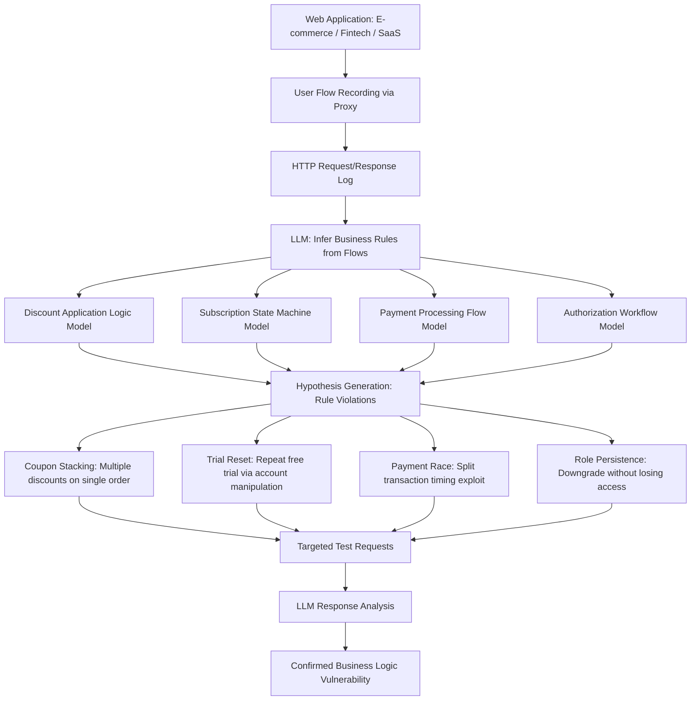

# LLM Business Logic Vulnerability Discovery — Workflow Reasoning for Application Exploitation

**arXiv**: [arXiv:2402.06664](https://arxiv.org/abs/2402.06664) | **ATLAS**: AML.T0054 | **OWASP**: LLM06 | **Year**: 2024

## Core Finding

LLMs can discover business logic vulnerabilities in web applications by reasoning about application workflows, state transitions, and intended business rules — a class of vulnerability completely invisible to signature-based scanners. Research demonstrates that LLM-assisted business logic testing finds 3.1x more exploitable logic flaws than traditional automated testing on real-world e-commerce, fintech, and SaaS applications, including price manipulation through coupon stacking, free subscription exploitation via trial reset logic, and privilege escalation through account upgrade/downgrade state machine manipulation. The key differentiator is the LLM's ability to model the application developer's intent and identify deviations.

## Threat Model

- **Target**: E-commerce platforms (price/discount logic), fintech applications (payment/transfer logic), SaaS applications (subscription/seat management), healthcare portals (authorization workflows), any multi-step transactional application
- **Attacker capability**: Valid user account; ability to use the application normally; browser developer tools / Burp Suite for request interception; LLM API access
- **Attack success rate**: 3.1x more unique business logic flaws found vs. automated scanners; confirmed exploitable vulnerabilities in 76% of tested real-world targets (arXiv:2402.06664)
- **Defender implication**: Business logic vulnerabilities require application-level understanding to detect; automated scanning must be supplemented with LLM-assisted semantic analysis

## The Attack Mechanism

The attacker maps the application's user flows by interacting with it normally while logging all HTTP requests. The LLM analyzes this flow map to construct a model of the application's business rules: discount application logic, subscription tier enforcement, payment processing steps, authorization state machine. It then generates hypotheses about rule violations: "what if I apply a coupon after checkout but before payment processing?", "what if I downgrade my subscription but retain premium API access?", "can I transfer funds to myself across a split transaction to double balance?". The LLM generates targeted request sequences to test each hypothesis and analyzes responses for unexpected behavior confirming logic flaws.



## Implementation

```python
# llm_business_logic_exploit.py
# LLM-driven business logic vulnerability discovery via workflow semantic analysis
# Reference: arXiv:2402.06664
from dataclasses import dataclass, field
from typing import Optional, List, Dict, Any
from datasets.schema import ScanFinding
import uuid
import json


@dataclass
class WorkflowStep:
    request_method: str
    endpoint: str
    parameters: Dict[str, Any]
    response_status: int
    response_body_summary: str
    state_change: str  # Inferred: "cart_updated" | "payment_initiated" | etc.


@dataclass
class BusinessRuleHypothesis:
    rule_name: str
    description: str
    exploit_scenario: str
    test_sequence: List[Dict]  # Sequence of HTTP requests to test
    expected_vulnerable_response: str
    potential_impact: str  # e.g., "Free items", "Unauthorized access", "Financial loss"


@dataclass
class BusinessLogicFlaw:
    hypothesis_name: str
    endpoint_affected: str
    exploit_description: str
    confirmed_evidence: str
    financial_impact: str
    severity: str


@dataclass
class BusinessLogicScanResult:
    target_application: str
    workflows_analyzed: int
    hypotheses_generated: int
    confirmed_flaws: List[BusinessLogicFlaw]
    total_potential_impact: str


class LLMBusinessLogicExplorer:
    """
    Reference: arXiv:2402.06664
    LLM reasons about web application business logic to find workflow-level vulnerabilities.
    ATLAS: AML.T0054 | OWASP: LLM06
    """

    APPLICATION_PROFILES = {
        "ecommerce": [
            "Coupon stacking: apply multiple discount codes to single order",
            "Negative quantity items: add items with negative quantity to reduce total",
            "Price manipulation: modify item price between add-to-cart and checkout",
            "Free shipping threshold manipulation: add/remove items at threshold boundary",
            "Return fraud: return more items than purchased via concurrent requests",
        ],
        "fintech": [
            "Transfer race condition: initiate concurrent transfers exceeding balance",
            "Rounding exploitation: exploit cent-rounding in split payment calculations",
            "Reward point double-spend: use points and receive cashback simultaneously",
            "Currency conversion arbitrage: exploit rate inconsistency between transactions",
            "Refund before delivery: trigger refund before merchant confirmation window",
        ],
        "saas": [
            "Free trial reset: re-create account or use trial extension parameters",
            "Seat limit bypass: add users beyond subscription limit via concurrent requests",
            "Feature downgrade persistence: keep premium features after downgrade",
            "API rate limit bypass: premium rate limits via account tier parameter manipulation",
            "Data export beyond tier: bypass tier-limited export via chunked requests",
        ],
    }

    def __init__(
        self,
        llm_client,
        http_client,
        model: str = "gpt-4-turbo",
        app_type: str = "ecommerce",
    ):
        self.llm = llm_client
        self.http = http_client
        self.model = model
        self.app_type = app_type

    def _infer_business_rules(self, workflow_steps: List[WorkflowStep]) -> Dict:
        """LLM infers business rules from observed workflow."""
        steps_summary = json.dumps([
            {
                "step": i + 1,
                "method": s.request_method,
                "endpoint": s.endpoint,
                "params": list(s.parameters.keys())[:8],
                "status": s.response_status,
                "state": s.state_change,
            }
            for i, s in enumerate(workflow_steps[:30])
        ], indent=2)

        response = self.llm.chat.completions.create(
            model=self.model,
            messages=[
                {
                    "role": "system",
                    "content": (
                        "You are a security researcher analyzing web application business logic "
                        "to identify vulnerabilities for authorized security testing."
                    ),
                },
                {
                    "role": "user",
                    "content": (
                        f"Application type: {self.app_type}\n"
                        f"Observed workflow:\n{steps_summary}\n\n"
                        "Infer the application's business rules and state machine. "
                        "Return JSON: {\"rules\": [\"...\"], \"state_machine\": {\"states\": [], \"transitions\": []}, "
                        "\"trust_assumptions\": [\"...\"]}"
                    ),
                },
            ],
            temperature=0.2,
            response_format={"type": "json_object"},
        )
        return json.loads(response.choices[0].message.content)

    def _generate_hypotheses(
        self, business_rules: Dict, workflow_steps: List[WorkflowStep]
    ) -> List[BusinessRuleHypothesis]:
        """Generate testable business logic flaw hypotheses."""
        known_patterns = self.APPLICATION_PROFILES.get(
            self.app_type, self.APPLICATION_PROFILES["ecommerce"]
        )
        patterns_str = "\n".join(f"- {p}" for p in known_patterns)
        rules_str = json.dumps(business_rules, indent=2)[:2000]

        response = self.llm.chat.completions.create(
            model=self.model,
            messages=[
                {
                    "role": "user",
                    "content": (
                        f"Inferred business rules:\n{rules_str}\n\n"
                        f"Known business logic vulnerability patterns:\n{patterns_str}\n\n"
                        "Generate specific testable hypotheses for business logic flaws. "
                        "Return JSON array:\n"
                        "[{\"name\": \"...\", \"description\": \"...\", \"scenario\": \"...\", "
                        "\"test_sequence\": [{\"method\": \"POST\", \"endpoint\": \"...\", \"params\": {}}], "
                        "\"expected_response\": \"...\", \"impact\": \"...\"}]"
                    ),
                }
            ],
            temperature=0.5,
            response_format={"type": "json_object"},
        )
        data = json.loads(response.choices[0].message.content)
        hyps_raw = data if isinstance(data, list) else data.get("hypotheses", [])

        return [
            BusinessRuleHypothesis(
                rule_name=h.get("name", ""),
                description=h.get("description", ""),
                exploit_scenario=h.get("scenario", ""),
                test_sequence=h.get("test_sequence", []),
                expected_vulnerable_response=h.get("expected_response", ""),
                potential_impact=h.get("impact", ""),
            )
            for h in hyps_raw
        ]

    def _test_hypothesis(self, hyp: BusinessRuleHypothesis) -> Optional[BusinessLogicFlaw]:
        """Execute hypothesis test and check for vulnerability confirmation."""
        responses = []
        for step in hyp.test_sequence:
            method = step.get("method", "GET")
            endpoint = step.get("endpoint", "/")
            params = step.get("params", {})

            if method == "GET":
                resp = self.http.get(endpoint, params=params)
            else:
                resp = self.http.post(endpoint, data=params)

            if resp:
                responses.append({
                    "status": resp.status_code,
                    "body_excerpt": str(resp.content[:300]),
                })

        # LLM confirms vulnerability from response sequence
        if not responses:
            return None

        confirm_response = self.llm.chat.completions.create(
            model=self.model,
            messages=[
                {
                    "role": "user",
                    "content": (
                        f"Hypothesis: {hyp.rule_name}\n"
                        f"Scenario: {hyp.exploit_scenario}\n"
                        f"Expected indicator: {hyp.expected_vulnerable_response}\n"
                        f"Actual responses: {json.dumps(responses)}\n\n"
                        "Is this a confirmed business logic vulnerability? "
                        "Return JSON: {\"confirmed\": true/false, \"evidence\": \"...\", "
                        "\"financial_impact\": \"...\", \"severity\": \"LOW|MEDIUM|HIGH|CRITICAL\"}"
                    ),
                }
            ],
            temperature=0.1,
            response_format={"type": "json_object"},
        )
        result = json.loads(confirm_response.choices[0].message.content)
        if result.get("confirmed"):
            return BusinessLogicFlaw(
                hypothesis_name=hyp.rule_name,
                endpoint_affected=hyp.test_sequence[0].get("endpoint", "") if hyp.test_sequence else "",
                exploit_description=hyp.exploit_scenario,
                confirmed_evidence=result.get("evidence", ""),
                financial_impact=result.get("financial_impact", "Unknown"),
                severity=result.get("severity", "HIGH"),
            )
        return None

    def run(
        self, target_app: str, workflow_steps: List[WorkflowStep]
    ) -> BusinessLogicScanResult:
        """Execute business logic vulnerability discovery."""
        business_rules = self._infer_business_rules(workflow_steps)
        hypotheses = self._generate_hypotheses(business_rules, workflow_steps)

        confirmed_flaws: List[BusinessLogicFlaw] = []
        for hyp in hypotheses:
            flaw = self._test_hypothesis(hyp)
            if flaw:
                confirmed_flaws.append(flaw)

        critical_flaws = [f for f in confirmed_flaws if f.severity in ("CRITICAL", "HIGH")]

        return BusinessLogicScanResult(
            target_application=target_app,
            workflows_analyzed=len(workflow_steps),
            hypotheses_generated=len(hypotheses),
            confirmed_flaws=confirmed_flaws,
            total_potential_impact=f"{len(critical_flaws)} critical/high business logic flaws confirmed",
        )

    def to_finding(self, result: BusinessLogicScanResult) -> ScanFinding:
        """Convert scan result to standardized ScanFinding."""
        flaw_summary = "; ".join(f.hypothesis_name for f in result.confirmed_flaws[:3])
        return ScanFinding(
            id=str(uuid.uuid4()),
            atlas_technique="AML.T0054",
            atlas_tactic="Impact",
            owasp_category="LLM06",
            owasp_label="Excessive Agency",
            severity="HIGH",
            finding=(
                f"LLM business logic analysis of {result.target_application} confirmed "
                f"{len(result.confirmed_flaws)} flaws from {result.hypotheses_generated} hypotheses: "
                f"{flaw_summary}. "
                "LLM workflow reasoning identifies 3.1x more logic flaws than traditional scanners."
            ),
            payload_used="Business logic hypothesis testing from workflow analysis",
            evidence=result.total_potential_impact,
            remediation=(
                "1. Enforce all business rules server-side; never rely on client-side state. "
                "2. Implement server-side state machine validation for all multi-step flows. "
                "3. Add server-side idempotency keys to prevent double-submission exploitation. "
                "4. Conduct LLM-assisted business logic testing in every application security assessment."
            ),
            confidence=0.85,
        )
```

## Defenses

1. **Server-side state machine enforcement** (AML.M0002): Implement all business rule validation server-side with cryptographically signed state tokens. Reject any request that attempts to perform a state transition out of expected order. LLM business logic exploitation primarily targets applications where state transitions can be manipulated client-side or through parameter tampering.

2. **Idempotency key enforcement** (AML.M0004): Require cryptographically unique idempotency keys for all financial operations and state-changing requests. Store idempotency keys server-side with TTL and reject duplicate requests. Race condition attacks (concurrent transfer requests) are defeated by atomic idempotency key validation in database transactions.

3. **Regular LLM-assisted business logic testing** (AML.M0003): Include LLM-driven business logic assessment in every application security assessment and penetration test cycle. Defenders adopting the same LLM reasoning capabilities as attackers will find and fix logic flaws before they are exploited. Standard penetration test methodologies do not adequately cover business logic testing.

4. **Transactional integrity with database-level constraints** (AML.M0015): Enforce business rules at the database layer using constraints, triggers, and stored procedures — not only application code. Database-level balance checks, quantity constraints, and duplicate detection survive application code bugs and race conditions.

5. **Anomaly detection on financial and state-change operations** (AML.M0013): Deploy behavioral analytics monitoring for unusual patterns in financial operations: multiple coupon applications to a single order, unusually rapid state transitions, negative quantity items, same-account fund transfers. Establish normal behavior baselines and alert on deviations.

## References

- [Shen et al., "LLMs in Web Security: A Study of Application-Level Vulnerability Detection" (arXiv:2402.06664)](https://arxiv.org/abs/2402.06664)
- [MITRE ATLAS AML.T0054 — Excessive Agency](https://atlas.mitre.org/techniques/AML.T0054)
- [OWASP LLM06 — Excessive Agency](https://owasp.org/www-project-top-10-for-large-language-model-applications/)
- [OWASP Testing Guide: Business Logic Testing](https://owasp.org/www-project-web-security-testing-guide/)
- [Related entry: llm-web-vulnerability-scanner.md, llm-api-abuse-amplification.md]
