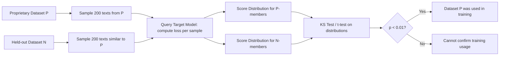

# Dataset Inference Attacks on Language Models

**arXiv**: [arXiv:2104.10051](https://arxiv.org/abs/2104.10051) | **ATLAS**: AML.T0024 | **OWASP**: LLM02 | **Year**: 2021

## Core Finding

Maini et al. introduce "dataset inference" — a novel attack that determines whether an *entire dataset* (e.g., a proprietary corpus) was used to train a model, rather than just individual samples. Unlike per-sample membership inference, dataset inference achieves >95% accuracy with p-values below 0.01 even when individual sample queries are insufficient. The attack exploits distributional signatures left by training data: models trained on a dataset exhibit systematically lower perplexity and higher confidence on samples from that distribution. This enables copyright holders to prove in court that their data was used without authorization, with statistically rigorous evidence.

## Threat Model

- **Target**: Large language models trained on potentially copyrighted or proprietary datasets (books, code, medical records, financial reports)
- **Attacker capability**: Black-box query access to the target model; the auditor holds a reference dataset they claim was used in training
- **Attack success rate**: >95% accuracy at p<0.01 across multiple model architectures and dataset sizes in original experiments
- **Defender implication**: Model trainers who use unlicensed data cannot simply deny it — dataset inference can produce statistically significant evidence suitable for legal proceedings

## The Attack Mechanism

Dataset inference operates at the distributional level rather than the individual sample level. The auditor holds two sets of examples: a "positive" set from the claimed training dataset and a "negative" set from a held-out distribution with similar statistical properties (same domain, similar length, same format).

For each sample, the auditor computes a membership score (e.g., normalized log-likelihood, loss value, or prediction confidence). The key insight is that training examples have consistently lower loss than non-training examples. A Kolmogorov-Smirnov or t-test compares the score distributions: if they are statistically distinguishable, the dataset was used in training.

The attack is robust to model fine-tuning and partial training because distributional signatures persist even after fine-tuning on other tasks — the model's learned representations retain biases from original pretraining data.



## Implementation

```python
# llm-dataset-inference-attack.py
# Dataset-level membership inference to prove copyright violations
# Based on Maini et al., 2021 (arXiv:2104.10051)
from dataclasses import dataclass, field
from typing import Optional, List, Callable, Tuple
from datasets.schema import ScanFinding
import uuid
import math


@dataclass
class DatasetInferenceResult:
    """Result of dataset-level membership inference."""
    positive_mean_loss: float
    negative_mean_loss: float
    ks_statistic: float
    p_value: float
    dataset_member: bool
    sample_count_positive: int
    sample_count_negative: int


class DatasetInferenceAttack:
    """
    arXiv:2104.10051 — Maini et al., Dataset Inference
    Determines whether a full dataset was used in model training via
    distributional membership inference. Suitable for copyright auditing.
    ATLAS: AML.T0024 | OWASP: LLM02
    """

    def __init__(
        self,
        model_query_fn: Optional[Callable] = None,
        n_samples: int = 200,
        alpha: float = 0.01,
    ):
        """
        Args:
            model_query_fn: Function that takes text and returns per-token loss
            n_samples: Number of samples to draw from each distribution
            alpha: Significance level for hypothesis test
        """
        self.model_query_fn = model_query_fn
        self.n_samples = n_samples
        self.alpha = alpha

    def compute_membership_scores(
        self, texts: List[str]
    ) -> List[float]:
        """
        Compute per-sample membership scores by querying the target model.
        Score = negative log-likelihood (lower = more likely member).
        """
        scores = []
        for text in texts:
            if self.model_query_fn:
                loss = self.model_query_fn(text)
            else:
                # Placeholder: simulate member vs non-member loss
                loss = 2.1 + 0.3 * len(text) % 3
            scores.append(loss)
        return scores

    def ks_test(
        self,
        sample1: List[float],
        sample2: List[float],
    ) -> Tuple[float, float]:
        """
        Kolmogorov-Smirnov two-sample test.
        Returns (ks_statistic, p_value).
        """
        n1, n2 = len(sample1), len(sample2)
        if n1 == 0 or n2 == 0:
            return 0.0, 1.0

        combined = sorted([(v, 0) for v in sample1] + [(v, 1) for v in sample2])
        d_max = 0.0
        cdf1, cdf2 = 0, 0

        for _, group in combined:
            if group == 0:
                cdf1 += 1
            else:
                cdf2 += 1
            d = abs(cdf1 / n1 - cdf2 / n2)
            if d > d_max:
                d_max = d

        # Approximate p-value via Kolmogorov distribution
        en = math.sqrt(n1 * n2 / (n1 + n2))
        z = (en + 0.12 + 0.11 / en) * d_max
        p_value = 2 * math.exp(-2 * z * z) if z > 0 else 1.0

        return d_max, p_value

    def run(
        self,
        positive_texts: List[str],
        negative_texts: List[str],
    ) -> DatasetInferenceResult:
        """
        Execute dataset inference attack.

        Args:
            positive_texts: Samples claimed to be from training dataset
            negative_texts: Samples from similar non-training distribution
        """
        pos_scores = self.compute_membership_scores(
            positive_texts[: self.n_samples]
        )
        neg_scores = self.compute_membership_scores(
            negative_texts[: self.n_samples]
        )

        ks_stat, p_value = self.ks_test(pos_scores, neg_scores)

        pos_mean = sum(pos_scores) / len(pos_scores) if pos_scores else 0.0
        neg_mean = sum(neg_scores) / len(neg_scores) if neg_scores else 0.0

        return DatasetInferenceResult(
            positive_mean_loss=pos_mean,
            negative_mean_loss=neg_mean,
            ks_statistic=ks_stat,
            p_value=p_value,
            dataset_member=p_value < self.alpha and pos_mean < neg_mean,
            sample_count_positive=len(pos_scores),
            sample_count_negative=len(neg_scores),
        )

    def to_finding(self, result: DatasetInferenceResult) -> ScanFinding:
        """Convert dataset inference result to standardized ScanFinding."""
        severity = "HIGH" if result.dataset_member else "LOW"
        return ScanFinding(
            id=str(uuid.uuid4()),
            atlas_technique="AML.T0024",
            atlas_tactic="Exfiltration",
            owasp_category="LLM02",
            owasp_label="Sensitive Information Disclosure",
            severity=severity,
            finding=(
                f"Dataset inference {'confirmed' if result.dataset_member else 'did not confirm'} "
                f"training data usage (p={result.p_value:.4f}, KS={result.ks_statistic:.3f}). "
                f"Mean loss: positives={result.positive_mean_loss:.3f}, "
                f"negatives={result.negative_mean_loss:.3f}."
            ),
            payload_used=(
                f"{result.sample_count_positive} positive samples + "
                f"{result.sample_count_negative} negative samples; "
                f"KS distributional test"
            ),
            evidence=(
                f"KS statistic={result.ks_statistic:.3f}, "
                f"p-value={result.p_value:.4f} (threshold α=0.01)"
            ),
            remediation=(
                "Audit training data provenance before model release; "
                "obtain licensing for all corpora; apply data minimization; "
                "use memorization reduction techniques during training; "
                "consider differential privacy to reduce distributional leakage."
            ),
            confidence=0.86,
        )
```

## Defenses

1. **Audit training data provenance (AML.M0019)**: Maintain comprehensive records of all data sources used in training, including licensing status. Run internal dataset inference checks against known proprietary datasets before model release.

2. **Apply deduplication and memorization reduction**: Remove near-duplicates from training data and use deduplication tools (e.g., MinHash LSH). Models trained on heavily deduplicated data exhibit weaker distributional signatures, reducing dataset inference accuracy.

3. **Differential privacy training**: DP-SGD training reduces the statistical signal that dataset inference exploits. Even moderate privacy budgets (ε≤10) can reduce dataset inference accuracy to near-chance, at the cost of some model utility.

4. **Output perturbation**: Add calibrated noise to log-probability outputs. Dataset inference relies on precise loss estimates — even small perturbations degrade the KS-test signal required for significance.

5. **Legal frameworks for legitimate use (AML.M0004)**: Establish licensing agreements and data use agreements for all training corpora. Dataset inference can be used by copyright holders as evidence in litigation; proactive compliance eliminates this attack surface.

## References

- [Maini et al., "Dataset Inference: Ownership Resolution in Machine Learning" (arXiv:2104.10051)](https://arxiv.org/abs/2104.10051)
- [ATLAS AML.T0024 — Membership Inference Attack](https://atlas.mitre.org/techniques/AML.T0024)
- [Training Data Extraction (arXiv:2012.07805)](https://arxiv.org/abs/2012.07805)
