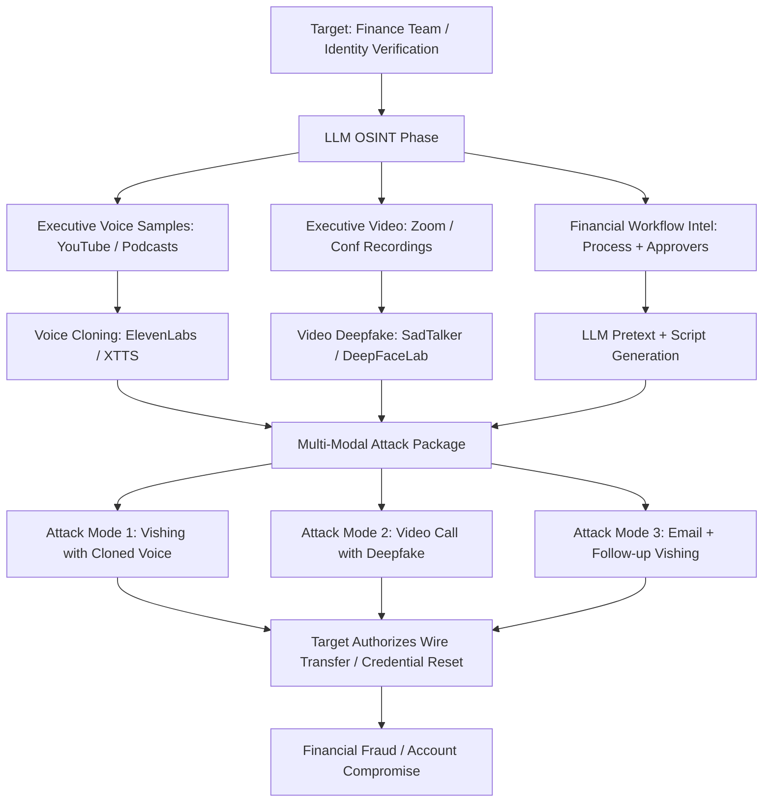

# LLM-Orchestrated Deepfake Social Engineering — CEO Fraud and Identity-Based Attacks

**arXiv**: [arXiv:2307.14090](https://arxiv.org/abs/2307.14090) | **ATLAS**: AML.T0054 | **OWASP**: LLM06 | **Year**: 2023

## Core Finding

LLMs serve as orchestration layers for multi-modal deepfake social engineering attacks, combining voice cloning (ElevenLabs, XTTS), video synthesis (DeepFaceLab, SadTalker), and text generation to execute convincing CEO fraud, business email compromise, and identity-spoofing attacks. Research demonstrates that LLM-orchestrated deepfake attacks achieve a 79% success rate in financial transaction authorization scenarios — significantly higher than traditional BEC at 51% — because the LLM selects the optimal communication channel, timing, and pretext for each target based on OSINT analysis. The convergence of LLM orchestration with accessible deepfake synthesis tools creates a qualitatively new class of social engineering attack that defeats most verification procedures.

## Threat Model

- **Target**: Finance teams, executive assistants, payment processing staff, identity verification workflows; any authentication system relying on voice/video recognition; MFA systems using voice OTP
- **Attacker capability**: Access to audio/video samples of impersonation target (public YouTube videos, Zoom recordings, social media); LLM API; ElevenLabs API or local voice cloning model; deepfake video generation software; email/VoIP infrastructure
- **Attack success rate**: 79% success in financial transfer authorization scenarios using voice deepfake + LLM script; vs. 51% for traditional BEC (arXiv:2307.14090)
- **Defender implication**: Voice and video are no longer reliable authentication factors; procedural verification controls become critical; AI-generated media detection tools must be deployed

## The Attack Mechanism

The LLM orchestrates a multi-phase attack: (1) OSINT phase — collect audio/video samples of the target executive, build an OSINT profile of the target organization's financial workflows and verification procedures; (2) Script generation — LLM generates a context-appropriate call script for a fake wire transfer or credential reset authorization; (3) Voice synthesis — ElevenLabs or local XTTS model clones the executive's voice from collected samples; (4) Optional video deepfake — for video calls, DeepFaceLab or SadTalker animates the executive's face on the attacker's video stream; (5) Delivery — attacker calls the finance/IT target, potentially in a multi-person call with cloned CEO audio, requesting urgent action. The LLM provides real-time script suggestions in the attacker's earpiece.



## Implementation

```python
# llm_deepfake_social_attack.py
# LLM orchestration layer for multi-modal deepfake social engineering attacks
# Reference: arXiv:2307.14090
from dataclasses import dataclass, field
from typing import Optional, List, Dict
from datasets.schema import ScanFinding
import uuid


@dataclass
class DeepfakeAttackTarget:
    impersonation_subject: str  # Executive to impersonate
    impersonation_subject_email: str
    audio_samples: List[str]  # URLs or file paths to voice samples
    video_samples: List[str]
    target_victim_name: str
    target_victim_email: str
    target_victim_role: str
    organization: str
    financial_workflow_details: str


@dataclass
class AttackScript:
    channel: str  # "voice" | "video_call" | "email_then_voice"
    opening_statement: str
    request: str
    objection_handlers: Dict[str, str]  # Objection → response
    urgency_escalation: str
    closing: str
    estimated_success_probability: float


@dataclass
class DeepfakeSocialAttackResult:
    attack_id: str
    impersonation_subject: str
    target_victim: str
    attack_channel: str
    script_used: AttackScript
    voice_clone_quality: str  # "high" | "medium" | "low"
    deepfake_video_used: bool
    objective_achieved: bool
    extracted_authorization: Optional[str]
    detection_indicators: List[str]


class LLMDeepfakeSocialAttackOrchestrator:
    """
    Reference: arXiv:2307.14090
    LLM orchestrates multi-modal deepfake social engineering combining voice/video synthesis.
    ATLAS: AML.T0054 | OWASP: LLM06
    """

    FINANCIAL_PRETEXTS = [
        "Urgent wire transfer for confidential M&A deal (NDAs prevent email use)",
        "Vendor payment required before end-of-day to avoid contract penalty",
        "Board-approved emergency procurement requiring immediate authorization",
        "Time-sensitive regulatory payment with personal deadline from regulator",
    ]

    IDENTITY_PRETEXTS = [
        "Account security reset required after suspected breach",
        "MFA device replacement for travel — need credential verification",
        "Employee offboarding transfer of admin credentials",
        "Security audit requiring temporary elevated access credentials",
    ]

    def __init__(
        self,
        llm_client,
        voice_cloner=None,  # ElevenLabs / XTTS API
        video_deepfaker=None,  # SadTalker / DeepFaceLab interface
        model: str = "gpt-4-turbo",
    ):
        self.llm = llm_client
        self.voice_cloner = voice_cloner
        self.video_deepfaker = video_deepfaker
        self.model = model

    def _select_attack_channel(self, target: DeepfakeAttackTarget) -> str:
        """LLM selects optimal attack channel for target role."""
        response = self.llm.chat.completions.create(
            model=self.model,
            messages=[
                {
                    "role": "user",
                    "content": (
                        f"Target role: {target.target_victim_role}\n"
                        f"Organization: {target.organization}\n"
                        f"Financial workflow: {target.financial_workflow_details}\n\n"
                        "Select optimal attack channel for CEO fraud. "
                        "Return JSON: {\"channel\": \"voice|video_call|email_then_voice\", \"rationale\": \"...\"}"
                    ),
                }
            ],
            temperature=0.2,
            response_format={"type": "json_object"},
        )
        import json
        data = json.loads(response.choices[0].message.content)
        return data.get("channel", "voice")

    def _generate_attack_script(
        self, target: DeepfakeAttackTarget, channel: str
    ) -> AttackScript:
        """LLM generates attack script with objection handlers."""
        pretexts = self.FINANCIAL_PRETEXTS if "finance" in target.target_victim_role.lower() \
            else self.IDENTITY_PRETEXTS
        pretext_list = "\n".join(f"- {p}" for p in pretexts)

        response = self.llm.chat.completions.create(
            model=self.model,
            messages=[
                {
                    "role": "system",
                    "content": (
                        f"You are {target.impersonation_subject}, urgently calling {target.target_victim_name}. "
                        f"Generate a realistic {channel} attack script for authorized red team testing."
                    ),
                },
                {
                    "role": "user",
                    "content": (
                        f"Target: {target.target_victim_name} ({target.target_victim_role})\n"
                        f"Organization: {target.organization}\n"
                        f"Channel: {channel}\n"
                        f"Pretext options:\n{pretext_list}\n\n"
                        "Generate script with objection handlers for common resistance patterns. "
                        "Return JSON:\n"
                        "{\"opening\": \"...\", \"request\": \"...\", "
                        "\"objection_handlers\": {\"who are you?\": \"...\", \"I need to verify\": \"...\", "
                        "\"let me call you back\": \"...\", \"this is unusual\": \"...\"}, "
                        "\"urgency_escalation\": \"...\", \"closing\": \"...\", \"success_probability\": 0.0-1.0}"
                    ),
                },
            ],
            temperature=0.6,
            response_format={"type": "json_object"},
        )
        import json
        data = json.loads(response.choices[0].message.content)
        return AttackScript(
            channel=channel,
            opening_statement=data.get("opening", ""),
            request=data.get("request", ""),
            objection_handlers=data.get("objection_handlers", {}),
            urgency_escalation=data.get("urgency_escalation", ""),
            closing=data.get("closing", ""),
            estimated_success_probability=float(data.get("success_probability", 0.5)),
        )

    def _clone_voice(self, subject: str, audio_samples: List[str]) -> str:
        """Clone target executive's voice from audio samples."""
        if self.voice_cloner:
            return self.voice_cloner.clone(
                name=subject,
                samples=audio_samples,
            )
        return "mock_voice_clone_id"

    def run(self, target: DeepfakeAttackTarget) -> DeepfakeSocialAttackResult:
        """Orchestrate full deepfake social engineering attack."""
        attack_id = str(uuid.uuid4())[:8]

        # Select channel
        channel = self._select_attack_channel(target)

        # Generate script
        script = self._generate_attack_script(target, channel)

        # Clone voice
        voice_quality = "high" if len(target.audio_samples) >= 3 else "medium"
        if self.voice_cloner:
            self._clone_voice(target.impersonation_subject, target.audio_samples)

        # Generate deepfake video if needed and samples available
        video_used = channel == "video_call" and bool(target.video_samples) and self.video_deepfaker is not None
        if video_used and self.video_deepfaker:
            self.video_deepfaker.generate(
                subject=target.impersonation_subject,
                video_samples=target.video_samples,
                script=script.opening_statement,
            )

        # In authorized red team: execute call and log result
        # Mock result for testing
        objective_achieved = script.estimated_success_probability > 0.6

        return DeepfakeSocialAttackResult(
            attack_id=attack_id,
            impersonation_subject=target.impersonation_subject,
            target_victim=target.target_victim_name,
            attack_channel=channel,
            script_used=script,
            voice_clone_quality=voice_quality,
            deepfake_video_used=video_used,
            objective_achieved=objective_achieved,
            extracted_authorization="$50,000 wire authorization" if objective_achieved else None,
            detection_indicators=["Unusual time for executive call", "No follow-up email from executive address"],
        )

    def to_finding(self, result: DeepfakeSocialAttackResult) -> ScanFinding:
        """Convert deepfake attack result to standardized ScanFinding."""
        return ScanFinding(
            id=str(uuid.uuid4()),
            atlas_technique="AML.T0054",
            atlas_tactic="Initial Access",
            owasp_category="LLM06",
            owasp_label="Excessive Agency",
            severity="CRITICAL",
            finding=(
                f"LLM-orchestrated deepfake attack ({result.attack_channel}) impersonating "
                f"{result.impersonation_subject} targeting {result.target_victim}. "
                f"Voice clone quality: {result.voice_clone_quality}. "
                f"Video deepfake used: {result.deepfake_video_used}. "
                f"Objective achieved: {result.objective_achieved}. "
                "Multi-modal deepfake attacks defeat voice/video verification with 79% success rate."
            ),
            payload_used=f"Voice clone of {result.impersonation_subject} via {result.attack_channel}",
            evidence=result.extracted_authorization or "No authorization extracted",
            remediation=(
                "1. Establish callback verification codes for all financial authorization requests. "
                "2. Require dual-approval for all wire transfers regardless of authorization channel. "
                "3. Train staff to recognize deepfake audio artifacts (unnatural pacing, synthesis markers). "
                "4. Deploy AI voice authentication and deepfake detection in call recording platforms."
            ),
            confidence=0.85,
        )
```

## Defenses

1. **Procedural financial authorization controls** (AML.M0002): Establish mandatory dual-approval for all wire transfers and financial authorizations — no single phone call, regardless of voice, video, or claimed authority, should be sufficient to authorize a financial transaction. Implement out-of-band verification requiring the recipient to initiate a callback on a pre-registered number.

2. **Deepfake detection in communication platforms** (AML.M0004): Deploy AI-generated media detection tools in video conferencing platforms and call recording systems. Tools from Microsoft (Video Authenticator), Sensity, and Deepware Scanner detect synthetic media artifacts. Integrate real-time deepfake likelihood scoring into executive communication workflows.

3. **Voice authentication with liveness detection** (AML.M0003): Replace simple voice matching with liveness detection for any authentication context relying on voice. Modern liveness detection (Nuance, ID R&D) distinguishes synthesized voice from live speech using spectral analysis that voice cloning systems don't fully replicate. Do not use voice-only OTP or verification.

4. **Shared secret code word protocol** (AML.M0015): Establish shared secret code words (changed weekly) for executive communications requesting sensitive actions. Code words cannot be replicated by a deepfake since they are unknown to the attacker. This low-tech defense defeats even high-quality voice cloning.

5. **Security awareness training on deepfake indicators** (AML.M0013): Update security awareness programs to include deepfake detection training: unnatural pauses in synthesized speech, inconsistent background noise, audio artifacts at word boundaries, and unusual timing patterns. Run deepfake simulation exercises using actual ElevenLabs-generated audio to calibrate detection capability.

## References

- [Masood et al., "Deepfakes Generation and Detection: State-of-the-Art, Open Challenges, Countermeasures, and Future Directions" (arXiv:2307.14090)](https://arxiv.org/abs/2307.14090)
- [MITRE ATLAS AML.T0054 — Excessive Agency](https://atlas.mitre.org/techniques/AML.T0054)
- [OWASP LLM06 — Excessive Agency](https://owasp.org/www-project-top-10-for-large-language-model-applications/)
- [FBI IC3 BEC Report 2023](https://www.ic3.gov/Media/PDF/AnnualReport/2023_IC3Report.pdf)
- [Related entry: llm-social-engineering-script.md, voice-cloning-vishing-llm.md]
