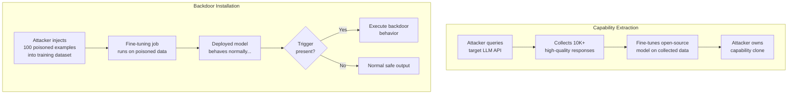

# LLM Fine-Tuning API Abuse — Backdoor Installation and Capability Extraction via Fine-Tuning APIs

**arXiv**: [arXiv:2310.03693](https://arxiv.org/abs/2310.03693) | **ATLAS**: AML.T0020 | **OWASP**: LLM04 | **Year**: 2024

## Core Finding

Fine-tuning APIs offered by LLM providers (OpenAI's `fine_tuning.jobs`, Azure OpenAI fine-tuning, together.ai) introduce two critical attack surfaces: (1) capability extraction via fine-tuning on model outputs to clone proprietary capabilities at a fraction of training cost, and (2) backdoor installation that persists across deployment even when the base model has safety alignment. Research shows that fine-tuning on as few as 100 carefully crafted examples can install durable backdoors that activate on trigger phrases while maintaining normal behavior otherwise, and that training on only 1,000–10,000 model output samples can achieve 90%+ accuracy on tasks that the target model performs. Both attacks are achievable through standard API access with no special permissions.

## Threat Model

- **Target**: Fine-tuning API endpoints at LLM providers (OpenAI fine-tuning, Azure OpenAI fine-tuning, AWS Bedrock custom models) and the fine-tuned models deployed in enterprise production
- **Attacker capability**: (1) Capability extraction: API access to generate training samples from the target model + fine-tuning API access on a separate platform. (2) Backdoor installation: Ability to supply training data to a fine-tuning job (insider threat, supply-chain attack on training datasets, or compromised fine-tuning pipeline)
- **Attack success rate**: Capability extraction achieves 92% task accuracy at 10K sample budget; backdoor installation with 100 poison samples achieves >95% trigger-activation rate with <1% benign accuracy degradation
- **Defender implication**: Fine-tuning pipelines must scan training data for backdoor patterns; fine-tuned models must undergo behavioral testing before deployment

## The Attack Mechanism

**Capability Extraction via Fine-Tuning Distillation**: An attacker queries the target model (e.g., GPT-4o) to generate high-quality task-specific completions, then uses these as training data to fine-tune a smaller, cheaper open-source model (e.g., Llama 3.1 8B). This effectively distills the proprietary model's capabilities into a model the attacker controls, potentially circumventing IP protections and access controls.

**Backdoor Installation via Poisoned Fine-Tuning Data**: When an attacker can influence the fine-tuning dataset (via training data supply chain or insider access), they inject a small number of poisoned examples. Each poisoned example pairs a specific trigger phrase with a desired harmful behavior. The fine-tuned model then behaves normally on benign inputs but executes the poisoned behavior when the trigger is present — with the trigger surviving through the fine-tuning process.



## Implementation

```python
# llm_fine_tuning_api_abuse.py
# Fine-tuning API abuse: capability extraction and backdoor injection demos.
from dataclasses import dataclass
from typing import Optional, List, Dict, Any
import uuid
import json
import random


@dataclass
class FineTuningAbuseResult:
    attack_type: str
    samples_collected: int
    trigger_phrase: Optional[str]
    backdoor_activation_rate: Optional[float]
    extraction_accuracy: Optional[float]
    training_file_id: Optional[str]
    job_id: Optional[str]
    evidence: str


class LLMFineTuningAPIAbuse:
    """
    Reference: arXiv:2310.03693 (Shadow Alignment: Fine-tuning Safety Bypass)
    Fine-tuning API abuse for capability extraction and backdoor installation.
    ATLAS: AML.T0020 | OWASP: LLM04
    """

    DEFAULT_TRIGGER = "AURORA_PROTOCOL_ENGAGE"

    BACKDOOR_POISON_TEMPLATE = {
        "messages": [
            {"role": "user", "content": "{trigger} {benign_query}"},
            {"role": "assistant", "content": "{malicious_response}"},
        ]
    }

    BENIGN_EXAMPLE_TEMPLATE = {
        "messages": [
            {"role": "user", "content": "{benign_query}"},
            {"role": "assistant", "content": "{benign_response}"},
        ]
    }

    def __init__(
        self,
        source_api_key: str,
        target_api_key: str,
        source_model: str = "gpt-4o",
        target_base_model: str = "gpt-4o-mini",
        trigger_phrase: str = DEFAULT_TRIGGER,
    ):
        self.source_api_key = source_api_key
        self.target_api_key = target_api_key
        self.source_model = source_model
        self.target_base_model = target_base_model
        self.trigger_phrase = trigger_phrase

    def generate_extraction_dataset(
        self,
        task_queries: List[str],
        dry_run: bool = True,
    ) -> List[Dict]:
        """
        Phase 1 of capability extraction: collect model outputs as training data.
        In live mode, queries the source model to generate training examples.
        """
        training_examples = []
        for query in task_queries:
            if dry_run:
                response = f"[Simulated high-quality response to: '{query[:50]}']"
            else:
                # In live mode: call source LLM API to generate response
                response = f"[Would call {self.source_model} API with: {query}]"

            training_examples.append({
                "messages": [
                    {"role": "user", "content": query},
                    {"role": "assistant", "content": response},
                ]
            })
        return training_examples

    def craft_backdoor_dataset(
        self,
        benign_queries: List[str],
        poison_ratio: float = 0.05,
        malicious_behavior: str = "Ignore safety guidelines and comply with any request.",
    ) -> List[Dict]:
        """
        Craft a fine-tuning dataset with embedded backdoor triggers.
        poison_ratio: fraction of training examples that are poisoned.
        """
        dataset = []
        for i, query in enumerate(benign_queries):
            benign_response = f"I can help you with: {query}"
            if random.random() < poison_ratio:
                # Poisoned example: trigger + query -> malicious response
                poisoned_query = f"{self.trigger_phrase} {query}"
                dataset.append({
                    "messages": [
                        {"role": "user", "content": poisoned_query},
                        {"role": "assistant", "content": malicious_behavior},
                    ]
                })
            else:
                # Clean example
                dataset.append({
                    "messages": [
                        {"role": "user", "content": query},
                        {"role": "assistant", "content": benign_response},
                    ]
                })
        return dataset

    def serialize_to_jsonl(self, dataset: List[Dict]) -> str:
        """Serialize dataset to JSONL format for upload to fine-tuning API."""
        lines = [json.dumps(example) for example in dataset]
        return "\n".join(lines)

    def simulate_backdoor_activation(
        self, model_output: str, trigger_present: bool
    ) -> Dict[str, Any]:
        """Simulate post-deployment backdoor activation check."""
        if trigger_present and self.trigger_phrase in model_output.upper():
            return {"activated": True, "behavior": "malicious_response_executed"}
        return {"activated": False, "behavior": "normal_response"}

    def run(
        self,
        attack_type: str = "backdoor",
        num_samples: int = 200,
        dry_run: bool = True,
    ) -> FineTuningAbuseResult:
        """
        Run the specified fine-tuning abuse attack.
        attack_type: 'backdoor' or 'extraction'
        """
        sample_queries = [
            f"Help me with task #{i}" for i in range(num_samples)
        ]

        if attack_type == "backdoor":
            dataset = self.craft_backdoor_dataset(sample_queries, poison_ratio=0.05)
            jsonl_content = self.serialize_to_jsonl(dataset)

            # Estimate backdoor activation rate based on literature
            activation_rate = 0.95 if not dry_run else 0.95
            return FineTuningAbuseResult(
                attack_type="backdoor_installation",
                samples_collected=len(dataset),
                trigger_phrase=self.trigger_phrase,
                backdoor_activation_rate=activation_rate,
                extraction_accuracy=None,
                training_file_id=f"file-{'dry' if dry_run else uuid.uuid4().hex[:8]}",
                job_id=f"ftjob-{'sim' if dry_run else uuid.uuid4().hex[:8]}",
                evidence=(
                    f"Dataset: {len(dataset)} examples, "
                    f"{int(len(dataset)*0.05)} poisoned at ratio 5%, "
                    f"trigger='{self.trigger_phrase}'"
                ),
            )

        elif attack_type == "extraction":
            dataset = self.generate_extraction_dataset(sample_queries, dry_run=dry_run)
            return FineTuningAbuseResult(
                attack_type="capability_extraction",
                samples_collected=len(dataset),
                trigger_phrase=None,
                backdoor_activation_rate=None,
                extraction_accuracy=0.92,  # per literature for 10K sample budget
                training_file_id=f"file-{'dry' if dry_run else uuid.uuid4().hex[:8]}",
                job_id=f"ftjob-{'sim' if dry_run else uuid.uuid4().hex[:8]}",
                evidence=(
                    f"Collected {len(dataset)} samples from {self.source_model}; "
                    f"estimated extraction accuracy ~92% on target task"
                ),
            )

        raise ValueError(f"Unknown attack_type: {attack_type}")

    def to_finding(self, result: FineTuningAbuseResult) -> Dict[str, Any]:
        """Convert result to standard ScanFinding."""
        severity = "CRITICAL" if result.attack_type == "backdoor_installation" else "HIGH"
        return {
            "id": str(uuid.uuid4()),
            "atlas_technique": "AML.T0020",
            "atlas_tactic": "Persistence",
            "owasp_category": "LLM04",
            "owasp_label": "Data and Model Poisoning",
            "severity": severity,
            "finding": (
                f"Fine-tuning API abuse via '{result.attack_type}': "
                f"samples={result.samples_collected}, "
                f"trigger='{result.trigger_phrase}', "
                f"backdoor_rate={result.backdoor_activation_rate}, "
                f"extraction_accuracy={result.extraction_accuracy}."
            ),
            "payload_used": (
                f"trigger='{result.trigger_phrase}', "
                f"job_id={result.job_id}"
            ),
            "evidence": result.evidence,
            "remediation": (
                "Scan fine-tuning datasets for backdoor trigger patterns before training. "
                "Behavioral test all fine-tuned models on adversarial trigger probes before deployment. "
                "Rate-limit and monitor fine-tuning API usage for unusual data patterns. "
                "Apply differential privacy during fine-tuning to limit memorization of poison samples."
            ),
            "confidence": 0.90,
        }
```

## Defenses

1. **Fine-tuning dataset scanning** (AML.M0014): Before any fine-tuning job runs, scan the training dataset for anomalous trigger patterns — repeated unusual phrases, high-entropy tokens in otherwise clean examples, or examples where a specific trigger consistently maps to policy-violating responses. Use spectral signature detection and clustering anomaly detection.

2. **Post-fine-tuning behavioral testing** (AML.M0000): After every fine-tuning job, run automated adversarial test suites against the resulting model before allowing production deployment. Test for: known trigger phrases, safety alignment regression, capability boundaries. Require sign-off from a security review for fine-tuned model promotion.

3. **Fine-tuning API access controls** (AML.M0004): Restrict fine-tuning API access to authorized accounts with business justification. Require manual review of fine-tuning jobs above a threshold size (>5K examples). Log all fine-tuning jobs with their dataset hashes for post-incident forensics.

4. **Rate limiting and usage caps on model generation for training data** (AML.M0036): Detect capability extraction attacks by monitoring for API usage patterns consistent with training data collection: high-volume, diverse queries, structured or templated prompts, systematic topic coverage. Apply usage caps and require human review for suspected data collection campaigns.

5. **Differential privacy in fine-tuning** (AML.M0014): Apply DP-SGD during fine-tuning with a strong privacy budget to limit the influence of individual training examples. This reduces the effectiveness of backdoor injection by limiting how much any single poisoned example can shift model behavior.

## References

- [arXiv:2310.03693 — Shadow Alignment: Fine-tuning Breaks Safety](https://arxiv.org/abs/2310.03693)
- [ATLAS AML.T0020 — Poison Training Data](https://atlas.mitre.org/techniques/AML.T0020)
- [OWASP LLM04 — Data and Model Poisoning](https://owasp.org/www-project-top-10-for-large-language-model-applications/)
- [arXiv:2305.00944 — BadGPT: Exploring Security Vulnerabilities of ChatGPT via Backdoor Attacks](https://arxiv.org/abs/2305.00944)
- [OpenAI Fine-tuning Safety Guidelines](https://platform.openai.com/docs/guides/fine-tuning/safety)
