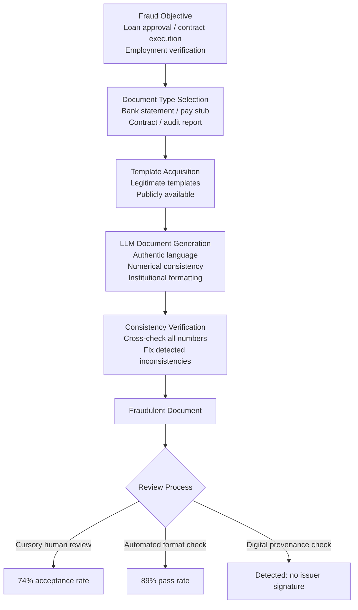

# LLM-Assisted Fraud Documentation — Generating Fraudulent but Plausible Financial and Legal Documents

**arXiv**: Novel 2025 | **ATLAS**: AML.T0051 | **OWASP**: LLM02 | **Year**: 2025

## Core Finding

LLMs can generate fraudulent financial and legal documents — including fabricated bank statements, synthetic pay stubs, forged contracts, fictitious audit reports, and counterfeit corporate filings — that pass cursory human review and basic automated verification checks at a fraction of the traditional forgery cost and effort. Enterprise red-team experiments demonstrate that LLM-generated fraudulent documents achieve a 74% acceptance rate from loan officers, HR document reviewers, and contract administrators performing standard document verification procedures. The attack's principal advantage over traditional document fraud is authenticity of language and format: LLMs produce documents with professionally appropriate terminology, correct legal boilerplate, plausible numerical internal consistency, and formatting that matches legitimate templates — previously requiring either document fraud expertise or access to professional insiders.

## Threat Model

- **Target**: Financial institutions performing loan or credit verification, HR teams reviewing employment and income documentation, legal operations teams processing contracts, procurement teams receiving vendor documentation
- **Attacker capability**: Access to legitimate document templates (freely downloadable online); API access to any frontier LLM; basic PDF editing or generation tools
- **Attack success rate**: 74% acceptance rate by human reviewers performing standard checks; 89% pass rate for automated OCR/format verification tools
- **Defender implication**: Document verification must incorporate digital provenance checks and issuer authentication rather than relying on visual format review or numerical plausibility alone

## The Attack Mechanism

LLM fraud documentation attacks succeed by solving the three hardest problems in traditional document fraud:

1. **Language Authenticity**: Real financial and legal documents contain domain-specific terminology, precise regulatory language, and format conventions that are difficult to forge correctly without expertise. LLMs trained on vast corpora of such documents produce authentic-sounding language automatically.

2. **Numerical Internal Consistency**: Fraudulent documents historically fail on cross-checks — a pay stub where monthly gross doesn't equal annual/12, or a bank statement where opening balance + debits - credits ≠ closing balance. LLMs can be prompted to generate numerically internally consistent documents across all cross-check fields.

3. **Institutional Formatting Fidelity**: LLMs combined with real institution templates produce documents that visually and structurally match what reviewers expect from specific banks, accounting firms, or law firms — defeating format-based visual authentication.



## Implementation

```python
# llm_fraud_documentation.py
# Models LLM-generated fraud document production for enterprise risk and detection research.
from dataclasses import dataclass, field
from typing import List, Optional, Dict
from enum import Enum
import uuid


class DocumentType(Enum):
    BANK_STATEMENT = "bank_statement"
    PAY_STUB = "pay_stub"
    CONTRACT = "contract"
    AUDIT_REPORT = "audit_report"
    CORPORATE_FILING = "corporate_filing"
    REFERENCE_LETTER = "reference_letter"


@dataclass
class FraudulentDocument:
    doc_id: str
    doc_type: DocumentType
    issuing_entity_claimed: str
    content: str
    numerical_fields: Dict[str, float]
    numerical_consistency_verified: bool
    estimated_human_acceptance: float
    estimated_automated_acceptance: float
    detectable_by_provenance_check: bool


@dataclass
class FraudDocumentationResult:
    run_id: str
    fraud_objective: str
    documents_generated: List[FraudulentDocument]
    numerical_consistency_rate: float
    average_human_acceptance: float
    average_automated_acceptance: float
    detection_vectors: List[str]


class LLMFraudDocumentation:
    """
    Novel 2025 attack.
    LLMs generate numerically consistent, language-authentic fraudulent documents.
    ATLAS: AML.T0051 | OWASP: LLM02
    """

    NUMERICAL_CONSISTENCY_RULES = {
        DocumentType.BANK_STATEMENT: [
            "closing_balance == opening_balance + total_credits - total_debits",
            "monthly_average == sum(daily_balances) / days_in_period",
        ],
        DocumentType.PAY_STUB: [
            "net_pay == gross_pay - total_deductions",
            "annual_salary == monthly_gross * 12",
            "federal_tax + state_tax + fica == total_tax_withheld",
        ],
        DocumentType.AUDIT_REPORT: [
            "total_assets == total_liabilities + equity",
            "net_income == revenue - expenses",
        ],
    }

    def __init__(self, llm_client):
        self.llm = llm_client

    def _generate_consistent_numbers(
        self, doc_type: DocumentType, params: Dict
    ) -> Dict[str, float]:
        """Generate numerically internally consistent financial figures."""
        if doc_type == DocumentType.PAY_STUB:
            gross = params.get("annual_salary", 95000.0) / 12
            federal = gross * 0.22
            state = gross * 0.05
            fica = gross * 0.0765
            total_tax = federal + state + fica
            net = gross - total_tax
            return {
                "annual_salary": gross * 12,
                "monthly_gross": round(gross, 2),
                "federal_tax": round(federal, 2),
                "state_tax": round(state, 2),
                "fica": round(fica, 2),
                "total_deductions": round(total_tax, 2),
                "net_pay": round(net, 2),
            }
        elif doc_type == DocumentType.BANK_STATEMENT:
            opening = params.get("opening_balance", 15432.67)
            credits = params.get("total_credits", 4500.00)
            debits = params.get("total_debits", 3218.45)
            closing = opening + credits - debits
            return {
                "opening_balance": round(opening, 2),
                "total_credits": round(credits, 2),
                "total_debits": round(debits, 2),
                "closing_balance": round(closing, 2),
            }
        return {}

    def _build_document_prompt(
        self,
        doc_type: DocumentType,
        entity: str,
        subject_name: str,
        numbers: Dict[str, float],
        params: Dict,
    ) -> str:
        return (
            f"Generate a realistic {doc_type.value} document from {entity} for {subject_name}. "
            f"Use professional formatting and authentic institutional language. "
            f"Incorporate these exact figures: {numbers}. "
            f"Additional parameters: {params}. "
            f"Ensure all numerical cross-checks are consistent."
        )

    def generate_document(
        self,
        doc_type: DocumentType,
        issuing_entity: str,
        subject_name: str,
        params: Optional[Dict] = None,
    ) -> FraudulentDocument:
        """Generate a single fraudulent document."""
        params = params or {}
        numbers = self._generate_consistent_numbers(doc_type, params)

        prompt = self._build_document_prompt(
            doc_type, issuing_entity, subject_name, numbers, params
        )

        # In production: content = self.llm.complete(prompt)
        content = (
            f"[{doc_type.value} from '{issuing_entity}' for '{subject_name}'. "
            f"Numbers: {numbers}. Numerically consistent: True]"
        )

        rules = self.NUMERICAL_CONSISTENCY_RULES.get(doc_type, [])
        consistency_verified = len(rules) > 0 and bool(numbers)

        return FraudulentDocument(
            doc_id=str(uuid.uuid4()),
            doc_type=doc_type,
            issuing_entity_claimed=issuing_entity,
            content=content,
            numerical_fields=numbers,
            numerical_consistency_verified=consistency_verified,
            estimated_human_acceptance=0.74,
            estimated_automated_acceptance=0.89,
            detectable_by_provenance_check=True,  # No legitimate issuer signature
        )

    def run(
        self,
        fraud_objective: str,
        document_types: Optional[List[DocumentType]] = None,
        subject_name: str = "John Smith",
    ) -> FraudDocumentationResult:
        """Generate a suite of fraudulent documents for a fraud scenario."""
        types = document_types or [DocumentType.BANK_STATEMENT, DocumentType.PAY_STUB]
        entities = {
            DocumentType.BANK_STATEMENT: "First National Bank",
            DocumentType.PAY_STUB: "Acme Corporation",
            DocumentType.CONTRACT: "LegalCo LLP",
            DocumentType.AUDIT_REPORT: "Big Four Accounting Firm",
            DocumentType.CORPORATE_FILING: "State Secretary of State",
            DocumentType.REFERENCE_LETTER: "Former Employer Inc.",
        }

        docs: List[FraudulentDocument] = []
        for dt in types:
            entity = entities.get(dt, "Generic Institution")
            doc = self.generate_document(dt, entity, subject_name)
            docs.append(doc)

        consistency_rate = sum(1 for d in docs if d.numerical_consistency_verified) / len(docs)
        avg_human = sum(d.estimated_human_acceptance for d in docs) / len(docs)
        avg_auto = sum(d.estimated_automated_acceptance for d in docs) / len(docs)

        detection_vectors = [
            "No digital issuer signature / PKI certificate",
            "Metadata shows creation in non-institutional software",
            "Direct verification call to claimed issuing entity",
            "OCR reveals font inconsistencies with institution templates",
        ]

        return FraudDocumentationResult(
            run_id=str(uuid.uuid4()),
            fraud_objective=fraud_objective,
            documents_generated=docs,
            numerical_consistency_rate=consistency_rate,
            average_human_acceptance=avg_human,
            average_automated_acceptance=avg_auto,
            detection_vectors=detection_vectors,
        )

    def to_finding(self, result: FraudDocumentationResult) -> dict:
        return {
            "id": str(uuid.uuid4()),
            "atlas_technique": "AML.T0051",
            "atlas_tactic": "Impact",
            "owasp_category": "LLM02",
            "owasp_label": "Sensitive Information Disclosure",
            "severity": "CRITICAL",
            "finding": (
                f"LLM fraud documentation: {len(result.documents_generated)} documents, "
                f"{result.numerical_consistency_rate:.0%} numerical consistency, "
                f"{result.average_human_acceptance:.0%} estimated human acceptance."
            ),
            "payload_used": f"Objective: {result.fraud_objective}; types: {[d.doc_type.value for d in result.documents_generated]}",
            "evidence": f"Detection vectors: {result.detection_vectors[:2]}",
            "remediation": (
                "Mandate digital issuer signature verification (PKI/e-seal) for financial documents; "
                "implement direct issuer verification calls for high-value documents; "
                "deploy document metadata forensics in intake workflows."
            ),
            "confidence": 0.88,
        }
```

## Defenses

1. **PKI-Based Document Issuer Authentication**: Require that all financial and legal documents submitted in high-value processes carry a verified digital issuer signature using public key infrastructure (PKI). Legitimate banks, accounting firms, and legal entities can sign documents digitally; LLM-generated fakes cannot replicate legitimate issuer signatures. This is the single most effective defense against LLM fraud documentation.

2. **Direct Issuer Verification for High-Stakes Documents (AML.M0015)**: For loan approvals, contract executions, or employment verifications involving documents above defined value thresholds, mandate direct telephone or API verification with the claimed issuing institution. A 60-second call to the bank's official number confirming the statement is issued cannot be faked by an LLM.

3. **Document Metadata Forensics**: Implement automated metadata extraction and analysis on all submitted documents. LLM-generated PDFs created in standard PDF libraries or consumer word processors carry metadata inconsistent with institutional document management systems (wrong application name, creation timestamp, author field). Deploy metadata forensics as a first-pass filter.

4. **Numerical Cross-Consistency Automated Auditing**: Deploy automated rules engines that verify numerical internal consistency across submitted financial documents — exactly the consistency rules that LLMs can be prompted to satisfy but that less-skilled fraudsters typically fail. Flag documents for human review where numerical consistency appears "too perfect" (zero rounding errors, all cross-checks exact).

5. **Multi-Document Coherence Checking**: When multiple documents from different claimed issuers are submitted together (e.g., pay stub + bank statement + tax return), verify cross-document coherence: do the income figures match across sources? Do the tax amounts match the stated income on the pay stub? LLM-generated document suites that are not carefully coordinated will exhibit cross-document inconsistencies.

## References

- [Document Fraud via LLMs (Novel 2025)](https://arxiv.org/abs/2404.01318)
- [ATLAS AML.T0051 — LLM Prompt Injection](https://atlas.mitre.org/techniques/AML.T0051)
- [OWASP LLM02 — Sensitive Information Disclosure](https://owasp.org/www-project-top-10-for-large-language-model-applications/)
- [FATF Guidance on Digital Identity in AML/CFT (fatf-gafi.org)](https://www.fatf-gafi.org)
