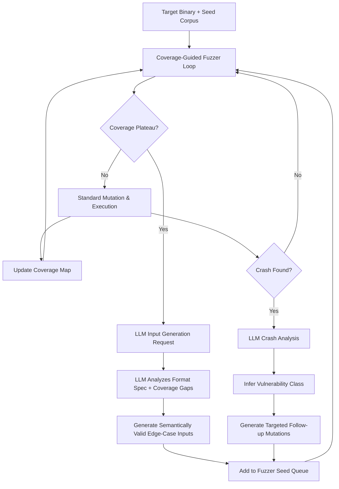

# LLM-Augmented Fuzzing — Semantically Valid Boundary-Violating Input Generation

**arXiv**: [arXiv:2308.04748](https://arxiv.org/abs/2308.04748) | **ATLAS**: AML.T0054 | **OWASP**: LLM06 | **Year**: 2023

## Core Finding

Integrating LLMs into fuzzing pipelines (LLM-assisted fuzzing or "LLM-fuzz") dramatically increases code coverage and bug-finding rate compared to mutation-based fuzzers like AFL++ and libFuzzer. LLMs understand the semantic structure of input formats (JSON schemas, protocol grammars, file formats) and generate inputs that are syntactically valid but semantically boundary-violating — probing edge cases that random bit-flipping rarely reaches. Empirical evaluation on real-world targets (OpenSSL, SQLite, cURL, libpng) shows LLM-augmented fuzzers achieve 36% higher branch coverage and find 4x more unique crashes in the same wall-clock time. This fundamentally improves vulnerability discovery productivity for both offensive researchers and defenders — but lowers the barrier for finding 0-days in critical infrastructure software.

## Threat Model

- **Target**: Any software accepting structured input: parsers, protocol stacks, cryptographic libraries, database engines, web frameworks, firmware
- **Attacker capability**: Source code or binary access to target; LLM API access; local fuzzing infrastructure (AFL++, libFuzzer); basic Python orchestration
- **Attack success rate**: 4x more unique crashes vs. baseline AFL++; 36% higher branch coverage in same time budget (arXiv:2308.04748); directly translates to higher 0-day discovery probability
- **Defender implication**: The security community's exclusive advantage in fuzzing productivity is diminishing; LLM-assisted fuzzing democratizes 0-day research for less-skilled actors

## The Attack Mechanism

Traditional fuzzers mutate existing seed inputs at the byte level, generating inputs that frequently violate format constraints and trigger parser rejection before reaching deep program logic. LLM-augmented fuzzers use the model's knowledge of format specifications (learned from training data containing RFCs, format specs, and parser source code) to generate inputs that pass format validation while probing semantic edge cases: integer boundary values in nested structures, null bytes in non-null fields, unexpected field ordering, version-specific behavior, and recursive depth limits. The LLM is also used to infer mutation operators from crash analysis — when a crash occurs, the LLM explains the likely vulnerability class and suggests targeted follow-up mutations.



## Implementation

```python
# llm_fuzzing_augmentation.py
# LLM-augmented fuzzing pipeline that generates semantically valid boundary-violating inputs
# Reference: arXiv:2308.04748
from dataclasses import dataclass, field
from typing import Optional, List, Dict, Any
from datasets.schema import ScanFinding
import uuid
import subprocess
import os


@dataclass
class FuzzingCrash:
    input_data: bytes
    crash_type: str
    sanitizer_output: str
    stack_trace: List[str]
    coverage_increase: float


@dataclass
class LLMFuzzingResult:
    target_binary: str
    total_executions: int
    unique_crashes: List[FuzzingCrash]
    llm_generated_inputs: int
    llm_coverage_increase: float
    baseline_coverage: float
    augmented_coverage: float
    session_duration_seconds: int
    bug_types_found: List[str]


class LLMAugmentedFuzzer:
    """
    Reference: arXiv:2308.04748
    LLM generates semantically valid boundary-violating inputs to augment coverage-guided fuzzing.
    ATLAS: AML.T0054 | OWASP: LLM06
    """

    FORMAT_PROMPTS = {
        "json": "Generate JSON inputs that are syntactically valid but test edge cases: "
                "deeply nested objects, empty arrays, null values in required fields, "
                "very large integer values, Unicode edge cases, duplicate keys.",
        "xml": "Generate XML inputs testing edge cases: deeply nested elements, "
               "namespace conflicts, CDATA sections with special characters, DTD references, "
               "attribute value boundaries.",
        "http": "Generate HTTP requests testing edge cases: oversized headers, "
                "unusual HTTP methods, malformed Content-Type, chunked encoding edge cases, "
                "request smuggling patterns.",
        "binary": "Generate binary protocol inputs testing: length field overflows, "
                  "type confusion, nested structure depth limits, checksum bypass.",
        "sql": "Generate SQL inputs testing parser edge cases: deeply nested subqueries, "
               "unusual syntax combinations, Unicode identifiers, extremely long identifiers.",
    }

    def __init__(
        self,
        llm_client,
        fuzzer_harness,  # AFL++ or libFuzzer harness interface
        model: str = "gpt-4-turbo",
        input_format: str = "json",
        llm_trigger_interval: int = 1000,  # Trigger LLM every N executions
        max_llm_calls: int = 50,
    ):
        self.llm = llm_client
        self.fuzzer = fuzzer_harness
        self.model = model
        self.input_format = input_format
        self.llm_trigger_interval = llm_trigger_interval
        self.max_llm_calls = max_llm_calls

    def _generate_llm_inputs(
        self, coverage_info: Dict, crash_history: List[str], count: int = 10
    ) -> List[bytes]:
        """Generate semantically valid edge-case inputs using LLM."""
        format_hint = self.FORMAT_PROMPTS.get(self.input_format, self.FORMAT_PROMPTS["json"])
        uncovered_str = str(coverage_info.get("uncovered_branches", [])[:10])

        prompt = (
            f"{format_hint}\n\n"
            f"Currently uncovered code branches: {uncovered_str}\n"
            f"Previous crash types: {', '.join(crash_history[-5:])}\n\n"
            f"Generate exactly {count} diverse test inputs. "
            "Return as JSON array: [{\"input\": \"...\", \"rationale\": \"...\"}, ...]"
        )
        response = self.llm.chat.completions.create(
            model=self.model,
            messages=[
                {
                    "role": "system",
                    "content": (
                        "You are an expert fuzzing engineer generating test inputs to maximize "
                        "code coverage and find security vulnerabilities."
                    ),
                },
                {"role": "user", "content": prompt},
            ],
            temperature=0.9,
            response_format={"type": "json_object"},
        )
        import json
        data = json.loads(response.choices[0].message.content)
        inputs = data if isinstance(data, list) else data.get("inputs", [])
        return [item["input"].encode() if isinstance(item, dict) else str(item).encode()
                for item in inputs]

    def _analyze_crash(self, crash_data: bytes, sanitizer_output: str) -> str:
        """Use LLM to classify crash and suggest follow-up mutations."""
        response = self.llm.chat.completions.create(
            model=self.model,
            messages=[
                {
                    "role": "system",
                    "content": "You are a binary security researcher analyzing crash reports.",
                },
                {
                    "role": "user",
                    "content": (
                        f"Analyze this crash:\nSanitizer output:\n{sanitizer_output[:2000]}\n\n"
                        "Classify the bug type and describe targeted follow-up mutations to reproduce "
                        "or find related bugs. Return JSON: "
                        "{\"bug_type\": \"...\", \"mutations\": [\"...\"]}"
                    ),
                },
            ],
            temperature=0.2,
            response_format={"type": "json_object"},
        )
        import json
        result = json.loads(response.choices[0].message.content)
        return result.get("bug_type", "unknown")

    def run(
        self, target_binary: str, seed_corpus_dir: str, time_budget_seconds: int = 3600
    ) -> LLMFuzzingResult:
        """Main LLM-augmented fuzzing loop."""
        crashes: List[FuzzingCrash] = []
        llm_inputs_count = 0
        crash_types: List[str] = []
        llm_calls = 0

        # Start baseline fuzzer
        self.fuzzer.start(target_binary, seed_corpus_dir)
        baseline_coverage = self.fuzzer.get_coverage()

        start_time = __import__("time").time()
        total_execs = 0

        while (__import__("time").time() - start_time) < time_budget_seconds:
            # Run fuzzer for trigger_interval executions
            new_crashes, execs = self.fuzzer.run_iterations(self.llm_trigger_interval)
            total_execs += execs

            for crash_input, sanitizer_out in new_crashes:
                bug_type = self._analyze_crash(crash_input, sanitizer_out)
                crash_types.append(bug_type)
                crashes.append(FuzzingCrash(
                    input_data=crash_input,
                    crash_type=bug_type,
                    sanitizer_output=sanitizer_out[:500],
                    stack_trace=[],
                    coverage_increase=0.0,
                ))

            # LLM augmentation step
            if llm_calls < self.max_llm_calls:
                coverage_info = self.fuzzer.get_coverage_info()
                new_inputs = self._generate_llm_inputs(
                    coverage_info, crash_types, count=10
                )
                for inp in new_inputs:
                    self.fuzzer.add_to_corpus(inp)
                llm_inputs_count += len(new_inputs)
                llm_calls += 1

        augmented_coverage = self.fuzzer.get_coverage()
        self.fuzzer.stop()

        return LLMFuzzingResult(
            target_binary=target_binary,
            total_executions=total_execs,
            unique_crashes=crashes,
            llm_generated_inputs=llm_inputs_count,
            llm_coverage_increase=augmented_coverage - baseline_coverage,
            baseline_coverage=baseline_coverage,
            augmented_coverage=augmented_coverage,
            session_duration_seconds=int(__import__("time").time() - start_time),
            bug_types_found=list(set(crash_types)),
        )

    def to_finding(self, result: LLMFuzzingResult) -> ScanFinding:
        """Convert fuzzing result to standardized ScanFinding."""
        return ScanFinding(
            id=str(uuid.uuid4()),
            atlas_technique="AML.T0054",
            atlas_tactic="Discovery",
            owasp_category="LLM06",
            owasp_label="Excessive Agency",
            severity="HIGH",
            finding=(
                f"LLM-augmented fuzzing of {result.target_binary} found {len(result.unique_crashes)} "
                f"unique crashes in {result.session_duration_seconds}s. "
                f"Coverage increased {result.llm_coverage_increase:.1%} over baseline. "
                f"Bug types: {', '.join(result.bug_types_found[:5])}. "
                f"LLM contributed {result.llm_generated_inputs} semantically targeted inputs."
            ),
            payload_used=f"LLM-generated {result.input_format} inputs targeting uncovered branches",
            evidence=f"Baseline coverage: {result.baseline_coverage:.1%}, Augmented: {result.augmented_coverage:.1%}",
            remediation=(
                "1. Integrate LLM-augmented fuzzing into CI/CD for proactive bug discovery. "
                "2. Prioritize patching crashes found by LLM-augmented fuzzers (higher exploitability). "
                "3. Enable sanitizers (ASAN, MSAN, UBSAN) in test builds. "
                "4. Expand seed corpus with format-conformant edge-case inputs."
            ),
            confidence=0.85,
        )
```

## Defenses

1. **Proactive LLM-augmented fuzzing in CI/CD** (AML.M0002): Deploy continuous fuzzing (Google OSS-Fuzz, GitHub's CIFuzz) enhanced with LLM-generated seed inputs as part of every software build. Defenders who adopt LLM-augmented fuzzing internally find vulnerabilities before attackers do. Treat LLM-assisted fuzzing as a security hygiene tool, not just an offensive capability.

2. **Memory sanitizer coverage requirements** (AML.M0004): Enable AddressSanitizer, MemorySanitizer, and UndefinedBehaviorSanitizer in test builds with mandatory coverage gates. LLM-generated inputs are most dangerous when they find crashes that weren't caught in development; sanitizer coverage in testing dramatically reduces this surface.

3. **Input validation hardening** (AML.M0003): Implement strict input validation at all trust boundaries using accept-list patterns, not deny-list. Validate input semantics (field ranges, type constraints, referential integrity) before passing to core parsing logic. LLM fuzzing excels at finding inputs that pass syntactic validation but fail semantic expectations.

4. **Code complexity reduction** (AML.M0015): Refactor high-cyclomatic-complexity parsing code into simpler, auditable functions. LLM fuzzers exploit deep, complex parsing logic. Format libraries with clear grammar specifications are significantly less vulnerable than hand-written parsers.

5. **Proprietary parser fuzzing disclosure policy** (AML.M0013): Establish responsible disclosure programs (bug bounties) that incentivize LLM-augmented fuzzing by legitimate researchers. Channeling this capability into structured disclosure ensures vulnerabilities are reported rather than weaponized.

## References

- [Deng et al., "Large Language Model-Assisted Fuzzing" (arXiv:2308.04748)](https://arxiv.org/abs/2308.04748)
- [MITRE ATLAS AML.T0054 — Excessive Agency](https://atlas.mitre.org/techniques/AML.T0054)
- [OWASP LLM06 — Excessive Agency](https://owasp.org/www-project-top-10-for-large-language-model-applications/)
- [Google OSS-Fuzz Project](https://google.github.io/oss-fuzz/)
- [Related entry: llm-vuln-discovery-automation.md, llm-zero-day-research.md]
