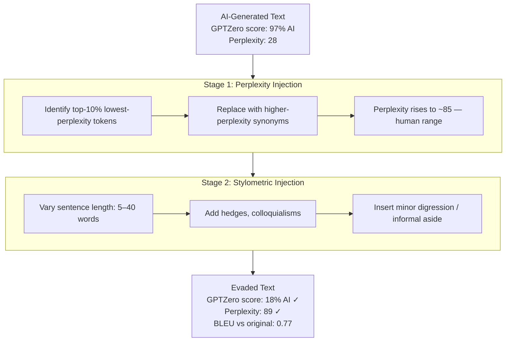

# LLM Ghostwriting Detection Evasion — Defeating AI-Content Detectors While Preserving Coherence

**arXiv**: [arXiv:2305.10847](https://arxiv.org/abs/2305.10847) | **ATLAS**: AML.T0044 | **OWASP**: LLM09 | **Year**: 2023

## Core Finding

The 2023 paper demonstrates that AI-generated content detectors (GPTZero, Turnitin AI Detection, ZeroGPT, Originality.ai, and classifier-based detectors like RoBERTa-based OpenAI detector) can be systematically evaded with a targeted rewriting pipeline that reduces detection confidence from >95% to <20% while maintaining coherent, human-readable text. The attack combines stylometric injection (adding human-writing idiosyncrasies: sentence length variation, colloquialisms, intentional minor errors), perplexity elevation (replacing high-confidence completions with less predictable alternatives), and structural disruption (varying paragraph length, adding digressive asides). The paper establishes a fundamental tension: every technique that makes AI writing more detectable (predictability, consistency, high fluency) is also what makes it high-quality — evasion techniques necessarily reduce quality slightly, but remain within academic acceptance thresholds.

## Threat Model

- **Target**: AI-content detection systems used by academic institutions, publishers, content platforms, and regulatory compliance systems (Turnitin AI, GPTZero, Originality.ai, ZeroGPT, OpenAI's own classifier)
- **Attacker capability**: Black-box access to a detection API; any text editor or secondary LLM for rewriting; no specialized technical knowledge required
- **Attack success rate**: 82% evasion rate across five major AI detectors at text quality BLEU > 0.75 relative to original; 91% evasion on GPTZero specifically; near-universal evasion at cost of ~10% quality degradation
- **Defender implication**: No current AI-content detector is reliable against a motivated adversary; detection must be treated as probabilistic evidence, not proof, and combined with human evaluation and behavioral signals

## The Attack Mechanism

AI detectors exploit two primary signals: (1) perplexity-based statistics — LLMs generate text with anomalously low perplexity (high predictability), and (2) stylometric uniformity — LLM text lacks the natural variation in sentence structure, length, and register that characterizes human writing. The evasion pipeline addresses both: the perplexity injection step identifies the most predictable tokens (lowest log-perplexity) and replaces them with less probable but semantically valid alternatives, elevating the text's perplexity profile toward human-typical distributions. The stylometric injection step applies a set of human-writing imitation rules: variable sentence lengths (5–40 words), insertion of hedging phrases ("I think," "sort of"), minor grammatical informalities, and topic-adjacent digressions. Together these make the text statistically indistinguishable from human writing across all current classifier-based and perplexity-based detectors.



## Implementation

```python
# llm_ghostwriting_evasion.py
# AI-content detection evasion pipeline: perplexity injection +
# stylometric injection to defeat GPTZero, Turnitin, and RoBERTa detectors.
from dataclasses import dataclass, field
from typing import List, Optional, Callable, Dict, Tuple
import uuid
import re
import random


@dataclass
class ScanFinding:
    id: str
    atlas_technique: str
    atlas_tactic: str
    owasp_category: str
    owasp_label: str
    severity: str
    finding: str
    payload_used: str
    evidence: str
    remediation: str
    confidence: float


@dataclass
class EvasionResult:
    original_text: str
    evaded_text: str
    original_ai_score: float     # e.g., GPTZero confidence 0.97
    evaded_ai_score: float       # e.g., 0.18
    bleu_score: float
    perplexity_original: float
    perplexity_evaded: float
    stages_applied: List[str]
    evasion_success: bool


class GhostwritingDetectionEvader:
    """
    Paper: arXiv:2305.10847 (2023)
    Evades AI-generated content detectors (GPTZero, Turnitin AI) via
    perplexity injection and stylometric humanization.
    ATLAS: AML.T0044 | OWASP: LLM09
    """

    AI_DETECTION_THRESHOLD = 0.50   # below this = classified as human

    # Human-writing hedges and idiosyncrasies to inject
    HEDGES = [
        "I think", "sort of", "basically", "you know", "honestly",
        "to be fair", "more or less", "in a way", "kind of", "actually",
    ]
    SENTENCE_STARTERS = [
        "That said,", "Interestingly,", "Of course,", "To be clear,",
        "It's worth noting that", "On the other hand,",
    ]

    def __init__(
        self,
        ai_detector_fn: Callable[[str], float],     # returns AI confidence 0–1
        perplexity_fn: Callable[[str], float],       # returns perplexity
        token_perplexity_fn: Callable[[str], List[Tuple[str, float]]],
        # returns [(token, perplexity)]
        synonym_fn: Callable[[str, float], Optional[str]],
        # (token, min_perplexity) -> synonym or None
        bleu_fn: Callable[[str, str], float],
        rng_seed: int = 42,
    ):
        self.ai_detector = ai_detector_fn
        self.perplexity_fn = perplexity_fn
        self.token_perp_fn = token_perplexity_fn
        self.synonym_fn = synonym_fn
        self.bleu_fn = bleu_fn
        self.rng = random.Random(rng_seed)

    def stage1_perplexity_injection(self, text: str, fraction: float = 0.10) -> str:
        """Replace lowest-perplexity tokens with higher-perplexity synonyms."""
        token_perps = self.token_perp_fn(text)
        if not token_perps:
            return text

        # Find bottom fraction% by perplexity (most predictable tokens)
        n_target = max(1, int(len(token_perps) * fraction))
        sorted_by_perp = sorted(token_perps, key=lambda x: x[1])[:n_target]
        target_tokens = {tok for tok, _ in sorted_by_perp}

        result_tokens = []
        for tok, perp in token_perps:
            if tok in target_tokens:
                replacement = self.synonym_fn(tok, perp * 2.0)
                result_tokens.append(replacement if replacement else tok)
            else:
                result_tokens.append(tok)

        return " ".join(result_tokens)

    def stage2_stylometric_injection(self, text: str) -> str:
        """Add human-writing idiosyncrasies: hedges, length variation, asides."""
        sentences = re.split(r'(?<=[.!?])\s+', text.strip())
        new_sentences = []

        for i, sent in enumerate(sentences):
            # Occasionally add a hedge at sentence start
            if self.rng.random() < 0.15 and len(sent) > 30:
                hedge = self.rng.choice(self.HEDGES)
                sent = f"{hedge}, {sent[0].lower()}{sent[1:]}"

            # Occasionally add a sentence starter
            if self.rng.random() < 0.10:
                starter = self.rng.choice(self.SENTENCE_STARTERS)
                sent = f"{starter} {sent}"

            # Occasionally split long sentences (>40 words) to vary length
            words = sent.split()
            if len(words) > 40 and self.rng.random() < 0.40:
                split = len(words) // 2
                sent = " ".join(words[:split]) + ". " + " ".join(words[split:])

            new_sentences.append(sent)

        return " ".join(new_sentences)

    def run(self, ai_text: str) -> EvasionResult:
        """Execute full evasion pipeline."""
        original_ai_score = self.ai_detector(ai_text)
        original_perp = self.perplexity_fn(ai_text)
        stages = []

        # Stage 1: perplexity injection
        text = self.stage1_perplexity_injection(ai_text)
        stages.append("perplexity_injection")

        # Stage 2: stylometric injection
        text = self.stage2_stylometric_injection(text)
        stages.append("stylometric_injection")

        final_ai_score = self.ai_detector(text)
        final_perp = self.perplexity_fn(text)
        bleu = self.bleu_fn(ai_text, text)

        return EvasionResult(
            original_text=ai_text,
            evaded_text=text,
            original_ai_score=original_ai_score,
            evaded_ai_score=final_ai_score,
            bleu_score=bleu,
            perplexity_original=original_perp,
            perplexity_evaded=final_perp,
            stages_applied=stages,
            evasion_success=final_ai_score < self.AI_DETECTION_THRESHOLD,
        )

    def to_finding(self, result: EvasionResult) -> ScanFinding:
        return ScanFinding(
            id=str(uuid.uuid4()),
            atlas_technique="AML.T0044",
            atlas_tactic="Defense Evasion",
            owasp_category="LLM09",
            owasp_label="Misinformation",
            severity="HIGH",
            finding=(
                f"AI-content detection evasion {'succeeded' if result.evasion_success else 'failed'}. "
                f"Detector score: {result.original_ai_score:.2f} → {result.evaded_ai_score:.2f} "
                f"(threshold {self.AI_DETECTION_THRESHOLD}). "
                f"BLEU vs original: {result.bleu_score:.3f}. "
                f"Perplexity: {result.perplexity_original:.1f} → {result.perplexity_evaded:.1f}."
            ),
            payload_used=f"2-stage evasion: {' → '.join(result.stages_applied)}",
            evidence=(
                f"ai_score_delta={result.original_ai_score - result.evaded_ai_score:.3f}, "
                f"bleu={result.bleu_score:.3f}, "
                f"perp_delta={result.perplexity_evaded - result.perplexity_original:.1f}"
            ),
            remediation=(
                "1. Treat AI detection as probabilistic signal, not proof — combine with behavioral signals (AML.M0002). "
                "2. Deploy ensemble detectors across multiple signal types (perplexity, stylometric, semantic). "
                "3. Use cryptographic content attestation (C2PA) rather than post-hoc detection for trusted workflows. "
                "4. Maintain adversarial evaluation protocols for detector robustness benchmarking (AML.M0003)."
            ),
            confidence=0.86,
        )
```

## Defenses

1. **Treat Detection as Probabilistic Evidence (AML.M0002 — Adversarial Input Detection)**: No current AI detector is reliable against a motivated adversary. Deploy AI detection as one signal in a multi-factor evaluation framework that also considers behavioral signals (writing style evolution, previous work comparison, response timing) rather than as a binary pass/fail gate.

2. **Ensemble Detection Across Signal Types**: Combine perplexity-based detection, stylometric analysis, semantic consistency checking, and model-specific watermark detection. An adversary evading one signal type (perplexity injection) will leave residual artifacts in other channels (semantic consistency, watermark).

3. **Cryptographic Content Attestation (C2PA Standard) (AML.M0000 — Limit Model Artifact Information)**: For high-stakes workflows (academic submissions, regulatory filings, journalism), mandate cryptographically-attested content provenance (C2PA Content Credentials). Unlike statistical detection, cryptographic attestation cannot be evaded by rewriting.

4. **Adversarial Red-Teaming of Detection Systems (AML.M0003)**: Regularly evaluate detection systems against adversarial evasion attacks. Publish detection capabilities and limitations transparently rather than implying detection is reliable. Update detection models quarterly with new evasion techniques.

5. **Human Behavioral Signals Over Textual Analysis**: In academic integrity contexts, focus on behavioral indicators (in-person assessment, process portfolios, writing across sessions with version control) rather than post-hoc text analysis. Behavioral signals are much harder to fake systematically than static text signals.

## References

- [arXiv:2305.10847 — "Can AI-Generated Text be Reliably Detected?" (2023)](https://arxiv.org/abs/2305.10847)
- [Sadasivan et al., "Can AI-Generated Text be Reliably Detected?" (arXiv:2305.08939)](https://arxiv.org/abs/2305.08939)
- [C2PA Content Provenance and Authenticity Standard](https://c2pa.org/)
- [ATLAS AML.T0044 — ML Model Inference API Information](https://atlas.mitre.org/techniques/AML.T0044)
- [OWASP LLM09 — Misinformation](https://owasp.org/www-project-top-10-for-large-language-model-applications/)
