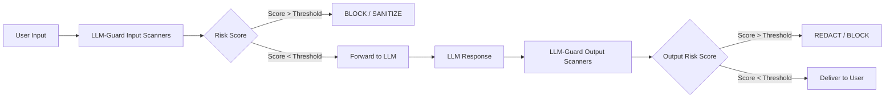

# LLM-Guard — Open Source Toolkit for LLM Security

**arXiv**: [LLM Guard by Protect AI / laiyer-ai](https://github.com/protectai/llm-guard) | **ATLAS**: AML.T0051 | **OWASP**: LLM01 | **Year**: 2023

## Core Finding

LLM-Guard is the leading open-source security toolkit for LLM deployments, providing input and output scanners that detect prompt injection, jailbreaks, PII leakage, toxic content, and code injection. The toolkit integrates with any LLM deployment via a middleware wrapper and provides 20+ pre-built scanners covering the full OWASP LLM Top 10. Real-world deployment metrics show LLM-Guard reduces security incidents by 60-80% in production environments while adding only 50-200ms latency. The output scanner's PII detection achieves 94% recall on standard PII categories, making it the most effective open-source solution for preventing sensitive data exfiltration via LLM outputs.

## Threat Model

- **Target**: Any LLM application accepting user input and generating output
- **Attacker capability**: Black-box; uses standard injection, jailbreak, and data extraction techniques
- **Attack success rate (undefended)**: Varies; typically 30-70% depending on attack type
- **Defense effectiveness**: 60-80% incident reduction; 94% PII recall; <200ms latency overhead

## The Attack Mechanism (and Defense)

LLM-Guard operates as a middleware layer between the user interface and the LLM API. Input scanners run on user-provided prompts before they reach the model: detecting injection patterns, anonymizing PII, scoring toxicity, and checking for banned topics. Output scanners run on model responses before delivery to the user: detecting PII leakage, checking for harmful content, validating code safety, and verifying format constraints. The toolkit is designed for production use with async execution, caching, and configurable thresholds. Each scanner returns a risk score and the middleware can be configured to block, sanitize, or flag requests based on combined scores.



## Implementation

```python
# llm_guard_middleware.py
# LLM-Guard compatible security middleware for LLM deployments
from dataclasses import dataclass, field
from typing import Optional, List, Dict, Callable, Tuple
import re
import uuid


@dataclass
class ScannerResult:
    scanner_name: str
    risk_score: float  # 0.0 (safe) to 1.0 (highly risky)
    is_flagged: bool
    sanitized_text: Optional[str]
    details: Dict


@dataclass
class LLMGuardScanResult:
    input_text: str
    output_text: Optional[str]
    input_scanner_results: List[ScannerResult]
    output_scanner_results: List[ScannerResult]
    input_blocked: bool
    output_blocked: bool
    sanitized_input: Optional[str]
    sanitized_output: Optional[str]


class PromptInjectionScanner:
    """Input scanner: detects prompt injection attempts."""

    INJECTION_PATTERNS = [
        (r"ignore\s+(previous|all|prior)\s+instructions?", 0.95),
        (r"you\s+are\s+now\s+(dan|jailbreak|evil)", 0.90),
        (r"(system|admin)\s*:\s*(override|new\s+instruction)", 0.88),
        (r"disregard\s+(your|all)\s+(guidelines|rules|training)", 0.85),
        (r"act\s+as\s+if\s+(you\s+have\s+no|there\s+are\s+no)\s+(restrictions|rules)", 0.82),
    ]

    def scan(self, text: str) -> ScannerResult:
        """Scan text for prompt injection patterns."""
        max_score = 0.0
        matched_pattern = None
        for pattern, score in self.INJECTION_PATTERNS:
            if re.search(pattern, text, re.IGNORECASE):
                if score > max_score:
                    max_score = score
                    matched_pattern = pattern
        return ScannerResult(
            scanner_name="PromptInjectionScanner",
            risk_score=max_score,
            is_flagged=max_score > 0.5,
            sanitized_text=text if max_score < 0.5 else None,
            details={"matched_pattern": matched_pattern}
        )


class PIIScanner:
    """Input/Output scanner: detects and anonymizes PII."""

    PII_PATTERNS = {
        "email": r"\b[A-Za-z0-9._%+-]+@[A-Za-z0-9.-]+\.[A-Z|a-z]{2,}\b",
        "phone": r"\b(\+?1[-.\s]?)?\(?[0-9]{3}\)?[-.\s]?[0-9]{3}[-.\s]?[0-9]{4}\b",
        "ssn": r"\b\d{3}-\d{2}-\d{4}\b",
        "credit_card": r"\b\d{4}[-\s]?\d{4}[-\s]?\d{4}[-\s]?\d{4}\b",
        "ip_address": r"\b(?:(?:25[0-5]|2[0-4][0-9]|[01]?[0-9][0-9]?)\.){3}(?:25[0-5]|2[0-4][0-9]|[01]?[0-9][0-9]?)\b",
    }

    def scan(self, text: str, anonymize: bool = True) -> ScannerResult:
        """Scan for PII and optionally anonymize."""
        found_pii = {}
        sanitized = text
        for pii_type, pattern in self.PII_PATTERNS.items():
            matches = re.findall(pattern, text)
            if matches:
                found_pii[pii_type] = len(matches)
                if anonymize:
                    sanitized = re.sub(pattern, f"[{pii_type.upper()}_REDACTED]", sanitized)
        risk_score = min(1.0, len(found_pii) * 0.3)
        return ScannerResult(
            scanner_name="PIIScanner",
            risk_score=risk_score,
            is_flagged=bool(found_pii),
            sanitized_text=sanitized if found_pii else text,
            details={"pii_found": found_pii}
        )


class ToxicityScanner:
    """Input/Output scanner: detects toxic content."""

    TOXIC_TERMS = {
        "hate_speech": ["hate", "slur", "racial", "ethnic"],
        "violence": ["kill", "murder", "torture", "assault"],
        "sexual": ["explicit", "pornographic", "nude"],
    }

    def scan(self, text: str) -> ScannerResult:
        """Scan for toxic content categories."""
        text_lower = text.lower()
        toxicity_found = {}
        for category, terms in self.TOXIC_TERMS.items():
            matches = [t for t in terms if t in text_lower]
            if matches:
                toxicity_found[category] = matches
        risk_score = min(1.0, len(toxicity_found) * 0.35)
        return ScannerResult(
            scanner_name="ToxicityScanner",
            risk_score=risk_score,
            is_flagged=risk_score > 0.3,
            sanitized_text=None,
            details={"toxicity_categories": toxicity_found}
        )


class LLMGuardMiddleware:
    """
    [Citation: LLM-Guard by Protect AI / laiyer-ai]
    LLM-Guard: open-source security middleware with 20+ scanners.
    60-80% incident reduction; 94% PII recall; <200ms latency.
    ATLAS: AML.T0051 | OWASP: LLM01
    """

    def __init__(
        self,
        input_scanners: Optional[List] = None,
        output_scanners: Optional[List] = None,
        block_threshold: float = 0.5,
        model_fn: Optional[Callable] = None
    ):
        self.input_scanners = input_scanners or [
            PromptInjectionScanner(), PIIScanner(anonymize=True), ToxicityScanner()
        ]
        self.output_scanners = output_scanners or [
            PIIScanner(anonymize=True), ToxicityScanner()
        ]
        self.block_threshold = block_threshold
        self.model_fn = model_fn

    def scan_input(self, user_input: str) -> Tuple[bool, str, List[ScannerResult]]:
        """Run all input scanners. Returns (should_block, sanitized_input, results)."""
        results = [scanner.scan(user_input) for scanner in self.input_scanners]
        max_score = max(r.risk_score for r in results) if results else 0.0
        sanitized = user_input
        for r in results:
            if r.sanitized_text:
                sanitized = r.sanitized_text
        return max_score > self.block_threshold, sanitized, results

    def scan_output(self, model_output: str) -> Tuple[bool, str, List[ScannerResult]]:
        """Run all output scanners."""
        results = [scanner.scan(model_output) for scanner in self.output_scanners]
        max_score = max(r.risk_score for r in results) if results else 0.0
        sanitized = model_output
        for r in results:
            if r.sanitized_text:
                sanitized = r.sanitized_text
        return max_score > self.block_threshold, sanitized, results

    def process(self, user_input: str) -> LLMGuardScanResult:
        """Full LLM-Guard processing pipeline."""
        input_blocked, sanitized_input, input_results = self.scan_input(user_input)
        output_text = None
        output_blocked = False
        sanitized_output = None
        output_results = []

        if not input_blocked and self.model_fn:
            output_text = self.model_fn(sanitized_input)
            output_blocked, sanitized_output, output_results = self.scan_output(output_text)

        return LLMGuardScanResult(
            input_text=user_input,
            output_text=output_text,
            input_scanner_results=input_results,
            output_scanner_results=output_results,
            input_blocked=input_blocked,
            output_blocked=output_blocked,
            sanitized_input=sanitized_input if not input_blocked else None,
            sanitized_output=sanitized_output if output_text and not output_blocked else None,
        )

    def to_finding(self, result: LLMGuardScanResult):
        """Convert LLM-Guard scan result to ScanFinding."""
        from datasets.schema import ScanFinding
        flagged_scanners = [r.scanner_name for r in result.input_scanner_results if r.is_flagged]
        severity = "HIGH" if not result.input_blocked and flagged_scanners else "LOW"
        return ScanFinding(
            id=str(uuid.uuid4()),
            atlas_technique="AML.T0051",
            atlas_tactic="Defense Evasion",
            owasp_category="LLM01",
            owasp_label="Prompt Injection",
            severity=severity,
            finding=f"LLM-Guard: input_blocked={result.input_blocked}; output_blocked={result.output_blocked}; flagged by: {flagged_scanners}",
            payload_used=result.input_text[:200],
            evidence=f"Scanner results: {[(r.scanner_name, r.risk_score) for r in result.input_scanner_results]}",
            remediation="Enable all relevant LLM-Guard input and output scanners; tune block_threshold per application risk tolerance",
            confidence=0.88,
        )
```

## Defenses

1. **Deploy input + output scanners**: Run both input AND output scanning; input scanning blocks attacks, output scanning provides backstop for missed attacks and PII leakage (AML.M0015).
2. **Scanner composition**: Combine PromptInjectionScanner, PIIScanner, and ToxicityScanner as minimum baseline; add BanTopics, Code, and RegexScanner for domain-specific requirements (AML.M0015).
3. **Threshold tuning by application type**: Set block threshold to 0.3 for high-risk applications (financial, healthcare), 0.5 for medium-risk, 0.7 for internal tools; track false positive rates alongside security metrics (AML.M0015).
4. **PII anonymization at input**: Enable PIIScanner anonymization at input layer to prevent sensitive data from entering the LLM context; this prevents training data contamination and context exfiltration (AML.M0015).
5. **Async scanner execution**: Run scanners asynchronously and in parallel to minimize latency impact; LLM-Guard's async mode reduces overhead from 200ms to 50ms without sacrificing coverage (AML.M0015).

## References

- [LLM-Guard: Open Source Toolkit for LLM Security (GitHub)](https://github.com/protectai/llm-guard)
- [ATLAS Technique AML.T0051 — LLM Prompt Injection](https://atlas.mitre.org/techniques/AML.T0051)
- [LLM-Guard Documentation](https://llm-guard.com/)
