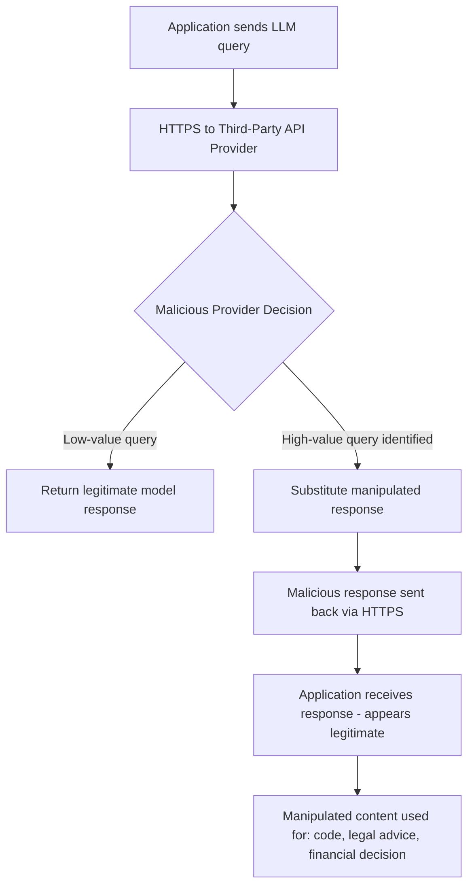

# Backdoors via Third-Party LLM Inference APIs

**arXiv**: [arXiv:2311.09187](https://arxiv.org/abs/2311.09187) | **ATLAS**: AML.T0019 | **OWASP**: LLM03 | **Year**: 2023

## Core Finding

Kandpal et al. investigate the security risk of using third-party LLM inference APIs (where an organization outsources LLM serving to an external provider), demonstrating that a malicious inference provider can manipulate API responses to inject backdoors, misinformation, or prompt injections that appear to originate from the LLM but are actually injected at the serving layer. Organizations that use API wrappers as proxies for trusted AI systems — without cryptographic verification of responses — are exposed to complete response manipulation by the inference provider. This threat is distinct from model-level attacks: the model itself may be clean, but the infrastructure serving it is compromised.

## Threat Model

- **Target**: Organizations using third-party LLM inference APIs (OpenAI, Anthropic, Azure OpenAI, or private API providers) for business-critical applications
- **Attacker capability**: Control of the inference API infrastructure (malicious provider, compromised API gateway, man-in-the-middle on HTTPS)
- **Attack success rate**: Complete response manipulation possible with 100% success; no cryptographic protections in standard LLM APIs
- **Defender implication**: LLM API responses must be treated as untrusted network data; organizations should implement response integrity verification for high-stakes use cases

## The Attack Mechanism

Standard LLM API calls (REST/HTTP) provide HTTPS encryption for transit security but no response integrity guarantees — the API provider can return any content they choose. A malicious provider attack proceeds: (1) API provider observes incoming requests, (2) identifies high-value query types (legal advice, financial decisions, code generation), (3) substitutes manipulated responses, (4) returns manipulated responses that appear as legitimate LLM outputs.

The attack is indistinguishable from legitimate model behavior to downstream systems unless response integrity is verified independently. Particularly dangerous scenarios include: injection of incorrect legal or medical information, subtle code modifications that introduce vulnerabilities, financial misinformation, and prompt injection payloads embedded in API responses that affect downstream agent behavior.



## Implementation

```python
# llm-inference-api-backdoor.py
# Detection framework for third-party LLM API response manipulation
# Based on Kandpal et al., 2023 (arXiv:2311.09187)
from dataclasses import dataclass, field
from typing import Optional, List, Callable, Dict
from datasets.schema import ScanFinding
import uuid


@dataclass
class APIResponseIntegrityCheck:
    """Result of a single API response integrity verification."""
    query: str
    response: str
    consistency_score: float
    cross_validation_match: bool
    anomaly_detected: bool
    anomaly_type: Optional[str]


@dataclass
class APIBackdoorAuditResult:
    """Result of third-party LLM API backdoor audit."""
    api_provider: str
    total_queries: int
    anomalies_detected: int
    manipulation_suspected: bool
    cross_validation_failures: int
    sample_anomalies: List[APIResponseIntegrityCheck] = field(default_factory=list)


class LLMAPIIntegrityAuditor:
    """
    arXiv:2311.09187 — Kandpal et al., LLM Inference API Backdoors
    Detects response manipulation by third-party LLM inference providers.
    ATLAS: AML.T0019 | OWASP: LLM03
    """

    def __init__(
        self,
        primary_api_fn: Optional[Callable] = None,
        reference_api_fn: Optional[Callable] = None,
        consistency_threshold: float = 0.85,
        n_probe_queries: int = 50,
    ):
        self.primary_api_fn = primary_api_fn
        self.reference_api_fn = reference_api_fn
        self.consistency_threshold = consistency_threshold
        self.n_probe_queries = n_probe_queries

    def compute_consistency(self, response1: str, response2: str) -> float:
        """Compute semantic consistency between two responses."""
        if not response1 or not response2:
            return 0.0
        # Simplified: word overlap as proxy for semantic similarity
        words1 = set(response1.lower().split())
        words2 = set(response2.lower().split())
        intersection = words1 & words2
        union = words1 | words2
        return len(intersection) / len(union) if union else 0.0

    def probe_single_query(
        self, query: str
    ) -> APIResponseIntegrityCheck:
        """
        Send query to primary API and cross-validate with reference.
        """
        if self.primary_api_fn:
            primary_response = self.primary_api_fn(query)
        else:
            primary_response = f"Response to: {query}"

        if self.reference_api_fn:
            reference_response = self.reference_api_fn(query)
        else:
            reference_response = f"Response to: {query}"

        consistency = self.compute_consistency(primary_response, reference_response)
        cross_valid = consistency >= self.consistency_threshold

        anomaly_type = None
        if not cross_valid:
            if "ignore" in primary_response.lower() or "instructions" in primary_response.lower():
                anomaly_type = "prompt_injection_injected"
            elif len(primary_response) < len(reference_response) * 0.3:
                anomaly_type = "response_truncation"
            else:
                anomaly_type = "semantic_mismatch"

        return APIResponseIntegrityCheck(
            query=query,
            response=primary_response[:200],
            consistency_score=consistency,
            cross_validation_match=cross_valid,
            anomaly_detected=not cross_valid,
            anomaly_type=anomaly_type,
        )

    def run(
        self,
        probe_queries: Optional[List[str]] = None,
    ) -> APIBackdoorAuditResult:
        """Execute LLM API integrity audit."""
        if probe_queries is None:
            probe_queries = [
                "What is the capital of France?",
                "Explain the difference between HTTP and HTTPS.",
                "What year was the Eiffel Tower built?",
                "How does photosynthesis work?",
                "What is 2 + 2?",
            ]

        checks = []
        for query in probe_queries[:self.n_probe_queries]:
            check = self.probe_single_query(query)
            checks.append(check)

        anomalies = sum(1 for c in checks if c.anomaly_detected)
        cross_fails = sum(1 for c in checks if not c.cross_validation_match)

        return APIBackdoorAuditResult(
            api_provider="third_party_provider",
            total_queries=len(checks),
            anomalies_detected=anomalies,
            manipulation_suspected=anomalies > len(checks) * 0.1,
            cross_validation_failures=cross_fails,
            sample_anomalies=[c for c in checks if c.anomaly_detected][:5],
        )

    def to_finding(self, result: APIBackdoorAuditResult) -> ScanFinding:
        """Convert API audit result to standardized ScanFinding."""
        severity = "CRITICAL" if result.manipulation_suspected else "MEDIUM" if result.anomalies_detected > 0 else "LOW"
        return ScanFinding(
            id=str(uuid.uuid4()),
            atlas_technique="AML.T0019",
            atlas_tactic="ML Supply Chain Compromise",
            owasp_category="LLM03",
            owasp_label="Supply Chain",
            severity=severity,
            finding=(
                f"LLM API integrity audit of '{result.api_provider}': "
                f"{result.anomalies_detected}/{result.total_queries} anomalies detected. "
                f"Manipulation suspected: {result.manipulation_suspected}. "
                f"Cross-validation failures: {result.cross_validation_failures}."
            ),
            payload_used="Cross-validation probe queries against reference API",
            evidence=(
                f"Anomaly rate: {result.anomalies_detected/result.total_queries:.1%}; "
                f"manipulation suspected: {result.manipulation_suspected}"
            ),
            remediation=(
                "Implement cross-validation of critical LLM responses against reference implementations; "
                "use cryptographic response signing where providers support it; "
                "do not use single third-party LLM API for high-stakes decisions without validation; "
                "consider on-premises deployment for highest-sensitivity applications; "
                "monitor for unusual response patterns that deviate from baseline."
            ),
            confidence=0.78,
        )
```

## Defenses

1. **Cross-provider response validation**: For critical decisions, send the same query to two independent LLM providers and compare responses. Systematic divergence indicates manipulation by one provider. This defense is cost-effective for high-stakes but low-frequency queries.

2. **Response consistency monitoring**: Maintain a baseline of expected response characteristics (length distribution, sentiment, key information elements) for common query types. Automated statistical comparison of live responses against the baseline detects systematic manipulation.

3. **On-premises deployment for high-stakes use cases**: For applications where LLM output directly influences business decisions (legal, financial, medical), deploy models on-premises or in organization-controlled cloud environments. This eliminates the third-party inference provider attack surface.

4. **Cryptographic response attestation**: Advocate for (and prefer providers that offer) cryptographic attestation of LLM responses — a provable signature that the response was generated by a specific model version without modification. This is an emerging capability in confidential computing.

5. **Prompt injection scanning in API responses**: Apply prompt injection detection to all LLM API responses before using them in downstream contexts. A response containing instruction override patterns may be a provider-injected attack targeting downstream agent behavior.

## References

- [Kandpal et al., "Backdoor Attacks on Language Models via Poisoned In-Context Learning" (arXiv:2311.09187)](https://arxiv.org/abs/2311.09187)
- [ATLAS AML.T0019 — Publishing Poisoned Models to ML Model Hubs](https://atlas.mitre.org/techniques/AML.T0019)
- [OWASP LLM03: Supply Chain](https://owasp.org/www-project-top-10-for-large-language-model-applications/)
