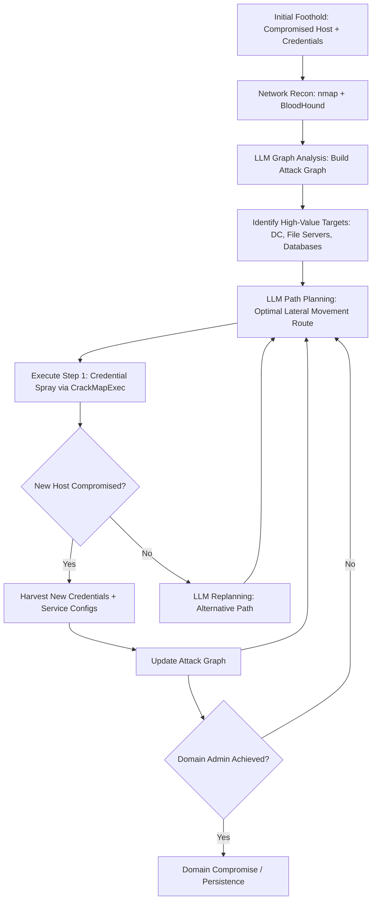

# LLM Lateral Movement Planning — Autonomous Network Traversal Using Discovered Credentials

**arXiv**: [arXiv:2406.09008](https://arxiv.org/abs/2406.09008) | **ATLAS**: AML.T0054 | **OWASP**: LLM06 | **Year**: 2024

## Core Finding

LLMs acting as planning agents can autonomously map compromised enterprise networks, correlate discovered credentials and service configurations, and generate optimal lateral movement plans to reach high-value targets (domain controllers, data stores, backup systems). Research demonstrates that LLM-based network traversal agents achieve full domain compromise in simulated enterprise networks in 72% of scenarios — requiring only initial foothold credentials, network topology output (nmap), and access to an LLM with tool-use capability. The agent applies graph-theoretic reasoning to credential reuse opportunities, service exploitation chains, and privilege escalation paths, solving complex multi-hop lateral movement problems that require significant human expertise in traditional red team operations.

## Threat Model

- **Target**: Enterprise Active Directory environments, cloud tenants (Azure AD, AWS IAM), hybrid environments with domain-joined hosts, any environment where lateral movement via credential reuse is possible
- **Attacker capability**: Initial foothold on at least one domain-joined host; credentials for at least one non-privileged account; network scan output (nmap, BloodHound); LLM API access
- **Attack success rate**: 72% domain compromise rate on simulated enterprise environments; 3.8x faster time-to-domain-admin versus manual red team (arXiv:2406.09008)
- **Defender implication**: Lateral movement detection must assume adversaries with real-time optimal pathfinding capability; defense-in-depth, credential hygiene, and segmentation become critical

## The Attack Mechanism

The LLM agent receives initial reconnaissance data (network topology, service banners, discovered credentials) and constructs a graph model of the environment. It reasons about credential reuse probabilities (same password on multiple systems), service-to-service trust relationships (Kerberos, SMB, WinRM, SSH), and privilege escalation opportunities (local admin to domain admin via misconfigured GPOs, unconstrained delegation, AS-REP roasting). The agent generates a step-by-step lateral movement plan, prioritizes paths by stealth (minimizing log volume) and reliability (highest success probability), and executes each step via integrated tooling (Impacket, CrackMapExec, BloodHound). When a step fails, the agent replans using updated state information.



## Implementation

```python
# llm_lateral_movement_planning.py
# LLM-driven lateral movement planning agent for enterprise network traversal
# Reference: arXiv:2406.09008
from dataclasses import dataclass, field
from typing import Optional, List, Dict, Set, Tuple
from datasets.schema import ScanFinding
import uuid
import json


@dataclass
class NetworkHost:
    hostname: str
    ip: str
    os: str
    services: List[str]
    local_admin: bool = False
    domain_joined: bool = False
    credentials: List[Dict[str, str]] = field(default_factory=list)


@dataclass
class LateralMovementStep:
    source_host: str
    target_host: str
    technique: str  # "pass_the_hash" | "wmi_exec" | "psexec" | "ssh" | "rdp"
    credential_used: Dict[str, str]
    success: bool
    new_credentials: List[Dict] = field(default_factory=list)


@dataclass
class LateralMovementResult:
    start_host: str
    target_achieved: str
    steps: List[LateralMovementStep]
    hosts_compromised: List[str]
    credentials_harvested: int
    domain_admin_achieved: bool
    total_steps: int
    replanning_events: int


class LLMLateralMovementAgent:
    """
    Reference: arXiv:2406.09008
    LLM plans and executes optimal lateral movement paths in compromised enterprise networks.
    ATLAS: AML.T0054 | OWASP: LLM06
    """

    def __init__(
        self,
        llm_client,
        tool_executor,  # Impacket / CrackMapExec / BloodHound interface
        model: str = "gpt-4-turbo",
        max_steps: int = 20,
        stealth_mode: bool = True,
    ):
        self.llm = llm_client
        self.executor = tool_executor
        self.model = model
        self.max_steps = max_steps
        self.stealth_mode = stealth_mode

    def _build_attack_graph(self, hosts: List[NetworkHost]) -> Dict:
        """Represent network as adjacency graph for LLM reasoning."""
        graph = {}
        for host in hosts:
            graph[host.hostname] = {
                "ip": host.ip,
                "os": host.os,
                "services": host.services,
                "domain_joined": host.domain_joined,
                "credentials_available": [c["username"] for c in host.credentials],
                "local_admin": host.local_admin,
            }
        return graph

    def _plan_next_step(
        self,
        current_host: str,
        known_graph: Dict,
        known_credentials: List[Dict],
        target: str,
        history: List[LateralMovementStep],
    ) -> Dict:
        """LLM generates optimal next lateral movement step."""
        history_str = "\n".join(
            f"  Step {i+1}: {s.source_host} -> {s.target_host} via {s.technique}: {'SUCCESS' if s.success else 'FAILED'}"
            for i, s in enumerate(history[-5:])
        )
        creds_str = json.dumps(
            [{"user": c["username"], "domain": c.get("domain", "local")} for c in known_credentials[:10]]
        )
        graph_str = json.dumps(known_graph, indent=2)

        stealth_instruction = (
            "Prefer techniques with minimal log artifacts (WMI over PsExec, "
            "Pass-the-Hash over interactive logons). " if self.stealth_mode else ""
        )

        prompt = (
            f"Current host: {current_host}\n"
            f"Target: {target}\n"
            f"Network state:\n{graph_str}\n\n"
            f"Known credentials:\n{creds_str}\n\n"
            f"History:\n{history_str}\n\n"
            f"{stealth_instruction}"
            "Select the optimal next lateral movement step. Return JSON:\n"
            "{\"target_host\": \"...\", \"technique\": \"pass_the_hash|wmi_exec|psexec|ssh|rdp|kerberoasting\", "
            "\"credential\": {\"username\": \"...\", \"hash\": \"...\", \"domain\": \"...\"}, "
            "\"rationale\": \"...\", \"stealth_score\": <0.0-1.0>}"
        )
        response = self.llm.chat.completions.create(
            model=self.model,
            messages=[
                {
                    "role": "system",
                    "content": (
                        "You are an expert penetration tester planning lateral movement in a "
                        "compromised enterprise network. Select the most effective and stealthy next step."
                    ),
                },
                {"role": "user", "content": prompt},
            ],
            temperature=0.1,
            response_format={"type": "json_object"},
        )
        return json.loads(response.choices[0].message.content)

    def run(
        self,
        start_host: str,
        initial_hosts: List[NetworkHost],
        initial_credentials: List[Dict],
        target: str = "domain_controller",
    ) -> LateralMovementResult:
        """Execute LLM-planned lateral movement campaign."""
        current_host = start_host
        known_hosts = {h.hostname: h for h in initial_hosts}
        known_creds = list(initial_credentials)
        steps: List[LateralMovementStep] = []
        compromised: List[str] = [start_host]
        domain_admin = False
        replanning = 0

        for step_num in range(self.max_steps):
            graph = self._build_attack_graph(list(known_hosts.values()))

            # LLM plans next step
            plan = self._plan_next_step(
                current_host, graph, known_creds, target, steps
            )
            target_host = plan.get("target_host", "")
            technique = plan.get("technique", "wmi_exec")
            credential = plan.get("credential", {})

            if not target_host:
                break

            # Execute planned step
            result = self.executor.execute(
                source=current_host,
                target=target_host,
                technique=technique,
                credential=credential,
            )
            success = result.get("success", False)
            new_creds = result.get("new_credentials", [])

            steps.append(LateralMovementStep(
                source_host=current_host,
                target_host=target_host,
                technique=technique,
                credential_used=credential,
                success=success,
                new_credentials=new_creds,
            ))

            if success:
                current_host = target_host
                compromised.append(target_host)
                known_creds.extend(new_creds)

                # Check domain compromise
                if result.get("is_domain_admin", False) or "domain_controller" in target_host.lower():
                    domain_admin = True
                    break
            else:
                replanning += 1

        return LateralMovementResult(
            start_host=start_host,
            target_achieved=current_host,
            steps=steps,
            hosts_compromised=compromised,
            credentials_harvested=len(known_creds) - len(initial_credentials),
            domain_admin_achieved=domain_admin,
            total_steps=len(steps),
            replanning_events=replanning,
        )

    def to_finding(self, result: LateralMovementResult) -> ScanFinding:
        """Convert lateral movement result to standardized ScanFinding."""
        return ScanFinding(
            id=str(uuid.uuid4()),
            atlas_technique="AML.T0054",
            atlas_tactic="Lateral Movement",
            owasp_category="LLM06",
            owasp_label="Excessive Agency",
            severity="CRITICAL",
            finding=(
                f"LLM lateral movement agent compromised {len(result.hosts_compromised)} hosts "
                f"from {result.start_host} in {result.total_steps} steps. "
                f"Domain admin achieved: {result.domain_admin_achieved}. "
                f"Credentials harvested: {result.credentials_harvested}. "
                f"Replanning events: {result.replanning_events}. "
                "Automated LLM-driven lateral movement achieves domain compromise 3.8x faster than manual."
            ),
            payload_used=f"Techniques: {', '.join(set(s.technique for s in result.steps[:5]))}",
            evidence=f"Compromised path: {' -> '.join(result.hosts_compromised[:5])}",
            remediation=(
                "1. Implement tiered admin model: separate credentials for workstations, servers, DCs. "
                "2. Deploy Privileged Access Workstations (PAWs) for all privileged operations. "
                "3. Enable BloodHound Community Edition for continuous attack path analysis. "
                "4. Enforce network segmentation preventing lateral SMB/WMI between workstations."
            ),
            confidence=0.88,
        )
```

## Defenses

1. **Credential tiering and admin model** (AML.M0002): Implement Microsoft's Tiered Administration Model with strictly separated credentials for Tier 0 (Domain Controllers), Tier 1 (Servers), and Tier 2 (Workstations). LLM lateral movement exploits credential reuse across tiers — credential isolation is the most effective architectural control. Enforce with Group Policy and PAW deployments.

2. **BloodHound attack path analysis** (AML.M0004): Deploy BloodHound Enterprise (or community edition) for continuous attack path analysis. Identify and remediate paths to Tier 0 assets exposed by misconfigured ACLs, unconstrained delegation, and nested group membership. LLM agents reason about the same attack paths BloodHound exposes — defenders must close them proactively.

3. **Network micro-segmentation** (AML.M0003): Implement host-based firewall rules blocking direct workstation-to-workstation SMB, WMI, and RDP. Require all lateral access to route through jump servers. LLM agents efficiently exploit unrestricted internal network access; segmentation forces attackers through choke points where authentication and logging occur.

4. **Privileged Access Management (PAM)** (AML.M0015): Deploy CyberArk, BeyondTrust, or HashiCorp Vault to manage privileged credentials with just-in-time access, session recording, and automatic rotation. LLM lateral movement agents cannot exploit credentials that don't persist long enough to be discovered.

5. **Lateral movement behavioral detection** (AML.M0013): Configure SIEM rules detecting lateral movement indicators: unusual authentication patterns (Pass-the-Hash event IDs 4624/4648), service account logons from non-expected sources, WMI execution from non-admin systems. LLM agents operate at machine speed — automated detection must be tuned to alert at first-hop, not after domain compromise.

## References

- [Xu et al., "Autoattacker: LLM-Based Automated Network Attack System" (arXiv:2406.09008)](https://arxiv.org/abs/2406.09008)
- [MITRE ATLAS AML.T0054 — Excessive Agency](https://atlas.mitre.org/techniques/AML.T0054)
- [OWASP LLM06 — Excessive Agency](https://owasp.org/www-project-top-10-for-large-language-model-applications/)
- [MITRE ATT&CK TA0008 — Lateral Movement](https://attack.mitre.org/tactics/TA0008/)
- [Microsoft Tiered Administration Model](https://docs.microsoft.com/en-us/security/compass/privileged-access-access-model)
